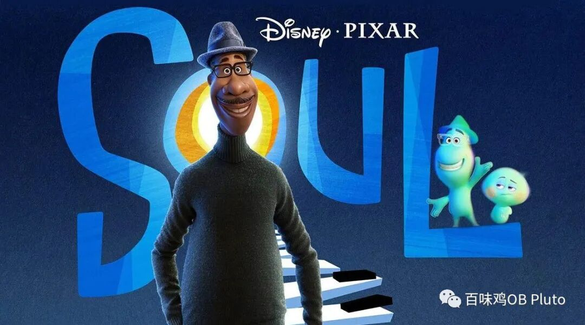
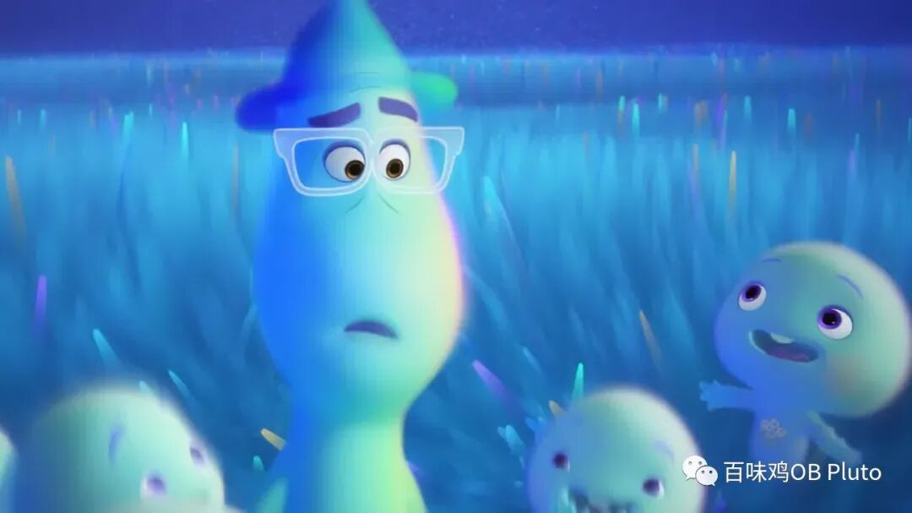
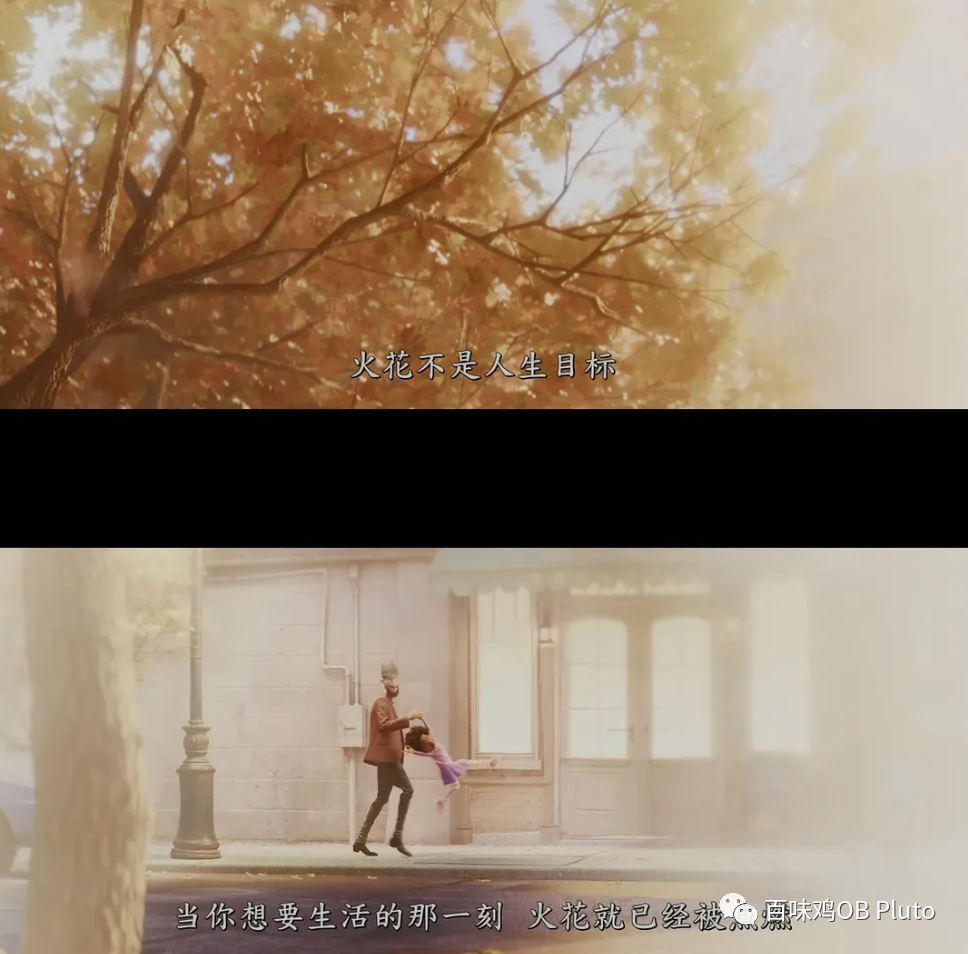
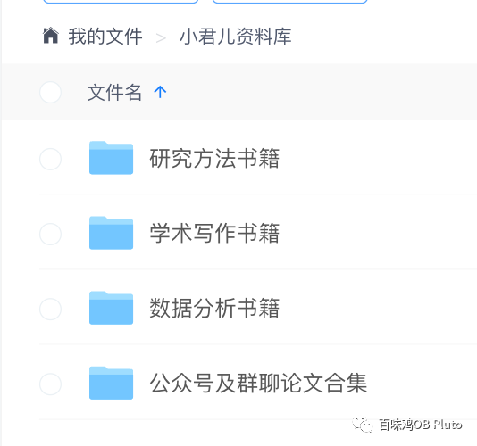
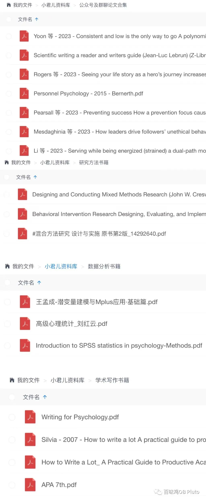
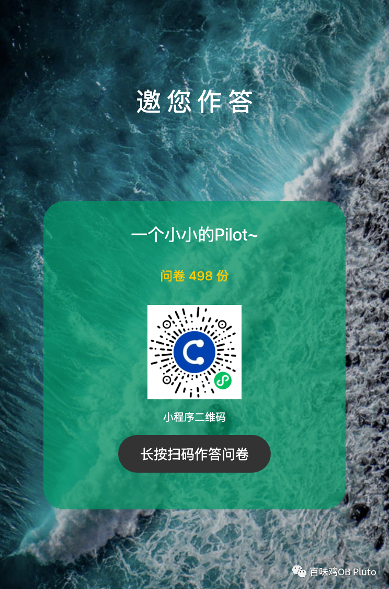

临近期末，兵荒马乱的，还得紧急做一些小研究。

但又感觉做都做了，也不能太糊弄，所以准备也做一做pilot study！

所以来公众号先发一波~ 欢迎各位填写，并分享您的真实感受和建议🫶

下面是研究的简单引入（非学术版）：

如果你看过2020年迪士尼的这部《心灵奇旅》，一定会记得“火花”这个词。

在电影里的“生之来处”是所有灵魂先于地球之前而存在的独特空间，每个灵魂只有觅得自身的“火花”，才能投身于地球。

决心重返地球的乔伊遇见了一个孤僻、早熟而厌世的灵魂“22”，后者由于迟迟未能找寻到自身的“火花”，而长时间游荡停留于此。

一次阴差阳错的经历，乔伊和“22”的命运互相牵连，两人重返地球，共同体验了一段诡谲而奇妙的生命旅程，并开始重构自身存在的价值与意义 。

我们是经历了怎样的时刻才突然找到了人生的“火花”？

“火花”又怎样影响了我们？对我们的工作、生活、自我认知又会有什么影响？

欢迎您简单思考后，填写一份预研究的问卷，帮助小君更好构建可能的理论模型🥹

（当然也可能存在 这个现象根本就不太值得研究的情况  就看大家的feedback了）。

为了感谢大家填写，我也整理了一些学术资料，领取方式可以在回答完问卷后获得哦！

祝您生活愉快，科研顺利，工作顺利，健康幸福！

提前给您拜个早年了🥰
