Beginning

终于熬过接连的两个pre（两个都是极限操作做到上课前10分钟），实在是太消耗了。

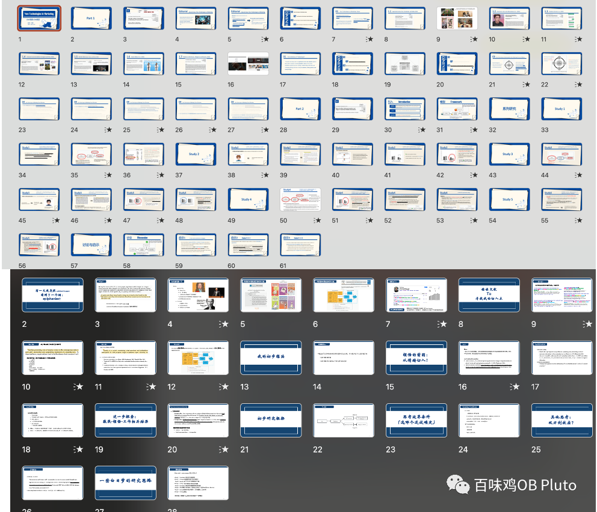

最近看到了一本书上说，人处于Emergency模式的时间越长，就越难恢复正常的日程安排... 所以这种极限操作实在是不愿再体会！本人实在是太需要松弛感了。

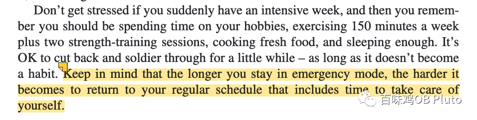

于是今天就去享受了一下杭州25度的冬日暖阳☀️，幸福~

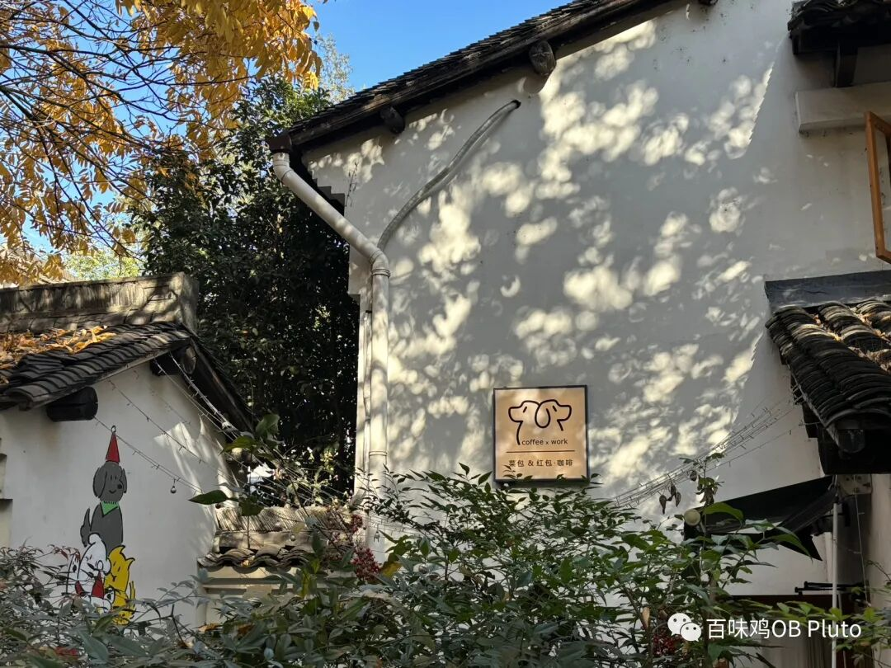

​

​

​

当然也在咖啡店浅浅看了看之前存过的有趣文章，随意Share一下~

**论文1：JPSP 2023**

**《把你的人生当成一段英雄的旅程可以增加生命意义感》**

超级神奇的题目hh

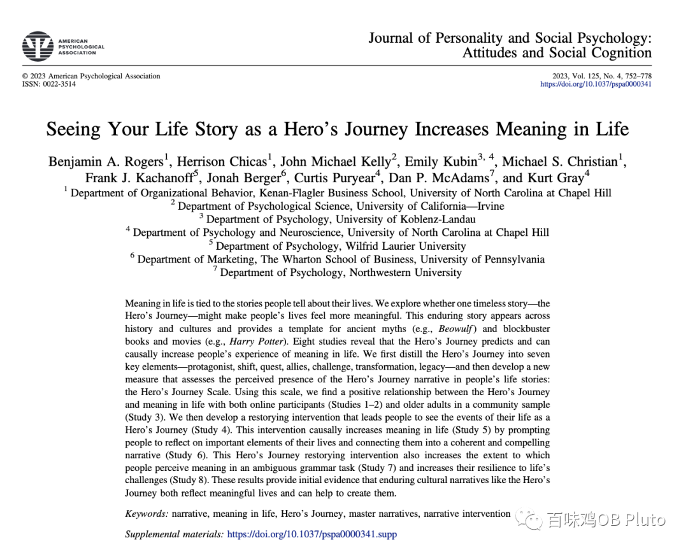

人类是天生的Storyteller，经常通过故事来理解自己的生活，而讲述故事的方式塑造了人们看待世界和对世界做出反应的方式。

本文通过8个研究，发现了“英雄人生”的7个核心维度，构建了“Hero's Journal”的量表，通过**线上问卷平台、线下数据采集、干预研究**探索了英雄旅程和生命意义感的因果关系。

我们也可以学习一下这里面的干预方法，用这些问题来问一问自己，来塑造一下自己的**“英雄旅程”**~

（粗糙翻译版）

1. 什么让你成为了“你”？思考你的特性、人格、核心价值观？

2. 有哪些新的体验改变了你？

3. 有哪些你追求的核心目标让你成为了今天的你？

4. 哪些挑战和困难曾出现在你的生命旅程中？

5. 在你的生命旅程中，谁支持着你？

6. 你的生命旅程中，你个人是如何成长的？

7. 你的人生旅程留下了什么？

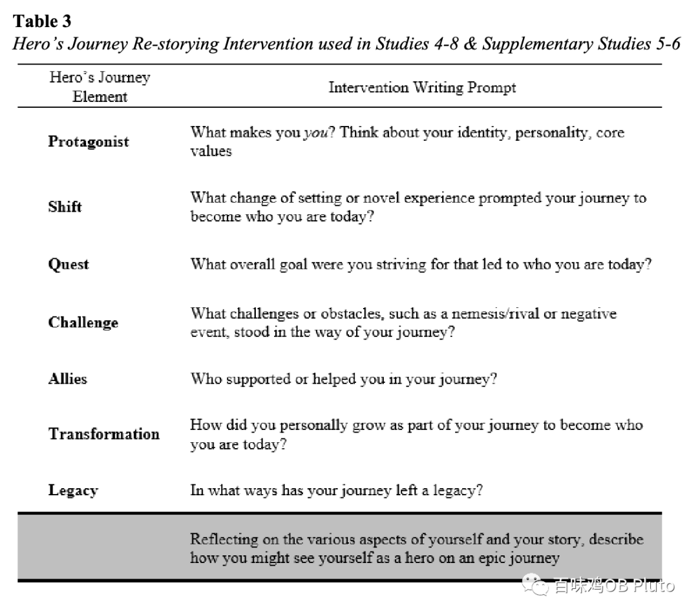

**论文2：JAP 2023**

**《以预防为关注焦点的领导会拒绝好想法 减少团队绩效》**

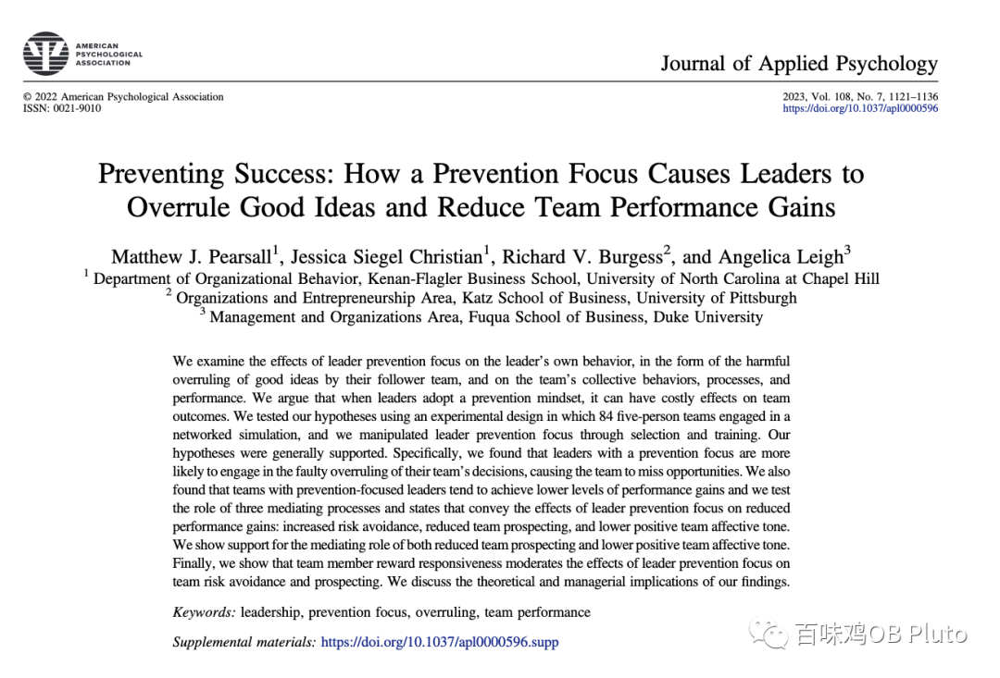

本研究发现，以预防为关注焦点（prevention focus）的领导者更有可能错误地否决团队的决策，导致团队错失机会。

同时，拥有以预防为关注焦点的领导者的团队往往有较低水平的绩效。这一过程的中介机制是：减少团队前景（Team Prospecting：a team action phase process that occurs while teams are engaged in their work, and is focused, in this context, on identifying opportunities for gains）、降低积极的团队情感基调。

团队成员的奖励反应性调节了这一消极作用。

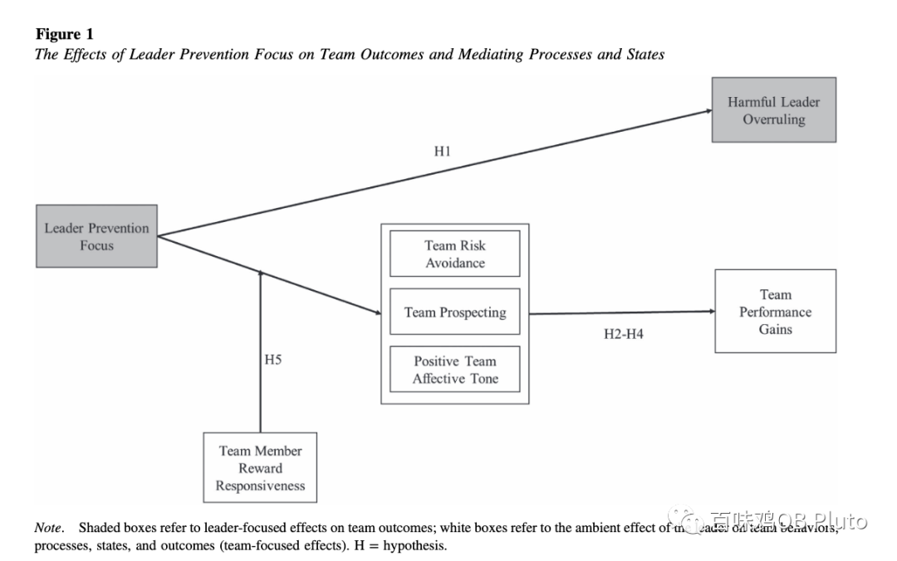

特别的是，这篇是关于团队研究的，用到了计算机模拟的方法，之后开始做团队研究的时候再回头精读一下~

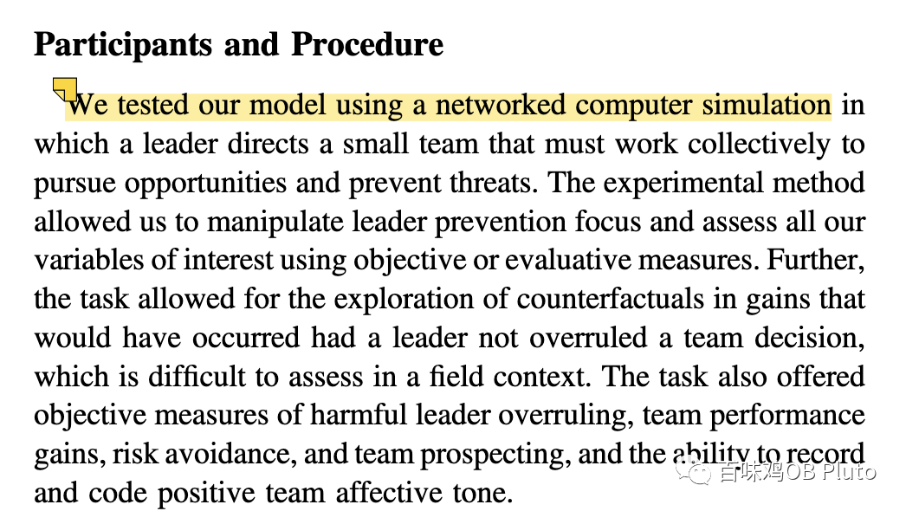

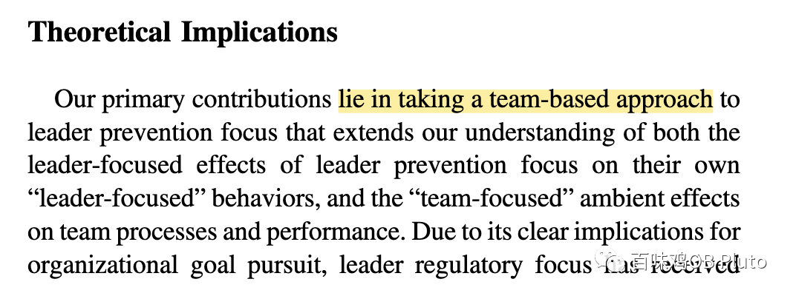

**论文3：JOOP 2022**

**《授权领导力、晋升焦点、创造力：性别的重要性》**

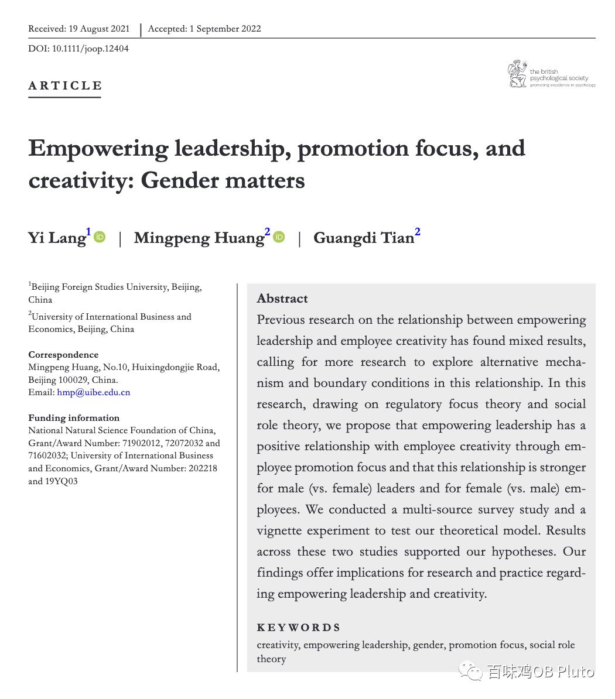

之前关于授权领导和员工创造力的结果比较mixed，所以需要更多的研究来探索这两者关系的机制和边界条件。

这篇论文基于regulatory focus theory 【调节定向理论：上一个文章也用了这个理论，所以在这儿解释一下。调节定向理论对在追求目标过程中的人们进行了划分，分为促进定向(Promotion-focus)的人和预防定向(Prevention Focus)的人。在目标追求过程中，促进定向的人重点关注进步、成长和成就，而预防定向的人重点关注安全、保险和责任】和Social role theory （社会角色理论：根据人们所处的社会角色去解释人的行为并揭示其中规律），利用多来源数据研究和一个EVM研究，发现授权型领导通过增加晋升关注（promotion focus）进而增加员工创造力。

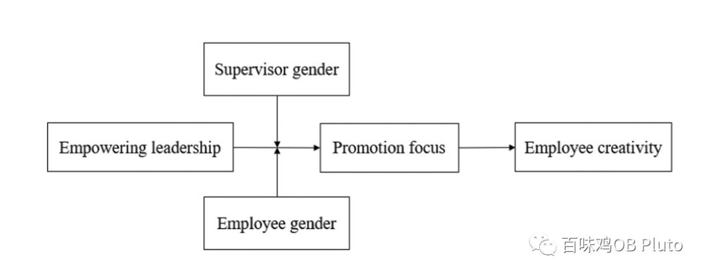

同时，男领导给女下属授予更多的权利的时候（这样消除了性别刻板印象），可以促进女员工的创造性。

这篇用性别做了调节，但**把领导和员工的性别分为2个变量考虑**，思路值得学习~

****❄️大家**冬天快乐！**
