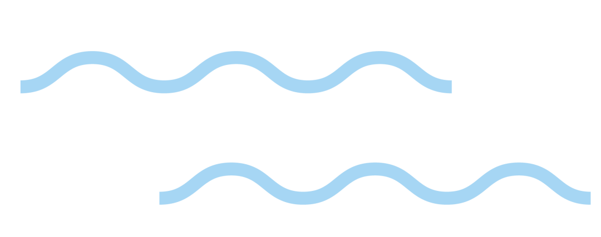
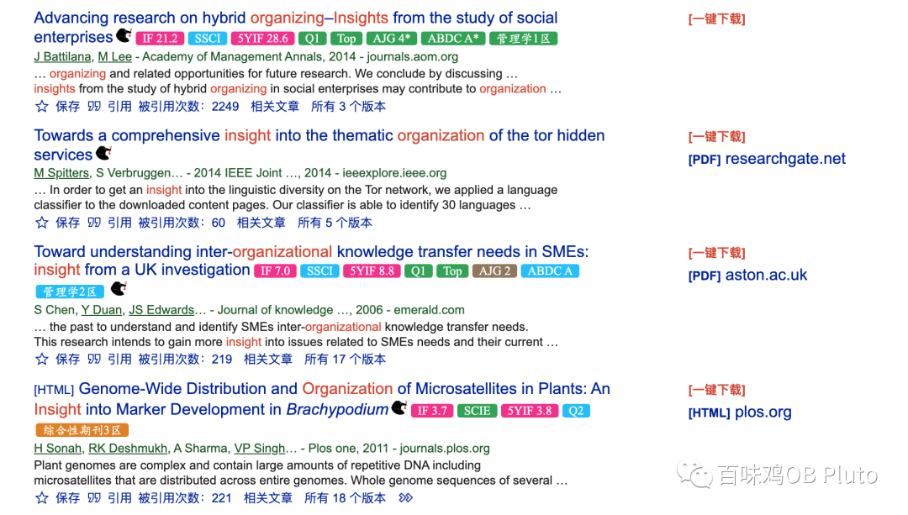
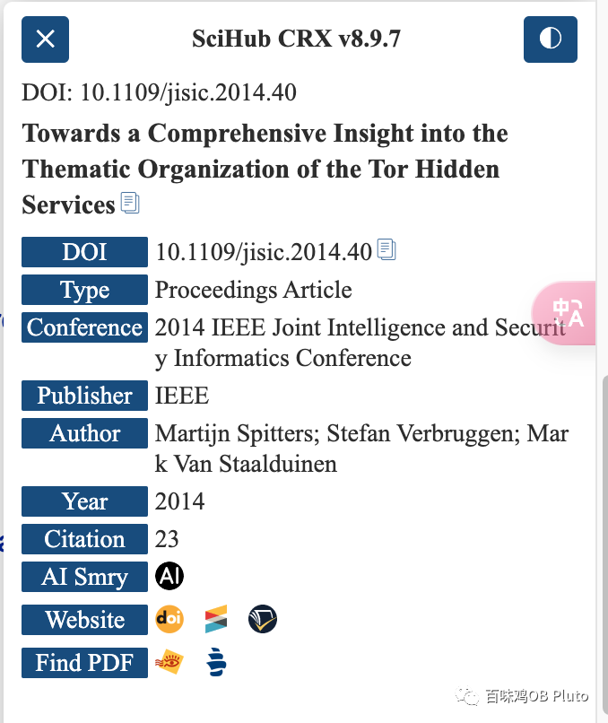
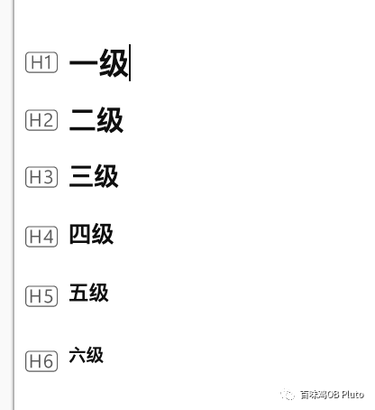
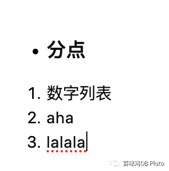

Beginning

本来这周末有一大堆事情做！（艰难的12月👨‍🌾）

但是周日早上根本没有任何学习动力。应该说是，冬天的每一个上午都根本就是一个长在床上不愿动弹的状态。

所以决定push自己起来浅更一期公众号，让我进入一下沉浸的状态。希望能借此来启动一下自己🥲

最近有两个新的科研助力小工具，分享给大家~！

**工具1**

**油猴插件SciHub CRX**

**功能介绍：**

- **显示期刊分区、影响因子等信息——帮助更好的筛选要下载文献的质量**

目前这类插件也有很多，最常用的就是easyscholar。

但是它无法在科学上网时使用，所以在谷歌学术上就用不了它，是一个痛点！

而SciHub CRX就可以完美解决这个问题！

**2. 显示论文基本信息**

这个插件还可以抓取论文的信息，只要点击每篇论文右侧的「那只衔着钥匙的鸟」就可以看到，这样就不需要再点进页面检索，更省时间！

**3. 自动抓取论文pdf**

从上面那张图会发现，最后一行有**“Find PDF”**。

虽然市面上也有很多自动跳转到scihub来抓取pdf的插件，但是这个插件除了抓scihub上的论文之外，**可以检索多个平台**，成功抓到论文的概率更高！

【说明1】这个功能需要付费。1个月3块钱，这个钱我还是愿意花的！

【说明2】有些pdf确实找不到，那就只能再用自己学校图书馆数据库找了。

4.还有一些可以直接按“T”进行文本翻译的内容啥的，大家自己探索~

**如何下载：**

主要是依托油猴脚本（又称篡改猴），大家自行知乎，里面有详细的下载方式！（ 篡改猴的快乐实在是超乎想象，希望大学生都能用上篡改猴！具体还有哪些功能，大家自己去篡改猴的脚本官网就可以大开眼界！）

**工具 2**

****Zotero内部笔记 （使用Markdown语法）****

以前看论文可能就高亮划划线，然后写在注释框里or插入个文本框。

但这有一个问题是，过了几天再看的时候**只能看到零散笔记**，完全无法提取核心信息，也没有论文的**框架感**。（一个看了等于白看的状态）。或者我也会再用notion记一个外部笔记，但这样还是无法在zotero里面打开pdf的时候直接看到笔记，不够整合。

所以最近就——**大道至简**了！直接用zotero自带的朴素的笔记进行记录！

其实也挺不错哦！

更重要的是，zotero的笔记也是支持**Markdown语法**的，这样可以在看论文的时候**更高效地进行笔记记录**，而不需要为了设置层级、格式等再点击鼠标而分散了注意力。

**列一些我在zotero中常用的Markdown语法：**

- 层级区分

#+空格     一级标题

##+空格    二级标题

###+空格   三级标题

####+空格   四级标题

#####+空格   五级标题

######+空格     六级标题（不能再多了）

2.points和数字列表

“+”或“-”或“*” 再按空格可以都得到points

数字 加“.” 再按空格可以得到数字列表

3. 分割线连续按三次“-”这个键 得到分割线

4. 强调引用

输入> 再按空格 可以得到申请的引用缩进

这样有些话我们觉得作者说的很好，想直接放到笔记中，就可以呈现出这样的效果：

关于Markdown语法其实也有更多的使用，大家可以再自行探索~

Ending

嗯.. 写完这篇确实 感觉有点学习的感觉

但是感觉可以去吃饭了...

大家周末愉快！
