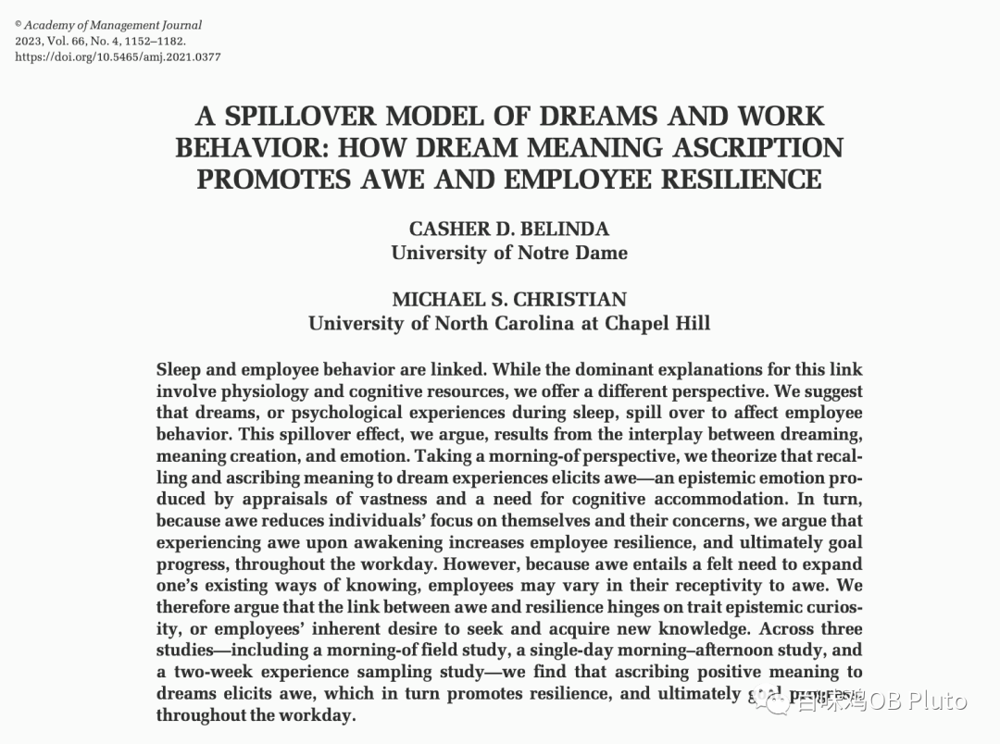
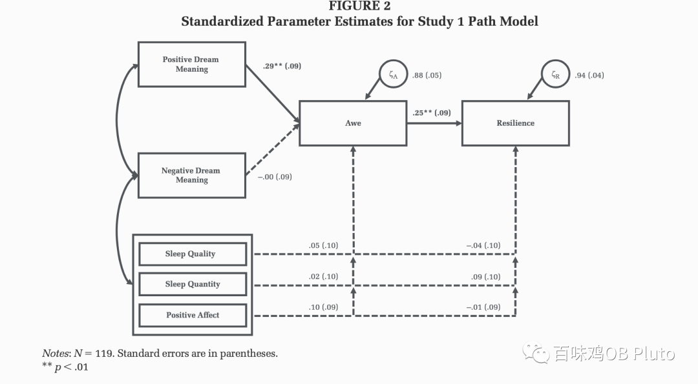
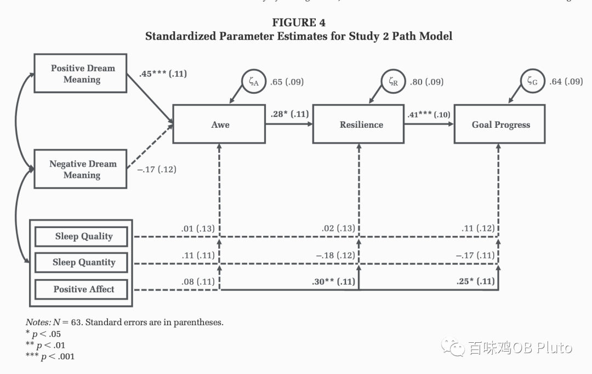
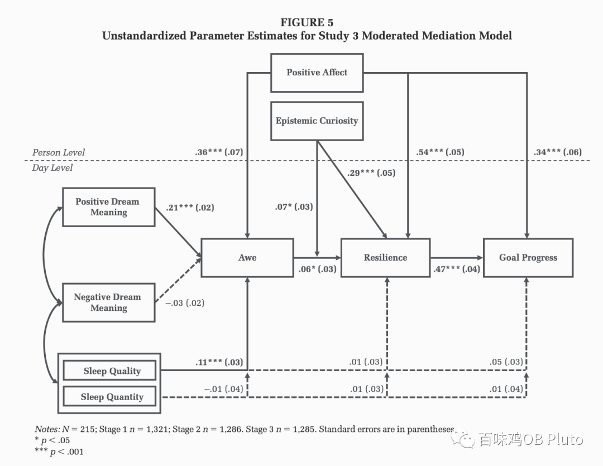
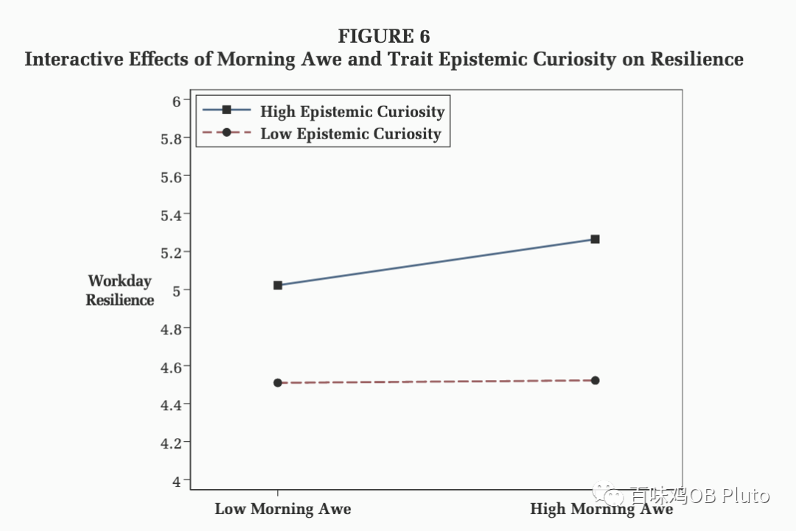

**省流：**

·对梦的积极解释，可以促进敬畏，进而促进工作韧性及工作目标进展。

·对于具有高认知好奇的人，这一机制更明显。

**PART 1**

**研究背景**

-睡眠和工作行为的研究很多，以前的解释是认为睡眠影响了认知功能，进而影响了工作行为。

-而本文作者认为，以往证据更多关注睡眠给人带来的客观影响，但忽略了睡眠给人带来的主观影响（人对梦的解释就是一种主观的心理过程）。

-作者认为睡眠对于**个体主观心理过程的改变**，同样也是影响之后工作行为的原因。

——作者把这一过程称为“dream-spillover process”，也就是睡眠溢出效应。

本篇文章用3个研究来解释这个**dream-spillover model**。

**PART 2**

****理论\模型 \贡献****

**-理论：**

·appraisal theories (Fletcher & Sarkar, 2013)

·appraisal-tendency perspectives (Beal, 2014; Lerner & Keltner, 2000; Lerner et al., 2015)

**-变量：**

·自变量：对梦的解释（dream meaning ascription）

·中介1：敬畏情感（awe）

·中介2：复原力（resilience）

·因变量：工作目标进行（work goal progress）

·边界条件：个体的认知好奇(epistemic curiosity)

**-贡献：**

1.为“睡眠-工作行为”的路径提供了除生理之外的解释机制。

2.探索了敬畏的作用，引发学者关注敬畏对于管理的积极作用。

3.拓展了以往只把resilience当成一个特质的研究，本研究关注了resilience的前因变量，并挖掘如何在每天提升resilience。

**PART 3**

**研究过程**

**-Study1：A morning-of field study （只在晨间测一次）**

·目的：检验dream meaning ascription到awe-employee到 resilience

·研究过程：早上醒来后对梦进行回忆和评价，之后进行一个书写任务（书写工作中的压力事件），书写好后之后再测量awe和resilience。

·统计方法：路径分析

·结果：Study1发现了对梦的积极解释-促进敬畏-促进resilience。

**-Study2：A single-day morning–afternoon study （2个时间点测量）**

·过渡：Study2以一整天为测量时间段、通过**两个时间点**来进一步验证上述机制，并**检验该机制的downstream consequence**：work goal process。

·研究过程：

T1：上午测量：对梦的解释（书写描述）、awe

T2：下午测量：resilience、work goal process

·路径分析：文本分析（对于梦的解释的文本分析）+路径分析

**-Study3：A two-week experience sampling study （2周的ESM）**

·过渡：Study2只是2个时间点的测量，但仍然无法探索**个体内和个体间效应**。Study3会通过经验取样法来解决这一问题，同时检验全模型+并探索epistemic curiosity的调节作用

·研究过程：

早上5-10点测1次（测对梦的解释+awe），下午4-10点测1次（测resilience+goal progress）

调节变量、控制变量等都是在研究前一周集中测量的（epistemic curiosity, affective disposition, and demographic characteristics.）

·统计方法：Multilevel Path Model (分离day-level和person-level的效应)

简单斜率检验发现，对于认知好奇更高的个体，敬畏对于resilience的促进作用更强。

**PART 4**

****个人评价****

读完感觉，这篇AMJ虽然选题看上去很有趣，但是总体来说还是很中规中矩的：3个研究之间的逻辑关系很常见，核心讨论的也没有太多深入（只是分段呈现了该研究对于sleep、awe、resilience相关literature的影响）。但也有亮点，比如引入了书写任务，并对书写内容进行文本分析和网络图呈现，比如控制变量的选择和可视化很清晰，比如前面的理论和假设提出很丝滑。

总之很适合新手学习*研究思路*+*理论推演+研究贡献呈现*的一篇！

（上助教的时候摸鱼写的，中英混杂，多多包涵🥹）

（可以后台回复【学术交流】来加入OB/Psychology的学术交流群。）
