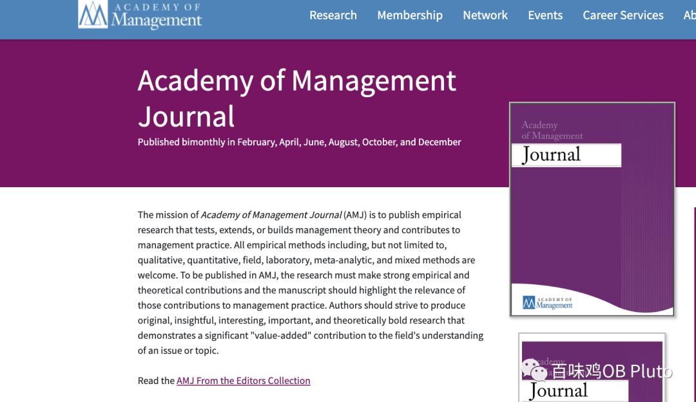
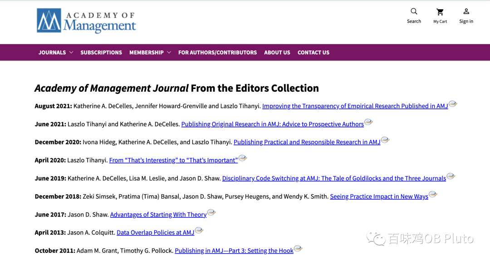
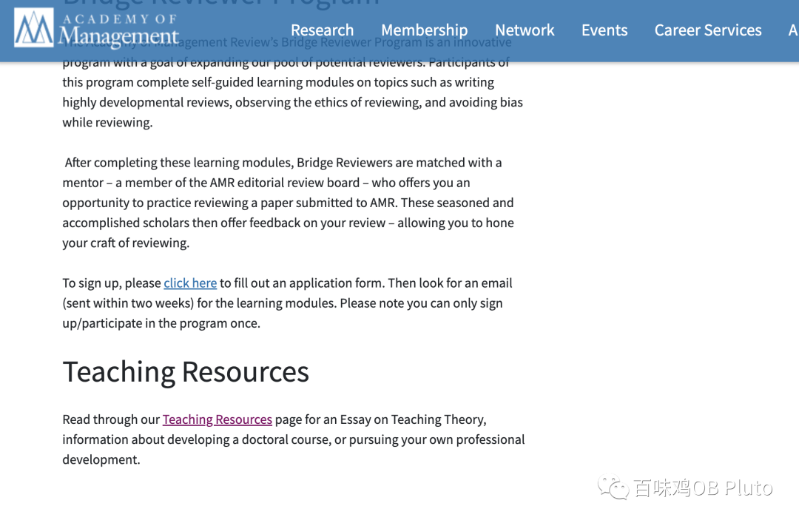
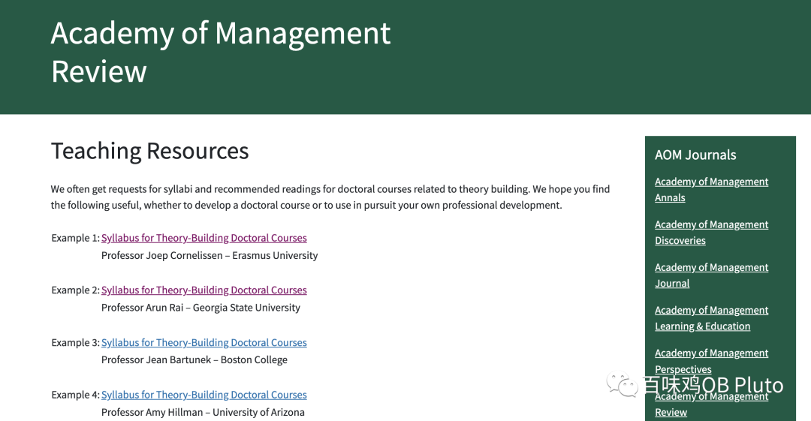
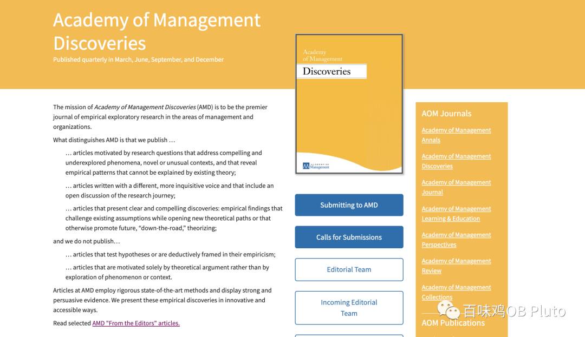
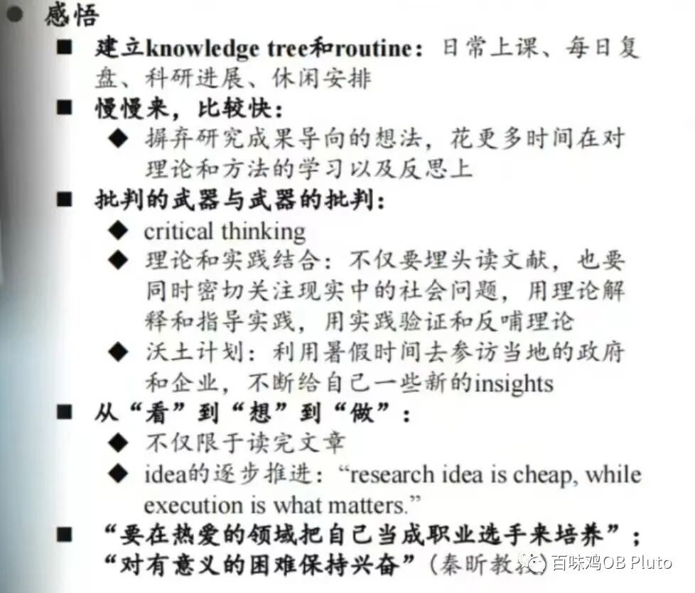

上周在管院听了很多期刊副主编的分享，了解到其实在期刊官网里有很多编委认真写的Guideline。包括陈晓萍老师目前在做MOR的主编，她也会说之后会邀请很多大佬写一些比较general的Guideline，期待一下~

所以很多时候我们总是很零散地看着一些公众号or知乎总结好的推文（有的公众号作者甚至都没有搞过科研），但忽略了**我们要找的答案其实就藏在我们的梦刊官网里~**

（上周见到了秦昕老师，觉得他实在是太牛也太有人格魅力了，所以还去b站上搜了他的相关视频hhh。他就提到：**不要再去读别人总结好的东西了。自己的探索和发现才是最有生命力的。**所以我也在想这个公众号的定位，或许就是授人以鱼不如授人以渔：传递一些科研热情，告诉一些可以利用的资源，但是最重要的东西还是要大家自己进行内化总结的。）

**以AMJ为例**

从期刊首页进去，点击这个“Read the AMJ From the Editors Collection”，其实就会看来一些来自编委的倡导：

比如有实证研究的清晰性、有责任的研究、从“有趣”到“重要”、从理论开始的好处…等等主题。

我们会发现审稿的过程中，很多reviewer也会引用这类的文章去给我们的论文一些建议。所以平时也可以有意识的翻一翻官网，这样可以提前了解编辑偏好，从而有意识地对他们不喜欢的东西避雷（虽然雷是避不完的，有些答案也是在书外的...）。

**以AMR为例**

官网往下翻，翻到“Teaching resources”

就会看到AMR像课件一样的关于“如何theory building”的材料。

**### 以AMD为例**

（和上面两本注重理论的期刊不同，AMD是完全注重“新现象”的期刊）

点进“From the editors” ，就可以看到关于如何吸引读者吸引力、AMD的作者告诉我们什么等等主题。

不一一列举了，总之大家打开思路， 之后看期刊官网可以不仅仅是看latest issue，也可以留意一下**editorial board给出的倡议**。（所以对于审稿人的过高要求也可以理解了，毕竟顶刊的taste早已在“From the editors”类的文章中有了提示~是我们自己忽略了）

**结尾碎碎念**

1. 上次投的JAP意料之中外审被拒，但是收到了20+条意见，收获很多，甚至从审稿人的意见中品出了感动（我真的很容易被pua…)—— 认真修改，认真改投，相信论文总有去处！其实还是很喜欢改论文然后让论文不断变好的过程的~

2. 检讨一下：上上周过于忙碌，导致上周非常摸鱼。这周会好好学习，好好更新！本号的粉丝都是我的互联网监工！爱大家！

3. 在xhs上看到了一位北大光华的学姐分享的秦昕老师讲座中的内容：

“对有意义的困难保持兴奋！”
