困顿的周四，没有太多学习的热情，所以来随缘更新一下我的公众号！

得时刻记得一周两更的flag📍

整理一下最近在学术群里面看到的一些有意思的研究：

**第一篇：JAP  服务型领导的双通道模型**

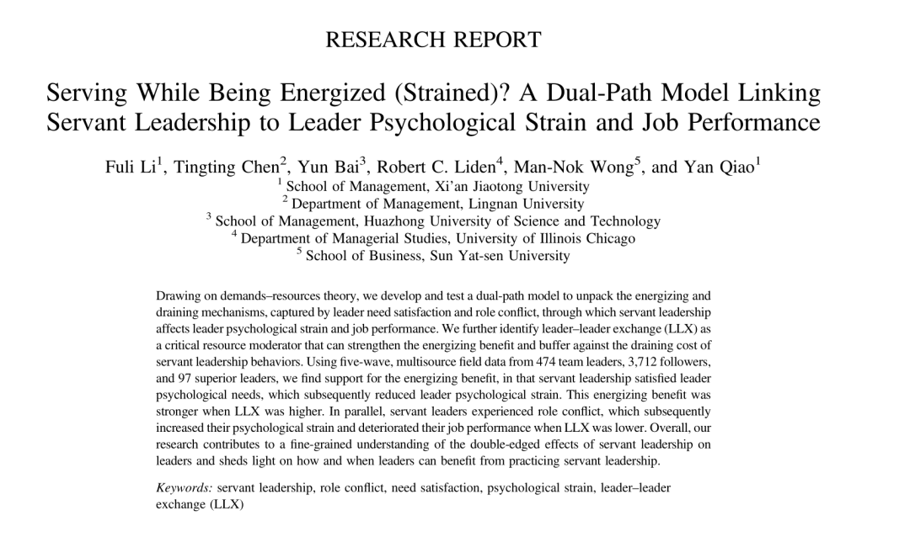

这篇是由西安交通大学的李福荔老师发的。（这个发表真的tql）

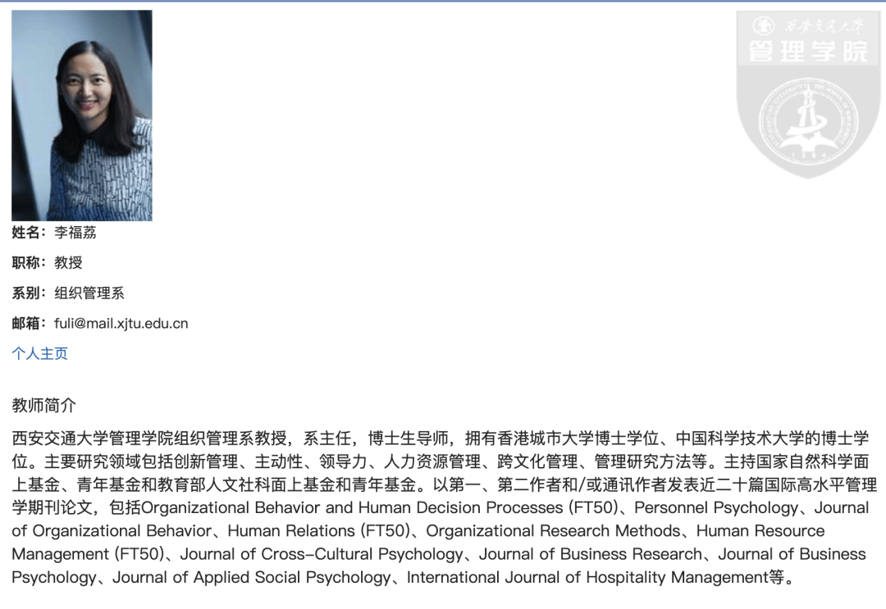

这篇主要探讨服务型领导的双刃剑效应（激励or消耗）。更重要的是探讨双刃剑效应的边界条件（作者选取LLX即leader-leader exchange 作为边界条件，该变量刻画的是领导和更上级领导之间的关系。（之前只知道LMX，这个LLX还是第一次听说）

结果表明，领导的服务型水平越高，领导的心理压力越小，但对其工作绩效没有显著作用；但是在LLX水平低的时候，上述关系会变成负向，即当领导和更上层关系不好时，领导的服务型水平越高，他们的心理压力会越大。（合理！没人想做舔狗的。。）

此外，当LLX水平低的时候，领导的服务型水平越高会导致更强的角色冲突，并进而导致更大的心理压力和更差的工作绩效。（合理！一味讨好是不利于心理健康和工作的！）

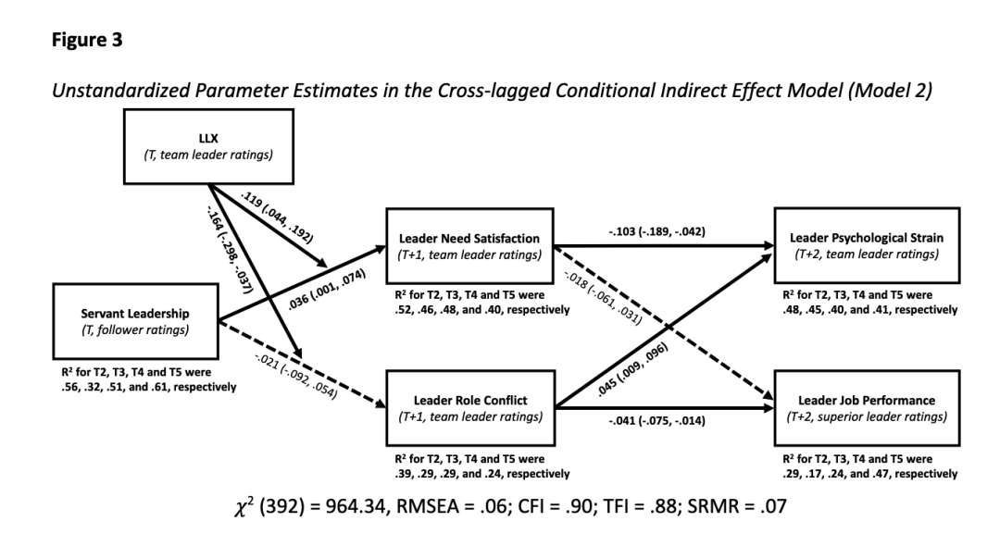

这篇采用了5个wave和多来源的评价指标，用了交叉滞后模型（稍显吓人）。感觉这种测量的level已经是JAP的默认要求了...

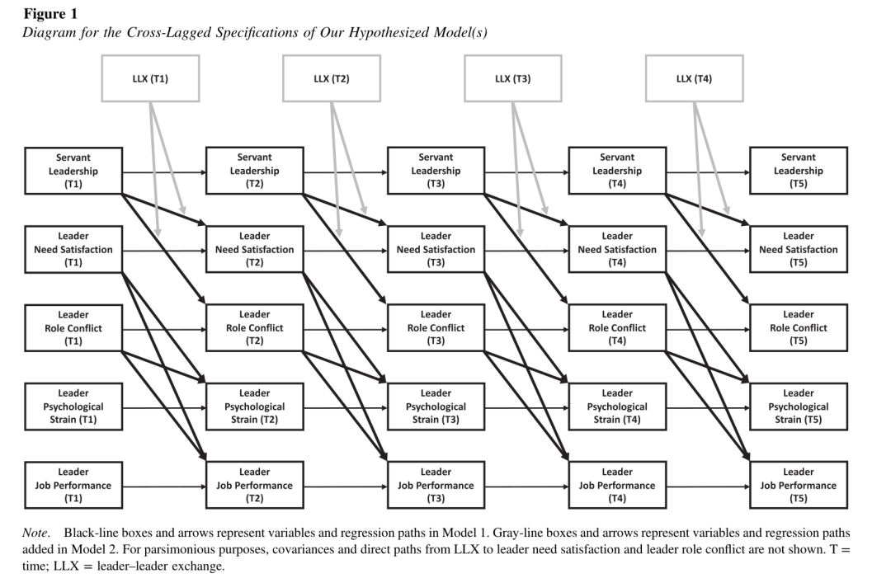

**第二篇：JAP  不一致的辱虐**

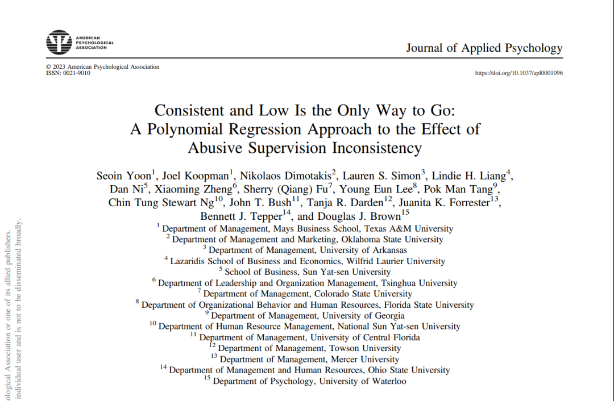

上一期《[有趣的研究合集1 | NHB、AMJ、IJCHM](http://mp.weixin.qq.com/s?__biz=MzU1MzY1MjIxOQ==&mid=2247484768&idx=1&sn=17af955065492f1d21ac2f55f2f03947&chksm=fbeedff4cc9956e2ece9287a2ac6052996e6e334f3851ed327e6e8c7ef5723cb2af10dfa9493&scene=21#wechat_redirect)》有提到说了现在很多研究都在关注某变量的一致/不一致/变化，这一篇同样也是在关注辱虐的不一致性，采用经验取样法，通过多元回归和响应面分析探讨了不一致辱虐的消极后果，并发现了只有一致且低水平的辱虐才是比较好的。（很显而易见的结果... 但是这里面设计的方法可以学习）

多元回归：

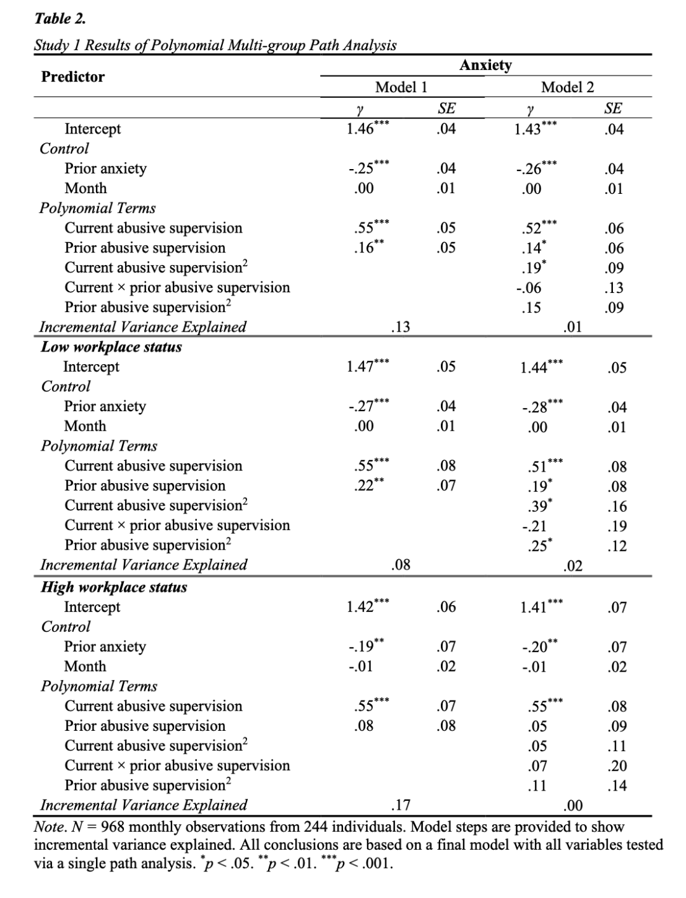

响应面分析：

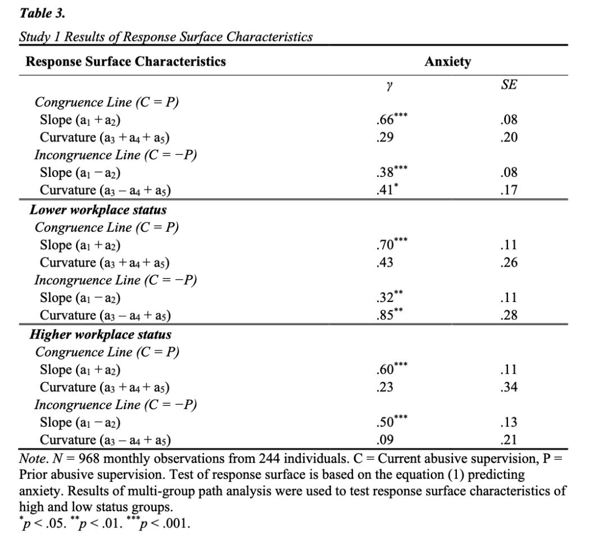

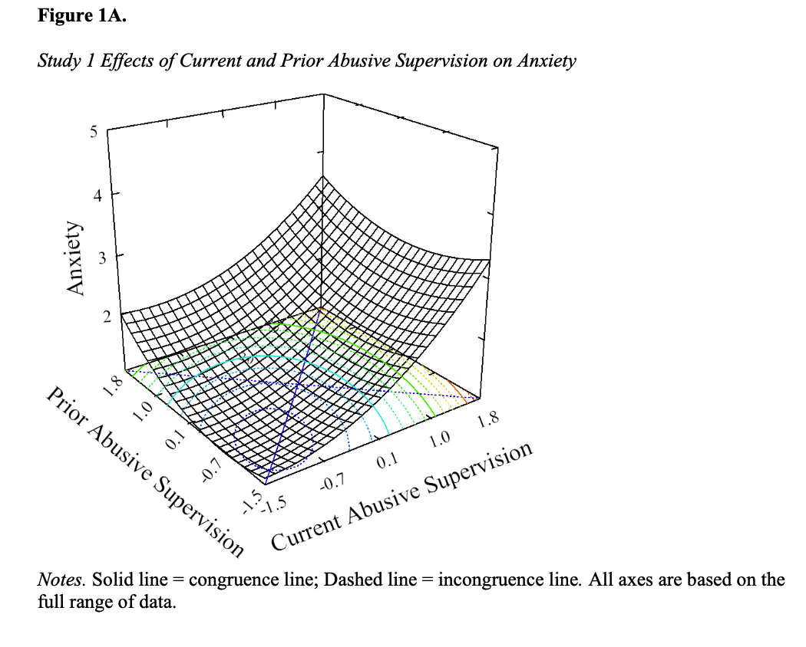

**第三篇 JOM  晚间自然接触**

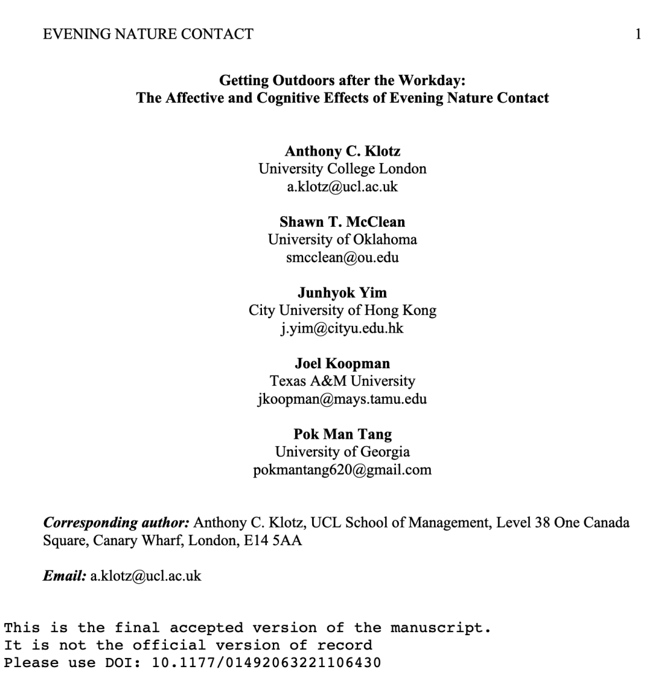

很真实的一项研究！

作者通过压力恢复和资源储存理论，用了经验取样、实验法和回忆法三种不同的方法进行研究，探讨晚间自然接触是否通过增加积极情绪、减少消耗两条路径来增加第二天的工作努力。

该研究还发现了影响上述积极关系的边界调节是：员工自身的nature connectness水平。

「我记得有个朋友跟我分享过：她在六年级走在一片树林里的时候，突然意识到了什么是自然，突然感觉这个大自然好美，也突然感受到了这种nature connection的感觉。

而我是在高三毕业去恩施旅游，看到从未见过的清澈见底的湖水时才有了这种感受。

总之，希望大家都能有很高的nature connectness。这样的话，只是行走在自然中，而不用过多的心理干预，也可以收获对身心的治愈。」

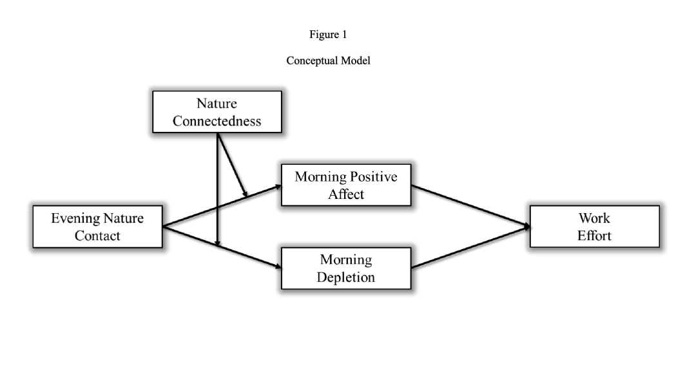

**第四篇 JOM 领导鼓励员工不道德行为**

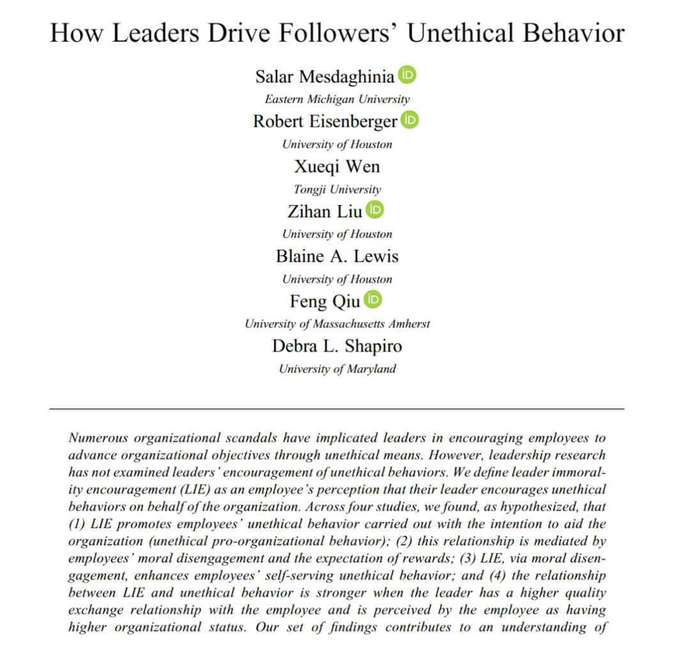

该研究发现，领导者对不道德的鼓励（LIE；一个新的变量 所以study1就是对于量表的修订）——会通过员工道德脱离、奖励期望——进而增加员工亲组织的不道德行为。

而当领导-员工关系更好、员工组织地位更高的时候，更有可能产生上述关系。（好真实...）

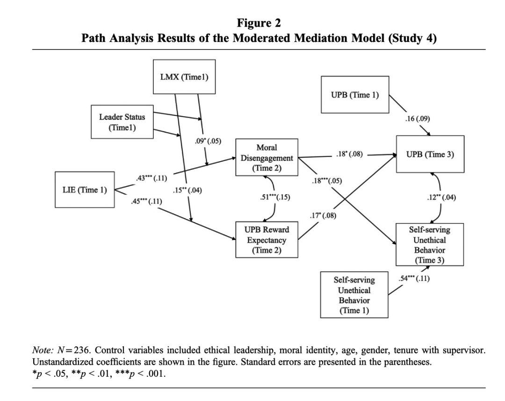

这个路线图略有些奇怪，本来惊讶这怎么调节上面还有一个调节，但看了results部分，也就只是做了一个three-way interaction...fine...

****结尾碎碎念****

先写到这里了！这些研究我就是瞎看看摘要和路线图、随缘从上往下刷一刷寻觅一些有趣points。看的目的也只是在脑海里停留一下这些研究的topic和最亮点的部分，能在之后遇到类似的研究的时候想起这些文章，因此也不会有太深度的阅读。

继续干活去了！
