其实每天都会在各种地方看到新的or有趣的研究，比如小红书的数据推送、一些学术交流群、关注的一些老师的微博分享。然而有时候看了也就看了，or分享给朋友浅浅说一下，然后没过几天就忘了。同时，虽然可以在社交媒体上刷到好的研究，但是也存在刷着刷着就开始被其他内容吸引注意力的情况。

——于是就有了这个新系列。我会选取一天中的一段时间专门浏览各处看到的有意思研究，并在公众号中记录。

**第一篇：NHB  腐败感知与信任**

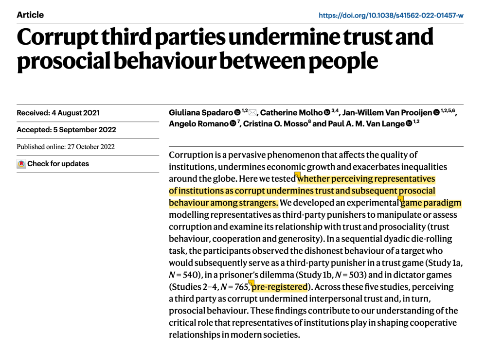

-结论：感知到的腐败会降低降低人际信任，进而减少陌生人间的亲社会行为。

-作者用自己设计的实验范式进行研究（最大创新点 所以能发NHB），一共有5个子研究。

-数据分析其实非常简单，就用了R语言进行了线性回归和用process进行中介模型分析。（这篇文章公开了数据和代码！很适合新手学习用R来作数据分析，有时间我也可以写一篇代码解读！！数据：https://osf.io/fm9b3/  代码：https://osf.io/p986h）

**第二篇：NHB 对机器人的心理反应过程**

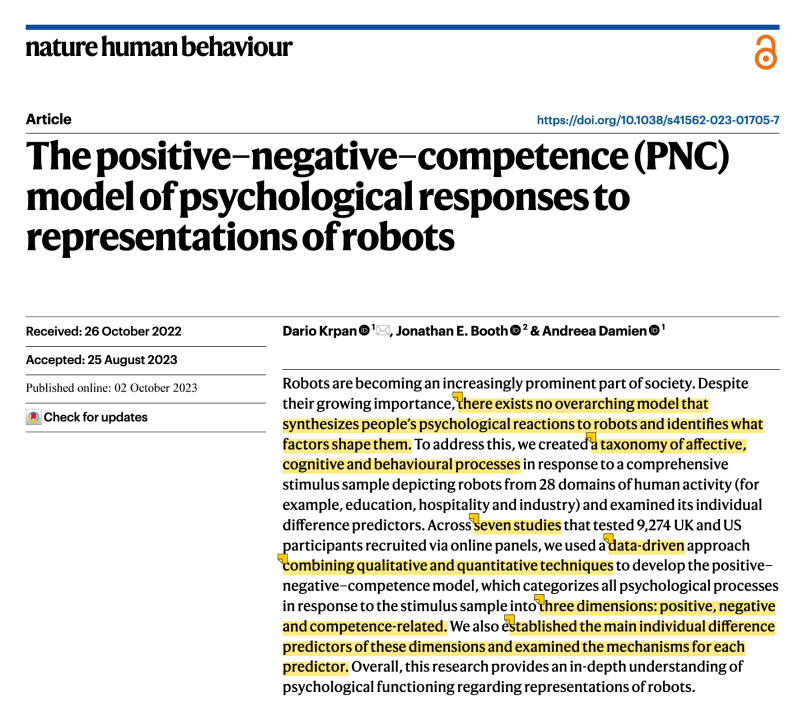

当今时代，智能体正逐渐成为社会生活中不可忽视的一部分。然而缺少一个解释个体对智能体心理反应的理论。

于是这篇文章采用data-driven的方法进行理论构建。我真的觉得这篇文章太好了！喜欢theory construction的研究者一定要看！

-涉及质性和量化共7个study

-用了文本分析、聚类、条件随机森林算法、探索性因子分析、探索性结构方程模型、中介分析等多种方法。——再感叹一句，这篇真的太牛！

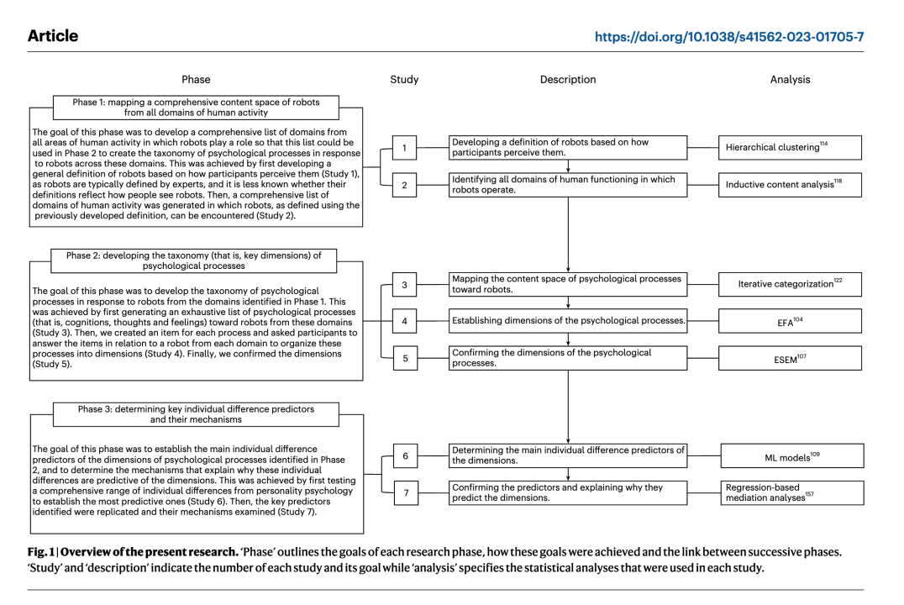

**第三篇 AMJ  不连续的公平**

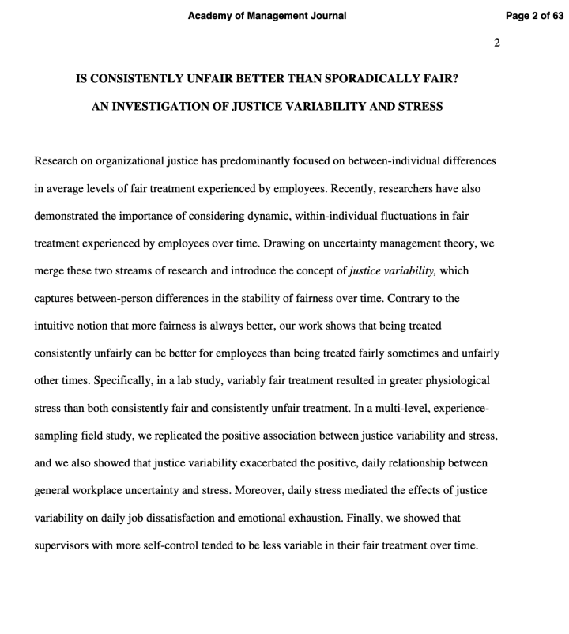

「有时公平、有时不公平」会比「持续不公平」产生更消极的影响。主要探索的是公平的变化（Variability）。这篇文章其实也在启发我们，也未必要追求organizational level的视角，对于一些话题 individual level的波动也是很值得探讨的。

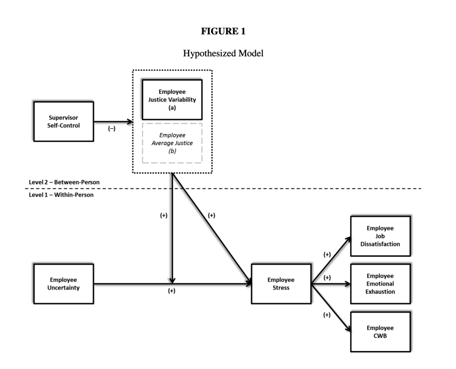

感觉最近确实看到挺多研究在关注「某个变量个体内的波动」or「团队层面存在的差异」。比如这篇大佬云集的发表在Personnel Psychology上的文章就探索了团队层面中创新热情的Diversity。

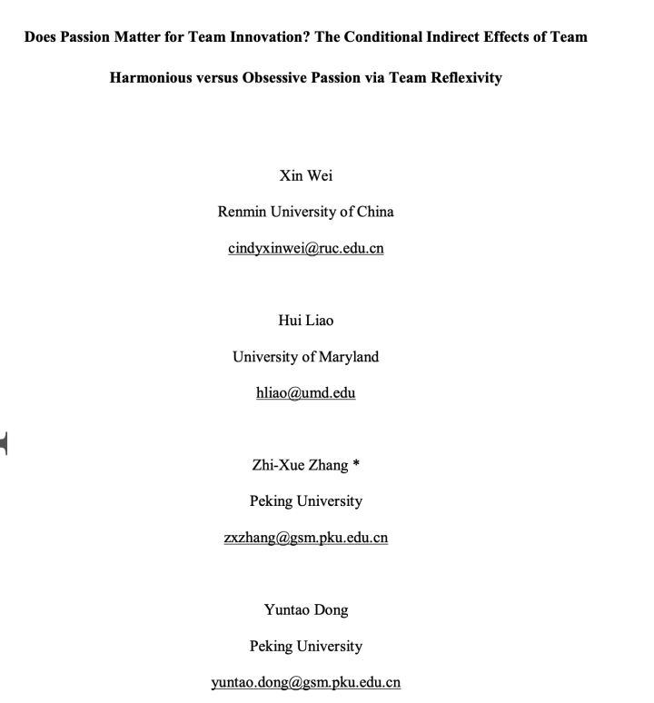

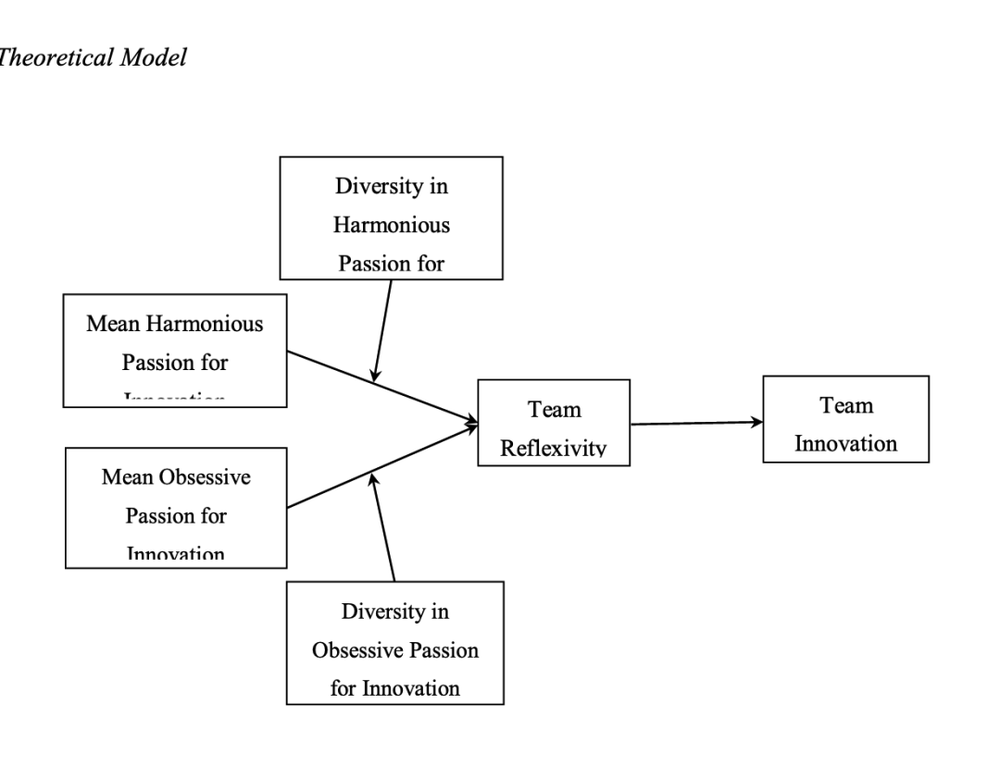

**第四篇 AMJ 生物钟与创造力**

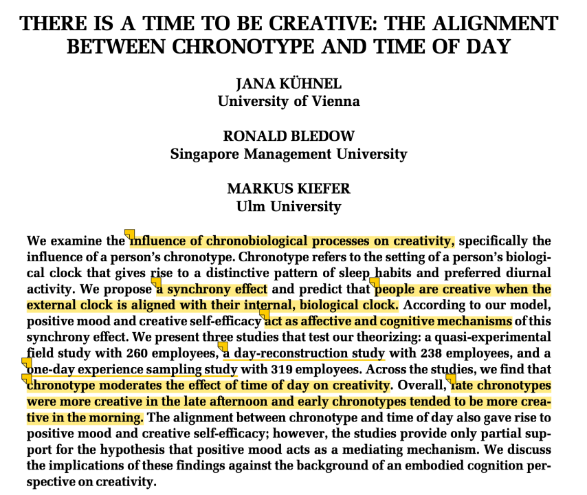

很有意思的一篇，研究生物钟对创造力的影响。会发现，和生物钟同步的时候，会提升情感（Positive Mood）和认知（Creativity Self-Efficacy）结果，从而更具有创造性。——所以找到适合自己作息的工作很重要！或者就是 调整生物钟 努力适应吧...

-如果要模仿经验取样法，就可以参考这篇。

-这篇的结果图也画的非常有意思。

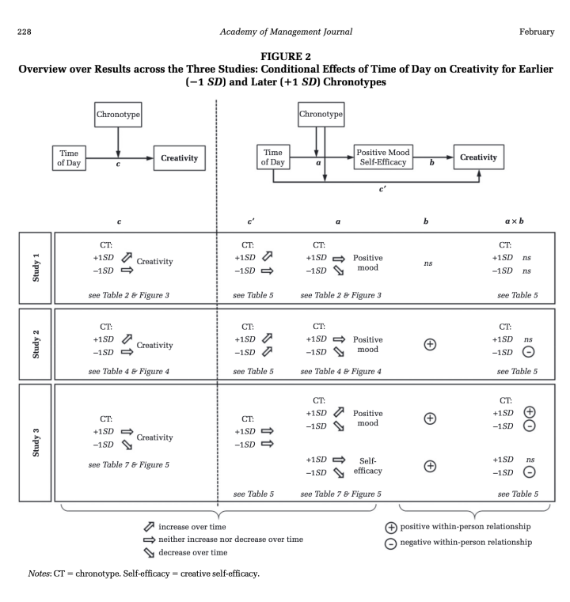

****第五篇  IJCHM AI意识与工作撤退****

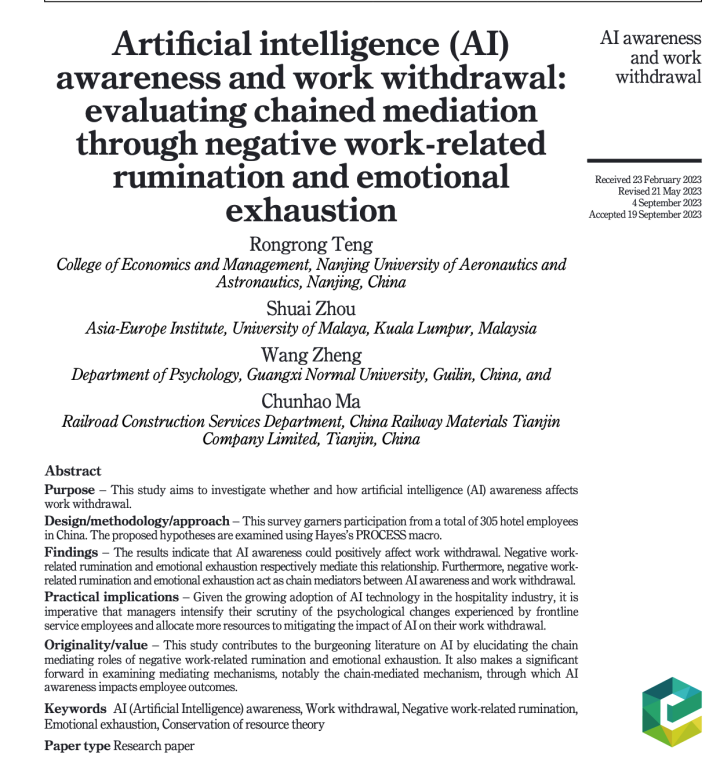

发在一篇旅游管理11.1分的期刊，很神奇的是这只用了一个链式模型就可以发一区，看来真的是OB太卷......

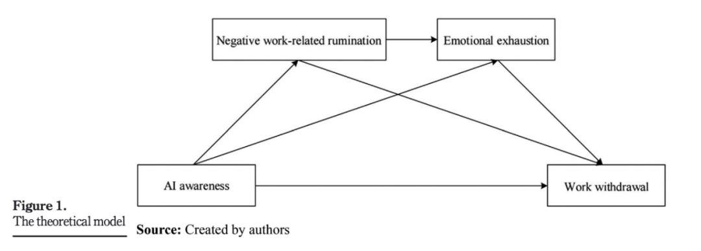

不过这个研究选题也真的非常契合当今社会，其中核心变量AI awareness就是指员工对于AI影响其未来工作情况的认知，结果发现AI awareness高会导致一系列消极的工作结果（消极工作反刍、情感耗竭、工作撤出）。

这个启发我们，只要能敏锐捕捉到契合当今热点讨论的话题，谁能更快地发出来也就可以有不错的结果。（就比如Covid-19期间的研究很多也并不严谨 但是很契合当时的关注点）。

****结尾碎碎念****

真的会沉迷一些fancy的研究视角和研究方法...

要努力做有意思有意义的研究，成为优秀科研人！

Good night!
