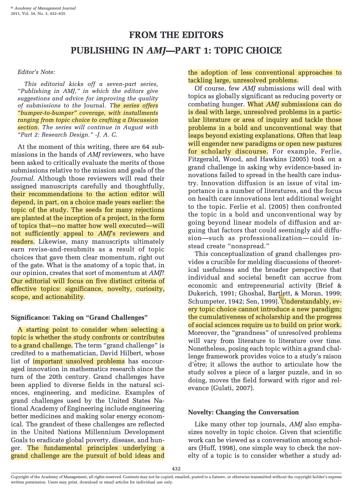
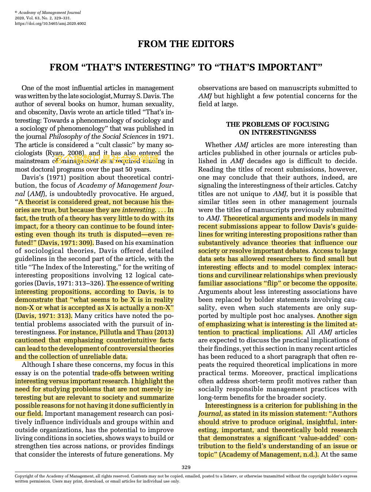
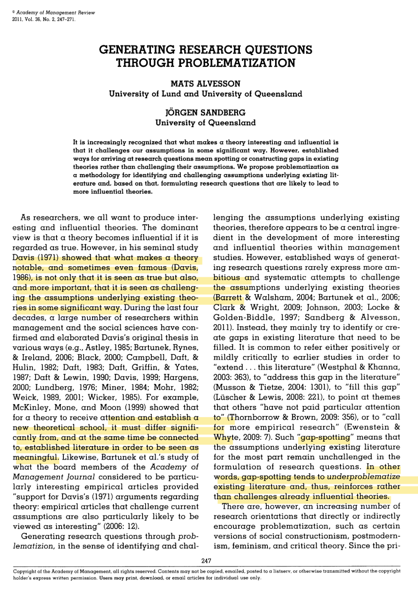
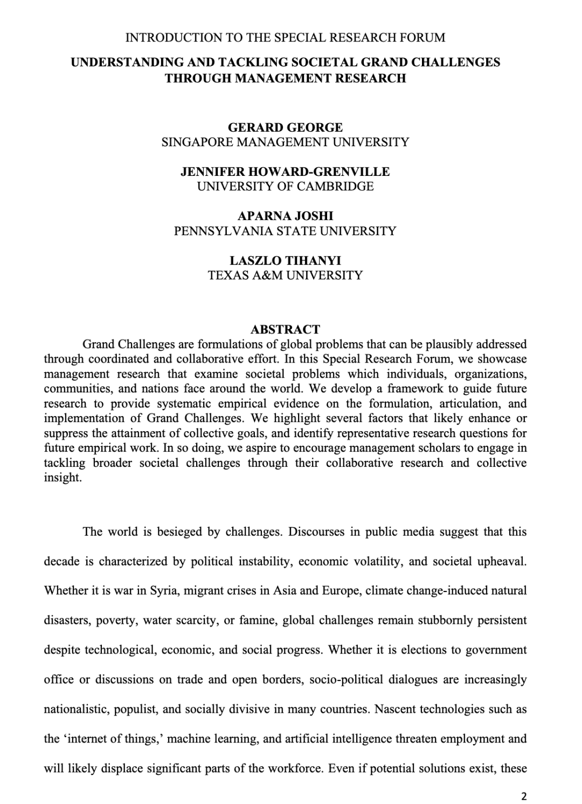
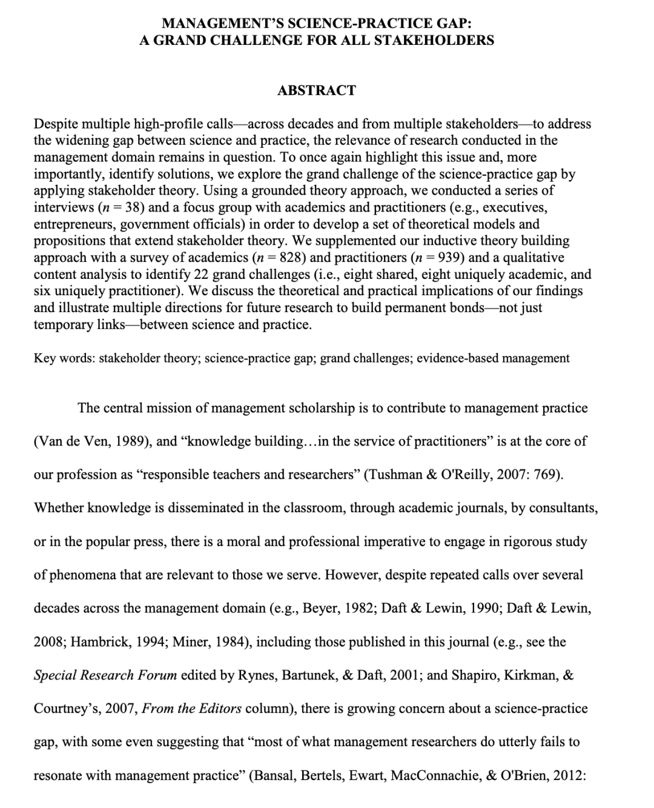
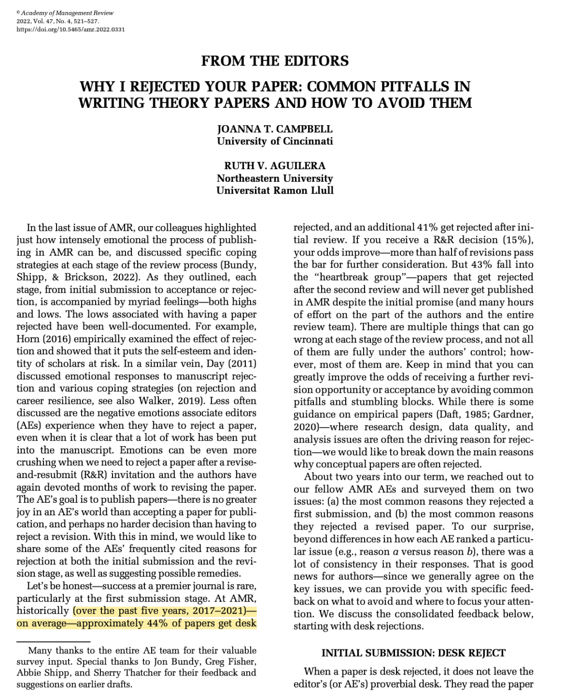

# 周一好困顿... 于是跑到系楼旁边的咖啡店猛灌咖啡，脑子逐渐清醒起来

——然后发现我这小破公众号又一个月没动静了！真是懒惰bwj！

于是就借上周组会报告随意水一期😃 主要是关于如何选题的。

具体内容已经在组会上分享过了，属于课题组资源了🌚就不放太详细的ppt和笔记了。但是准备这次组会时看的几篇好文章倒是可以给大家一起共享一下！

**第一篇：AMJ  Topic Choice的五大原则**

这篇会提出五个选题的原则，每一点都会给出相应的例子和文献。是一篇很经典的文章。每个管理学人都应该看看！（其实也是很通用的检验，任何领域的学术人都可以看看）

**第二篇：AMJ 从“有趣”到“重要”**

这篇在“有趣”和“重要”之间进行了trade off。对于「过度追求有趣、而忽略了数据的严谨、忽略了对领域内重大问题的回应」的研究进行了批判，倡导学者还是应该回到「重要」的问题上。

**第三篇 AMR 通过“问题化”来产生研究问题**

这篇把传统的Gap-spotting的研究和挑战原有观点的研究进行了对比，鼓励学者Change the conversation。以后不要在intro部分只知道filling the gap，而是应该Think out of the box，对于以往理论的底层命题勇敢质疑。（太难...）

**第四篇 AMJ 管理学者如何面对社会挑战**

****

这篇罗列了一些联合国给出的Grand Challenge以及编辑部认为的管理学者可以回应的Grand Challenge，并分析了两类管理学结合社会重大问题的研究。这篇能提供一个更宽广的学术视角，鼓励我们不要整天只在individual的层面探索。

****第五篇 AMJ 管理领域中学者和实践者的gap****

非常重要的一个话题：如何做到学术界和业界的整合。哪些话题可以在两个领域进行合作，哪些话题是特有的，都可以在这篇中找到答案。

****第六篇 AMJ  我为何拒绝你的稿件！****

****

听名字就知道 这篇一定要看！可以狠狠避雷！

****结尾碎碎念****

感觉公众号的记录也是一个push自己静下心来的阅读写作的平台，所以还是想好好利用一下。所以浅浅对接下来的公众号运营进行2个Flag：

- 搭建一个Psychology的学术群，感兴趣的可以后台回复「学术交流」进群。会不定期分享一些好文章or好推送，也可以在群里进行学术讨论（并push我好好科研 好好更新）。
- 保持至少一周2次的更新，每次都可以很简短，比如有趣的研究、模型、理论，或者是学到了什么好的时间管理方法，再或者就是一些资源的整理，都可以瞎分享分享。
