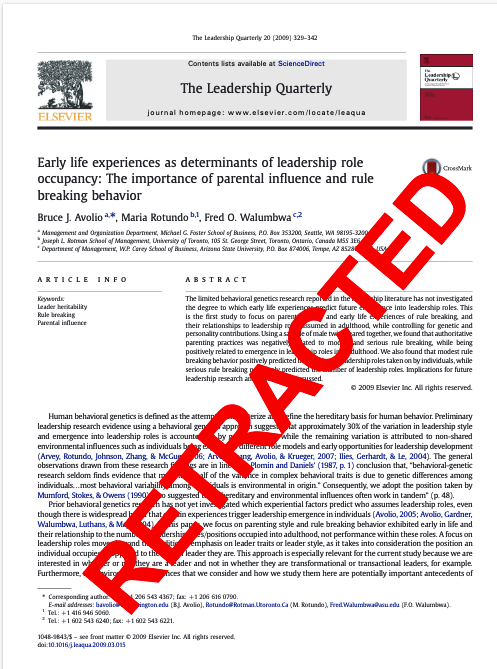
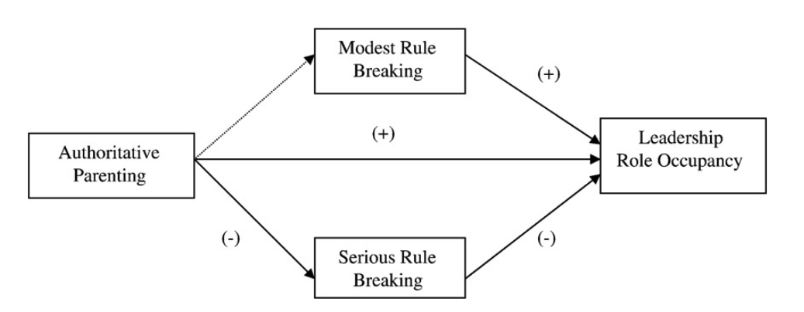
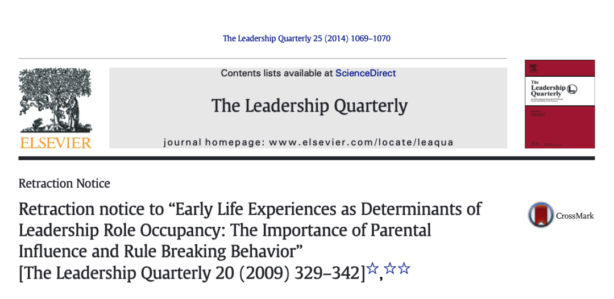
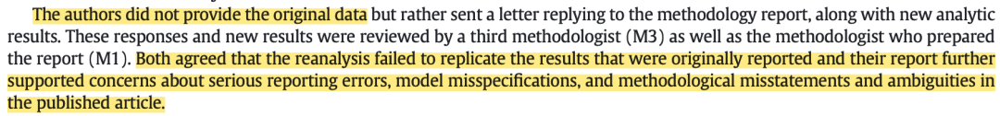
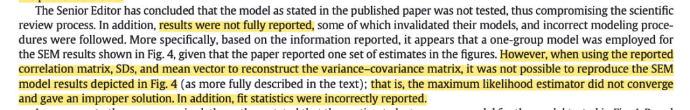
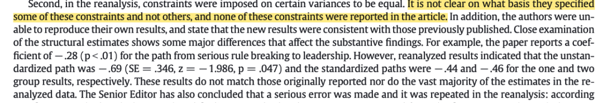

# 前段时间大规模检索文献，发现了LQ （中科院一区top IF=7.5）上一篇2009年被撤稿的文章。

说实话，这还真是我第一次见到打上「Retracted」的撤稿文章+撤稿声明，之前见过的都是推送里写的关于一些医学论文的造假撤稿，从来没关注过管理学领域的撤稿情况。当时就想着等忙完就来看看这篇文章究竟为何被撤稿。

D5文献：Avolio, B. J., Rotundo, M., & Walumbwa, F. O. (2009). RETRACTED: Early life experiences as determinants of leadership role occupancy: The importance of parental influence and rule breaking behavior. *The Leadership Quarterly,* *20*(3), 329–342. https://doi.org/10.1016/j.leaqua.2009.03.015

**这篇文章讲了什么？**

这篇文章主要探讨「早期人生经历」对「成年期的领导角色」的作用，并借助***社会学习理论***探讨「早期经历」中的pareting（即父母教养）的作用，并认为「早期父母教养」对「成年期的领导角色」的关系是通过rule breaking behavior（即违反规则行为）来**中介**。特别的是，作者为了控制年龄、性别、基因的额外影响，选用了1961-1964年生的男性双胞胎作为被试。

这篇文章的结论是，authoritative parenting（权威型父母教养方式）和违反规则行为成负相关，和成年期的领导角色涌现成正相关。此外，中等程度的违反规则行为可以正向预测领导角色的数量，但严重程度的违反规则行为则反向预测领导角色的数量。——也就是，作者的四个假设全都成立了。

****

这么乍一看，结论仔细想想倒也有点意思，被试也挺特别，虽然这个中介提的有点怪，但似乎不至于到撤稿的地步。——我继续看了期刊官网上的retraction notice。

真是大为震撼！！

**撤稿原因**

在2014年的时候主编和LQ的2个前任主编、一些方法学专家一起对于这篇文章的方法进行了质疑（也许他们某天晚上进行鸡尾酒会 聊着聊着发现多年前审稿通过的一篇文章很有bug...）。之后他们把这份质疑转发给作者，让其进行回应。

至于他们一开始提出的质疑是什么，notice里面没有说。只是介绍了作者对他们的质疑做出的回应，以及他们针对这份回应最终选择撤稿的原因。

作者并没有如编辑所需要的那样提供原始数据，而是提供了一份重新分析的结果。而这份重新分析的结果完全无法重复文章之前的数据结果。

首先，作者没有**对所有的结果进行报告**。作者在图四中呈现的数据结果只是通过一组被试得到的，而不是两组被试的综合结果。

    关于这一点，专家是通过对于汇报的相关矩阵、平均值、标准差的分析得出论文中汇报的路径系数是存在问题的——太厉害了！虽然我隐隐约约是记得相关系数和路径系数是有关系的，但如何转换是彻底不记得了。——这个也从另一方面告诫我们，不要试图瞒天过海，描述性分析也是推断性分析的一个参考，需要前后保持一致。其次，作者的重新分析中，莫名其妙地对其中一些变量的方差进行限制使其相等。然而作者并没有报告，这些变量是如何被选中的、又是为何不选择其他的变量加以限制，同时在文章中也并没有对这一操作进行报告。以及，作者不仅莫名其妙进行这样的操作，最终得出的路径系数也和之前文章报告的不一样，真的是有点荒谬至极。

读完我感觉，作者这份重新分析仿佛是他不愿意直接承认学术造假而写的搪塞回应，也许他写的时候也明白这个迟早是会被撤稿的。

**启示**

归根究底，撤稿的原因还是在于数据方面。虽然在学习组织行为学的过程中，很多前辈说OB领域还是理论最重要。但是我想在发表文章的时候，理论推演体现的是在该领域的逻辑功底，而数据分析则体验了研究者的学术素养和严谨程度。

别人能否用同样的原始数据和分析方法进行结果的复现是基础，在此基础上，就需要对你分析方法的每一步进行谨慎操作、并把关键步骤在论文中进行汇报。

对于这个我深有同感。尤其是对于像spss、amos这样的按键类软件，也许稍微按错一个键或者在方差那边的线胡乱设置了一下，就有可能导致不一样的结果——这也提示了科研人们：所有的数据都需要多方进行检验，不能只凭一人得出的结果。当然我觉得最好的方法还是使用R这种每行代码都标注地很清楚的软件，这样只要保证代码是合理的，那么每个人的结果也都是一样的了。我也想以后都用R语言进行数据处理，这样可以把数据清洗、转换、分析、作图都放在一份代码中进行呈现，从始至终都能有迹可循，就可以避免在excel-spss-amos等软件来回切换的过程中弄错了一步而导致满盘皆输。

就是如此啦！愿我们都能成为严谨学术人！

**结尾碎碎念**

我终于严格意义上开始了研究生的生活！感觉已经好久没有线下听课、参加什么开学典礼了，也很久没有高密度的进行一些社交，总之还是新奇+疲惫+期待共存，希望能慢慢平衡，摸索出适合新学期的daily routine，结识好友，科研进步~

​

​

​
