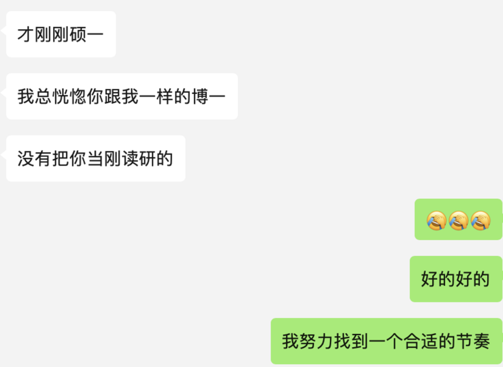
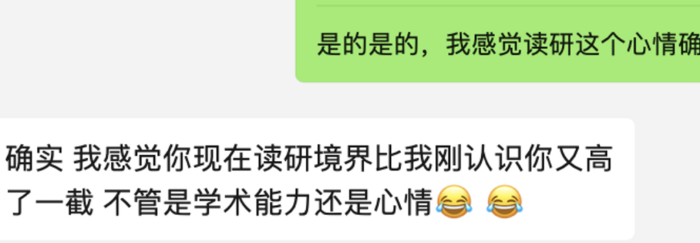
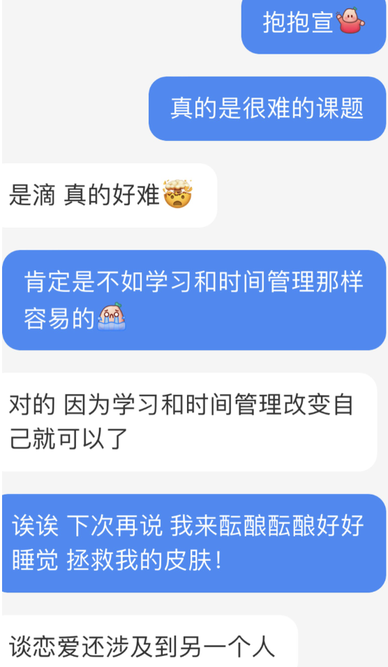

论文推进受阻，需要再进行一些文献调研，加上我的皮肤实在有点无法耐受杭州湿热的天气，所以美美回家度假了（还没跟导师说…）🙏🏻

今天彻底摆烂一天，晚上也完全不想学习，所以来这儿浅浅记录一下最近脑子里闪现的一些东西。

**#一些关于升学的忧虑**

谁能想到，我这个甚至还没有入学的研0人就已经在考虑未来规划的事情了。

目前已经给自己列了以下几种选择（包括但不限于）：

本校本组转博（中间申csc或港校联培）、本校去管院转博（同样也是申csc或港校联培、努力清北读博（也得申csc）、申港校全奖phd、申国外全奖phd…

前段时间还为此困惑了一会儿，现在想想，**纯粹杞人忧天！**

不如在还有时间的研一把这些选择里都需要的**科研+英语**搞好，这样也是给未来更多选择的权利。至于未来到底选哪条路，**到时候随着阅历的增加自然会有答案的！**

👆🏻昨天我的一位管院师兄兼学术伙伴这么跟我说。我才感觉我大可不必把自己push的太极限…所以...还有10多天才开学，我要在最后的时间里「理所当然地」美美度假！

**#现在与过去**

最近看的一些书影音里都很默契地提到一个场景，那就是站在现在审视过去。

比如哈利波特回到过去的时间线里，发现拯救小天狼星的守护神其实并不是父亲召唤的，而是他自己召唤的；

比如《献给阿尔吉侬的花束》里，智商变高的查理审视过去，才发现过往被嘲笑的自己有多么可怜；

比如《不原谅也没关系》中提到，面对创伤的一大办法是想象回到过去。成为当时那个脆弱的自己的倾听者、陪伴他、完全与他共情。

今天一个学弟跟我说：

（抛开学弟吹嘘的成分），我也在思考，现在的我和过去又有什么差别呢？刻意回忆一下，可能是以下几点：

1. 本科期间觉得去名校读研是唯一目标，而现在**会思考自己未来想要的生活是什么样的，从而能更好的指导当下的自己的行动了**——这个也是钱婧老师一直在提的，觉得迷茫的时候就想一想10年后你想过的人生是什么样的，然后慢慢看那7年后、5年后、3年后的自己为了那个目标都需要达到什么程度，再去指导当下的自己。

2. 我确实会更爱自己了。无论是身体还是心理，我都在努力尝试用最好的方式care myself （很好地贯彻落实我的微信名：Selfcarebwj）。比如久坐了必须站一会儿出去晃悠晃悠，保持脑子不要因为过于紧张而变得疲惫；比如觉得一段时间身心疲惫也会和好朋友一起出去吃、这被我们称为『出去吸吸人气』；比如不会像之前一样困在自己的价值观里、而是尝试一些让『关系』中的人都更舒适的想法了。——**于是我也渐渐明白了，爱自己的前提，似乎也是改变，是打开自己，是在接纳自己的前提下、也去接纳更多的人、更多的生活方式、更多的价值观。**

嗯…好像还想诌些什么，还以为有更多改变的..但好像目前想到的也就是这两点了。

**#亲密关系**

最近回家我发现，我在亲密关系中习得的很多感受似乎是可以**迁移到**我与父母的关系中的。

经历了亲密关系中的失望、怀疑，到理解、释怀，才终于可以区分「我感受到的」和「他人想传递的」的区别，终于能从一些事情的源头去理解而不是困于最末端的浅层感受，终于感受到了作为主体和客体的不同体验，终于发现「我认同的理念」和「我能实际做到的事情」是两码事，才会发现自己长期信以为真的很多价值观其实真的只纳入了自己。总之，亲密关系确实是一面镜子，它让我看到我的脆弱、我的自私当然也有我的好、我的真心。

（本来以为这些是很简单的东西。但真的花了好多时间精力了好多痛苦才真正明白。）

经历了这些，确实让我更好的理解了爸爸妈妈的爱。我也可以逐渐把《不原谅也没关系》里面的提到的「Good Enough  足够好」这个概念（最早是温尼科特提出的）用在我的关系中：我会认为，我已经有足够好的父母、足够好的伴侣、足够好的朋友、足够好的导师、足够好的课题组。追求最好是没有上限也永远不会快乐的，good enough is enough！

另一个感受是，我感觉现在的我已经几乎挣脱「浪漫爱」的束缚了。爱情对我来说已经不是那种抽象的、荡气回肠、难以形容的东西了。我觉得**这就是很具体的东西**。可以具体到那些感受到的爱的时刻、场景、几月几日。学术一点说，这玩意儿是context-based而不是theory-based。甚至我都不用“爱”这个模糊的字，而是可以更具体的解释为陪伴、共情、理解、原谅、珍惜、欣赏、付出、关心…当这些本来是四散在不同地方的感受发生在同一个人身上，我想那应该就是爱了吧。

ps：当然和宣宣宝每次因为爱情的苦交流的时候，也总是感慨这真是很难的东西。

虽然我俩总是看很多这方面的书，总能诌出很多感悟，但每次困进去的时候就是困进去了，也是无数次想逃离…宣宝说这个和单方面的学习不一样，这个更涉及两个人之间更复杂的情感与认知交流，确实不是努力就可以的…

另一方面，我想也是因为当代人**「先看过海的图片，再看到海；先听过很多爱情故事，之后才知道什么是爱」**，我们**头脑中的概念已经先行于我们遇到的具体的场景**了，所以在面对真实问题前，我们必须还要额外经历的一个痛苦是，再审视并更正头脑中的长期概念。

Anyway 祝大家都能找到能沟通、能一起探索亲密关系的人，少吃爱情的苦:)

浅浅写到这里，时间不早了，洗洗睡了~ 健康最重要！！
