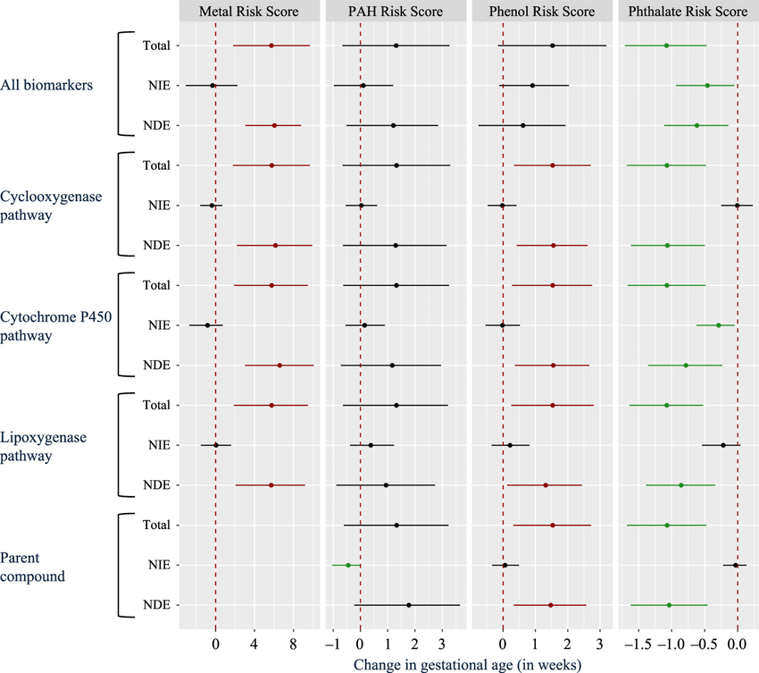
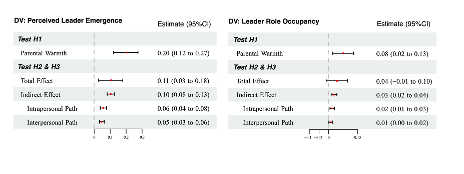

之前一直看到森林图，感觉非常直观，就想着我这个论文能不能也用森林图可视化，但属实没见过有人做过。

以R语言+中介为keyword在google上搜了搜，倒是找到了一个Nature Communication里面的图，可惜没代码...

还是回到万能的微信搜一搜，看着看着发现，其实也完全可以靠手动输入一些数据的方式。（比如医学森林图那些亚组会分成不同的年龄，那我就可以把不同的年龄组代替为总效应、直接效应、间接效应，然后再输入置信区间，效果也是一样的！）

于是东拼西凑地整理了一下代码，无数次处理了bug。贼累！花了3小时才调整好！

看着倒是还行！

但我最后发现，因为图左侧的因素都是一样的，所以如果因变量能用不同颜色呈现出来合并到一张图上，效果会更好。

奈何我的代码是东拼西凑的，不能像ggplot2那样增加一行代码就可以实现分组...

于是感慨：虽然直接当成工具一样去整理、改动一下别人的代码，但是一些针对于数据的个性化作图还是得靠自己的基础！ 之后还得带着把R语言基础学一学！

（蹲蹲公众号有没有R语言大神可以交流学习哇——）
