最近忙于改论文，于是公众号的「读顶刊」和「R语言」栏目快3周没更新了。但是这3周倒确实又提升了我的部分学术素养，在这里记录一下一些workflow&insights。

**我的核心目的：为了使得论文逻辑更顺→找一个理论视角的切入→找相关论文**

我的workflow是：

1. 通过**wos**或者**scopus**限定关键词、期刊、领域进行文献筛选——只**根据摘要**判断是否需要这篇文献，需要的话就在前面打勾。

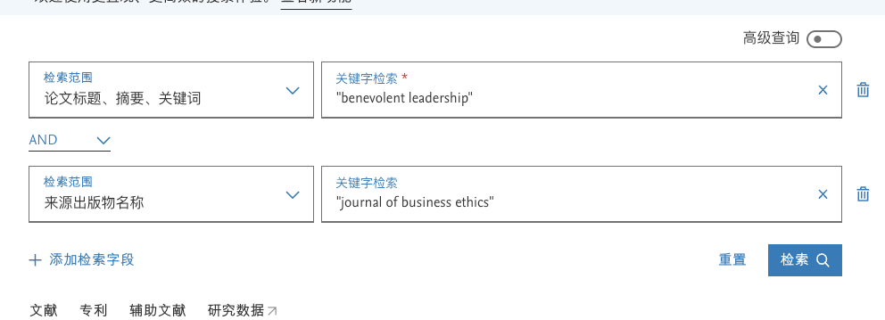

举个例子：可以限定仁慈领导力+JBE这本期刊

当然也可以再增加更多的相关关键词和期刊

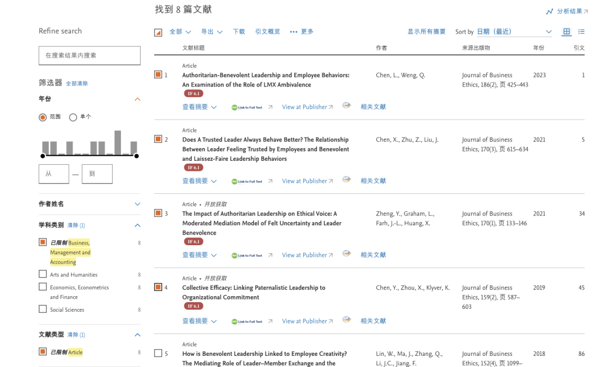

这一步搭配easyscholar插件效果更佳（可以显示期刊分区和影响因子）

奈何它最近收费了... 免费的话就只有如图这样显示

2. 之后把打勾的所有文献按照zotero的格式导出，然后导入到zotero中，并等待一会儿让**zotero自动下载论文pdf**——我真的太爱zotero了，每次看到zotero自动查找pdf，而不需要我自己一个个子下载的过程真的引起极度舒适！

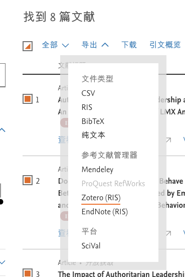

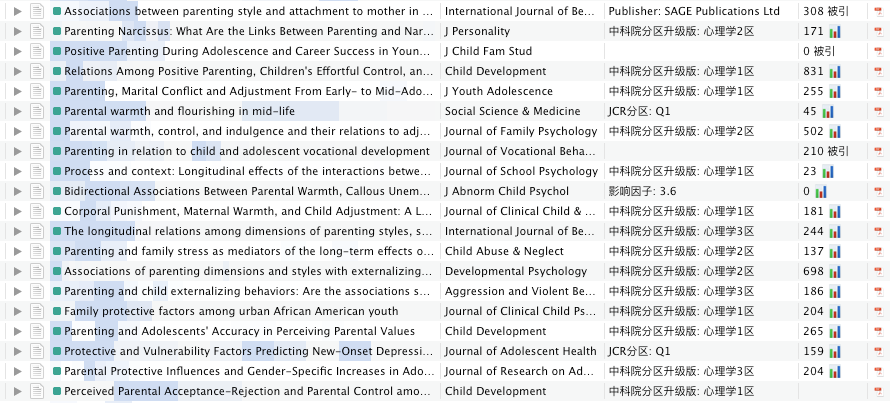

右边的这些pdf都是zotero自己找的哟！

主要也是基于scihub 这个相关的教程b站、xhs都有很多

**下一步就是最核心的阅读论文和记笔记——完全靠zotero实现：**

**阅读顺序：**因为zotero中安装了能显示期刊影响因子的插件（greenfrog、zotero stype、青柠学术的vip插件都可以实现功能），所以我会按照**「期刊影响因子从高到低」**的顺序阅读——因为**往往越是顶刊，就可以把一个理论阐述的越有逻辑性**，这样看到后面，就会发现那些IF低的文章味同嚼蜡，只是简单概括了一下理论，所以可以马上打上一星差评然后丢弃，从而**节约时间**。

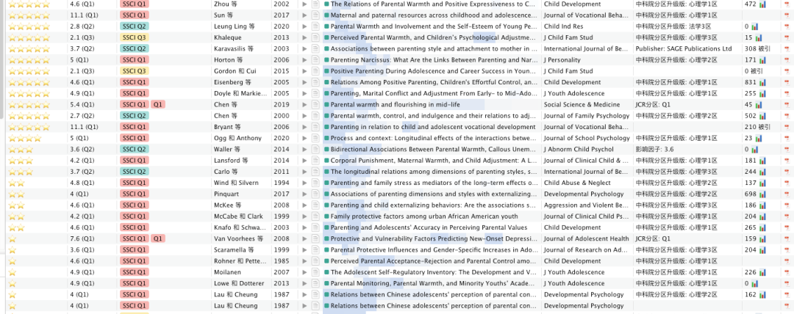

**阅读过程：**因为这种文献阅读是完全基于目的性的，即是为了查找某个理论具体的推到逻辑，所以我就会用zotero阅读器打开文献之后，直接查找关键词的部分词根（这样可以捕捉到形容词、名词的所有表达），然后再**集中查看高亮部分**。）——同时，在阅读完之后，我也会**利用评级功能**对每篇文章进行1-5分的评级，这样可以**方便之后更快地找出核心文献**。

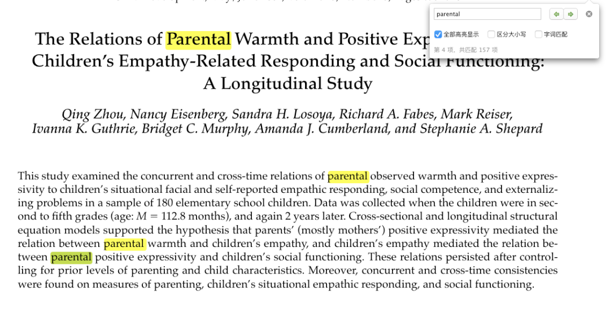

**高亮颜色：**我会用红色代表和我的研究最契合的句子，黄色代表这篇文章里的一些关键观点（但可能暂时我用不到的那种），用绿色标出之后要查阅的文章，用灰色标出一些很好的表达。

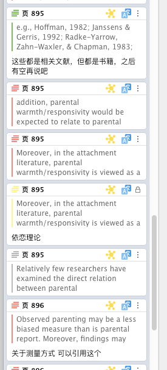

**笔记整理：**我会用到betternotes这个插件（后来看论坛的时候发现，这个插件居然就是浙大研究生开发的！），这样插件的功能是可以进行**双链笔记——即大纲和文本之间的双链。**

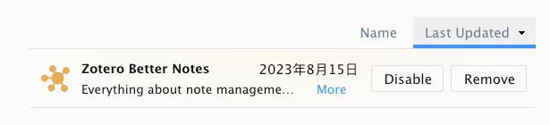

具体的用法是：

我会先创设一个大纲笔记，里面会包括围绕：这个概念相关的一些themes（比如理论最原始的解释、随后发展的一些相似理论、理论可以解释的一些现象、如何用丝滑的逻辑解释这些现象等等——**这部分的划分完全是按照自己的需求**，目的就是顺应你论文中的假设推演——对应红色高亮）、可以学习的表达（对应灰色高亮）、之后要去查阅的文献（对应绿色高亮）

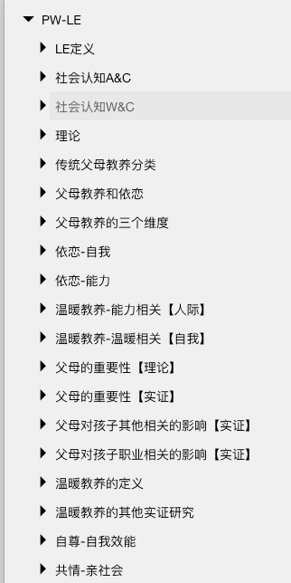

2. 之后我就开始将之前高亮的部分链接到相关的主题下（每个高亮内容都会对应一个betternotes按钮，点一下之后就可以进行**注释+链接到大纲笔记**）——这一步相当于是把阅读文献和文献整理的过程去开，可以让阅读的过程**更进入心流的状态**，然后阅读完之后再进行分主题的整理。

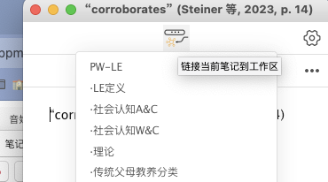

3. 完成以上两步之后，再回到刚才的大纲笔记，就会发现里面每条大纲下面都会放进去你文献中建立了链接的内容——这一步，相当于是通过betternotes建立了**所有文献之间的整合**，而不是像之前一样要把每篇文章中的高亮再复制粘贴到word或者excel中了，非常省事儿！

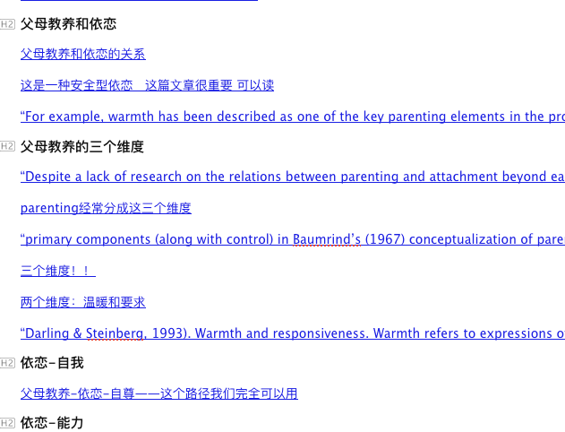

比如这样👆🏻 但因为有的我加了注释有的没加 所以看上去比较混乱...

另外，betternotes还可以和zotcard一起使用，这样可以有更多的笔记模版；以及大纲笔记也可以以Markdown的格式导出到obsidian软件，方便更好地笔记管理。——这就是更高阶的功能咯，这里先不说了！

这样下来，再在写论文的时候找你需要的内容就很方便喽~

****结尾碎碎念****

写论文改论文实在是消耗认知！我得多写写这些休闲公众号放松一下！
