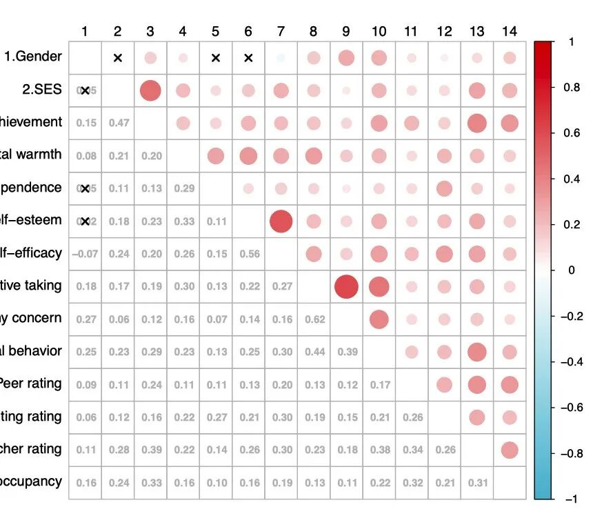
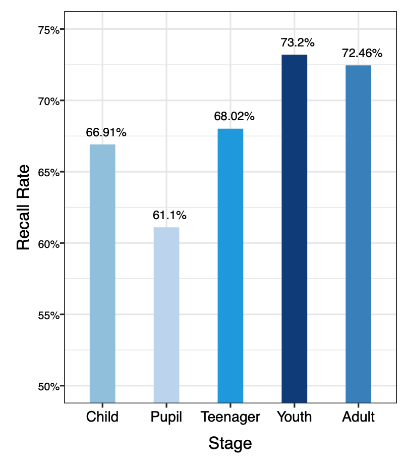

终于更新这个系列...

但是今日搞论文+作图两眼昏花... 就纯纯放个图得了...

**图1:相关性热图**

(为保护课题组隐私 隐去变量名了)

- 下三角呈现相关系数，上三角是相关系数的可视化；

- 红色为正相关，蓝色为负相关；

- 对角线相关为 1 进行省略；

- 保留相关显著的相关系数，并为相关不显著（p>0.05）的打上叉。

**图2:很基础的柱形图**

（突然想到我也可以拓展卖代码业务... （等我不再是 R的弱鸡再说吧...

好累... 赶紧 洗洗sleep 了

祝大家早睡早起身体好！

科研顺利 灵感迸发  idea 满满 逢投必中！
