# 因为旅行+提前入学，已经两周没更新了...批判一下自己！

之后还是会定期更新一点东西的...!

这次分享的AMJ这篇已经眼熟了三四次了，是得拾掇一下它了～

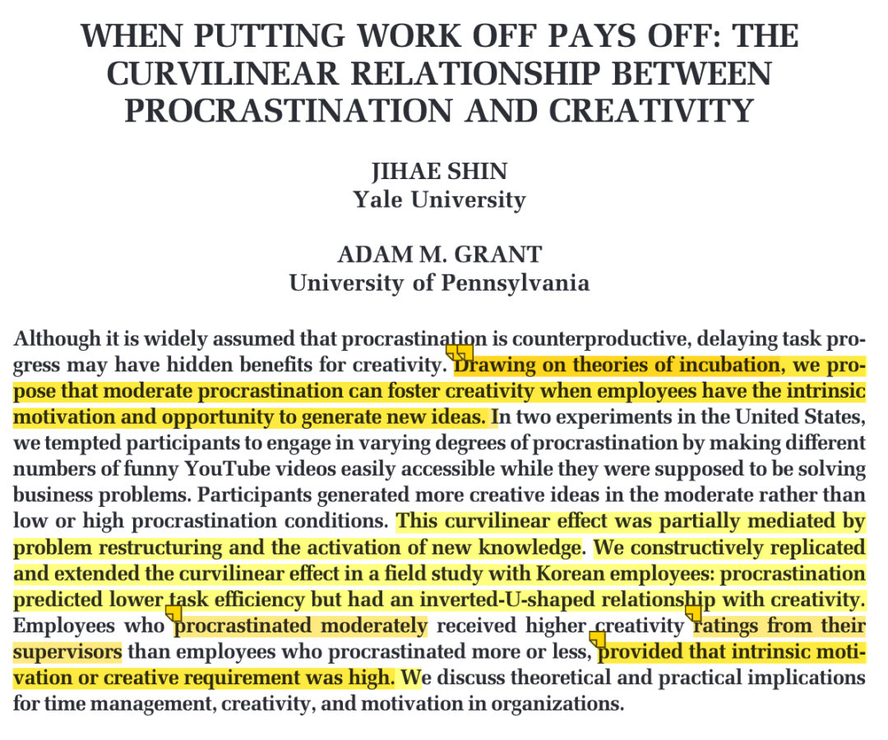

# D4文献：Shin, J., & Grant, A. M. (2021). When Putting Work Off Pays Off: The Curvilinear Relationship between Procrastination and Creativity. Academy of Management Journal, 64(3), 772–798. https://doi.org/10.5465/amj.2018.1471

**引入**

承接上一篇《[读顶刊｜JOM-管理学中的“过犹不及”效应](http://mp.weixin.qq.com/s?__biz=MzU1MzY1MjIxOQ==&mid=2247484652&idx=1&sn=be72baefa642745f363ad8dbaa0df806&chksm=fbeede78cc99576e03319315a9223523845a6f8cd94068742f2c8dde5a1f552a9c4ae8452199&scene=21#wechat_redirect)》中提到的非线性关系，今天 AMJ 上这篇就是从实证研究的角度探讨了拖延和创造力的关系。

**假设提出**

根据theories of incubation（孵化理论），不拖延的员工会只聚集于拿到任务时想到的传统想法（比如那些给你 5 元进行城市生存挑战，如果不拖延马上去做，很有可能只能产生「想尽办法节流」的传统想法），**因此会限制问题重组和新知识的激活**；而过度的拖延员工由于时间紧迫，会采用熟悉的、传统的想法尽快完成任务。

只有适度拖延的员工，他们会创造与任务之间的心理距离，从而有意识或潜意识地重组问题和激活新的知识。

基于此，作者提出两个假设：

H1：拖延与创造力成倒U型关系

H2：这种倒 U 型关系是通过**问题重构**和**新知识激活**来中介

此外，作者还进行了边界条件的探讨：

借鉴theories of self-determination theory（自我决定理论）和 motivational equifinality  theory（动机等效性理论），员工的内在动机水平会影响员工对于焦点任务的注意力（ 类似于是一种来自于个体的边界条件）以及，任务的创造性需求将弥补内在动机的缺乏，从而促进拖延对创造力的曲线效应（ 类似于是一种来自于外部的边界条件）。

因此提出H3：拖延对创造力的曲线效应受内在动机和创造性要求共同调节。

**Study 1**

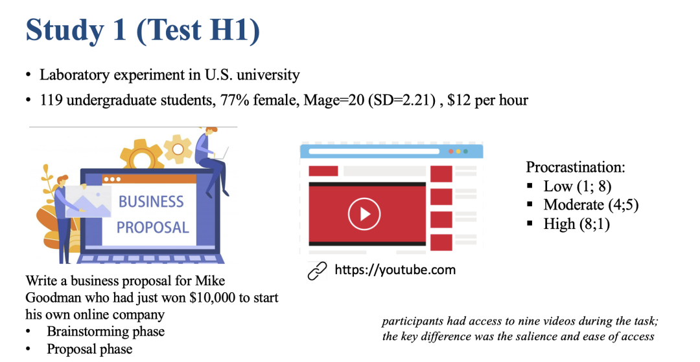

自变量的操纵：研究一要求被试进行头脑风暴和撰写商业计划书。通过在做商业计划时页面呈现的Youtub视频的数量进行不同操纵拖延水平（高 vs 中 vs 低）。

因变量的测量：计划书的创造性由两个科研助理评定。此外，他们还分别评定了 idea 的数量和质量作为探索性研究（最终发现是 idea的质量才会提升创造力，而非数量）

结果表明，中度拖延的参与者比低拖延和高拖延的参与者写出更多创造性的提案，低拖延与高拖延没有差异。——Study1  反应出了拖延与创造力的非线性趋势。

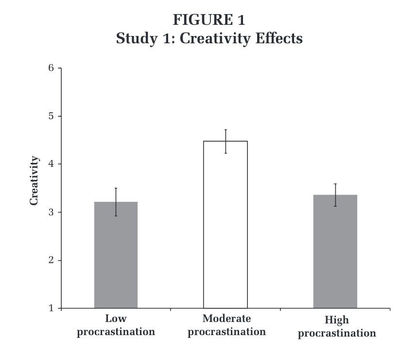

**Study 2**

Study2 对于 Study1 的变化：改变了创造力任务、进行了中介机制（和创造力一样，对于问题重构和新知识激活的测量也是由科研助理进行单独 coding ）的探讨。

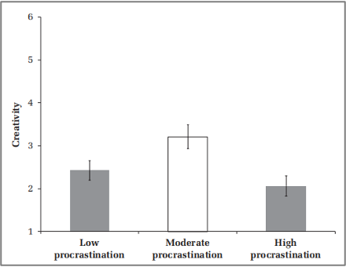

Study2得出了和 Study1 一致的结果

而对于中介的分析发现：

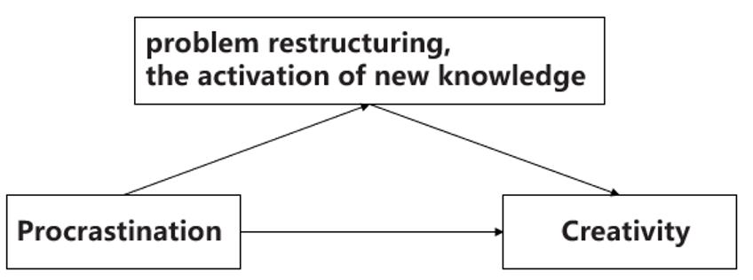

从低拖延到中等拖延：拖延通过促进问题重组和新知识的激活增加了创造力；

从中等拖延到高拖延：拖延通过阻碍问题重组和新知识的激活降低了创造力。

****Study 3****

Study 3 对于 Study 1&2 的变化：从实验室情景转换到了公司情境、 完全用问卷进行测量、进行了边界条件的探讨。

这里的数据分析用了一种random coefficient model（随机系数模型）。我搜了一下，发现这其实就是multilevel 多水平分析，又称为混合效应模型（Mixed-effects model），主要就是检验多层数据。

ps：该方法最早应用于教育领域，研究不同学生成绩时，同一个班级的学生成绩是不独立的，呈现一定的相关性。对于本研究的数据，会采集不同部门的数据，然而同部门的员工之间并不独立，所以就需要用 multilevel 的方法进行嵌套处理。

将二次项放进回归模型，发现了显著的倒 U 型关系：

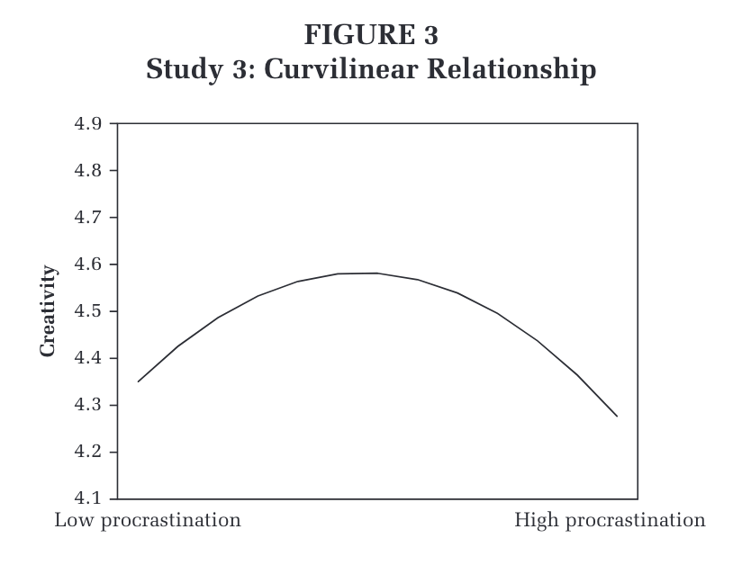

针对于边界条件的检验发现：只有在低创造力需求、低内在动机的情况下，拖延和创造力才成负的线性关系。而在其他三组条件中，都成倒 U 型关系。

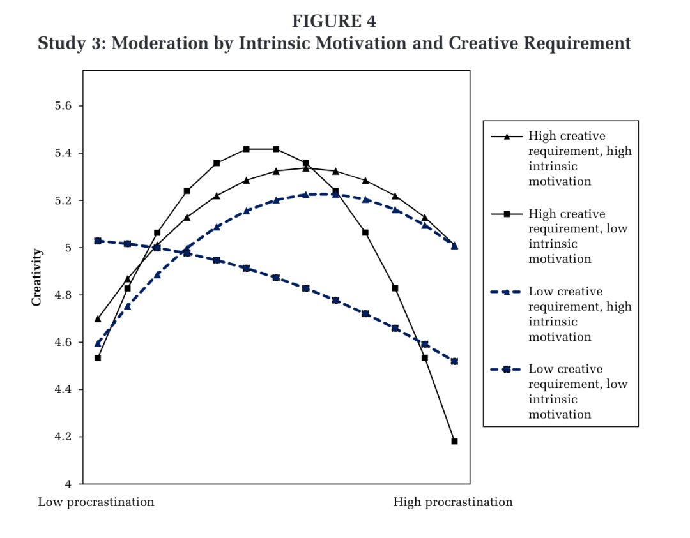

这也能证明H3：创造需求 or 内在动机有一个较高，就会导致拖延和创造力的非线性关系。换言之，如果你既没有内在动机也没有创造需求，那你越拖延，创造力也只会越低。

**结论**

结论也很显而易见啦！

拖延并不像传统认知里那样一定是一件坏事。只有你有一点内在动机，或者你的任务需要一些创造性，那不着急、慢慢来、先好好想想，促进一下问题重构和新知识的激活，达到一个适度拖延的状态，反而会提高创造力！

**贡献+局限+未来方向**

这部分就稍微有些泛泛了.. 略过一下

**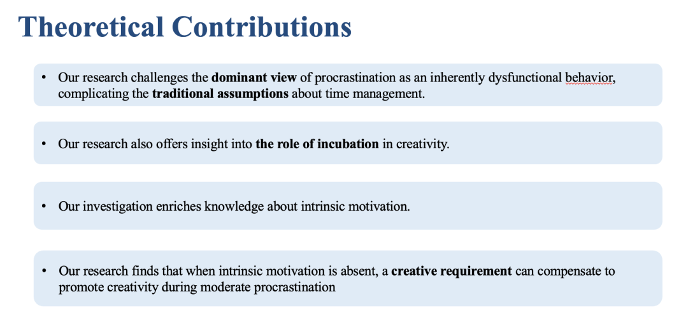**

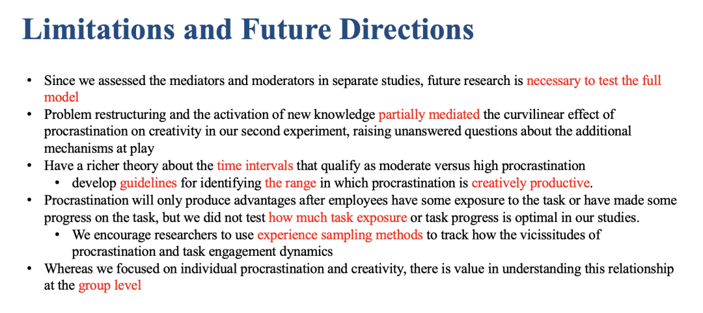

**可学习的点**

1.非线性关系的检验

2.非线性关系的调节、中介的数据分析

3.有趣的实验任务设计&严谨的变量控制

4. Adam Grant 的文章都可以好好关注写作，毕竟他是一个超级传奇的人物，写书、演讲、播客、魔术、学术大牛...

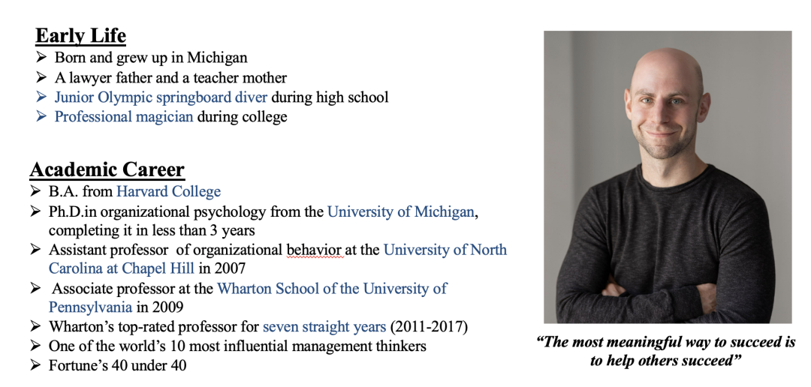

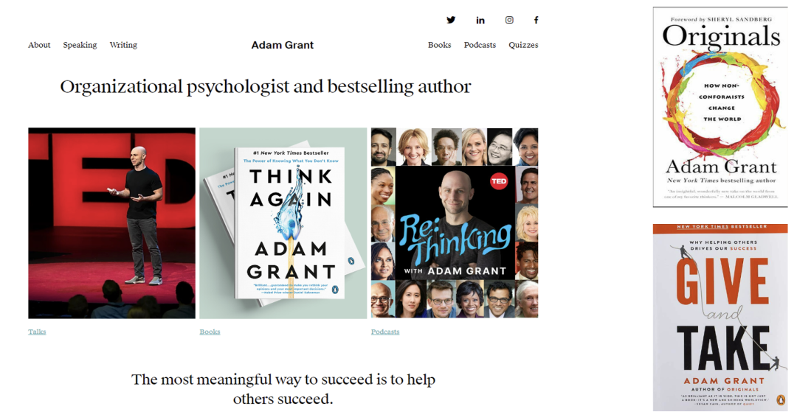

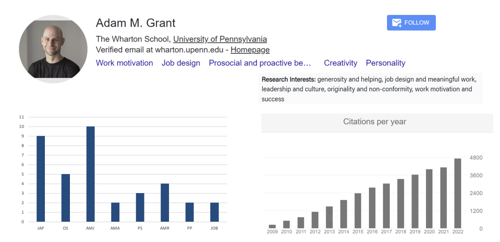

****结尾碎碎念****

来到紫金港后感觉一切都是崭新的、有趣的，真的会有下面这样的感受：

能学的东西、有意思的人和事太多了，我没看到的世界太大了，真的不想再精神内耗地把自己的价值依托在外界了。

世界广阔着呢！
