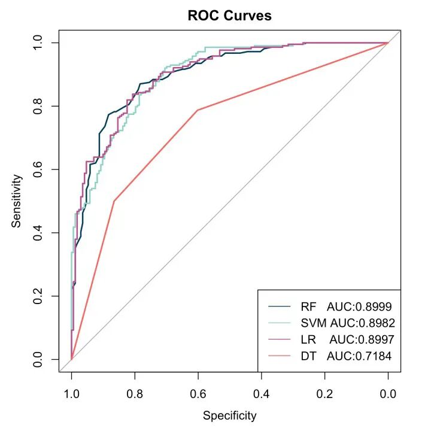
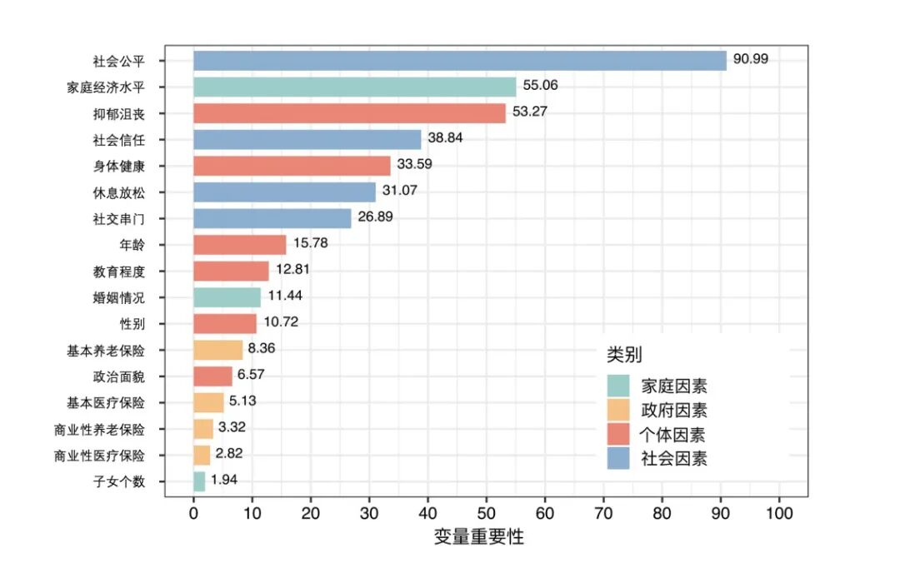
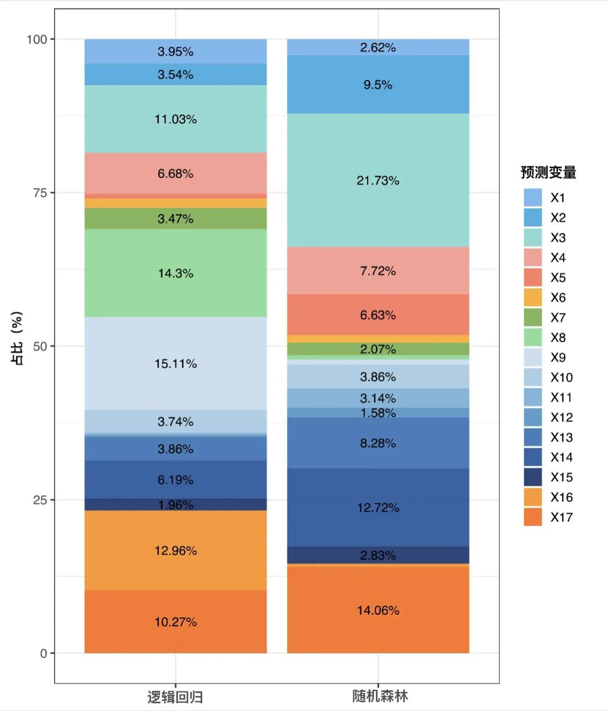

啦啦啦 开一个新标题！

这几天用R作图感觉太有意思了，我立志之后好好学R、好好可视化！

虽然R一直被当成一个统计软件，但是用R作图也是非常常见且优雅的，当时听了一个北大心理学本科的活动就说他们大二就都在R作图了...确实不愧是pku的🥹

但是永远不算晚！反正有很多时间 学它学它！

（近日已对一些吵闹的娱乐活动丧失兴趣...）

图1:把不同算法的ROC曲线画在一张图上

​

图2:把随机森林算出来的变量重要性可视化，并且用颜色区分变量的类别

（本图特别鸣谢 Doctor Liu）

​

图3: 展现两个算法变量重要性的比较

（后来感觉差异太大 也不好解释 干脆只画了个随机森林的 这个图就废弃了 而且颜色太多也蛮丑的！）

​

R语言作图也是需要许多知识积累的，比如函数比如配色比如不同的包，还有各种各样可能出现的big。不过现在有GPT 和Doctor Liu的帮助，学起来就容易多了！

我学！！
