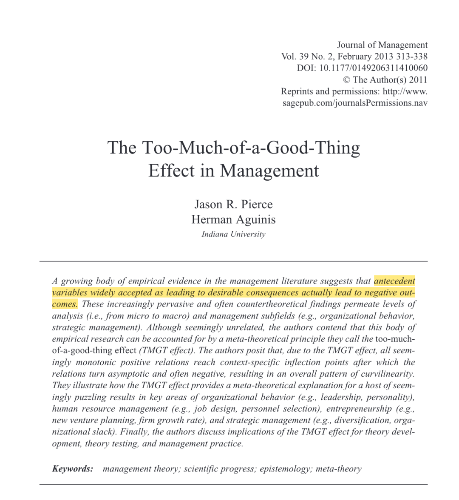
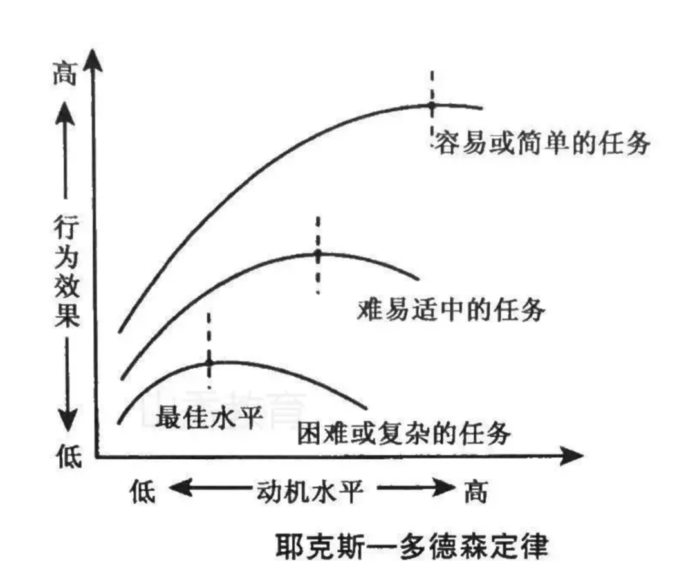
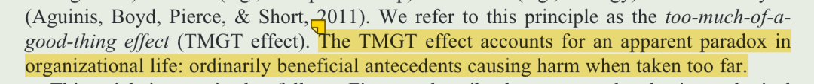
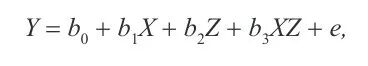
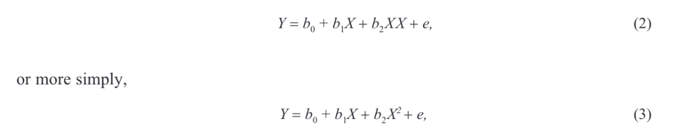
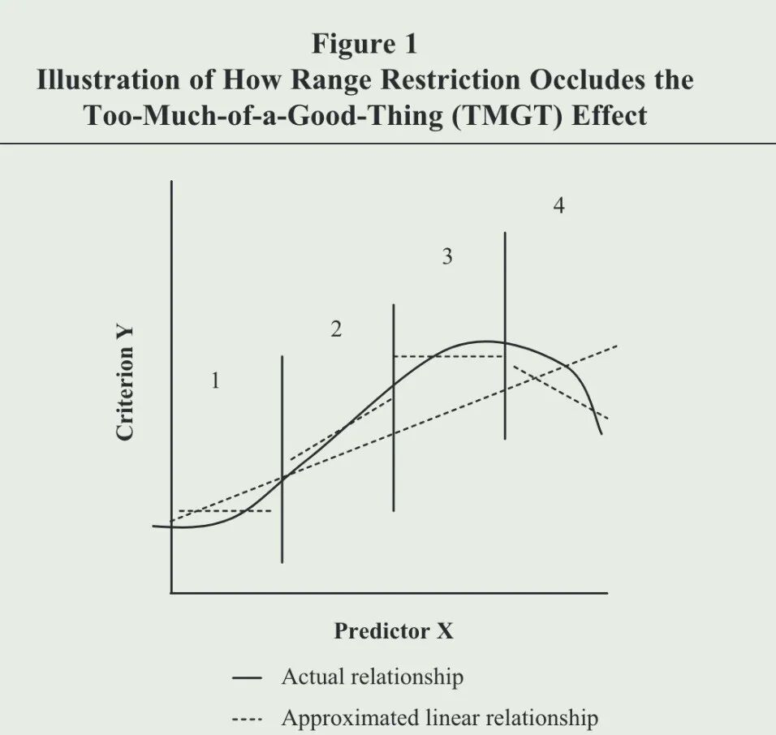
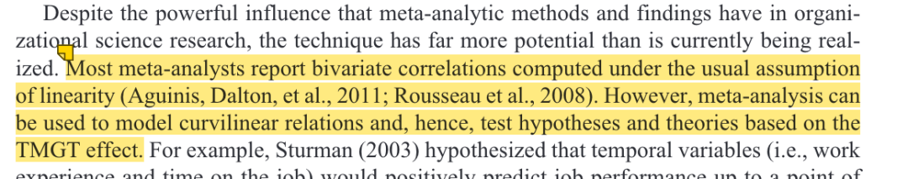

# 

# Day3文献：Pierce, J. R., & Aguinis, H. (2013). The Too-Much-of-a-Good-Thing Effect in Management. Journal of Management, 39(2), 313–338. https://doi.org/10.1177/0149206311410060

**引入**

在我们接触的大多数研究中，都是在探讨变量间的线性关系，比如组织公民行为越高，员工绩效越好。然而有越来越多的研究会发现，**这种常理来说正向的影响也可能会导致消极影响**（比如最近涌现的关于创造力的 dark side）的研究。

这两种相反的结论总是在综述被提及，然而大部分学者只是告诉读者这是一个 mixed 的现象，然后接着就是会进行更严谨的方法or更大的样本检验，来验证这个问题。

但是！仅仅关注线性关系是正向还是负向依然是很局限的。

或许还有一种情况是非线性。比如像心理学里著名的耶克斯-多德森定律，说的就是动机强度和工作效率之间的关系不是一种线性关系，而是倒U形曲线关系。

在管理学里，就比如说，一些积极的行为会促进领导力发展，但是当这些积极行为达到一个度之后就会导致消极影响。

**概念**

作者把这样一种现象总结为**too-much-of-agood-thing effect（TMGT效应）**，描述一种如果有利的前因变量“taken too far”的时候可能就会导致消极影响。

作者借用了各种哲学、认知论等等方面的理论对于 TMGT 效应进行背景介绍和概念界定，之后借用 OB、HRM、创业、战略管理四个领域的 8 个小方向的众多研究，阐明了这个效应在管理领域存在的普遍性，值得引起学者重视。

当学者关注到这个效应时，就可以：

（1）促使一个**理论**变得**更全面、准确、具体、更有推广性**。比如我们会了解到一个积极作用产生效应会存在拐点、拐点会出现在什么时候、拐点之后关系会呈现什么形态。

（2）会推进**调节效应**的研究。

因为本身就是调节效应里的一个特例，即自变量不仅作为预测变量 X 也作为调节变量 Z，这样就会导致原来的乘积项「XZ」变成了 「X 的平方」。

（3）在**实际管理**中也会避免“过犹不及”的现象，让管理者把握积极行为的尺度。

**应用上的注意点**

此外，作者还给出了学者在验证TMGT效应时的一些提示：

（1）在一开始可以**先画出散点图**观察数据形态，再决定是否需要建立倒 U 型关系。

（2）需关注**统计检验力和效应值**。否则在统计检验里小的情况下即使非线性关系存在，这种情况也只是很小的概率，显然是没有意义的。

（3）需要关注选取数据的**区域**，这个也是平时研究中经常出现的问题，如果我们只是选取一个变量中的一部分区域，很有可能发现的只是线性关系，忽略了 full range 下的非线性。比如这张图中，如果只选去部分 range 的数据，很有可能只能观察到虚线线段这样的线性关系。

（4）在文章的综述部分，应该采用更加**先进的元分析方法**（不应只关注总结了线性关系的元分析，还要关注那些能总结非线性关系的元分析）。

（5）在分析方法上，还要关注能够反应数据变化趋势的方法，比如作者提到的：

【Second, researchers have at least three growth-modeling techniques from which to choose: (1) latent growth modeling; (2) random coefficients modeling; and (3) latent class growth analysis (LCGA), also known as latent class growth modeling or mixture modeling (Muthén, 2001）】

**总结**

多看看文章就会让脑海里的框架不断扩展，不再局限于线性的 SEM，而是会在脑海里勾勒出优雅的倒 U 型、神奇的 LGM 模型，会发现数据上更美妙的关系，怎么不算是一种科研的乐趣呢！

****结尾碎碎念****

可以看出作者非常宽广的知识面和极高的写作水平，在论述理论的时候还会引用非常多哲学上的相似概念，同时也会结合真实企业案例进行说明。这部分是科研小白写作的时候非常缺少的，很容易写的很空洞。——不断学习！各种方面都要学习！
