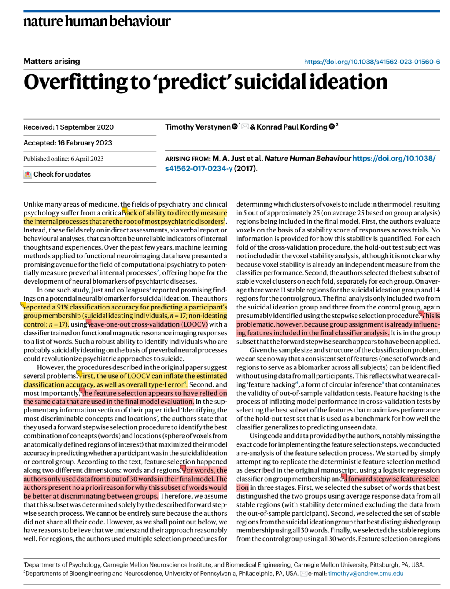
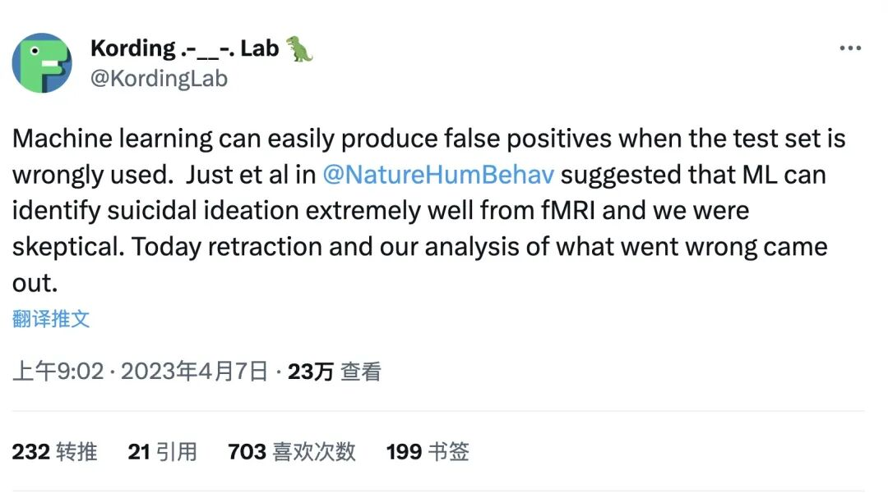
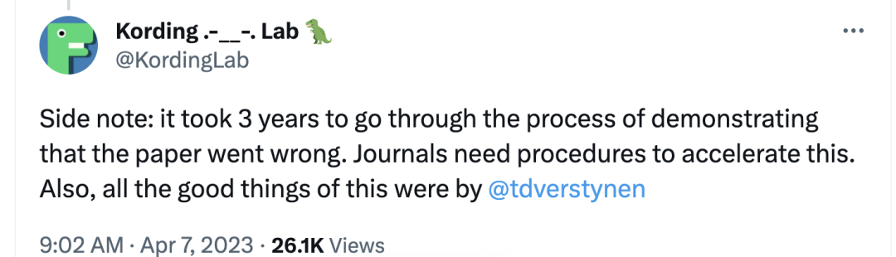
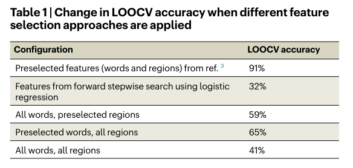
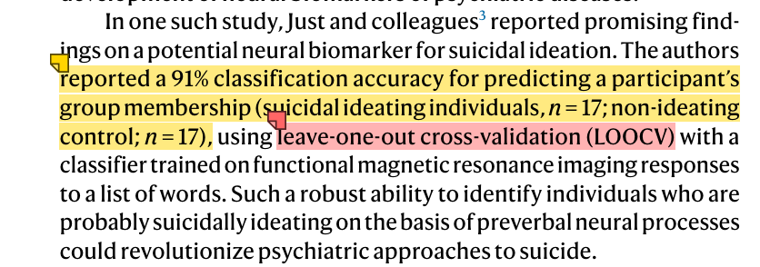

# 

# Day2文献：Verstynen, T., & Kording, K. P. (2023). Overfitting to ‘predict’ suicidal ideation. Nature Human Behaviour, 7(5), 680–681. https://doi.org/10.1038/s41562-023-01560-6

# 

今天这篇文章其实14 号就看了，结果之后一直在忙着毕业的事情就拖到了现在，「天天读一篇顶刊」这个目标还是太难实现了，我估计一周 2 篇已经很好了… 不过现在总算是结束了，回到家中可以安心学习～

这篇是发表在 Nature human behavior 上的一篇关于机器学习算法的文章，更特殊的在于，这其实算是一篇评论性的文章：作者对于 2017 年发表在 NHB 上的文章进行了批判性讨论，重新检验了数据，提出了更正确的机器学习应用方法——于是，那篇 2017 年的文章就在今年 4 月被NHB 撤稿了…

argue 的过程花了 3 年... 挺震撼的，致敬严谨的科研人！

下面就开始说说这篇文章：

【ps：我只是一个 ML 入门都没入的垃圾，毕业论文虽然用到了这个但是都是依葫芦画瓢随便搞搞，底层逻辑是一点都不懂，写的也只是算是个我的读文献草稿 55，有问题大家在后台及时给我指出！！】

与许多医学领域不同，精神病学和临床心理学领域无法**直接**测量大多数精神疾病的形成与发展过程，而是依赖于口头报告或行为分析进行**间接**评估（而这通常是不太可靠的指标）。

而在过去的几年里，应用fMRI的机器学习方法为**计算精神病学**领域提供了一条新途径。比如说 **Just 等人2017 年的文章**就通过机器学习的方法发现了识别自杀意念的可能性神经指标，这种机器学习方法的准确率可以达到 91%。

**然后！作者就开始对这篇文章进行了质疑：**

**问题一：**

原作者采用的留一交叉验证（leave-one-out cross-validation (LOOCV)）会让**分类准确性虚高，也会增加一类错误**。

【补充1：交叉验证】

交叉验证（Cross Validation，CV）是一种常见的模型评估方法。简言之，就是将样本分为训练集（tranning set）和测试集（test set），训练集用来估计模型参数，测试集用来评价模型效能。交叉验证的方法主要有留一交叉验证、k 折交叉验证、重复k折交叉验证和Bootstrap交叉验证。

·留一交叉验证（Least-One-Out Cross-Validation，LOOCV）：每次只留下一个样本作为测试集，剩余n-1个样本作为训练集，重复n次。(只适用于样本数较小的情况)

·k 折交叉验证k-Folder Cross-Validation）：将个样本随机分为k等份，将其中k-1份作为训练集，剩余一份作为测试集，并不断重复，直至每份都有且仅有一次作为过测试集。当k=n时，k折交叉验证等价于留一法交叉验证。最常用的是10折交叉验证。

·重复k折交叉验证（Repeated k-Fold Cross-Validation ）：对样本进行多次随机分组，每次分组都进行一次k折交叉验证，再将多次计算的结果取平均值，以消除分组的偶然性对计算结果可能造成的偏差。

·Bootstrap交叉验证：从原始样本数据集中有放回地抽取若干个样本形成新的数据集；然后使用新的数据集进行训练和测试，这个过程可以重复多次，最后计算评价指标的均值和方差。自助法交叉验证的原理是通过使用自主抽样的方法，能够有效地减小训练集和测试集之间的相关性，从而更准确地评估模型的性能。

-具体代码可参考“R语言学堂”公众号的文章（或者微信搜一搜就可以找到代码了）。

-各交叉验证方法的优缺点以及参考文献可以参考“java 菌”618 的那篇文章。

【补充二：一类错误和二类错误】

·Ⅰ型错误：拒绝了实际上成立的H0，即错误地判为有差别，这种弃真的错误称为Ⅰ型错误。其概率大小用即检验水准用α表示。

·Ⅱ型错误：接受了实际上不成立的H0，也就是错误地判为无差别，这类取伪的错误称为第二类错误。第二类错误的概率用β表示。

-很难记！可以参考荷兰心理统计联盟的《趣味统计原理 | 01 用一个故事让你理解什么是两类错误》辅助记忆。

**问题二：**

也是这篇文章最大的硬伤，那就是这篇文章的特征选择有大问题——**居然在同一份 data上进行了特征选择和模型评估**（作者称之为 “feather hacking”），简单点说，**就是作者没有将数据划分成训练集、验证集和测试集，导致建模和评估的过程就是在“循环论证”，这样会破坏外部验证的有效性。**

原作者挑选了 30 个词汇中的 6 个放进了最终的模型里，但是没有说明原因。于是本文的作者就开始对数据重新分析，特别是那些过程被省略的部分，作者用不同的方法进行了检验（真的很狠 很严谨）。

结果发现，作者用了正确的方法后，模型的准确率非常惨淡，根本无法重复出原来的 91%的准确率。

其实这篇文章还有更离谱的在于，机器学习明明需要非常大的样本量，但是这里面最终进行预测分类的样本量只有 34…

看完只觉得，确实不知道为什么 2017 年可以发 NHB...

**总结**

当我们建立一个模型来进行分类预测时，我们需要评估这个模型在新数据上的表现能力。为了做到这一点，通常将数据划分成训练集、验证集、测试集（如果不用调参，也可以只有训练集和测试集）。

然而原作者在特征选择中，保留了测试集上表现最好的特征子集，来夸大模型的性能。

这种做法的问题在于：因为选择特征的依据是测试集的表现，而不是真正的未知数据——也就是说模型的选择是基于已经参与了模型选择的数据，而不是未知数据，这样会让模型在测试集上的性能被高估。

**感想**

总之，**建模需谨慎，该划分还得划分，数据分析过程该清晰还是得清晰**，否则即使一开始糊弄过去发了 NHB，最终还是会被大佬发现然后不得不撤稿。

**结尾碎碎念：**

毕业季着急忙慌 心里乱乱的

现在能静下来写写东西看看东西感觉真好！
