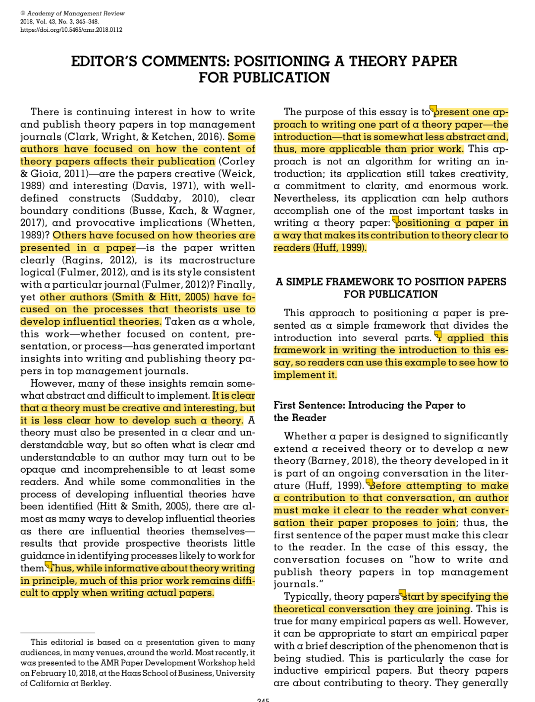
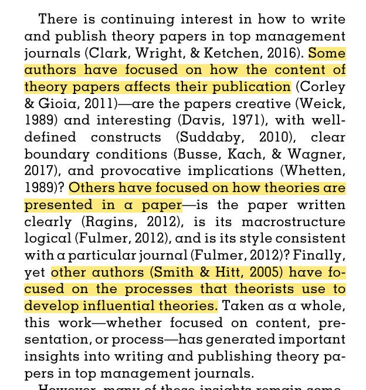

# 

# Day1文献：Barney, J. (2018). Editor’s Comments: Positioning a Theory Paper for Publication. Academy of Management Review, 43(3),345–348. https://doi.org/10.5465/amr.2018.0112

昨天组会听了雨欣学姐美国读博的分享，再次意识到了读顶刊的重要性。——于是马上和朋友开始互相 push 读文献！

同时她也说，感觉管理学和心理系的其中一点差异在于，心理学学生培养缺少了一些底层知识的积累，比如关于写作、阅读、发表这些技能。

确实是的，在我学习的过程中，也发现我对于这部分的知识的了解基本上都是我在看一些社交平台的过程中获得的，对于这部分更专业的学习比较少。但在之前瞎检索的过程中，我也发现蛮多这种类型的论文，就连“如何回复审稿意见”都会有非常详细的论文介绍。这部分论文是平时很少会看、但对于科研生涯是非常有帮助的。

因此，我也会把读顶刊分成读我的领域的顶刊+读其他领域的顶刊+读顶刊上的工具类的文章。

今天要分享的是昨天学姐在组会上推荐的在 AMR 上一篇“关于在管理研究中如何写理论类文章引言部分”的论文。

引言往往是人文社科学者比较头疼的一部分，往往会在看一堆的相关论文中迷失方向，乱了逻辑。这篇文章就用了一种非常模版化的方式给出了一些可操作性的建议。

我觉得在初期进行学术写作的时候，就可以照着这个模版进行套用，去规范化我们的学术写作逻辑；到了后期看的文章多了，再去学习一些逻辑过度也非常丝滑的文章写法。

话不多说了！下面就开始介绍一下作者给出的模板。他主要通过以下几个板块进行介绍：

第一段第一句话

第一段剩余部分

第二段的第一个单词

第二段剩余部分

第三段的第一句话

第三段剩余部分

引言长度

### 

### 

### **第一段第一句话**

一篇文章就是一场 conversation，而学术界有非常多不同主题的 conversation。（陈晓萍老师《组织与管理研究的实证方法》中也有类似的观点）

因此在这场对话的最开始，就应该去阐明你想要加入的是哪场conversation。

“Before attempting to make a contribution to that conversation, an author must **make it clear to the reader what conversation their paper proposes to join”**

“Typically, theory papers start by **specifying the theoretical conversation they are joining.”**

理论类文章的第一句就可以是具体化到哪一个你想要讨论的理论；而实证类文章的第一句就可以是对于你想要探讨的现象进行简单介绍。

### 

### **第一段剩余部分**

用两三句话介绍这个领域的过往的研究观点，以及在这个领域中最重要的一些结果。

比如这篇文章中，作者就进行以下三点的介绍：

### 

### **第二段的第一个单词**

——就是 However

第一段对这个领域进行了介绍，那第二段就需要去交代在这个领域还存在那些**unresolved issue**。

### **第二段剩余部分**

去解释为什么这个**unresolved issue为什么重要，为什么是值得研究的。**

“为什么重要”这个问题有很多种答案，比如：

-理论的实证意义尚未被阐明

-理论的边界条件的意义尚未被发现

-弱化一些基本假设是否会改变理论的贡献

-这个理论对于另一个理论的贡献尚未被探讨

但是如果仅仅说，“这问题是前人没做过的”就是一个很弱的答案。

### 

### **第三段的第一句话**

到这边就可以去交代：本篇文章的目的是…

这边需要用**简单的清晰的句子**告诉读者你的研究目的——如果你觉的无法简略表达（比如要写很多点或者很长的句子），那是因为你还是没明确你的核心研究问题是什么、你想要对话的具体是理论的哪个部分。

有时候，作者会罗列非常多的文献之后再进行研究目的的引出，这是因为他们对整个领域的研究不够熟悉，也就无法总结出前人工作中的问题。

“Papers that are about two or more research questions are usually about no research questions.”

### **第三段剩余部分**

介绍研究是如何对研究问题进行回应 以及研究的意义是什么。——这也是 reviewer 判断文章是否值得发表的关键。

在这部分，有一个误区是：引言中implication 写的越多越好，比如对不同话题的研究都可以写一点contribution。但是这样就会导致**重点分散**。

“Listing several other contributions—to other research questions, to practice, for teaching **simply draws attention away from a paper’s central contribution.”**

因此，**引言中还是聚焦在核心领域**，在讨论部分可以再简单说一下对其他领域的贡献。

“Of course, a paper may have other implications. It is acceptable to mention—typically in a series of short sentences—these other implications in the third paragraph of the introduction. However, these implications will generally be explored in more detail not in a paper’s introduction **but in the paper’s discussion section**.” (Barney, 2018, p. 3)

### **引言长度**

震撼！作者认为只要 大约 1.5 页足矣。

“Constraining oneself to 1.5 manuscript pages will almost always generate clearer and more precise writing than writing introductions that go on for two or three manuscript pages.”

不再多写废话了！继续去整理整理东西～

多读顶刊 多思考多学习 每天进步一点点！
