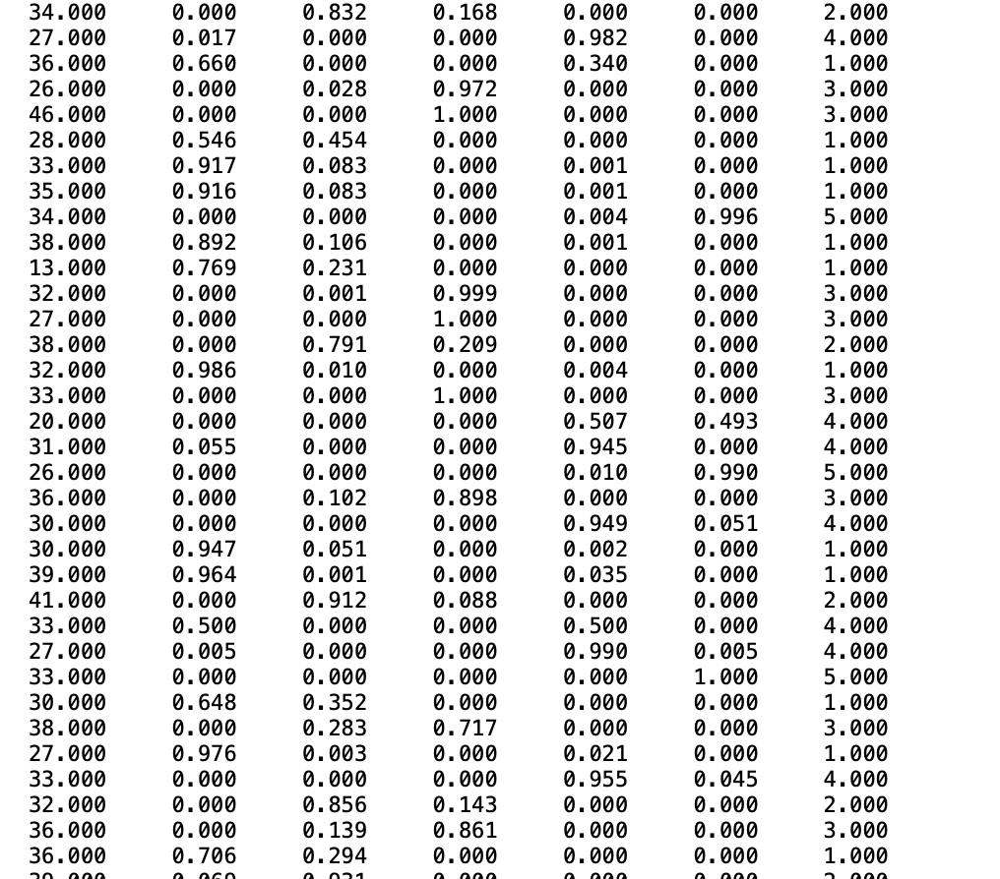

最近新关注的蛮多都是从潜在剖面分析那篇分享来的，后台也有一些问题。问的最多的就是：**潜在剖面分析如何知道原数据属于哪个类别？**

这也是我自己当时在用这个方法的时候找了半天才找到解决办法的问题，所以在这里写一写回答！

好吧 其实特简单！

首先我们在 mplus 的代码中，会在最后有一个output 的命令：

savedata:

file = lpa-end.txt;

（这个文件名字命名就随意了  主要的是必须要是 txt 结尾）

有了这行命令，就可以在跑完LPA之后在同一个文件夹中生成一个 txt 文件。

然后——你会惊讶地发现这个 txt 文件差不多就是你原始 input 的 data。

但是！

当你划拉到最后，就会发现这些数据里面多了一列，而那一列就是这行数据所属的剖面～

之后就可以用这个数据进行一些逻辑回归or 方差分析啥的计算喽！
