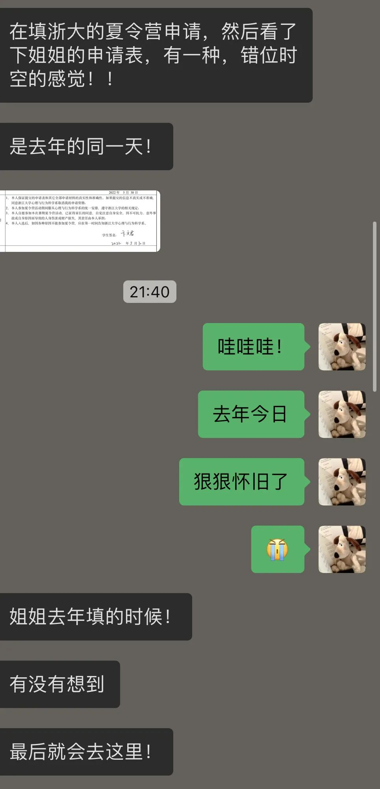
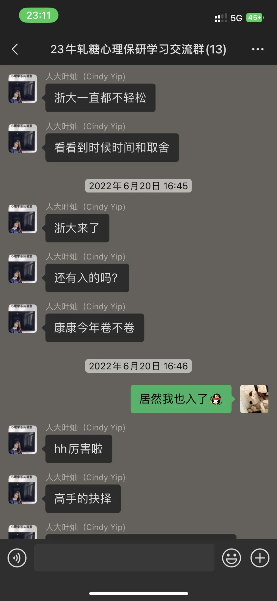
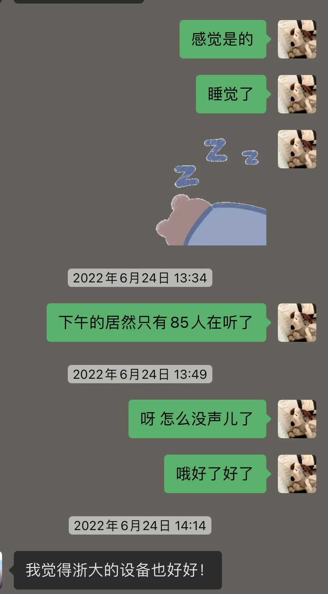
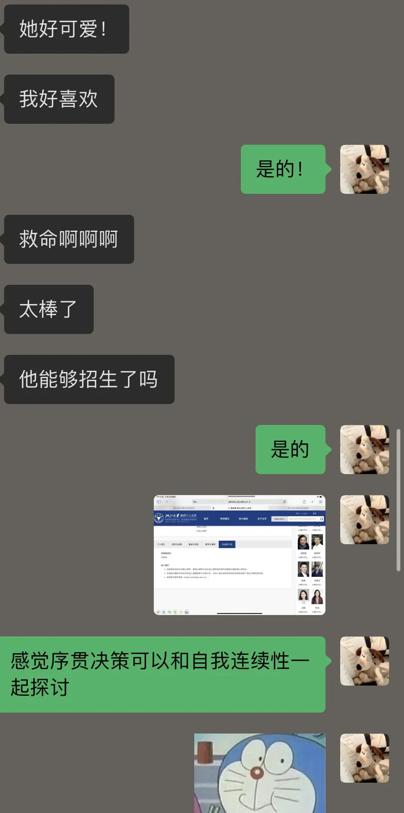
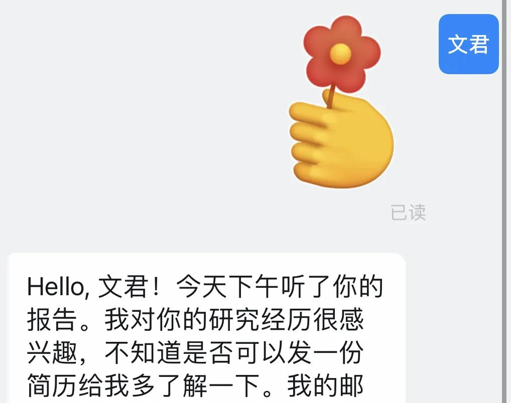

学妹最近在填浙大的申请表，看到日期居然就是今天，没想到一年真的这么快就过去了。

以及，要不是她问我当时的心情，我又都快不记得了，于是赶来这里记录一下。

​

投递的时候固然是用着海王心情把清北复浙人都投了个遍，但心里也知道我校实力就到那儿了，基本上也没人能去这些地方。

但那段时间联系了北师大的韩老师，没想到她把我的科研经历大夸特夸，说我作为本科生做到这样已经很不容易了——不得不说，韩老师真的是天使🥹 也真的让我产生了一些「我还挺不错」的自我认知，于是投递 top 院校的海王心情就更笃定了——尽人事听天命，投归投，不录也没关系！

（像我们彬仔说的，这是一个双向选择的过程中。不录就说明你和院校没缘分。

但无论如何，最后肯定是有有缘分的学校的！  夸夸彬仔的好心态捏！

当时加了一个机构的公益心理学推免群，群里有人说浙大出名单了，用欣赏大佬的态度划拉了一下名单，结果居然在后面看到了自己的名字！

​

再之后就是参加夏令营，浙大是我参加的第一个夏令营，结果！直接睡着！

​

浙大更偏认知神经科学，以我当时那种科研储备，真的是昏昏欲睡，之后后面听到了一些偏社会、发展、组织方向的老师我才和朋友们提起了精神，开始边听讲座边茶话会讨论。

​

而关于夏令营的考核，当时还和一个学长讨论了半天，考虑到：

（1）不要选太火热、方向太简单的老师，因为很有可能会有十几个人选择，这样这么多人汇报同一篇文章就不会有优势

（2）夏令营的目的其实还是获得优秀营员，所以可以挑选那些更能汇报的清晰、有逻辑、能拓展的文章。

（3）认知神经科学的文章虽然看着难，但是仔细读几遍也还能接受，这些文章很有可能会劝退一部分人，那这个时候如果能够埋头研读这些文章，可能也比较有竞争力。

于是我和学长一起挑选了一位人也很好、虽然是认知神经科学但是还算能够理解的老师，之后就是紧锣密鼓的准备文献汇报了！

文献汇报当时除了那篇文章，还看了无数的中英论文，把那篇文章主要依托的核心文献都看了看（当然只看核心结果+讨论），以及把相关的中文硕博论文都看了看（主要是把一些名词的翻译确定+硕博论文的前沿可以积累背景知识），同时还看了相关话题英文综述的future direction 部分（这个就可以放在最后作为自己的思考）——反正是不小的工作量，最后一天直接通宵了…

一直到汇报当天的上午才做完 ppt，当时居然还有空约了一个北师大的学姐模拟汇报了一下，好像也没什么太多的反馈，但走了走流程也让心里有底了。

后来下午的核心汇报也比较顺利，那篇文章的作者就是给我提问的老师，超温和，还对我自己的科研经历问了问，氛围非常轻松，当时内心火速被俘获，淋漓尽致体现了首因效应。我记得那段时间之前我还在梦北大，xhs 的名字还是“未名湖畔”，后来参加完浙大就改成了“紫金港等我！！”，女人！！

汇报完睡了一觉就去看了电影，都不太记得看的是啥了，因为过程中收到了一个老师的钉钉加好友通知，直接心脏骤停，根本看不下电影…  那也是一位给了我正反馈的、认识神经科学方向的老师，直接暴风哭泣。所以后来优营名单出来也就在意料之中了。

​

然后就是思想矛盾矛盾再矛盾的暑假！

一直都在纠结我到底学认知呢还是学我自己真正感兴趣的，是头一铁学点技术还是 follow my heart 沉浸于一些自己真正喜欢的领域呢？

——后来也是在无数的学长学姐那里找到了归宿，找到一个 人也好、方向也喜欢、学术成果也很棒、经历也非常有意思的老师。lucky bwj！

（目前接触了也快一年，感觉这个方向真的可以作为我毕生奋斗的目标了，有时间写一写对于 OB 这个方向的理解～）

之后也顺理成章发邮件给了老师，和老师 meeting 了一下之后被他的研究课题彻底吸引，老师也非常 nice 的给了我许多准备预推免的建议。

预推免的时候在二人间从早到晚焦虑地演练，找同学找学长反复修改，遇到了超级聪明靠谱的宣宣宝，以及后来一起合作论文的 xk 学长，都让我的整个 ppt 逻辑顺畅了很多，去掉了很多无用内容！这整个打破自己原有认知、接受外界逻辑的过程我感觉也挺不错的～

结果就在我在宿舍睡大觉的时候出来了（对了！谭哥还把他2021年的推免录取短信发给了我，改成了2022年祝我好运当时真的天天在梦想能够收到那个短信！）

然后睡完起来就看到一个钉钉群里的文档，名字是考核成绩，当时心率骤增，睡眼朦胧的点开，然后马上看到我和宣宣是第四和第五，我俩可真是太牛了！——然后把这个好消息分享给了 20 多个人 maybe…

——————————————分割

一年前的经历仍然历历在目，不得不承认准备推免真的是人生重大事件。一次次审视自己经历、思考未来方向、询问前辈问题、打磨文书材料的过程其实我都有收获。那段时间真的是迎难而上，见招拆招，但最重要的是，我遇到了一群多么好的人呀！

一年后的今天，膝盖被挂钩划了个 2cm 的大口子（在此告诫大家 钩子可不能买那种太锋利的 真的生活处处是危险 已经在想象死神来了中一个人如何因为一个钩子而死亡..）

独自去医院缝了 4 针，还和那个医生唠嗑了一会儿，回家后又开始给学弟学妹改文书材料。而谁能想到，明天就要毕业论文答辩的我，居然，什么都没准备呢！！

——anyway 如今的好心态真的也是去年培养的：汇报总是能讲出东西的，逻辑总会理顺的，痛苦总会熬过去的，不走主流的方向也是完全ok的，选你所爱 爱你所选，大家都有光明的未来的！（敲木鱼）
