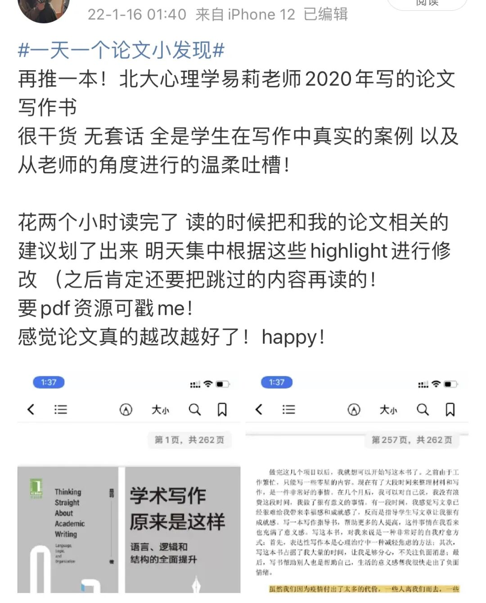
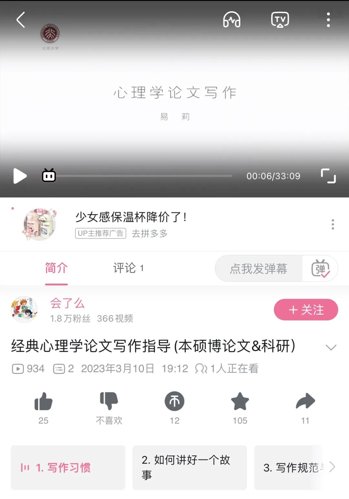

今天晚上刷b站的时候惊喜地看到了易莉老师的课！马上来这里分享一下🥰

22年的写论文的时候 这本书就给过我非常大的参考 当时还发了一条微博安利给大家

在最后说可以分享pdf。

结果！尴尬的是这条微博被易莉老师本人看到了  她：虽然但是 请支持正版🥹

所以！大家还是坚定地去买一买实体书  这是非常值得的！

在实体书上划出一些impressive的意见 会更加深印象～

当时的wb⬇️

​

b站上的资源⬇️（mooc上也有）

​

晚安😴
