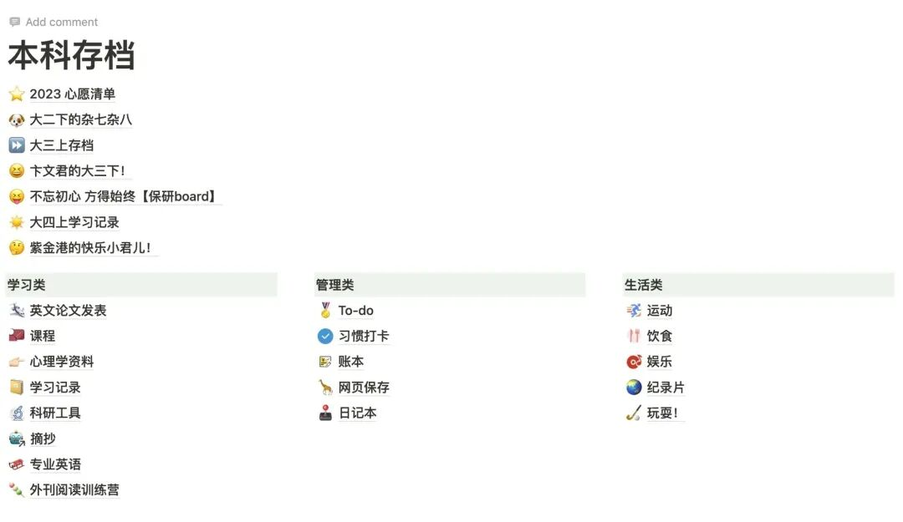

毕业在即，我开始了物理层面和电子层面的双重整理，切实地再次感受着Nostalgia的力量。

虽然一直想追求「All in one」的宗旨，但总是中道奔殂的...

于是书桌抽屉里出现了各种奇形怪状的计划本or单页，于是notion里面的模版换了又换，于是其实记录和复盘的习惯也并没真正养成，很多时候都是临时起意，于是大学生涯中某些没有留下记录的时刻，其实我的记忆真的一片空白。

​

这一堆奇形怪状的纸质or电子记录，保存着我大学以来各种各样的学习资料、情绪碎片、习惯养成、目标、复盘。记录着我的失败、放弃和妥协，也记录着我的努力、快乐、感恩与收获，记录着我的孤独和奇怪，记录着我方方面面的变化。

感谢文字，感谢记录这件事情本身，感谢纸张、备忘录和notion，感谢我自己。

突然发一条这个也是因为，今天看到一个博士的公众号，里面记录了每周她在科研和生活上的琐碎记录，感觉真的很好。

所以也真的想提醒自己未来也要多多记录一下生活，感受一下个体的存在，保存一些浓烈的情绪和感悟。

另外，好久没打开公众号居然发现了很多科研粉！嗨呀 我真的好久好久没有发科研的东西了，未来这种也要多发！
