上周导师让我给一个班级讲一下潜在剖面分析，当时紧急做了个ppt，最近也在用mplus做潜在剖面的数据分析，在此存档一下！

（ppt准备得很匆忙  肯定是有很多错误的 仅供参考！  ）

Mplus代码

title: lpadata; #文件的名字

data: file is lpareg.dat; #数据用spss导出为dat格式

vari:namesarev1-v9; #数据里的变量

usev=v1-v9; #分析要用的变量

classes = c(5); #剖面数量  可以从1开始做

analysis: #下面的都是固定的了 不用改

type = mixture;

starts = 200 10;

proc = 4;

output:tech11 tech14; #这两个是为了得出LMRT、BLRT的结果 也不用改

savedata:

file = lpa-end.txt; #导输出文件  这个很重要是为了之后看每行数据属于哪个剖面

save = cprob;

plot:

type = plot3;

series = v1 v2 v3 v4 v5 v6 v7 v8 v9(*);

最后的数据怎么看我就不写了因为很多公众号or B站都讲的很明白了！

也可以参考下图的拓展资料：

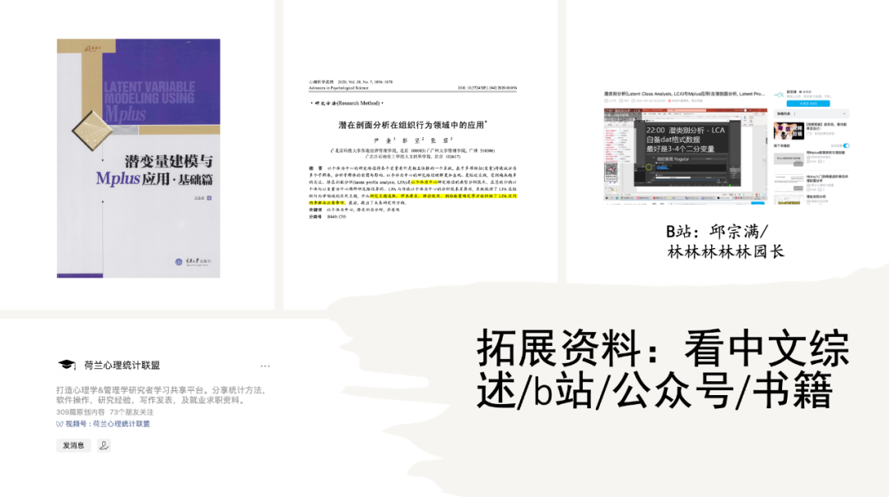

**记录一下当时自己遇到的问题：**

1. 原始样本量和mplus输出的不同——后来通过把V1-V9拆开了表述（即V1V2V3这样子）

2. SPSS导出dat的时候要记得把“将变量名写入文件”的勾去掉

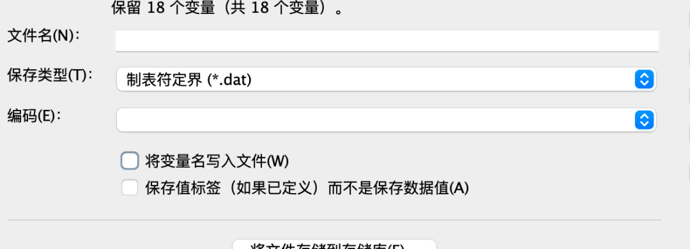

3. 不知道不同剖面对应的其他变量的平均数和标准差怎么看——通过output出来的txt文件的最后一行进行识别（可以知道每行数据属于哪个剖面），之后把数据放在SPSS里进行方差分析即可

潜在剖面分析PPT

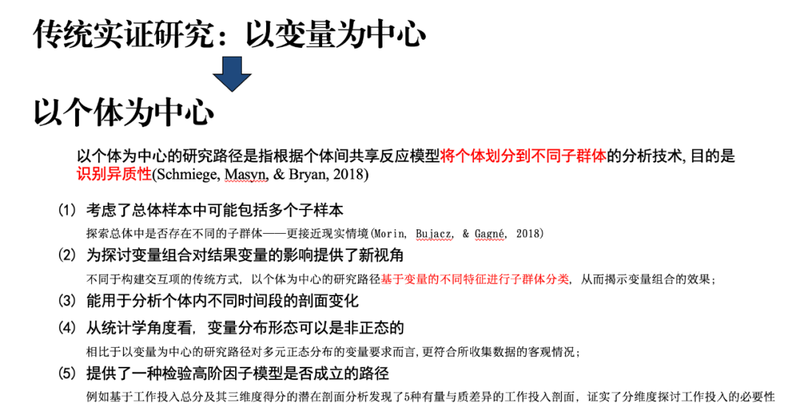

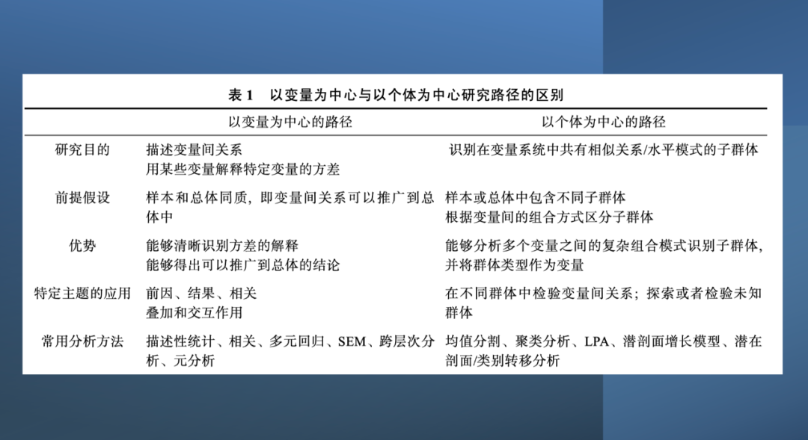

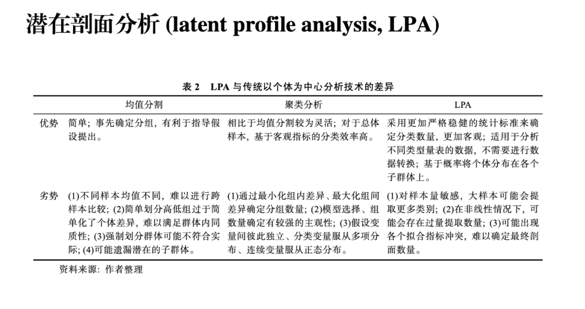

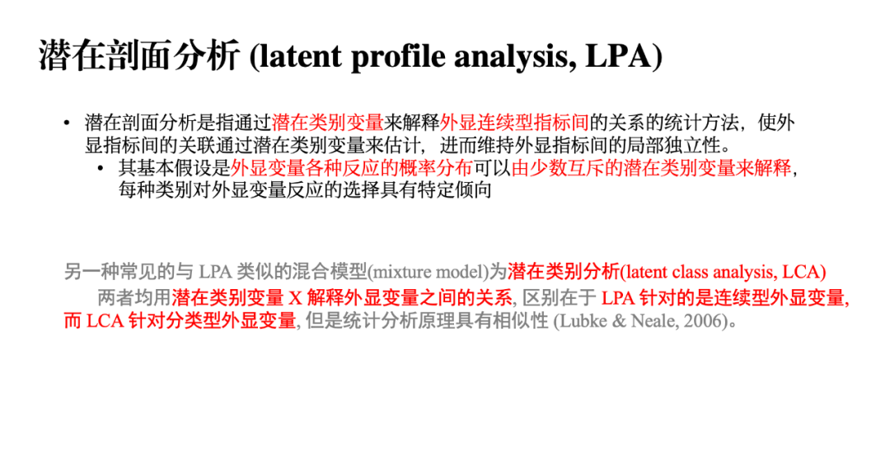

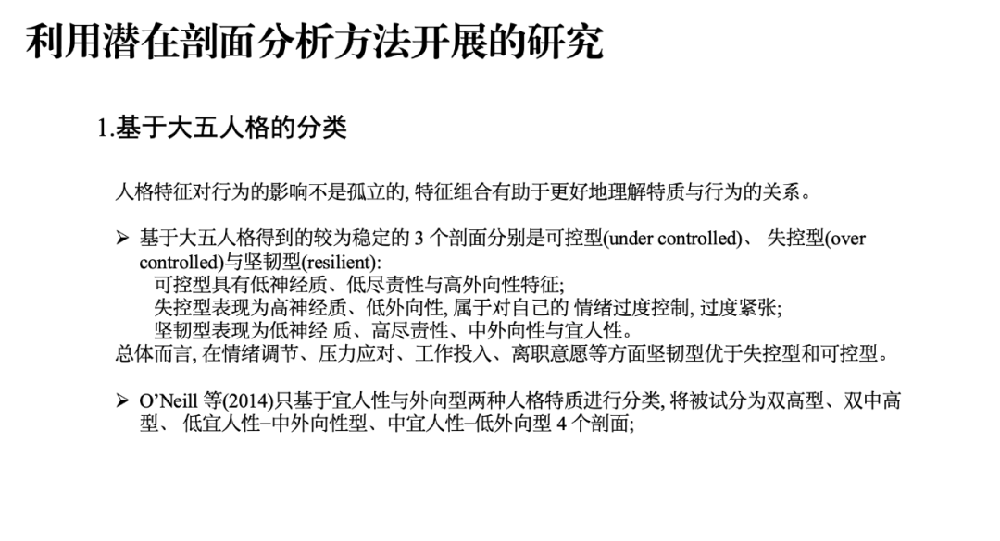

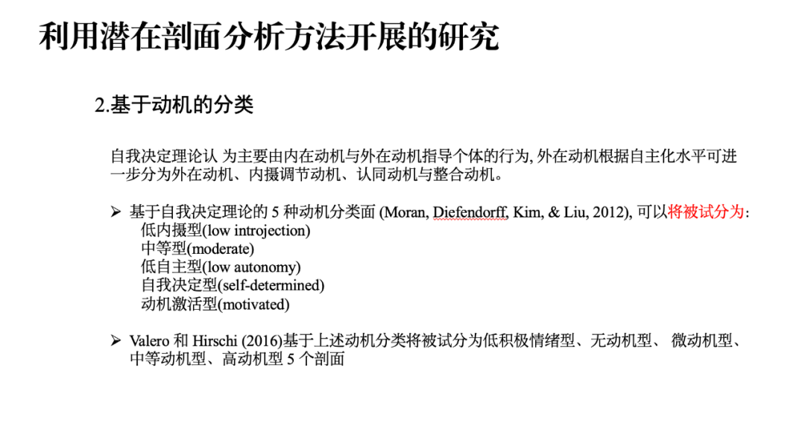

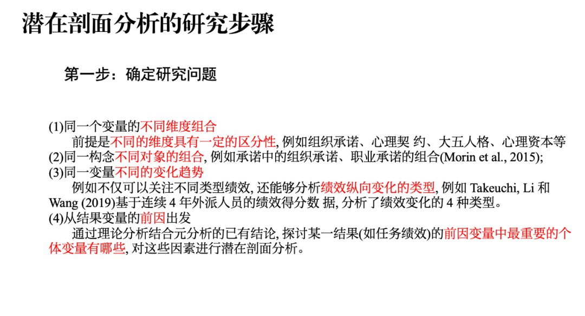

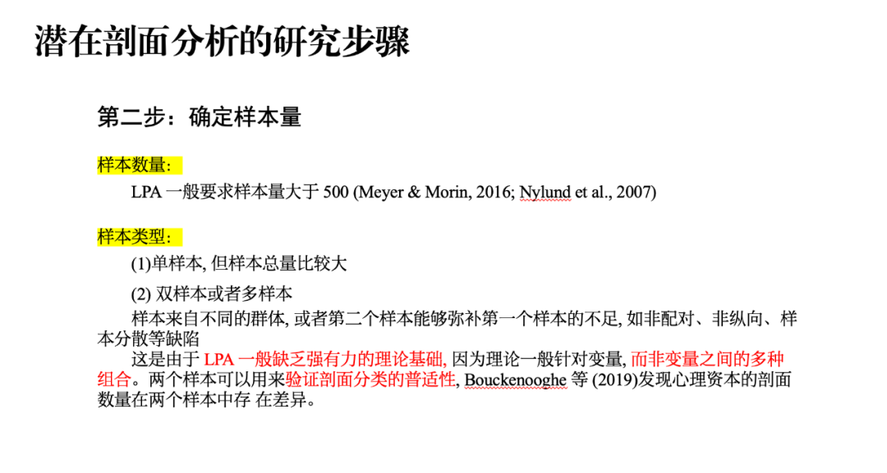

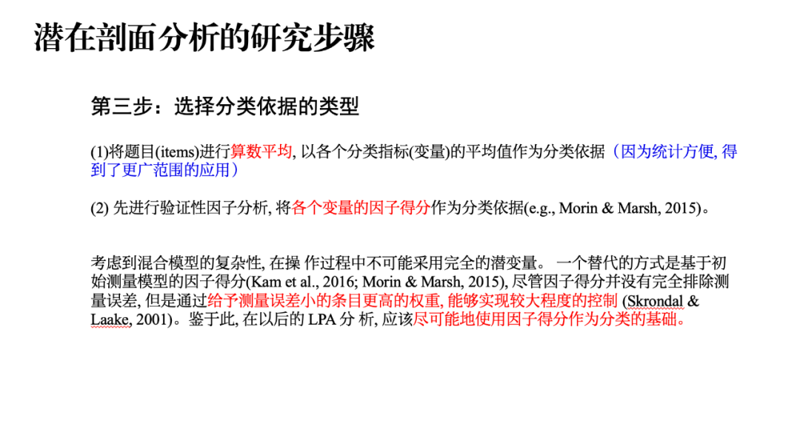

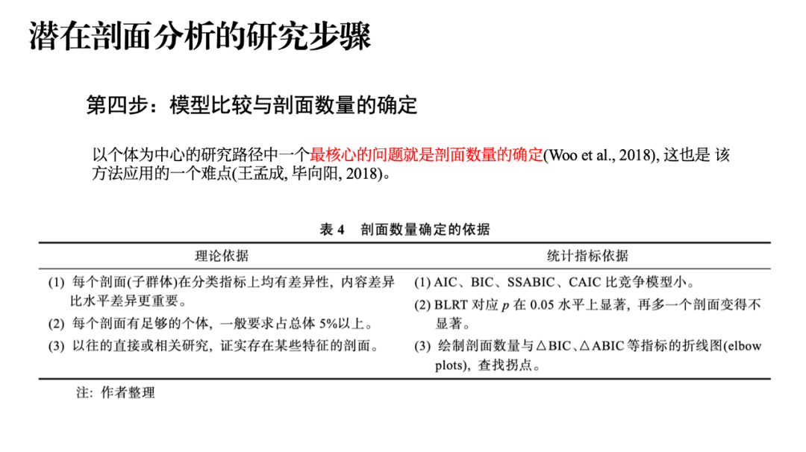

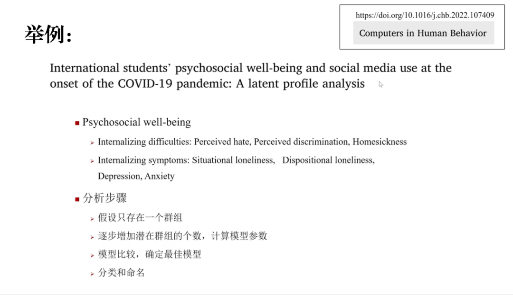

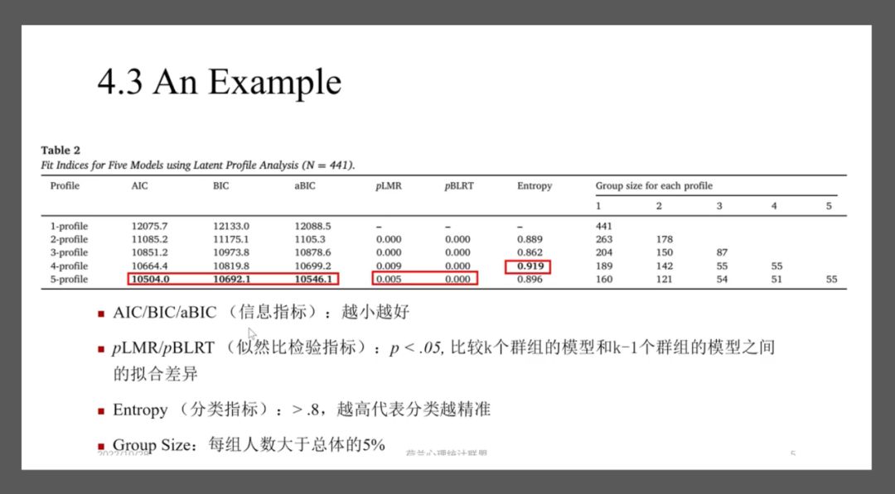

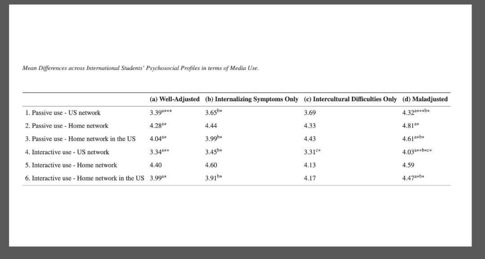

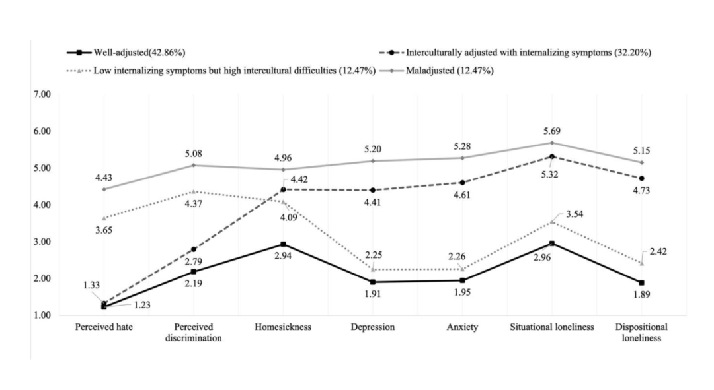

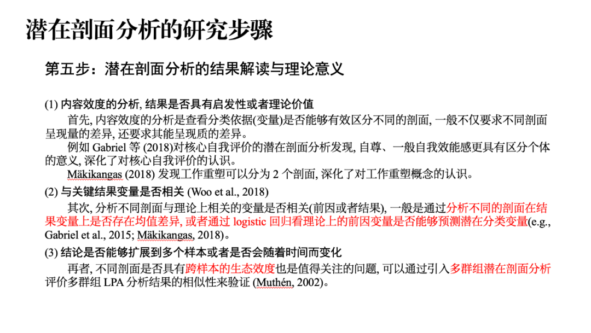

有什么问题可以在箱子里问！

科研or生活都可以！

