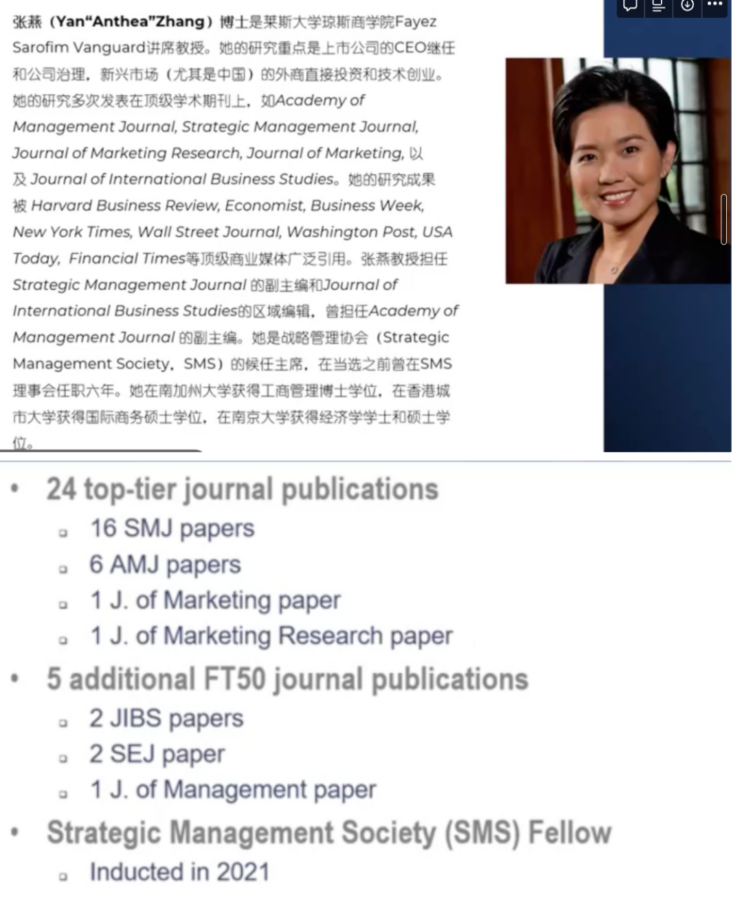

# 

开始在公众号上进行一些笔记分享，push自己认真听讲座...

虽然我一直觉得成功不可复制，但我觉得听一些**学术界的前辈**分享他们的观点还是非常有必要的。这些经验或许不适用于每个人，但至少可以让我们在一些**关键选择**上停下来思考思考、审视审视，多跟朋友老师讨论讨论。总之，我想每个人都可以有自己的脚步，但需要清楚每一步都是自己花过时间思考的。

### **主讲人介绍**

震撼….总之就是一个拥有24篇Top journal的厉害女性👍

**博****士论文及博士刚毕业的几年很重要**

- 博士论文define your scholar identity 决定了你在学术界的定位
- 一个学者最早的顶刊都是从博士论文来的
- 博士毕业后的哪几年最重要——productive！

围绕博士论文去做，不要随意开展side project
- “rule of three”原则：围绕一个topic至少发表3篇重要的文章才能在这个领域build your own identity

**有关写作**
- “我不是native speaker”不是不能写英文论文的理由
- 写论文最重要的是逻辑 是thinking 而不是language

**有关发表**
- 发表了第一篇顶刊后不要停止，从中总结自己在写作、改稿、R&R的经验，思考如何用到后面的project —— “乘胜追击”

**有关学术界的power and politics**
- 埋头做事 keep your head down
- 不用管gossip 不用学术站队
- 自己的发表才是硬通货

**有关work-life balance**
- 没有work-life balance这一说，只能尽力做到最好（比如老师说她一直带娃去参加学术会议）
- 努力享受你做的事情
- 人生不同的阶段的priority是不一样的，该努力的时候还是应该keep moving on的
- 找一个爱好
- 坚持定期运动

讲座回放可以在优酷**中国管理研究国际学会（IACMR）**这个账号里看，里面也有许多往期专家学者的讲座：https://v.youku.com/v_show/id_XNTkxODQ0NDIzMg==.html?spm=a2hcb.profile.app.5~5!2~5~5!3~5!2~5~5~A

（对了... 我读研的方向确实就是组织行为学、管理心理学这个方向... 心理咨询和认知神经科学咱是真的不行....）
