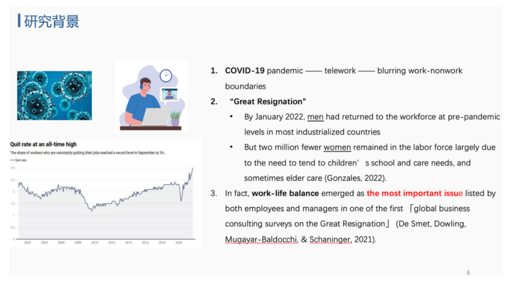
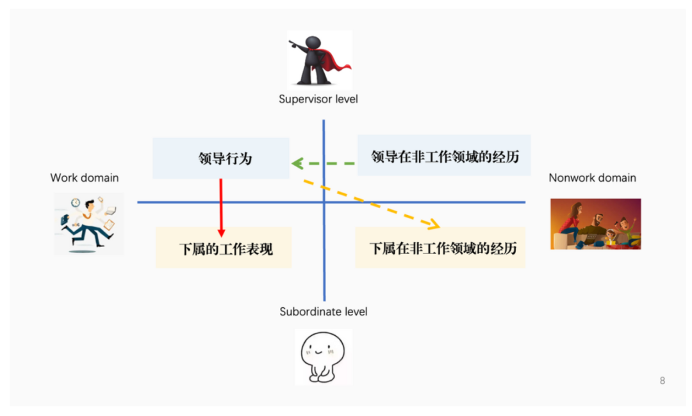
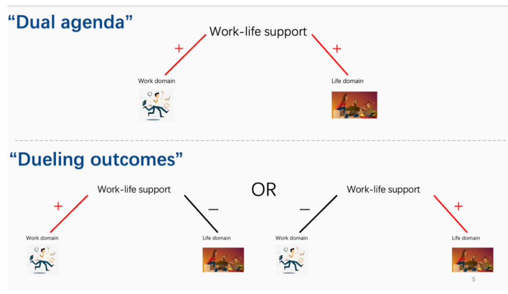

前几天在小红书发了一条关于组会汇报的碎碎念，结果让我突然多了300多个粉丝...

评论区让我写一写经验贴。我想我当时准备地挺混乱的，写经验贴倒正好可以帮我梳理梳理思路，总结一下成功经验，这样下次也可以按着这个思路不断改进！

所以来我的小破公众号也来同步一下！

### 

### 

### 这篇经验分享我就分成两部分：论文阅读及整理、PPT制作

ps：我粗略算了一下一共会花大概12个小时，不过往往组会都有蛮久的时间进行准备，所以每天推进一点点儿就可以了，如果实在不够的话，也可以把其中一些内容阉割一下…

### **一、论文阅读及整理**

ps：这一部分一共花至少6H；也适用于所有的论文精读）

**1.看第一遍：通读全文 【1H】**

这一遍的时候不用对于没看懂的地方停下来阅读，甚至不用高亮和圈画，不用思考逻辑，只要每个字都读过去然后对这篇论文有大致的印象，含含糊糊的就行！

这一遍虽然粗糙，但是会对第二遍的精读很有帮助！

**2.看第二遍：拎出论文大框架【2-3H】**

这个时候是半精读，更多的关注这篇文章的逻辑，关注每个段落总结性的句子。

这个时候还是以论文本身为主，可以不带自己的“critical thinking”，就纯粹盯着这篇文章的思路。

这个阶段要用思维导图的形式（用xmind和幕布都可以），这一遍看完之后脑子里就会有更清晰的框架，同时这个阶段可以为之后做ppt提供很好的帮助。

**3.看第三遍：加入自己critical thinking【1-2H】**

这个时候是非常仔细、一个一个单词看过去，同时这个时候就开始在pdf中间做笔记，笔记我大概有这么几种：

- 黄色高亮：高亮出重点句子，可以用中文进行简单的总结标在旁边（红色文字），方便自己下次提取
- 蓝色文字：记录自己看到某些段落的延伸思考
- 橙色高亮：标出自己暂时看不懂的内容，之后进行查阅或者跟别人讨论
- 绿色高亮：看作者为一些重点论述所引用的文献，这些文献肯定是非常重要的，可以在之后找出来再读

读完这遍的时候，还要对自己第二遍的时候做的思维导图进行修改和完善，对于之前一切错误的思路进行调整。

**4.看第四遍：根据上一遍的精读去额外做一些工作【1H】**

比如去解决自己没懂的问题，去看一些重点的拓展文献，来加深对于这篇论文的理解。

**5.最后一遍：对自己进行灵魂拷问【1H】**

在上面四遍之后其实对于这篇文章已经很熟悉了，那最后一遍就需要对自己进行提问，这些问题其实也是老生常谈的：

- 这篇文章解决的核心问题是什么？
- 这篇文章在文献大厦中起到了什么样的作用？它提出的gap有弥补吗？
- 这篇文章有什么优点？最大的创新点是什么？
- 这篇文章有什么缺点？如果是我，我会如何改进？
- 我读这篇文章的收获是什么？

（这些问题视具体学科而定）

针对这些自我提问的回答也可以加在思维导图的最后一个分支。

到这个时候，你可以获得一张很清晰的思维导图，之后做ppt参考这张思维导图的结构就可以。

### **二、后期ppt制作**

ps：这一部分大概也花6H

**1.准备阶段：先找模版【30min】**

我们课题组是有现成的模版的，一开始老师就直接发在了群里。

所以大家可以先去问问课题组的师兄师姐～

如果没有的话，也可以去淘宝上买学术模版ppt（很便宜

**2.搭框架：用ppt里“添加节”的方式对不同部分进行分页【5min】**

具体可以根据最终的思维导图的分支来分节。

**3.填内容【2-3H】**

这个时候还是根据思维导图里列出的段落总结句，再回到pdf找到原文放到ppt上。

**4.梳理逻辑【1H】**

再从头到位看一遍ppt的逻辑是否顺畅，放进去的内容是不是都是重点。

which is 我的导师很注重的一点，就是一定要详略得当。

组会的时间有限，不可能把这篇文章的所有细节都呈现，更重要地是挖掘出这篇文章的核心要点，然后让对这个话题有兴趣的同学再去细读这篇文章。

**5.润色：代入“观众思维”进行ppt润色【2-3H】**

其实就是把一些文字信息用图表的形式呈现或者加入图片辅助对文字的理解，以及把重点句子标红或加粗，还有多多进行分点，最好每一点能用一个短语进行总结，这样也能方便听众抓重点。

比如说在研究背景那儿，就可以加入一些相关的图片。

比如在梳理论文的逻辑那儿，就可以加入一些图片和箭头。

比如讲解两种理论视角的时候，也可以做一个对比图。

**6.演练【视情况而定】**

如果可以找师兄师姐或者好朋友们听你讲一遍，挑挑毛病，看看你讲得清不清楚，那是最好的！（任何答辩都可以这样 要和好uu们一起进步！大家之后也可以找我来听！）

如果你的uu们没有时间，也可以自己多练几遍，理理逻辑，确保到时候汇报别短路就行，也可以自己用腾讯会议录个视频听一听。

### 大概就是这样，其实“怎么做好文献pre”“怎么高效读文献”“怎么整理文献”我也一直在学习，希望大家有好的建议多多提出，一起进步！
