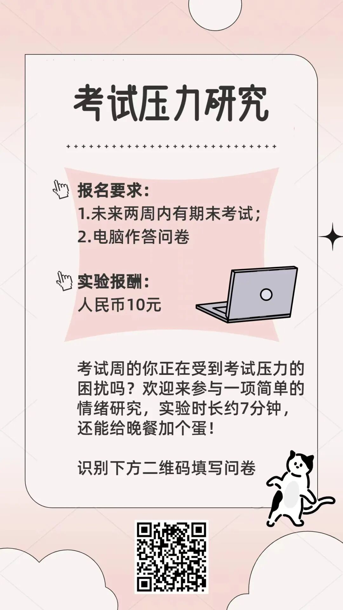

🤔考试周的你正在受到考试压力的困扰吗？欢迎来参与一项简单的情绪研究，实验时长约7分钟，还能给晚餐加个蛋！

（10块钱不止一个蛋了！）

实验要求：

1⃣️未来两周内有期末考试；（或者托福雅思  或者没有考试但有ddl也可以）

2⃣️电脑作答问卷（问卷链接需要电脑打开！）

实验报酬：10元

链接⬇️
https://hku.au1.qualtrics.com/jfe/form/SV_25JueGu9naBQWeG

​

ps：这是个北大课题组的项目😃 大家还能康康qualtrics发问卷的质感 （虽然真的卡…
