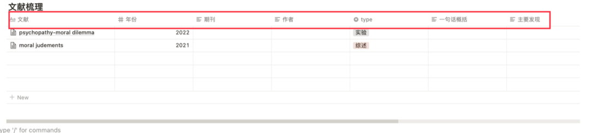
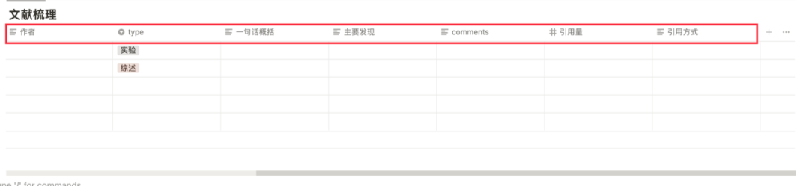
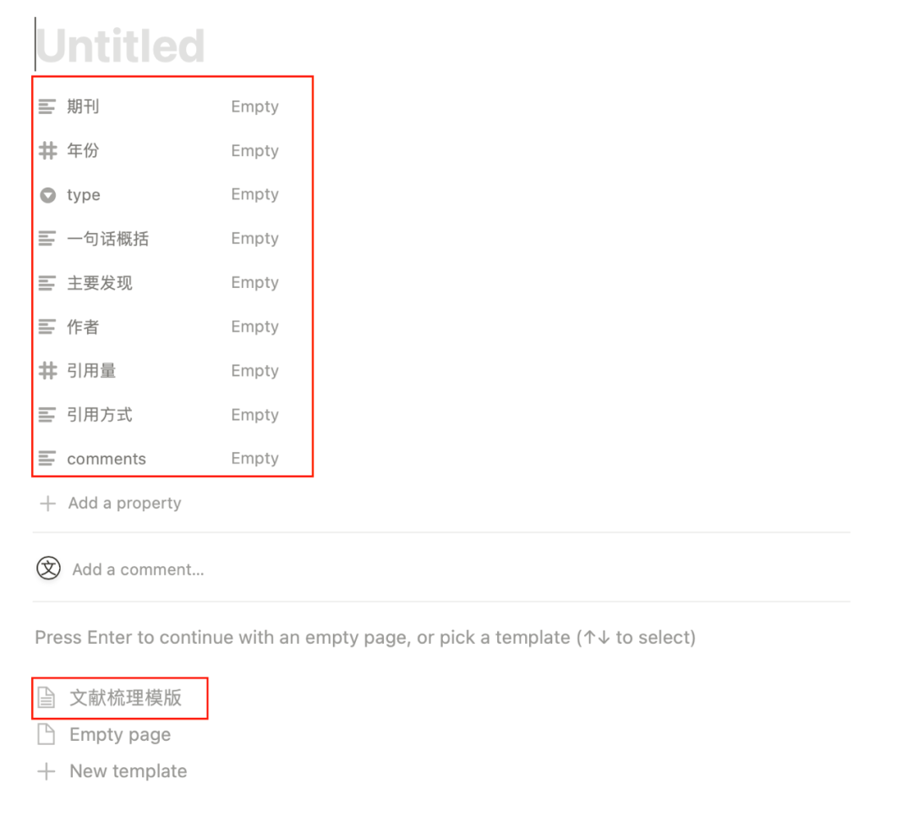
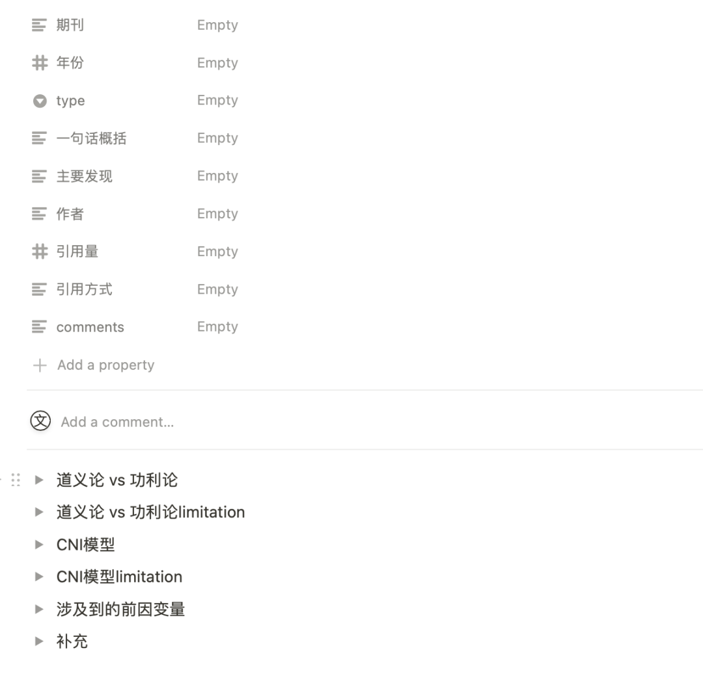

上周说要多做输出，结果根本没空...

这周依然没空，但是可以浅浅水几期科研工具类的推送——

这几天正好在梳理文献，就在这儿记录一下我的文献整理模版。

我是用notion这个软件，它对我来说的优势在于：

- 笔记可同步 不用担心word突然卡住
- 快捷键和markdown语法可以很轻松地进行笔记分层/加序号/加points/改变字号/加粗  不用像word一样再麻烦地进行点按 这样也就不会在记笔记的时候再点鼠标分心，而是完全可以用键盘一直书写
- 可以内置table database   （database 的功能太宏大 简直无法说清楚 总之我感觉是把excel和word相结合了 还有非常高级的filter和不同试图 ）
- 可以设置笔记模版  这样每记录一篇论文都不用再次列标题分类
- 可以多人协作（虽然现在暂时用不到  但真的ke yi可以非常丝滑地多人协作  比腾讯文档丝滑一万倍）

因此我目前的文献整理模版为：

1⃣️内嵌一个table database   在首行根据自己的需求进行设置

2⃣️在首列的核心页面按照自己整理论文的需求创建template

3⃣️之后就可以一个个慢慢填进去了

4⃣️这样的方式只是纵向整理（基于单篇论文的整理）  之后如果有需要还可以进行横向整理   这样就可以合并某些理论和comments

继续滚去看论文——————

对这个笔记模版有什么好的建议欢迎补充！！

