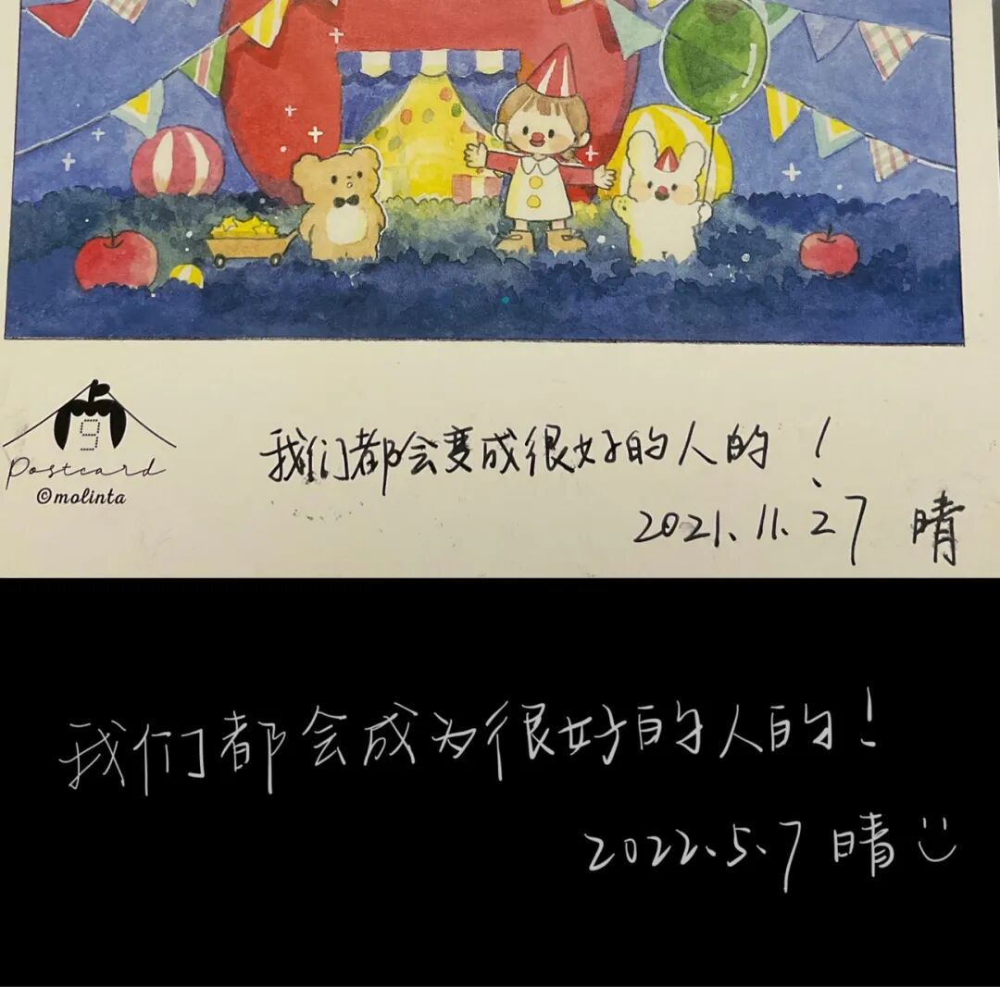

2022年的生日 或许对我们来说都有些特别

你在异国他乡 带着种种不安 孤独 疲惫 迎接这个还没准备好的21岁

而等我生日时 迎接我的会是期待了3年的好结果吗 到那时 我可以接纳过去的自己了吗？

有时候 我会忘记曾经的我们 只记得在对话框中讨论着未来方向时迷茫的我们

有时候 我又会记起那些放学路上的笑声 和那些笑声之下、我们互相掩藏着的对现实生活的疲惫

我们能做出正确的选择吗 我们会后悔吗

我们可以在之后告诉我们爱的人 我们做到了吗

我们可以自信地回到海中 说曾经的遗憾我们已经释怀了吗

或者

我们可以对自己好一点吗

我们可以好好珍视自己的健康 慢慢地欣赏一朵云吗

我们可以不带着愧疚 狠狠放松一下吗

这些问题 是我自己也不清楚的答案

是我自己翻来覆去 左右摇摆 无法自洽的答案

但我想

2022一定是我们人生中很难忘的一年

此刻的我们 超有力量 超有追求

即使有时候想骂骂这个fucking world 但很多时候我们还是满怀希望地在赶路

而且 很重要的一点是

我们并非全然讨厌如今的忙碌

我们仍然可以享受学习带来的“六经注我“般的富足 享受学科交叉的奇妙 享受世界的diversity   享受与不同的人交流时感受到的不同的人生体验

写着写着 内里突然有些酸楚

不知大洋彼岸的你是否已经起床 不知你是如何在伯克利度过了自己的生日

不管怎么样

下次见面一定要好好散步 好好吃饭 好好诉说

不管怎么样

我们都会成为很好的人的！

​
