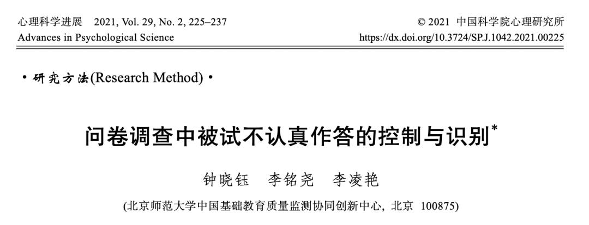
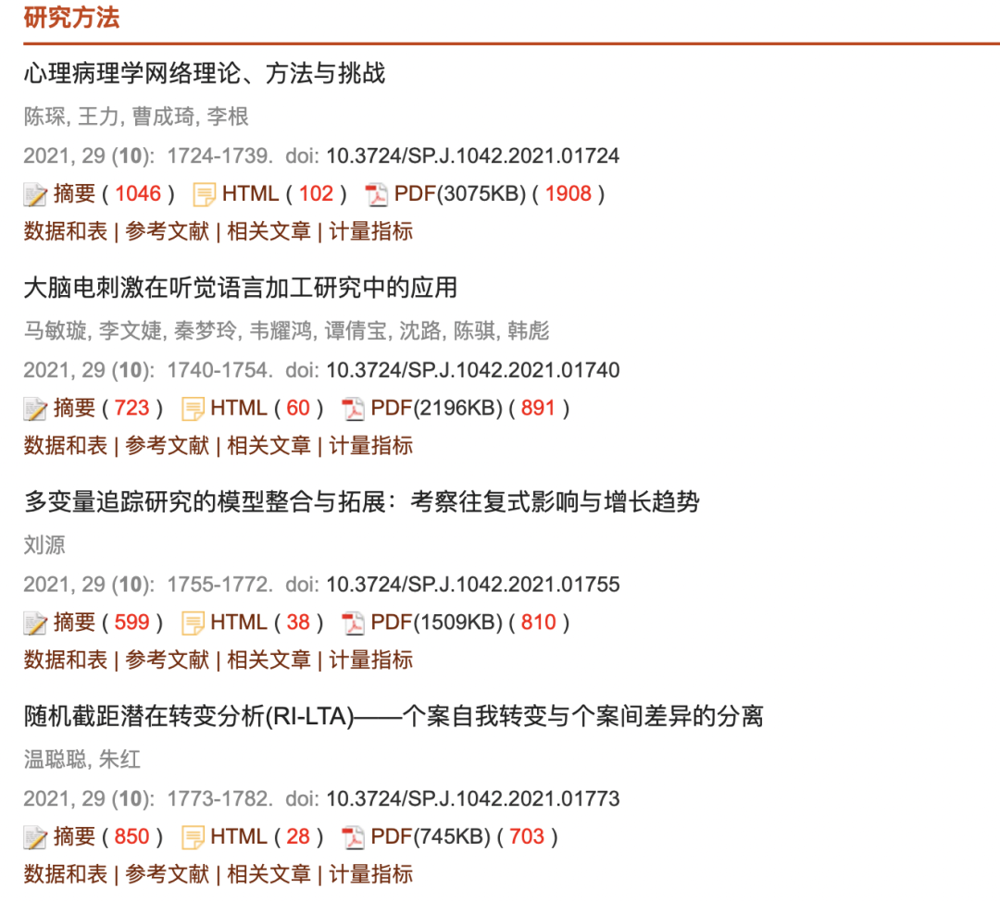
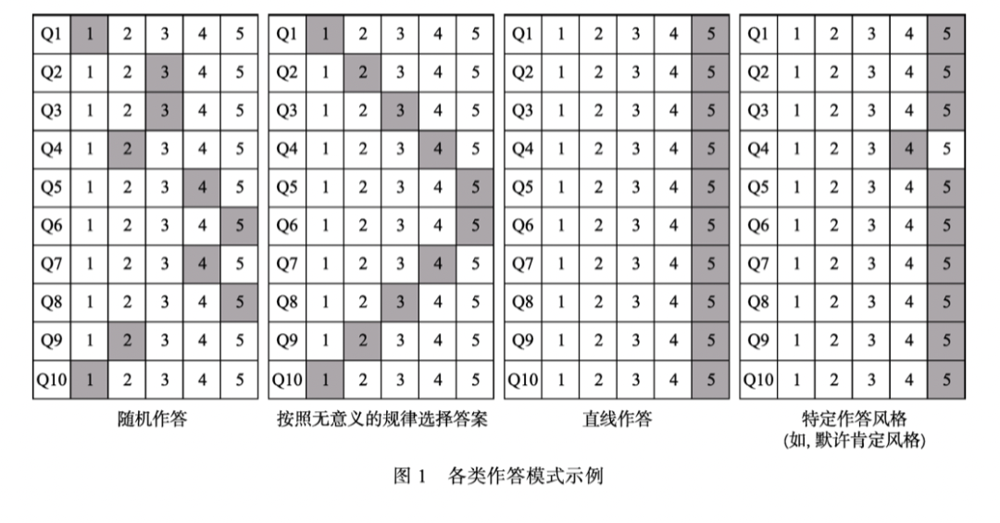
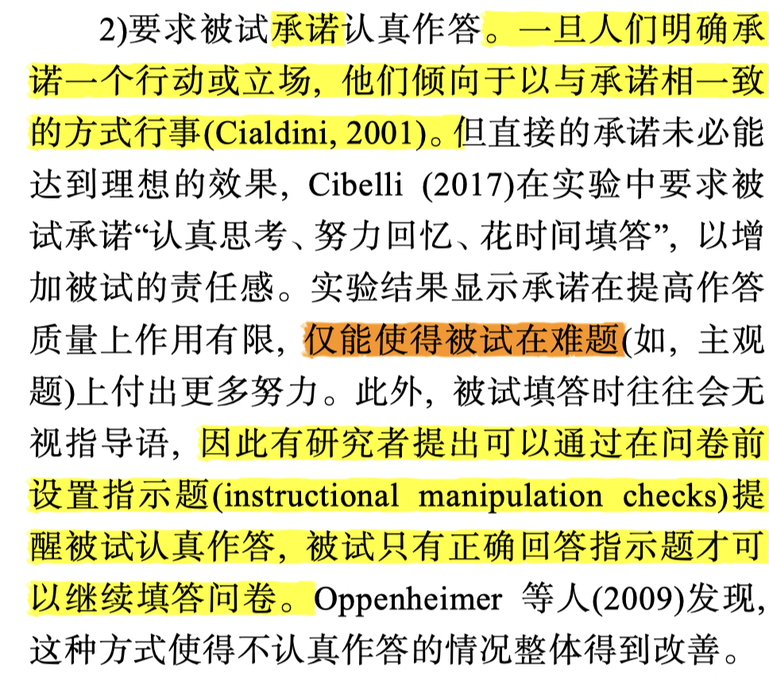
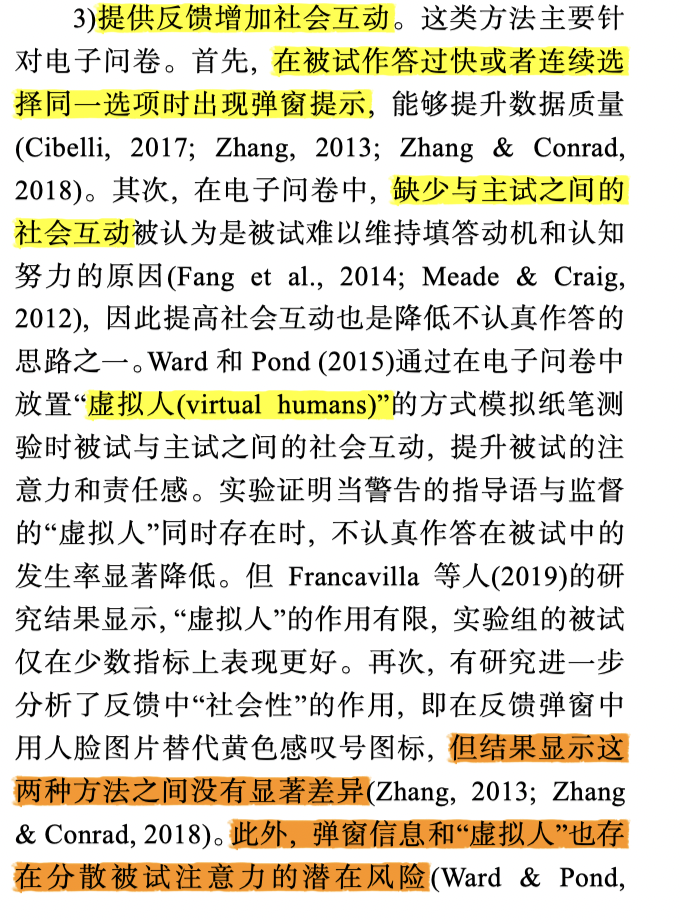
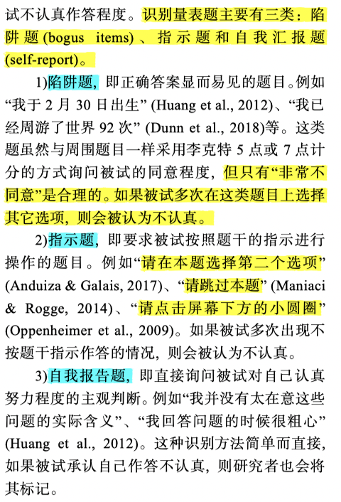

问卷到底如何设置？

如何检验被试是否认真填写？

——好论文共欣赏！

**//**

发问卷乃大学生苟且生活的常态，但是多数问卷都是为了敷衍作业🌚

所以本文仅仅针对一些真正想要研究出一些现象的情况，比如大创结题论文、毕业论文以及想要在期刊上正经发表的情况。

**//**

这篇论文在2021年发表在《心理科学进展》的研究方法部分。这个专栏一直会更新一些最新的统计、测量和某些问题的研究范式，非常值得人文社科的同学们参考。而且最近还有元分析的专栏，要写元分析文章的就可以去这里找找好论文。

迷惑问卷大赏——

我们该如何设计一个好问卷？

1. 降低任务难度

·用清晰易懂的问卷

·缩短问卷  （问卷过长影响被试注意力也是可以找到文献支持的）

2.提高作答动机

·施加外部奖惩（我之前看到有学姐会在后面附上自己的学习资料，还有雅思资料，以及一些电影的资源啥的，我觉得可以一试hh；警告也是一种好方法 神奇！）

·要求被试作答前进行承诺（这一点很有意思！之前就看过类似的研究。而且在法庭上也有相关运用，比如美国某个州让小孩儿作证人时，就会让他们在陈词前做一个承诺，这样就可以稍微避免一些撒谎的情况。）

·提供反馈 增加社会互动（这个我从来没试过，而且存在分散注意力的风险）

3.嵌入识别量表

这个让我学到了很多的识别量表题！之前我只知道一些基础的陷阱题。但是也不宜过多，否则会激怒认真作答的被试🤔

至于如何对问卷后续数据进行分析，就自己看论文吧🤪这个写起来真是有些复杂！

去知网或者期刊官网就可以轻松get全文 写的真的非常详细了😆

这周真的好忙  先滚去忙活了——

参考文献：

[1]钟晓钰,李铭尧,李凌艳.问卷调查中被试不认真作答的控制与识别[J].心理科学进展,2021,29(02):225-237.

