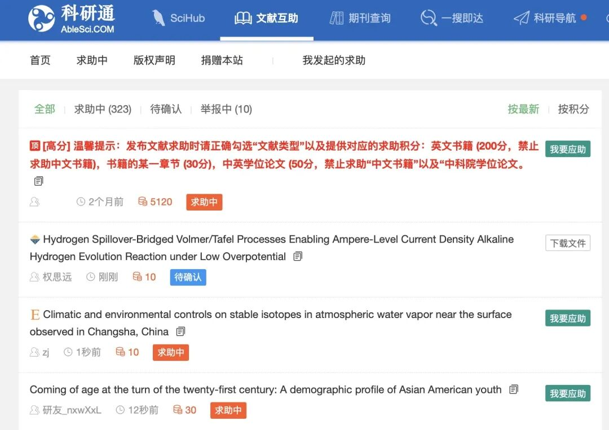

今天在一个科研互助群看到有人推荐“科研通”这个网站，浅用了一下发现真好使！

昨天的一篇让朋友翻墙都没找到的文章结果44s就给我找到了！

还能和微信绑定，一旦找到就会推送😊

每次找文献要花30积分，可以通过转发朋友圈、充钱、帮别人找文献来拿积分，充钱10块钱就有500积分 真的比淘宝代找便宜很多耶！

这个网站里还会有scihub最新可用网址🤪

在这里放链接好像会被吞，大家直接百度“科研通”就可以找到😋

以后就可以达成以下找文献工作流：

用数据库找到要看的论文及其doi号➡️去scihub看看有没有➡️自己翻墙或者让朋友翻墙➡️科研通👍

​

​
