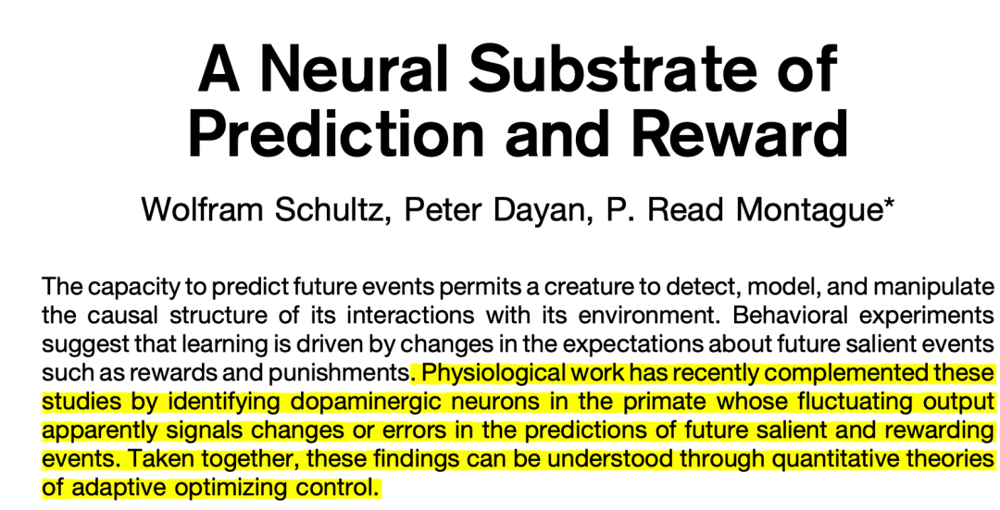

很多外行人，包括心理学初学者以及之前的我，都会把多巴胺等同于快乐。但是根据1997年Science上发表的一篇文章：

这就是著名的**奖赏预测误差假说** (reward prediction error hypothesis)。摘要里这段话翻译过来就是，灵长类动物的多巴胺能神经元，代表着对于奖赏、未来事件的预测产生了改变和偏差。

比如我和舍友在二食堂的台湾便当随便点的霸王鸡腿饭竟然很好吃（真的超级好吃！那个鸡腿真的无敌香！），这个就是在我们原有的「这个饭应该就一般般」的预测上产生了意料之外的改变，这个时候我们感到快乐就是因为多巴胺。

**那么多巴胺到底是什么？**

多巴胺是一种神经递质，可以在细胞突出间隙释放，激活或抑制下级神经元。能够释放多巴胺的神经元就叫做多巴胺能神经元。

**多巴胺的功能到底有哪些？**

想弄明白这个就必须了解多巴胺的产地。它的产地有两个：

1.**产自腹侧被盖区**，可能去到伏隔核（和奖励有关）或前额皮层（跟选择、行动、强化学习有关）。

这类多巴胺的作用很多：

·行为选择：多巴胺水平越高，发起行动所需的动力就越低，往往冲动性行为越多。而多巴胺水平越低，人就显得越麻木，反应也越慢。

·强化学习：当基底核发起了行动A（基底核里的神经细胞决定了到底要选择哪一种行动），并且行动之后多巴胺水平升高，那么中脑皮层就会发生改变，使得下一次遇到类似的环境或场景时，更倾向于选择行动A。

2.**产自黑质**，只能去往纹状体。

·这类多巴胺主要负责调节和控制自主运动，比如让人狂刷抖音。

（知道这一点，可以觉察到自己的无意识行为，从而更好地做出行为改变。这也是很多学了心理学人说学这个学科后的好处。当我们能了解我们一些症状的专业名称、了解行为发生的内在机制，那我们就可以更清晰地觉察自己，从心理和生理、从宏观和微观上觉察自己。觉察本身即是疗愈。）

·帕金森患者就是因为这类多巴胺缺少，才会身体僵硬、动作迟缓、手抖等等。

而运动所产生的多巴胺，指的就是这类多巴胺。所以“运动会让人产生多巴胺“其实并不准确，多巴胺只是控制了机体的运动状态。

实际上，运动产生的快乐是由于另一种神经递质——内啡肽，这是一种可以止疼的神经递质。所以刚开始健身时，你可能会觉得肌肉酸痛，但之后这种酸痛感就没那么明显了。（内啡肽的另一个作用是和爽感、愉悦感有关。吃糖、吃辣、听欢快英语的时候都离不开内啡肽。）

**多巴胺、爱情与渣男**

网上有人说“爱情始于多巴胺，但多巴胺只能持续几个月到几年，之后爱情就会消失”，这样的人多半就是渣男了。

如果是真的，等到他多巴胺耗尽、与你分手之日，便是他得帕金森之时。

爱情是责任、承诺、亲密、激情等要素的共同产物，它固然涉及到大脑中复杂的神经递质的变化。但是对神经递质的功能一知半解、却还用这个作为自己渣男的借口，实在是爹味十足的普信男的典型代表了。

**参考书目/文献：**

- 《大脑通信员》赵思家  p50-p69
- Schultz, W., Dayan, P., & Montague, P. R. (1997). A neural substrate of prediction and reward. *Science*, *275*(5306), 1593-1599.

**欢迎批评指正！**

****
