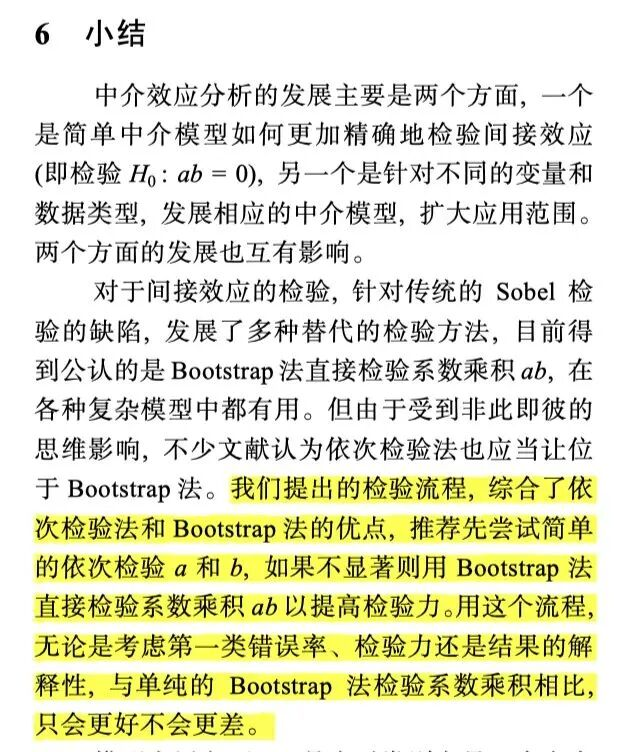
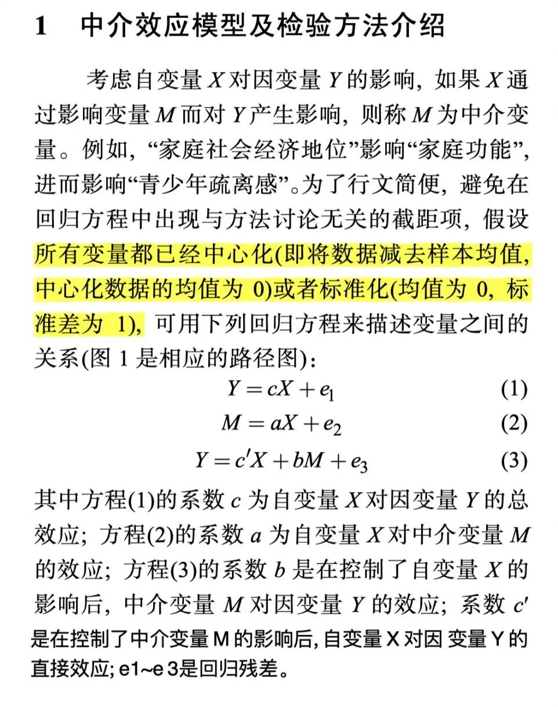
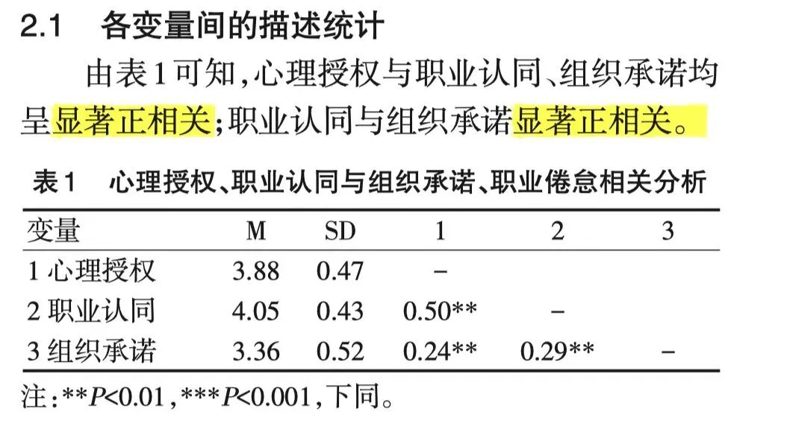
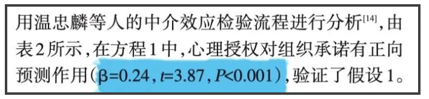
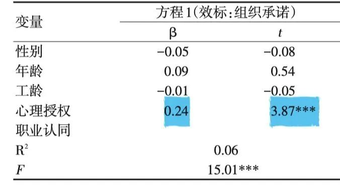
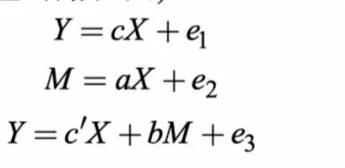
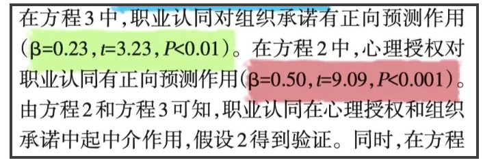
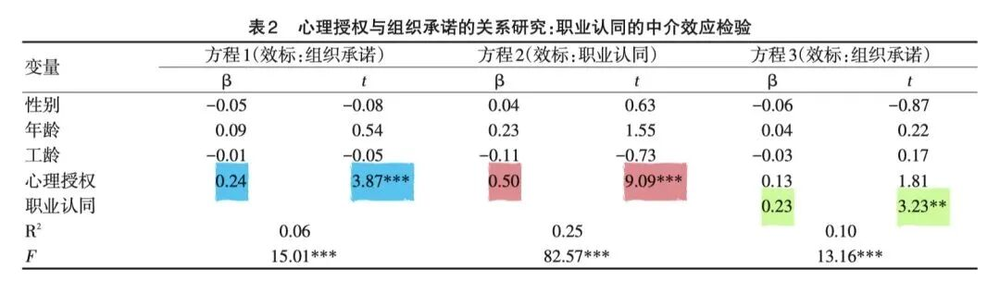
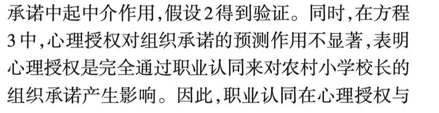

**01**

**中介效应**

从逐步分析法开始讲起

做冬燕老师的作业时，真是耗费了一番精力。

之前自己不会的时候找教程，要么是过于啰嗦，要么是只讲操作不讲结果的报告，都没有找到浑然天成的那种。于是就决定自己开一个data analysis的专题，以便自己之后忘记操作时能回来看看。

这一篇就介绍最简单的逐步分析法。

根据温忠麟2014年在《心理科学进展》上发表的对于中介效应的综述，他提出应该先用逐步检验回归法来检验a和b。如果不显著再用bootstrap法。因此这篇推送先来介绍最简单的依次检验法。

上面提到的系数a和b是指这个：

我决定从论文追根溯源。看看要报告哪些结论，以及这些结论是如何得出的。选用的是国内研究中介/调节的大牛叶宝娟老师在2017年发表在《中国临床心理学杂志》上的一篇论文，主要探讨“心理授权-职业认同-组织承诺”的关系。这篇论文的假设是：

假设 1：心理授权可以正向预测农村小学校长的组织承诺。

假设2：职业认同在农村小学校长心理授权和组织承诺的关系中起中介作用。

直接来看数据分析部分。

第一步，作者把描述统计和相关分析合在了一张表里，这个制表方法可以模仿。

（这一步很简单，就快速跳过了。要注意的是，只有变量间的相关显著时，才能进一步分析中介效应。）

第二步，就开始中介效应检验。我将对这段文字分句解读。

预测变量：也就是自变量和因变量：

转化成Z分数：就是数据标准化，实际上数据中心化也是ok的。

方程1其实就是自变量对因变量的关系。（那些性别、年龄、工龄都是协变量，相当于额外变量。）

其关系显著，说明自变量对因变量有预测作用，也就验证了假设1。

在保证了自变量和因变量之间预测作用显著时，就要开始进行关键的中介作用分析了，也就是最关键的系数a和b的检验！

（再回顾一下a和b是啥）

方程3中，职业认同对组织承诺的作用，其实就是中介变量对因变量的作用，也就是b  ；方程2中，心理授权对职业认同的作用，其实就是自变量对因变量的作用，也就是a。

这里a和b都显著，也就不要进行bootstrap检验。可以直接说明有中介作用。

所以说这是最简单的一种中介效应分析了。

上一步我们只得出了有中介？但是这个中介到底是什么样的，是完全中介还是部分中介？

（完全中介的意思是，自变量对因变量的关系完全由这个中介变量起作用。比如男方和女方之间完全靠媒婆认识的。

部分中介的意思是，自变量对因变量的关系只有部分通过这个中介变量起作用，可能还存在其他预测因变量的路径。比如男方和女方的认识除了通过媒婆，还通过他们之间的朋友，或者通过「附近的人」搜索。 ）

这里是完全还是部分就完全由方程3得知。

在放入中介变量后，如果自变量对因变量的因变量的预测作用仍然显著，则说明是部分中介。（比如就算那个媒婆在场，男方和女方也不怎么需要她，因为他们之间可以靠别的关系认识）

但是，如果放入中介变量后，自变量对因变量的因变量的预测作用不显著了，则说明是完全中介。（比如那个媒婆出现后，成为了男方与女方的社交依赖，男方只能通过媒婆来跟女方进行交流）

奇怪的比喻...

好了 那么这期简单的逐次分析法就到这里！

下一期可以写如何通过SPSS的process读数据 做结果报告。

参考文献：

[1]叶宝娟,刘林林,董圣鸿,方小婷 & 郑清.(2017).农村小学校长心理授权对组织承诺的影响:职业认同的中介作用. 中国临床心理学杂志(01),182-184. doi:10.16128/j.cnki.1005 3611.2017.01.041.

[2]温忠麟 & 叶宝娟.(2014).中介效应分析:方法和模型发展. 心理科学进展(05),731-745.

欢迎批评指正！！一起战胜数据分析！！

****
