**2021.2.2**

**@一只百味鸡**

**年终总结**

**人就是记忆和时间**

“人其实就是记忆和时间，这两样看不见摸不着的东西。我们吃喝拉撒睡，供养着躯体，让记忆和时间有落脚的地方。”

这一年，写了太多太多的材料、总结，直到现在都可以想象出团委老师的叮嘱：“你要把这些东西凝炼成一个主题”。

想对仗的小标题真的好痛苦。

所以，写自己的年终总结的时候就随意一点了，想到哪儿写到哪儿👻

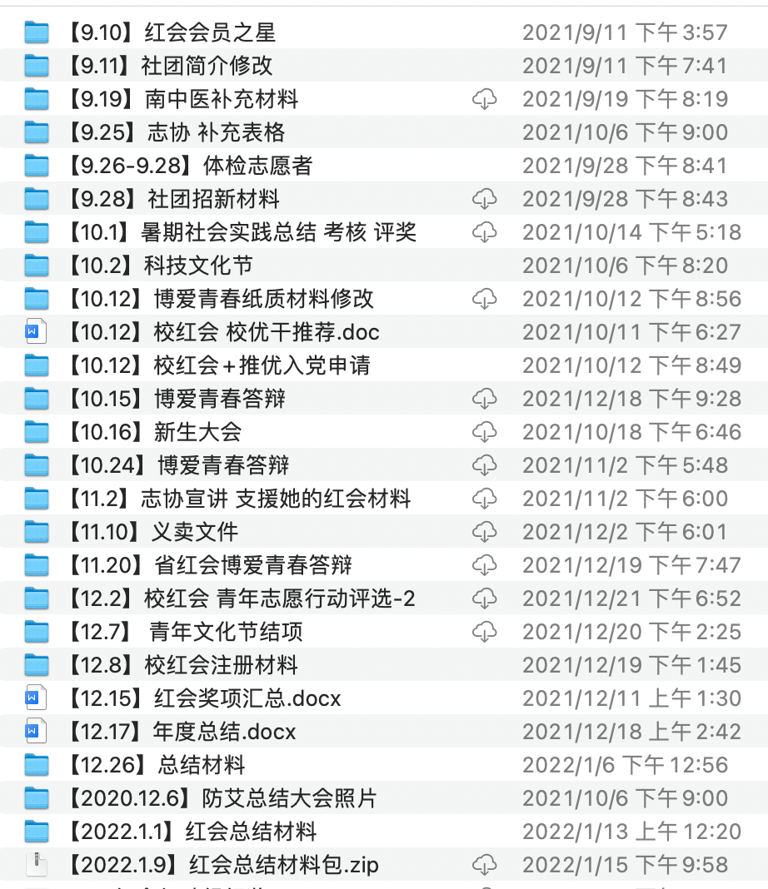

⬆️ 难以置信 这一年居然搞了如此多的材料 
今年最大的成长应该是，我允许自己作为一个具体的人而呼吸、而生活。就好像我允许自己这么晚才把年终总结写完一样。

大家总说要爱“具体的人”，但是却很少有人注意到自己的真实性。小红书上漫天的“1个月狂甩30斤”“清华美女学霸的5个时间管理方法”“科研人必备的5个工具”… 有人说现在的每一笔消费，都是在给未来的生活投币。那么在社交平台上放进收藏夹的内容，是不是也类似于对自己未来的希冀呢。

于是慢慢地就会发现，你希望自己能够快速减肥，每天、每周、每月精致的时间管理，能够做出好看的手帐，能够画出惊为天人的妆，有好看的穿搭，能掌握综述的写作技巧，能把所有高级的数据分析都学了，同时你喜欢的人也要喜欢你，同时，你最好能去清北。

现在列举以上这些会感觉很荒唐，但是有一段时间我的各大社交平台真的都在给我推送这种，又在大数据的“猜你喜欢”的智能推算下，衍生出更多不同领域的“优秀”。

于是，我给自己列周密的计划，每天打卡不同的事情，减少一切娱乐，维持一段时间的所谓的「优秀」「自律」「时间管理大师」。

⬇️下面是本学期一开始的时间管理方案，但用了大概3个星期马上就觉得非常疲惫。

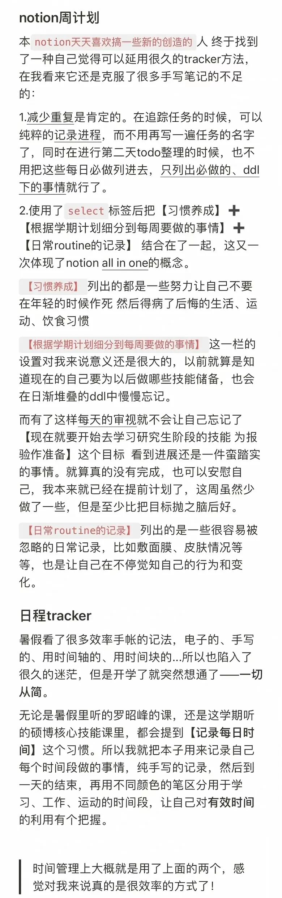

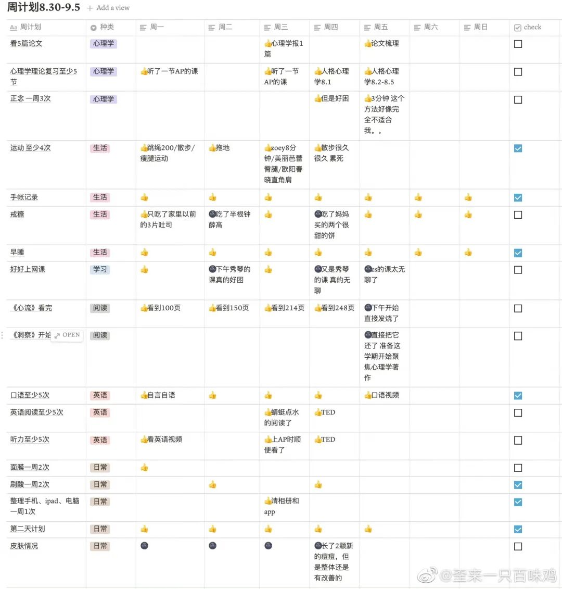

疲惫的后果是，总有一天所有的防线都崩溃，你只想什么都不做，在床上躺到中午，吃一顿油腻的饭然后继续躺着。

于是突然就悟到了，学习最重要的不是超人式的打卡和时长，而是长久的学习热情和稳定的情绪状态。而明白了这个之后，我也把我期末周的时间安排进行了调整，直接睡到自然醒起床，计划也根本不制定严格一天学多少，而是按照大方向地复习，让自己保持在恒定的情绪状态，当然还有一些让情绪上调的外在因素hhh。

⬇️期末季的佛系作息

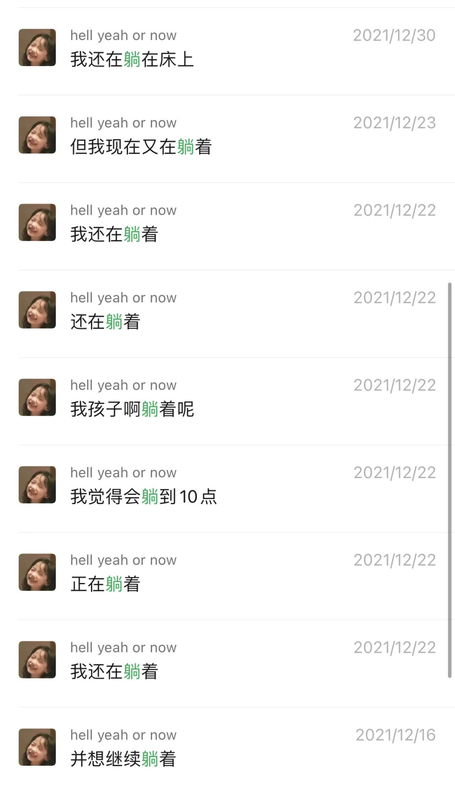

而除了学习上，在生活上我也允许自己一周去外面大吃一顿，允许自己产生的世俗的情感，允许自己有爱与恨，而不再像是一台机器一样觉知和运作。

我去上海的亲戚家玩了很多天，对着电视吃西瓜吃螺蛳粉，去五角场逛街逛到10点再回家，每天以一个蜜雪冰城的冰激凌作结。

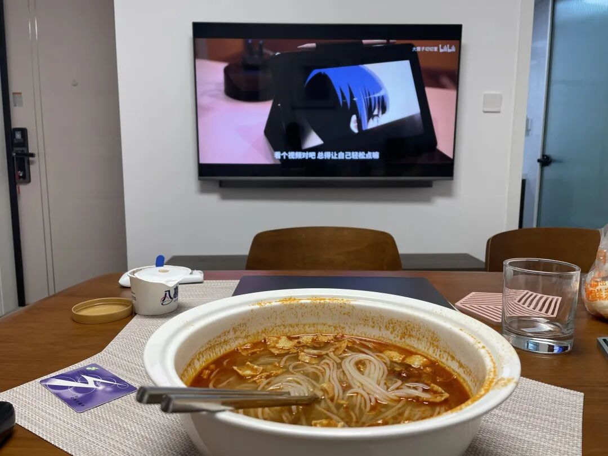

我每周六如果没有学校里的事情就要去外面瞎逛瞎吃，觉得无趣了就坐在星巴克里摸一会儿电脑。

我会一个人去吃东北菜，仙林新村的锅包肉真是yyds。

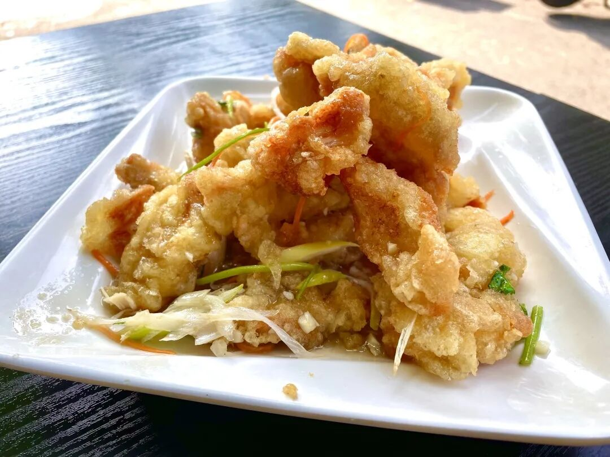

我会本来准备去打羽毛球减肥，然后突然想去逛超市，然后和好朋友说走就走开始了3个小时不停歇的吃喝。

还有5月份和zyy说走就走的成都旅行，emo的时候翻翻那时候快乐的照片都会觉得是安慰。会一直记得凌晨骑着共享单车飙过锦里武侯祠，在电子科大周围转圈圈，去熊猫基地结果因为人太多直接run了，不愧是我们…

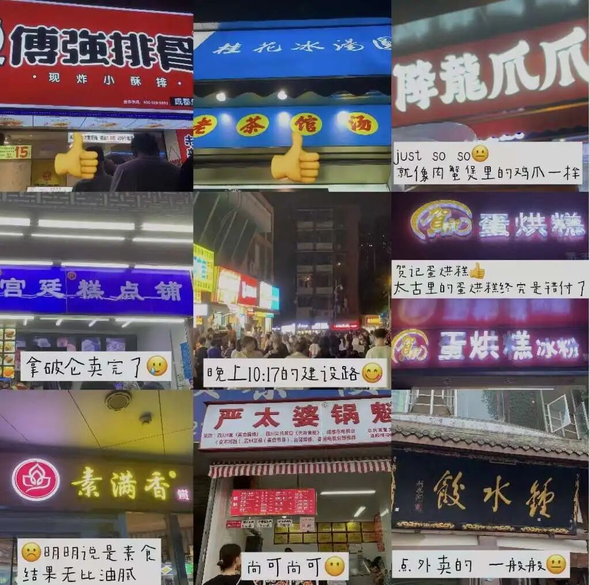

总的来说，就是暑假看的小甜剧里的那句：

**我居然感受到了生活，它竟然是个动词。**

而事实上这些脱离原有轨迹的放纵，根本不会拉扯学习的心思，反而让学习的时候变得更有盼头，同时学习也让玩耍变得毫无愧疚感。因此，我也算是在这个学期达成了学习和玩耍的平衡。而且最重要的，现在我可以终于可以接纳拖延这件事情了，我完全可以心平气和地摸鱼，只要确保我可以在ddl之前保质保量的完成即可。totally相信我脑子的危机意识hh🧠

写到这里，突然想到一位朋友深夜问我的：你觉得见色起意是可以的吗。我说，就把自己当成一个鲜活的、有情感的人吧，这没什么不对的。

所以，新的一年要继续作为一个鲜活的个体而活，体验真实的心动，爱具体的人。

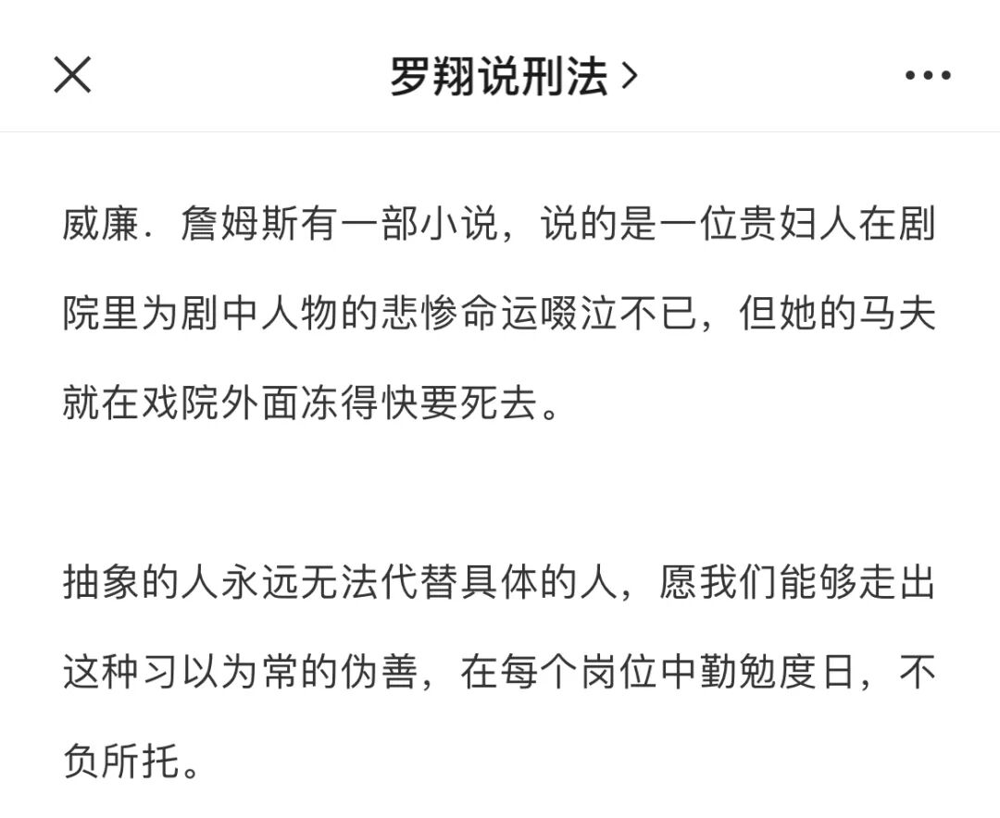

追根溯源，以上的的变化也许是因为在大三上我为自己找了许多自我疗愈的途径。

正念

我在9月份报了一个北大正念的课程，需要在49天里每天进行一次正念练习并写下感悟，同时在每周一开线上会议进行提问及感受分享。

在身体扫描的练习中，我去感受脚踝、膝盖、腰上的肥肉、胸腔里的脏器，然后对那些根本不会在平常觉知的关节道谢，感谢他们多年来对我们的支撑。

在觉察呼吸的练习中，感受胸腔、鼻腔、肩膀、腹部的起伏，睁开眼睛会觉得心情无比敞亮。

在正念进食的练习中，我去感受能闻到食物的最远距离，感受咀嚼这个动作所需要的步骤，感受食物滋味从嘴巴中漫散开的神秘。慢慢地就会发现，以前觉得很好吃的东西细细品起来完全是另一个味道。我甚至觉得这个学期我把甜品戒了也是因为练习正念的功劳。

在慈心禅的练习中，我祝愿自己、不太熟悉的人、喜欢的人、有过节的人 健康、平安、远离痛苦、喜悦自在。练慈心禅的时候，真的会感觉自己在和这个世界和解。

以上的音频都可以在“正念研习”的公众号里获取。

心理咨询

不同于上个学期把时间全都献给了学生工作，这个学期的一开始就填报了一个北师大的线上心理咨询，因此我必须连续12周准时准点收拾好心情，把一周的心情和变化总结好表达出来。一方面，表达自己内心感受这件事情本身就充满了力量感，能消解掉一部分的抑郁情绪。另一方面，当咨询师与你共情时，那种感受是再好的朋友也不能给到的。

仅仅是咨询师对我说的“我觉得你真的好辛苦啊”，就让我顿时破防。我本来想第一时间反驳她我的辛苦根本只是瞎忙，辛苦也没什么收获，但是那些日子里我明明体察到了自己身体的疲惫、心脏会在夜里狂跳、只能听播客很久才能入眠，我为什么偏偏不愿意承认自己的辛苦呢？

“唯结果论”确实是从小到大被灌输的教育，只是这个“结果”一定要是荣誉、地位、钱财吗，我从那些慢长岁月里磨练出的坚强、锻炼出的意志、潜移默化形成的严谨细心、行走社区农村见到不同的人而生发的共情以及习得的一些办公技能，不也同样值得被我自己看见、接纳并且感激吗？

于是那天结束咨询后，我在日记本上写下：嗯，辛苦你了！忙完这阵就要适当休息哦！

关系

大学超过一半的日子都奉献给了红会，对于学生工作的意义总是质疑，但是在红会遇到的人构成了大部分的意义。

跟hr说锅包肉真好吃啊！hr说🐎到，结果过了10分钟我因一个人吃锅包肉太腻决定放筷休息一下的时候，抬头就看到了smh和hr的大脸。

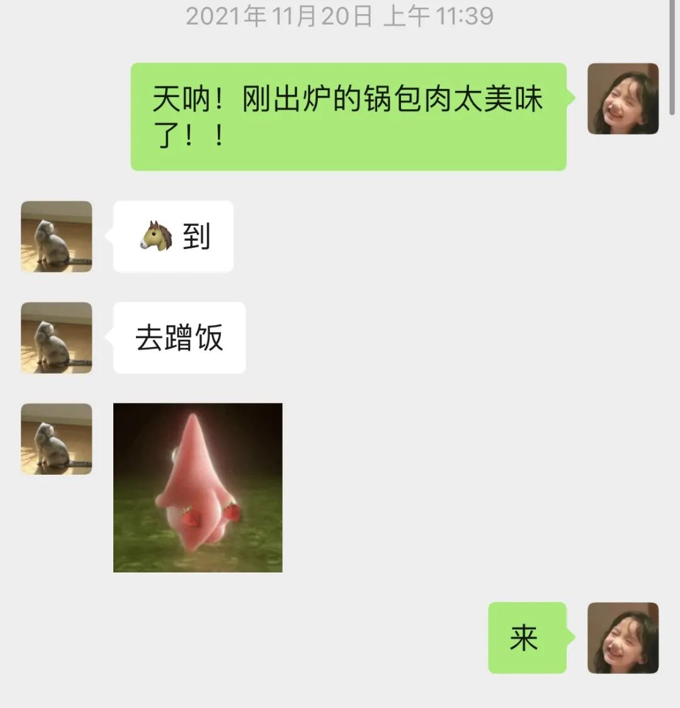

和两个好女儿 一个好大儿 还有一个傻儿子 以及hr一起去山姆，小孩儿们快乐地像是进城了一样，下学期一定再一起去一次！

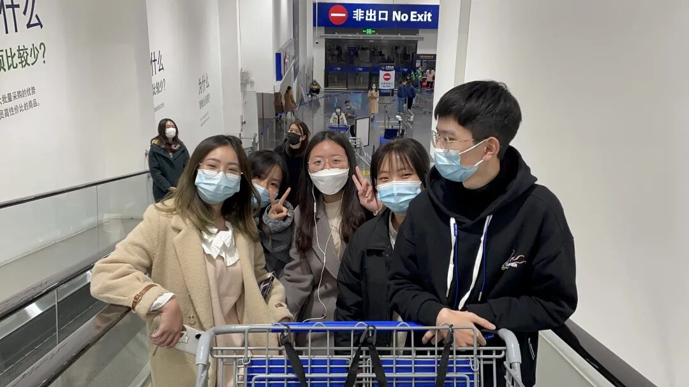

当我和hr有一个人开始馋东北菜的时候…

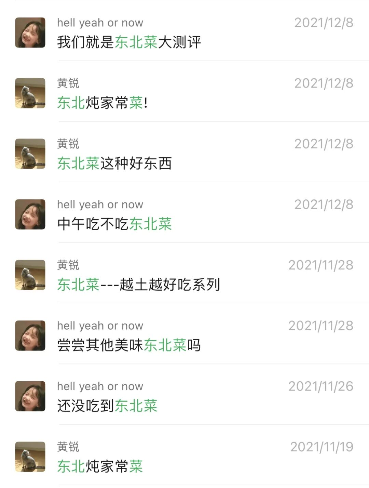

以及我的红会工具人yc&xj🤡

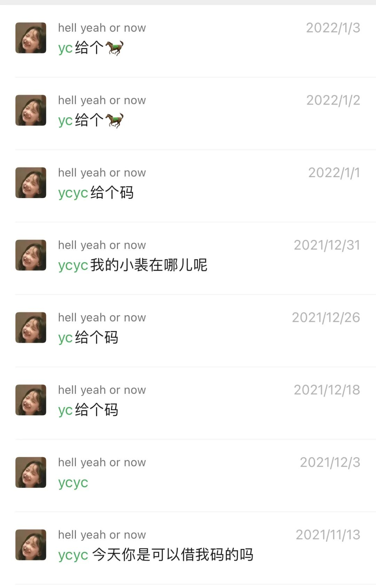

还有最牛的老白和yc！我总是感慨，我要是不进红会，就不会遇到老白和yc了，或许就不会有今天的我了。

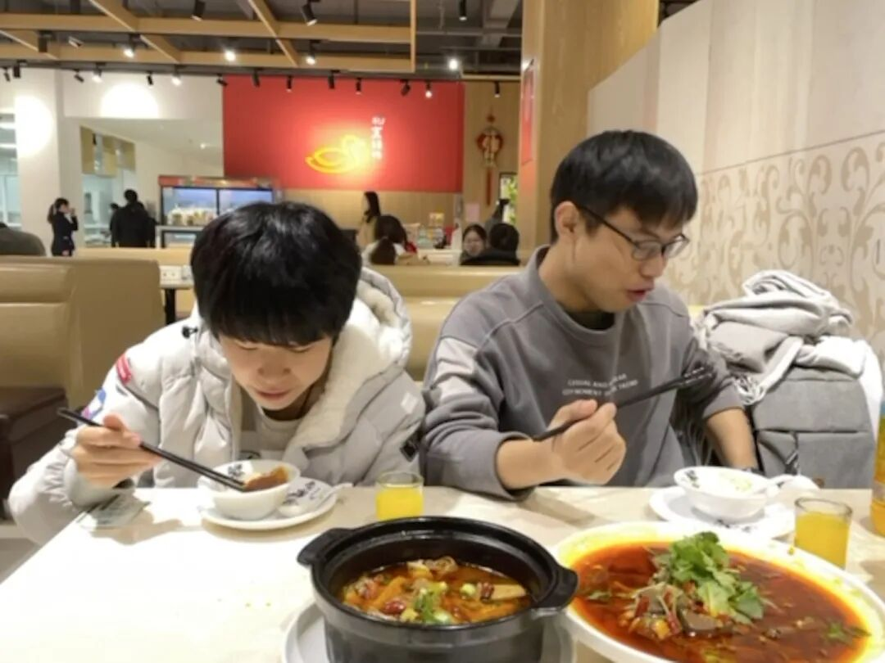

还有和小裴裴每天都像在谈恋爱一样👻 我们既可以一起搞答辩，也能一起吃喝玩乐，一起学习！

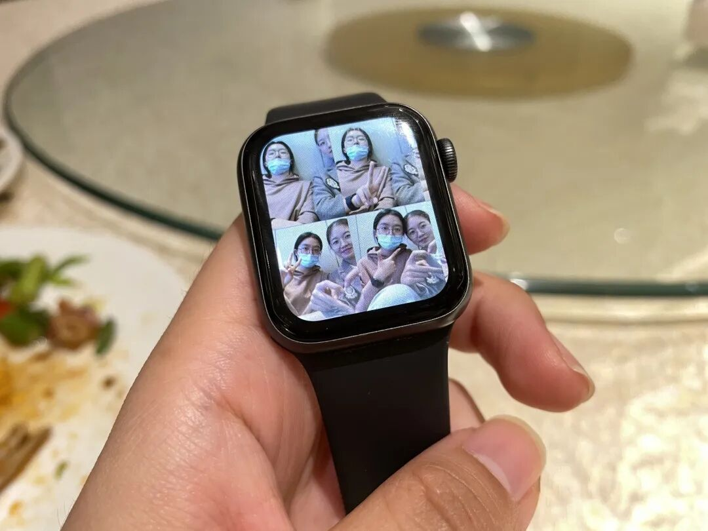

…还有很多很多很好的人

我们一起做义卖，居然可以靠自己的力量搞到5千多；我们在校园、社区、乡村普及心肺复苏，爷爷奶奶们居然都非常感兴趣；在世界艾滋病日带着小孩儿去表演手语，遇到了很好的区红会老师；2021年夏天有机会去参加长三角的红十字夏令营，学习YABC的方法，遇到了很有思想有情怀的各地的peers/peers educater，度过了超有意义的7天。

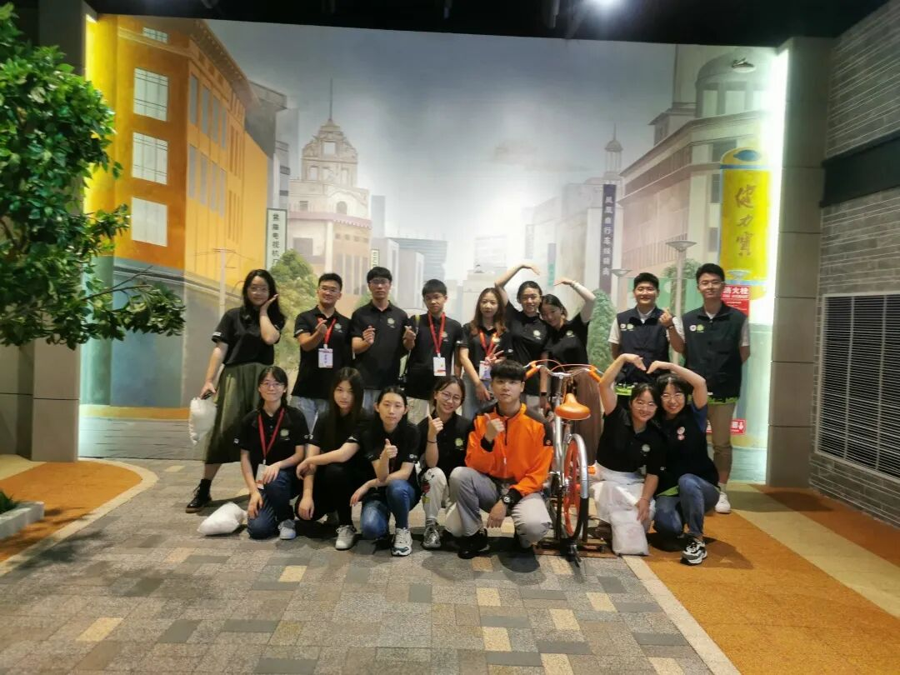

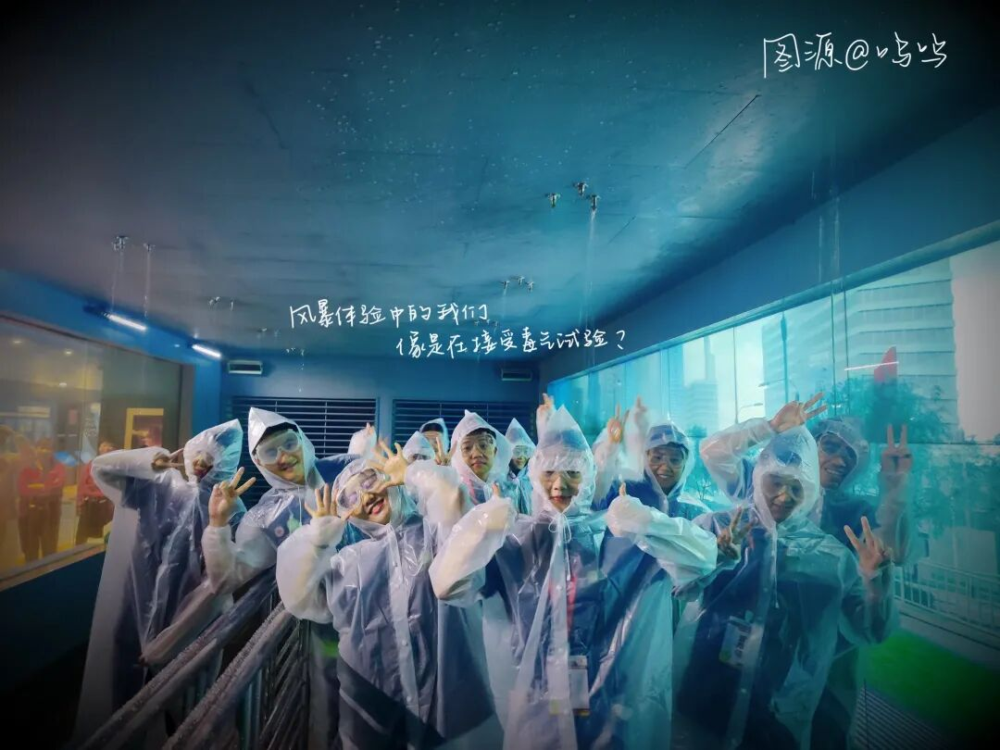

想来想去真的觉得很神奇，高中和zyy报个学生会都拖延再三后来干脆🐦了，后来想去做军训跟班因为太热也🐦了，大学之前当过的无非是什么学习委员宣传委员，就是这样一个不完美、没经验的我成为了红会会长，不过或许也就是这样的不完美，让我更能和小孩儿们共情，知道哪些事情有意思哪些事情只是在自我消耗，也尝试着让更多的人能够在社团中有所收获。而在社团中认识的人永远都会是很好很好的朋友。

还有，确实是做学生工作让我从INFJ变成了ISFJ...

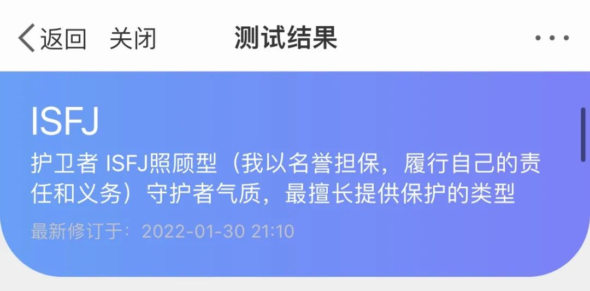

当然除了红会遇到的人 还有很多很多很好很好的人 。

我会永远感谢我的好舍友们 每次在外面饱经风霜（指因为学工而心如死灰）一回到宿舍感受一下宿舍的搞笑氛围就能变得快乐 有啥大不了的 反正事情最后总会解决 不如先开心一下！

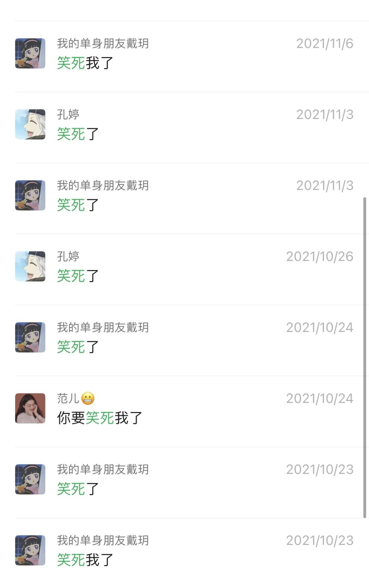

总是能和wej同频 这个学期我们的状态都比之前好太多了 所以我们totally接受用期末复习的下午去操场上开着电瓶车兜圈扯淡 wej永远是我能说很多很多话的好朋友！

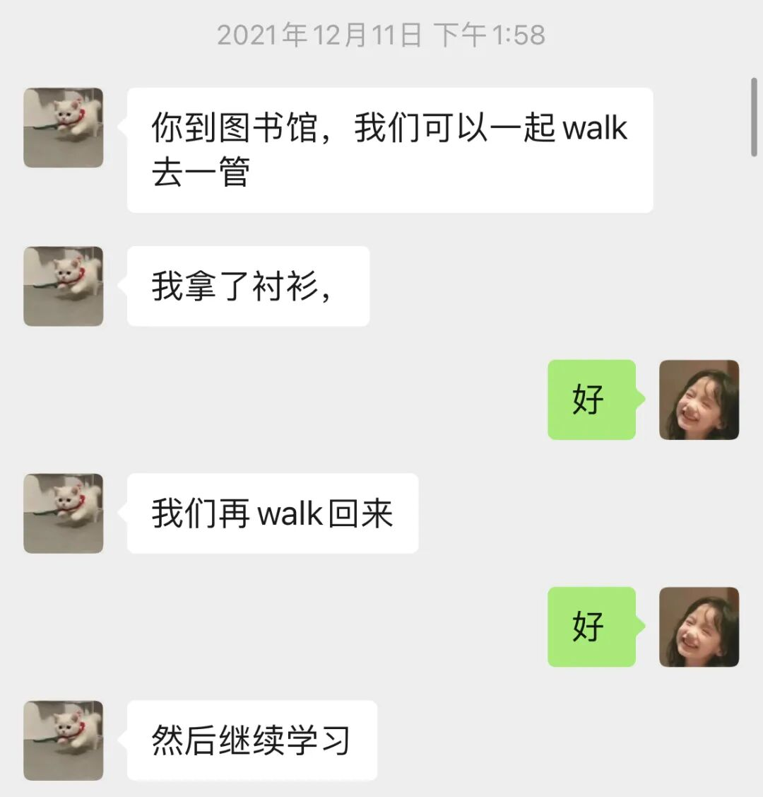

之前总能和剑浩老师情感共鸣 在我没评上国奖的时候给了发了一段值得我反复品味的话 真的很感谢他！现在剑浩老师成功保研 并拥有sweet爱情 妥妥人生赢家👻

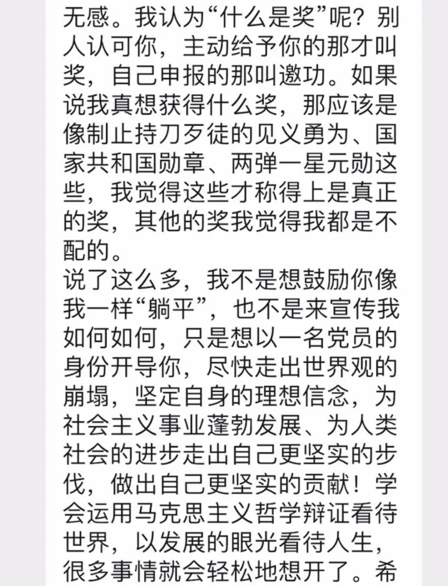

和lhj自然是说走就走的酒肉朋友（❌）是让我们是想得很多的笨蛋小孩呢

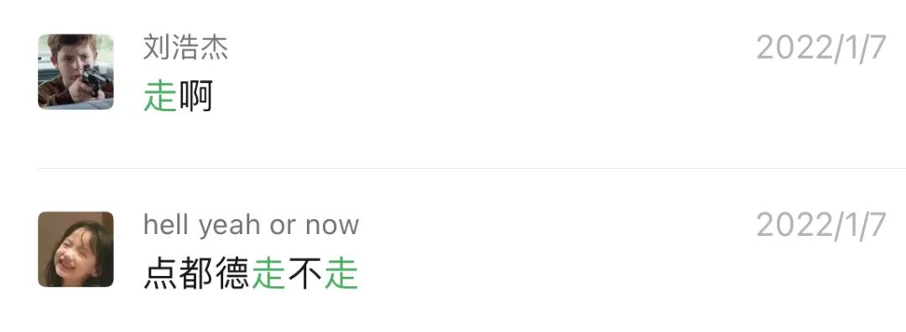

还有很多很多值得感谢的人... 感情都在酒里了🍻

say 886 to 2021

小时候觉得，长大是最美的字眼。以为成长到二十岁，就可以拥抱自由，按喜欢的方式生活。就算没有喜欢的生活，也至少应该形成一个内心深处稳定的自我，可以深信不疑地在任何生活的角落迈开脚步。

然而事实并非如此，我的二十岁，我们的二十岁，还在对抗着各种焦虑和虚无，撕扯着内卷、躺平、摆烂的标签。我有时候也在想，这个时代确实有了更多元的思想，有了更多的生命可能，但这样的时代背景也让更多的人开始“斜杠”、开始“超前学习”，开始挣脱“什么年纪做什么事情”的桎梏。于是就有了初中学完大学课程、一个职位有很多比你年轻还比你优秀的人一同竞争，于是年轻人们，真的就越来越辛苦了。但是这只是我的猜想，社会思想与行为之间究竟如何交互，还需要在社会学的研究中不断求证。

最近我会问我的爸爸妈妈，问我的哥哥嫂嫂：**你们的二十岁在想一些什么呢**。得到的答案大多都是按部就班地毕业、找工作、结婚，没有further study的他们依然平安幸福，家庭合睦。

而我们这一代面前有太多的抉择，抉择推动着我们提前成熟，必须成为具备着学习能力、抗压能力、信息检索能力的超人，电视剧、社交平台塑造着一个个成功人士、一段段幸福的婚姻，但一刷微博则又是另一片鸡飞狗跳、魔幻现实的社会新闻。

基于这样一个复杂、混乱的社会场景，我们找到稳定的自我太难了，形成一个稳定的价值观太难了。

去年我总觉得如果一直关注内在就会对于时事缺少很多的洞见和深入思考，但是今年完全接纳自己多进行自我救赎。

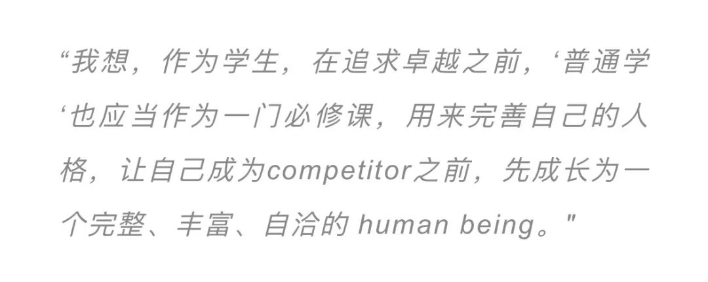

我必须蹲下来欣赏地上的蘑菇，抛开那些失望和不解，把自己的铁架子全部拆开，对自己的内心感受进行一番深刻洞察，去想想走过的路，同情过的人，呼唤过的正义，渴求过的尊重，努力寻找构成我们根植与世界共通意义的根基，然后才能自信地站起来重新拥抱周遭的世界，在形形色色的世界里即使体会了失落，品尝了诱惑，经历了幻灭，领受了嘲讽，也不至于在一瞬间崩溃而泯灭了心中的美好底色。

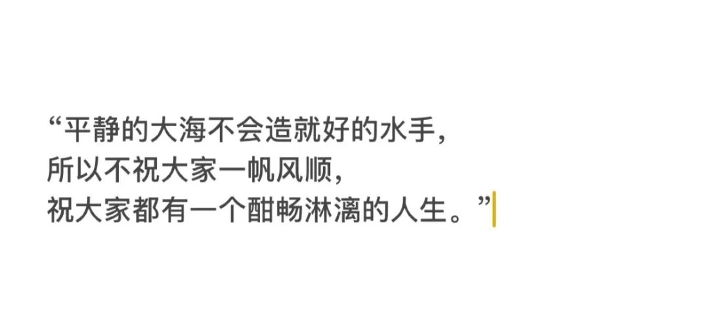

2021确实是经历了很多成长的一年，有了一些我觉得配不上自己的荣誉，遇到了很多很好的人，即使它依然带着遗憾，即使依然有一些不那么可爱的人。

但我仍然满怀希望地拥抱2022，这是对我至关重要的一年，希望自己勇敢、坚强、满心热爱，希望满怀希望，希望所向披靡，希望圆满。

新年快乐，希望大家都能幸福充实，满怀期待！

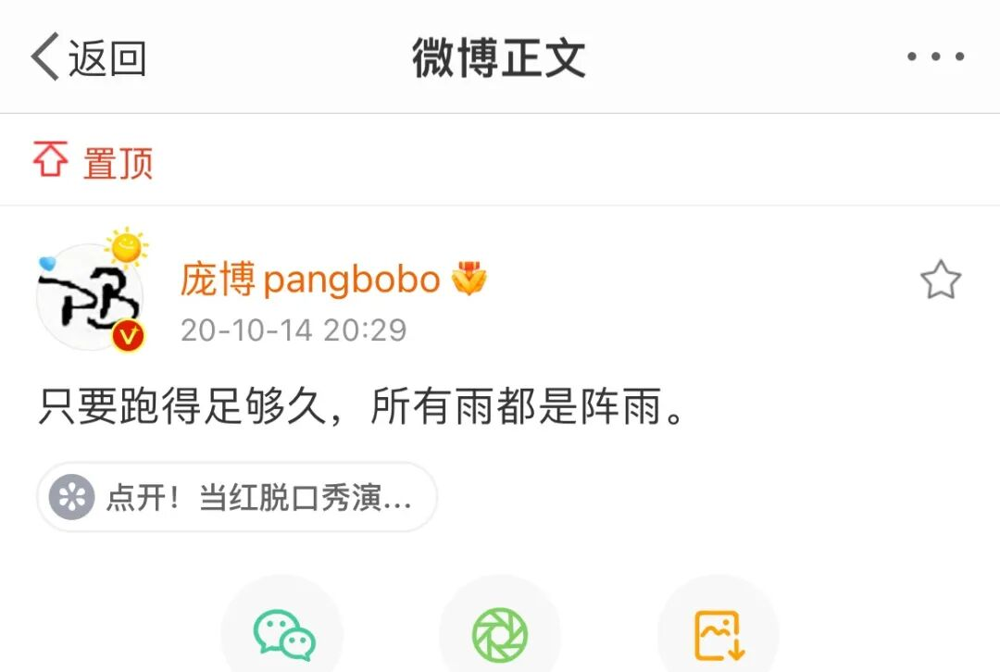

**//还有一些碎片**

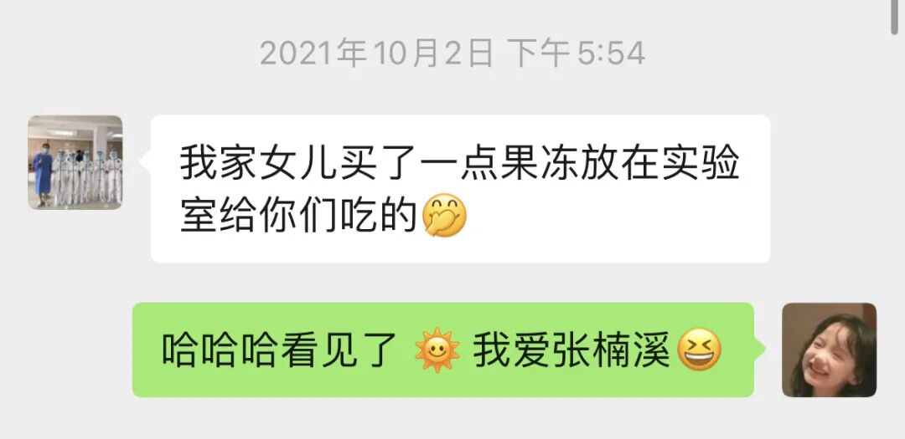

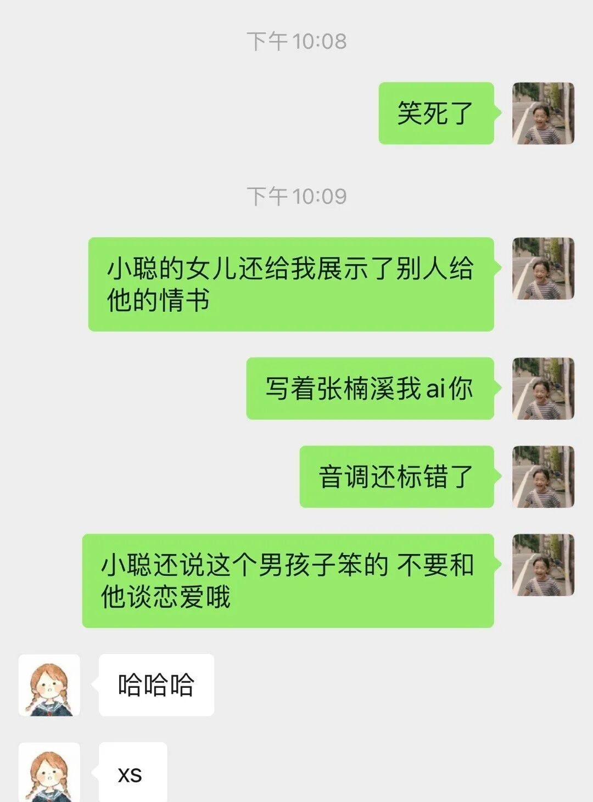

小葱的女儿超级可爱！

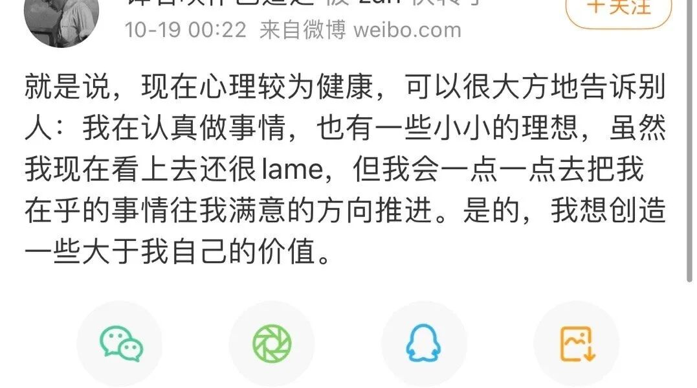

是这样的！

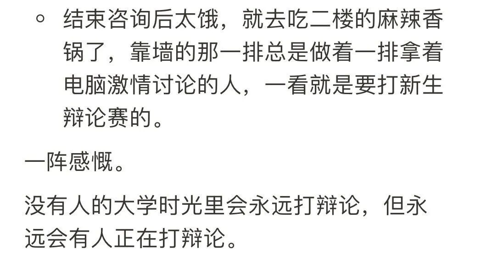

11月的某篇小日记

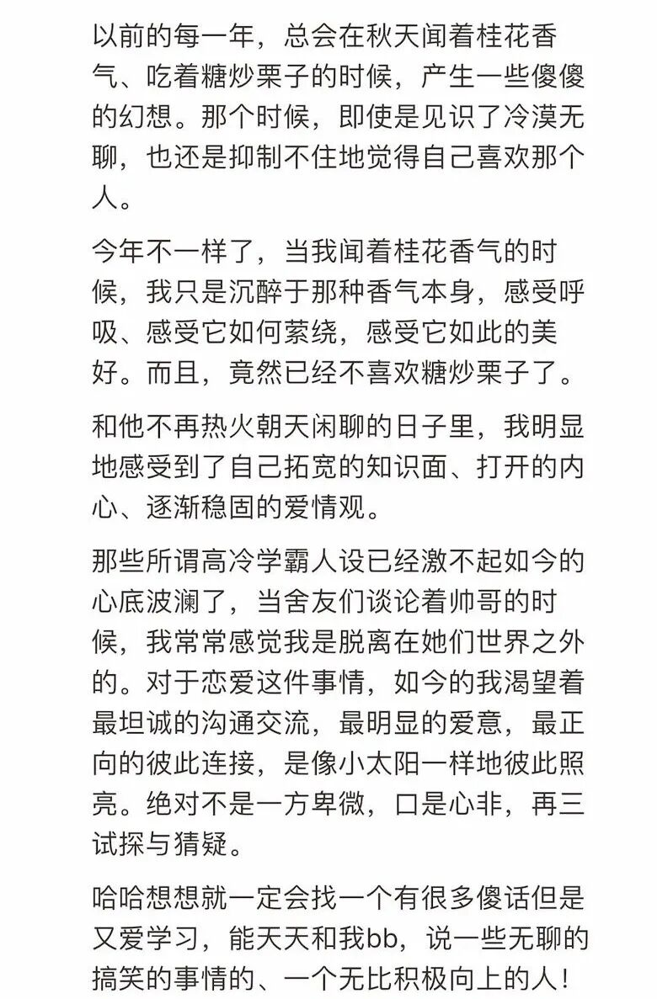

10月份的某篇小日记1

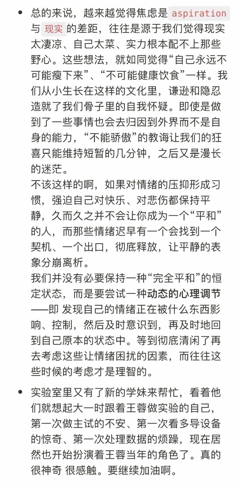

10月份小日记2

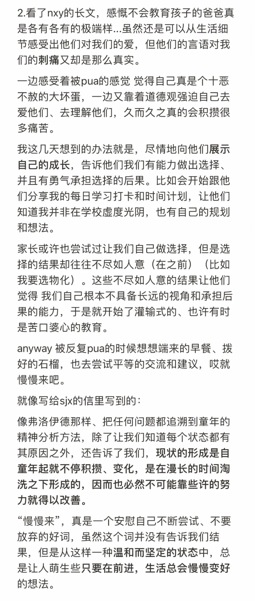

9月份的小日记

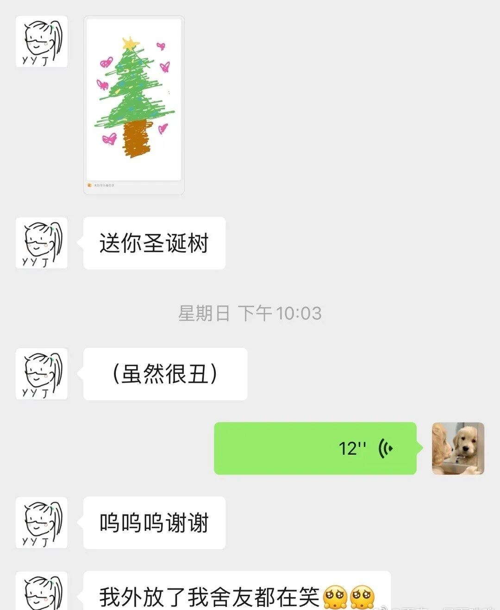

yyj圣诞节给我画的巨丑的圣诞树hh

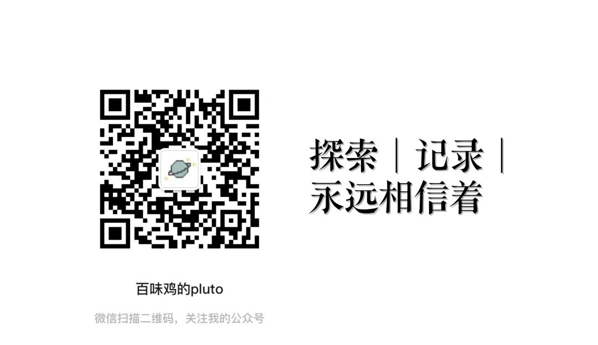
