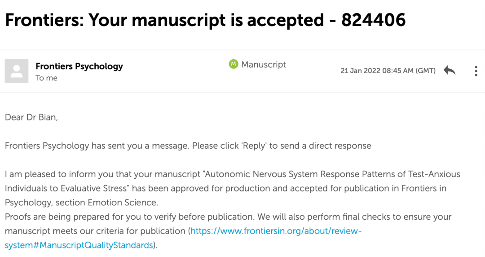
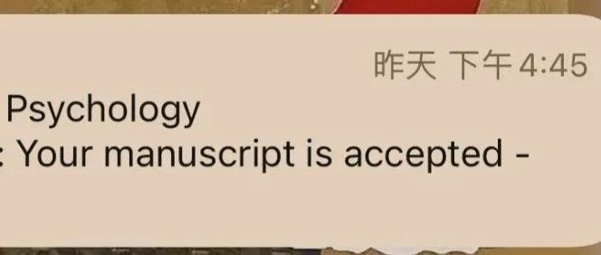

<section style="font-size: 16px;letter-spacing: 0px;white-space: normal;caret-color: rgb(0, 0, 0);color: rgb(0, 0, 0);line-height: 1.56;padding-right: 20px;padding-left: 20px;box-sizing: border-box;"><section powered-by="xiumi.us" style="box-sizing: border-box;"><section style="display: inline-block;width: 729px;vertical-align: top;box-sizing: border-box;"><section powered-by="xiumi.us" style="text-align: center;margin-top: 20px;margin-bottom: 10px;box-sizing: border-box;"><section style="display: inline-block;min-width: 10%;max-width: 100%;vertical-align: top;padding-right: 8px;padding-bottom: 8px;padding-left: 8px;background-color: rgb(182, 204, 220);box-sizing: border-box;"><section powered-by="xiumi.us" style="margin-top: -10px;box-sizing: border-box;"><section style="padding: 3px;display: inline-block;border-bottom-width: 1px;border-bottom-style: solid;border-bottom-color: rgb(105, 139, 162);line-height: 3;letter-spacing: 9px;color: rgb(105, 139, 162);box-sizing: border-box;">
<strong style="box-sizing: border-box;">学术聊养</strong>
</section></section></section></section><section powered-by="xiumi.us" style="font-size: 13px;color: rgb(71, 108, 133);letter-spacing: 4px;line-height: 5;box-sizing: border-box;">
生活是正着来活，却是倒着去理解
</section></section></section><section powered-by="xiumi.us" style="display: inline-block;width: 729px;vertical-align: top;box-sizing: border-box;"><section powered-by="xiumi.us" style="transform: translate3d(4px, 0px, 0px);box-sizing: border-box;"><section style="font-size: 14px;color: rgb(124, 122, 123);line-height: 3;letter-spacing: 0px;box-sizing: border-box;">
 

 

2022年1月21日下午4:45，我的第一篇ssci被接收了。

收到这封邮件的时候，我正在和一起上OPP的coworker讨论我们的pre。当时正讨论着下次一起顺ppt是什么时候，然后网易邮箱大师就给我弹了封邮件过来。当时只看到title:

Your manuscript is accepted.

 
</section></section><section powered-by="xiumi.us" style="text-align: left;margin-top: -140px;margin-bottom: 10px;justify-content: flex-start;box-sizing: border-box;"><section style="vertical-align: middle;display: inline-block;line-height: 0;width: 364.5px;height: auto;box-sizing: border-box;"> </section></section></section><section powered-by="xiumi.us" style="box-sizing: border-box;"> </section><section powered-by="xiumi.us" style="transform: translate3d(4px, 0px, 0px);box-sizing: border-box;"><section style="font-size: 14px;color: rgb(124, 122, 123);line-height: 3;letter-spacing: 0px;box-sizing: border-box;">
 

当时第一反应是，receive和accept的区别是什么来着，这是垃圾邮件吗，这啥意思，不会吧。然后就淡定的先关了等到讨论结束了再看。 

但是其实已经心跳加速了。

结束后打开它，一字一句读过去，那1分钟，是我感觉我的英语阅读能力最差的1分钟。
</section></section><section powered-by="xiumi.us" style="box-sizing: border-box;"> </section><section powered-by="xiumi.us" style="transform: translate3d(4px, 0px, 0px);box-sizing: border-box;"><section style="font-size: 14px;color: rgb(124, 122, 123);line-height: 3;letter-spacing: 0px;box-sizing: border-box;">
但是看到那句 “we are pleased to inform you…”的时候我就知道，啊，真的是我啊。

大一大二陆陆续续看了一些帖子上发了sci/ssci的人的介绍，觉得那都是我遥不可及的存在。直到我也成为了其中的一个，还是有点恍惚的。果然就是这几天看戴维的社心里提到的那句：生活是正着来活，却是倒着去理解。

我站在这个时间节点尝试着理解过去，确实脑海中的一片混沌，确实是杂七杂八干了些事情，但是却很难总结出点经验，就在这里用倒叙的方式小小回顾一下：

 
</section></section><section powered-by="xiumi.us" style="text-align: center;margin-top: 10px;margin-bottom: 10px;box-sizing: border-box;"><section style="max-width: 100%;vertical-align: middle;display: inline-block;line-height: 0;box-sizing: border-box;"></section></section><section powered-by="xiumi.us" style="transform: translate3d(4px, 0px, 0px);box-sizing: border-box;"><section style="font-size: 14px;color: rgb(124, 122, 123);line-height: 3;letter-spacing: 0px;box-sizing: border-box;">
 
</section></section><section powered-by="xiumi.us" style="transform: translate3d(4px, 0px, 0px);box-sizing: border-box;"><section style="font-size: 14px;color: rgb(124, 122, 123);line-height: 3;letter-spacing: 0px;box-sizing: border-box;">
再翻聊天记录还是很感慨的，第一次跟小聪老师说起干脆投个外刊是在2021年10月4日，也就是我公历生日的那天。虽然没有过生日，但是生日这个节点总会给你“又大了一岁”的勇气。于是伴随着自不量力、冲动、对academic writing一无所知的状态，我就开始了第一篇ssci的写作、翻译、润色、投稿、改稿：

第一步就是确定中文版没问题之后就开始进行了英文翻译（现在回想起来，第一步的翻译可以不要那么追求表达， 而是把中文的语句用英文的写作逻辑去表达）。而光光是一个翻译，大概就花了1个月，用一个星期时间去改一版，然后小聪老师再提意见，然后再改，再提，再改。那是一段社团招新、暑社答辩、暑社总结等等事情混在一起的日子，所以也不是真的用一个星期去改，往往是每周ddl前的1个晚上熬到4点多改完。 

我现在想，要是我那个时候知道deepl就好了… 🤡 

之后有段时间感觉思维真的太停滞了，盯着文章心里却是麻木，于是也就找了很多其他的资源，在这里做个总结：

 
</section></section><section powered-by="xiumi.us" style="box-sizing: border-box;"><section style="color: rgb(255, 255, 255);line-height: 3;box-sizing: border-box;">
<strong style="box-sizing: border-box;">word插件</strong>
</section></section><section powered-by="xiumi.us" style="transform: translate3d(4px, 0px, 0px);box-sizing: border-box;"><section style="font-size: 14px;color: rgb(124, 122, 123);line-height: 3;letter-spacing: 0px;box-sizing: border-box;"><ol class="list-paddingleft-2"><li style="box-sizing: border-box;">
Grammarly  

可以check很多语法、标点、主被动等等的使用，同时还能调整是formal/academic/casual哪种语气。不限字数的话是要钱的，可以去淘宝上买个7天的会员。 
</li><li style="box-sizing: border-box;">
quillbot 

这个是集paraphrase和grammar check于一身的插件，paraphrase功能可以替换掉很多中式表达。我也只用了它的word插件。要钱，淘宝上也有会员。
</li><li style="box-sizing: border-box;">
Writefull

这个是我在浏览word加载项有哪些的时候无意间发现的，装完之后简直神了。最好的一个功能是你可以输入一个表达，它会告诉你这个表达在其他的学术写作中用了多少次，别人是怎么用的。所以如果纠结两个表达方式哪个更academic一点的话，选择使用次数多的那个即可。同时它也有grammar check等等功能。目前我用着免费版本就已经很好了。
</li><li style="box-sizing: border-box;">
Zotero和mendeley就放在一起说了，都是文献管理软件。但是感觉mac装这俩就巨卡，而且我的血泪史告诉我：

ps：mendeley对于中文文献极度不友好，插入的中文文献不仅不能变成自动识别成拼音，在你把汉字改成拼音之后，在某个刷新文献的瞬间，这些拼音又都会变成汉字！！真的是血泪史了，辛辛苦苦改好的中文文献的英文形式一瞬间🈚️了，谁懂、、

所以如果在英文写作中要加中文文献，干脆从头到尾都不要用mendeley！ 

相比这一点，zotero就友好很多，如果识别到你修改了它自动生成的插入时，它会问你是否保存修改。还有一点应该是高级一点的文献管理软件都有的功能是它内置了很多期刊的reference格式。因为不是所有的期刊都是APA格式，一个个自己改确实麻烦，因此有文献管理软件就会方便很多，但同时还是有些内容是它不能自动识别的，因此还是需要自己再去一个个校对，比如一切期刊是否进行了缩写，是否斜体等等。（但是mac用zotero巨无敌卡… 可能对windows会友好很多）
</li></ol></section></section><section powered-by="xiumi.us" style="color: rgb(255, 255, 255);line-height: 3;box-sizing: border-box;">
<strong style="box-sizing: border-box;">作图软件</strong>
</section><section powered-by="xiumi.us" style="transform: translate3d(4px, 0px, 0px);box-sizing: border-box;"><section style="font-size: 14px;color: rgb(124, 122, 123);line-height: 3;letter-spacing: 0px;box-sizing: border-box;">
graphpad prism

是我在小红书上无意间刷到的，应该是医学类用得比较多，是个集数据分析和作图于一体的软件，功能很多很多，还没摸透。最神奇的是有一个magic功能，可以自动识别顶刊中图片的设计和配色然后improve你的图表。有一个缺点是，正是因为功能很多，一定要把每个细节都检查到位。比如最后一遍检查论文的时候才发现有一个指标的标准差线没加，这是因为漏了一个按键没选择。所以一定要列一个checklist，每次作图结束一条条去检查。 

 
</section></section><section powered-by="xiumi.us" style="color: rgb(255, 255, 255);line-height: 3;box-sizing: border-box;">
<strong style="box-sizing: border-box;">翻译软件</strong>
</section><section powered-by="xiumi.us" style="box-sizing: border-box;"><section style="transform: translate3d(4px, 0px, 0px);box-sizing: border-box;"><section style="font-size: 14px;color: rgb(124, 122, 123);line-height: 3;letter-spacing: 0px;box-sizing: border-box;">
Deepl

是比谷歌翻译好很多倍的翻译软件，是一个“说的是人话”的翻译软件。买会员可以全文翻译，绝对是科研一大利器。
</section></section></section><section powered-by="xiumi.us" style="color: rgb(255, 255, 255);line-height: 3;box-sizing: border-box;">
<strong style="box-sizing: border-box;">写作书/网站</strong>
</section><section powered-by="xiumi.us" style="transform: translate3d(4px, 0px, 0px);box-sizing: border-box;"><section style="font-size: 14px;color: rgb(124, 122, 123);line-height: 3;letter-spacing: 0px;box-sizing: border-box;">
1.《学术写作原来是这样》 

 很巧的是这本书是北京大学心理与认知科学学院的易莉老师写的，总结的不是条条框框的抽象points。而是学生写论文时常见的毛病出发，自下而上地展开academic writing的正确方法。看到里面的坑感觉自己每个都跳过… 比如句子太长、太多被动、前后主语不一致等等… 

2.《风格的要素》 

相当于一本表达工具书，可以帮助我们挣脱一下高中英语作文模版的框架。

3.《academic phrasebank》 

是曼大整理出的一本常用论文表达，一些过渡句不知道怎么表达的时候就可以翻到对应话题挑一个自己觉得最合适的。

4.上面这本书还有配套的网站 https://www.phrasebank.manchester.ac.uk

5.术语在线  https://www.termonline.cn/index  用来查专业名词的翻译

6.zlibrary

所有书的pdf都可以去这里找，但是它的域名一直变，目前是这个     https://zh.usa1lib.org
</section></section><section powered-by="xiumi.us" style="margin-top: 15px;margin-bottom: 15px;box-sizing: border-box;"><section style="font-size: 14px;line-height: 1.8;padding-right: 30px;padding-left: 30px;color: rgb(91, 91, 91);letter-spacing: 3px;box-sizing: border-box;">
 

很多资源大多数都是我突然在刷小红书、b站无意间刷到的，甚至不是那些几十万粉丝的科研博主，很可能只是一个突然发现好软件的辛苦科研民工。

后来无聊的时候会挨个试试，以上是我自己用的暂时比较顺手的，以后一定还会不断refresh新的好软件的！好软件好插件真是极大地提升科研体验。

 

同时也觉得，这样一种social media atmosphere （瞎造的词）是不是也算是大数据对我的馈赠呢，毕竟我在网上冲浪看帅哥看狗子看美食的时候也不忘看看硕博的daily life… 

好，我真是不错的。

 

今天先倒叙倒到这里… 回忆真让人疲惫…属于是写完都不想回看自己到底写了点啥🥲

 
</section></section><section powered-by="xiumi.us" style="text-align: center;margin-top: 10px;margin-bottom: 10px;box-sizing: border-box;"><section style="max-width: 100%;vertical-align: middle;display: inline-block;line-height: 0;box-sizing: border-box;"></section></section><section powered-by="xiumi.us" style="box-sizing: border-box;">
 
</section><section powered-by="xiumi.us" style="text-align: unset;box-sizing: border-box;">
 
</section></section>
 

