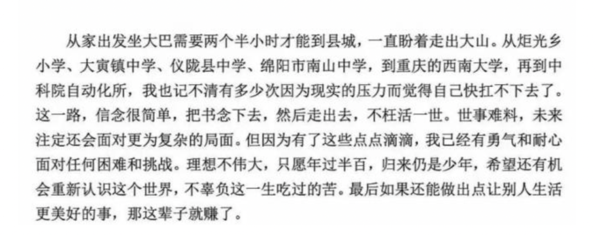
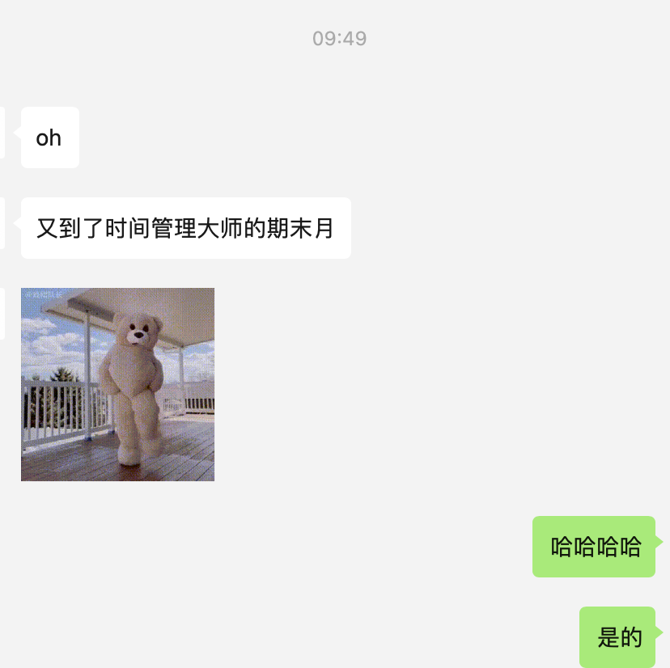
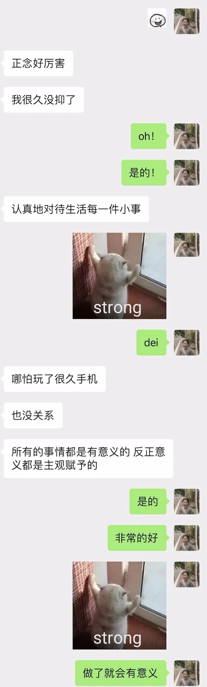
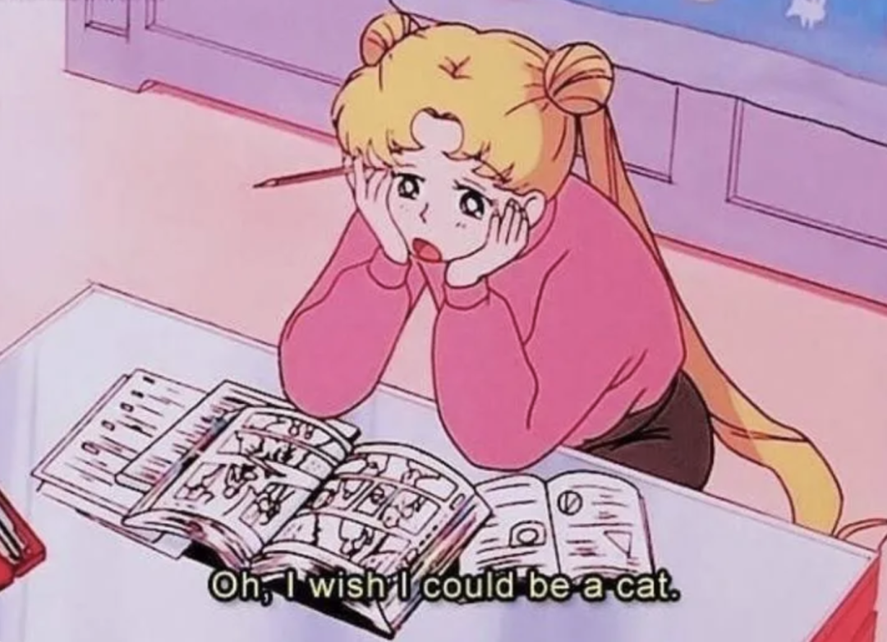

**2021.6.2**

**@一只百味鸡**

**分享一则别人的分享**

**#或许你也在一直怀疑意义吗**

**//**

**@城闭暄**

知乎问题

《为什么经常觉得人活着没有意思？》

于2016-12-27

从我小时候，知道了人是进化出来的时候起，我就已经开始明白:创造人类的世界，并没有给人类任何意义，一切只是条件符合而已。人类的意义全部都是人类自己定义的。

我开始怀疑一切，怀疑所有的正确答案、怀疑一眼看到头的主流路线……我去看了很多对于人生意义的解释，但几乎全部都是自欺之法，而直到我绝望放弃的时候起，我才明白：

接受人生的没有意义，正是可以真正追求意义的第一步。

这个世界残酷且黑暗，我们要去热爱它，两者并不矛盾。

就是这样，我越是认识到人生的没有意义，也就越是去追求意义。越是悲观厌世，也越是努力挣扎着不死。

我小心仔细的经历当下的每一刻，像小时候收集水浒人物卡一样收集有意义的事情。

我走在夜路上，看到满头星空就会矫情的热泪盈眶。

我会在暴雨前，逆着人流跑到海边看半宿闪电。

正是因为人生没有意义，才得以放肆任性的胡作非为。

纵然明知路的尽头只是谎言，才要更加坚定疯狂的为之努力。即便永远也追不到太阳，也要面朝着太阳的方向死去。

正是因为没有意义，才可以赋予给自己意义。

我始终坚信这一生，为的只是贯穿整个人生的一两件必须的事情。

只是几个足以铭记一生的瞬间，是使我人生里所有星辰甘愿同时坠落的绝美景象，便到了临死时回忆起来，也觉得值得了。

于是又想起中科院博士的论文致谢了：

“这一路，信念很简单，把书念下去，然后走出去，不枉活一世。”

“希望还有机会重新认识这个世界，不辜负这一生吃过的苦。最后如果还能做出点让别人生活更美好的事，那这辈子就赚了。”

六月简直动力满满！

要好好生活呢！

**//**

