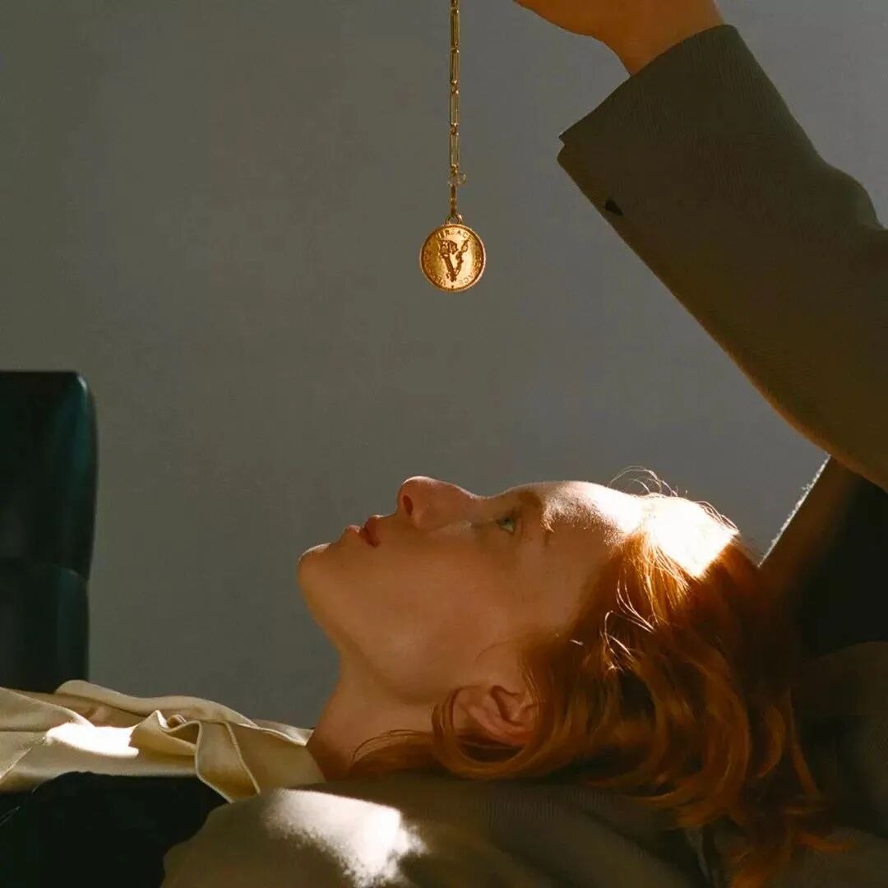

上周去心理咨询中心和老师聊到，上学期一直在公众号记录心情/在pyq分享日常，这学期好像全然没有这种心情了。

这似乎不是一件好事。

于是开始问自己——

为什么不再发日常/感想了呢？

情绪心理学有个作业是：

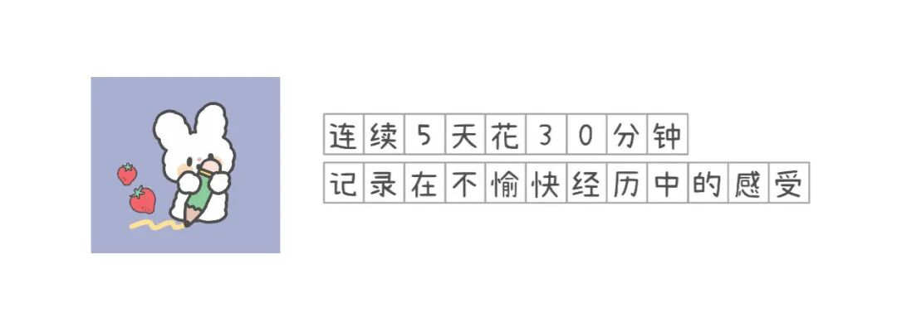

写着写着发现，自己的不愉快都来自于内在思想的冲突：

本质上还是喜欢做咸鱼

&有时move on的成就感也真的很好

试图理解包容一切行为选择

&对有些行为还是难免排斥

有时候会给自己的行为找原因

&又会怀疑那些都是借口

而生活日常 有时候还是会拍一拍mark一下

但是已经懒得加滤镜加文字了

开始觉得那只不过是非常琐碎的个人日常罢了 没有分享的必要

然后老师说：

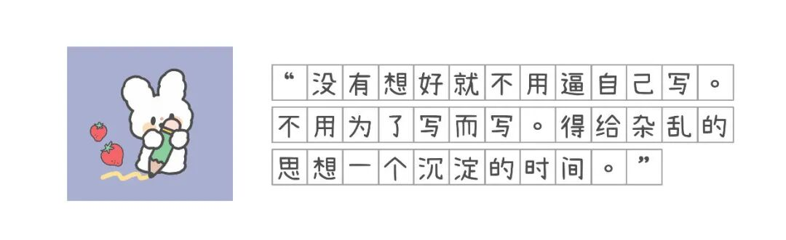

是啊，当时看《月童度河》时摘录的：

> “我对你说，最近我无思无想，时空经常如同停止一般。你说，这样是好的，是心在沉淀。”

而所谓的觉得自己的琐碎日常没有分享的必要 也是因为在心里已经给一些事情默认排了序：学习、社团、工作、科研都比记录生活重要的多。

但显然，不是这样的。

这周一的傍晚 自闭的bwj 自闭的啃着玉米散着步 然后接到了同样自闭的pzy的电话

得知她也在自闭的啃玉米 突然一阵搞笑——

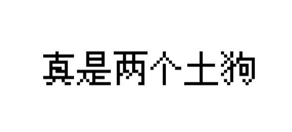

这段时间和pzy总是陷入生活的无意义感里：

“如果不喜欢这件事情，那就只是完成，不是做好啊。”

“参加这么多东西，真的有意义吗。”

“我们真的有必要这么累吗。”

“哎，不懂啊。”

然后自闭的我们双双预约了心理咨询/一起去朝阳模拟医院推拿/之后在操场上兜了大概几十圈。

> “本来结束咨询想找你大哭一场，但是刚出了那个门，就觉得什么都想通了。”

突然想到了那篇写南大最近自杀事件的文章里的：

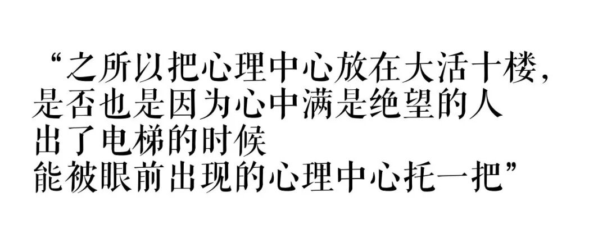

人还是需要定期把日常清一清 感知一下这段时间以来自己在做的事情 在这个过程中心情如何 而之后又将如何向前的。

于是就有了这篇#好久不见的文章。

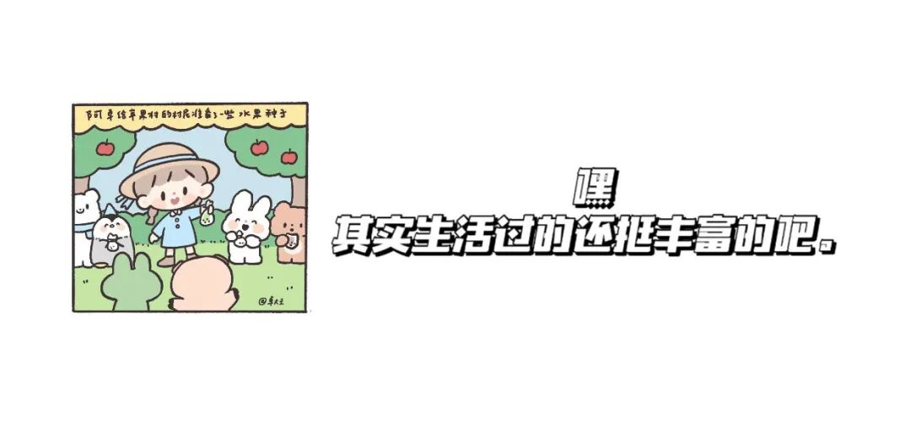

在干一些什么呢？

嗯...在写日记、在研究时间管理、在研究奇奇怪怪的软件、在搞社团...

同时在约饭、在行走、在聊天、在兜圈儿、在看闲书、在看电影...

整理了一下相册——啊 真是颇为丰富的日常...

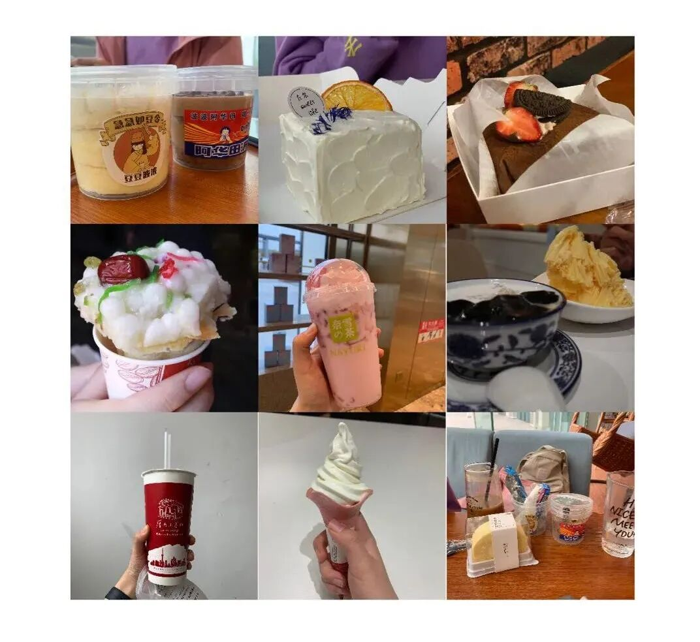

和pzy 范儿心烦意乱的时候吃的甜品

左耳/夫子庙/冰激凌/最爱小眷村/最爱绢豆腐

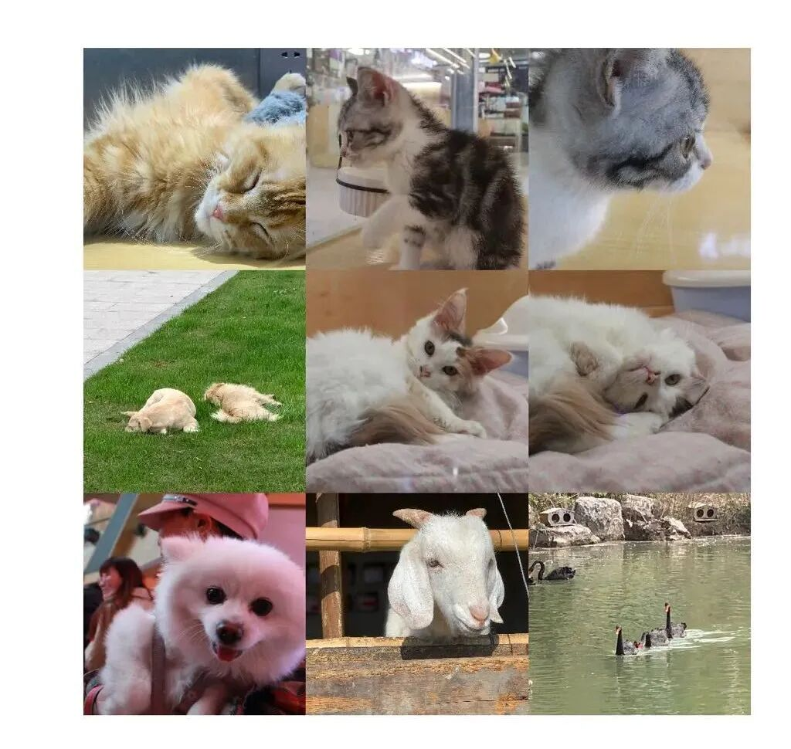

看的一些动物

猫猫/学校里颓废的狗子/羊/药苑排队的鸭鸭

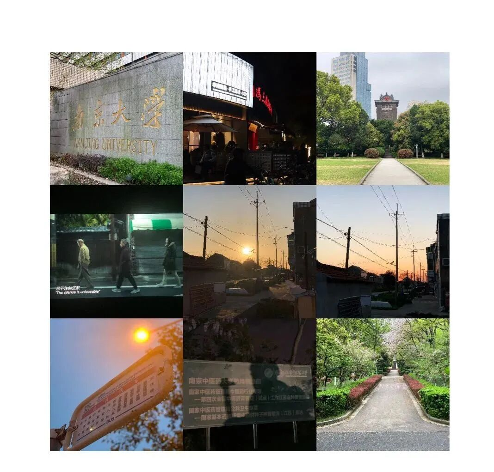

瞎走的一些地方

南大鼓楼校区/科巷/北大楼/电影院/

乡下/万达茂公交站的站牌/药苑李时珍雕像的影子

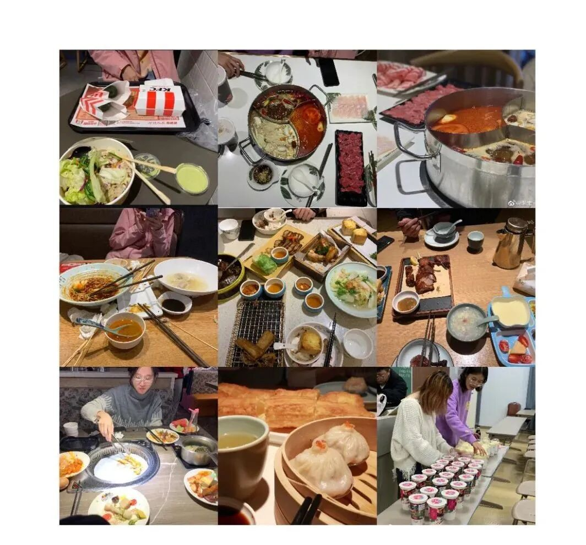

恰饭 恰饭是最快乐的！

KFC/火锅/川菜/越南菜/江浙菜

湖南菜/自助/粤菜

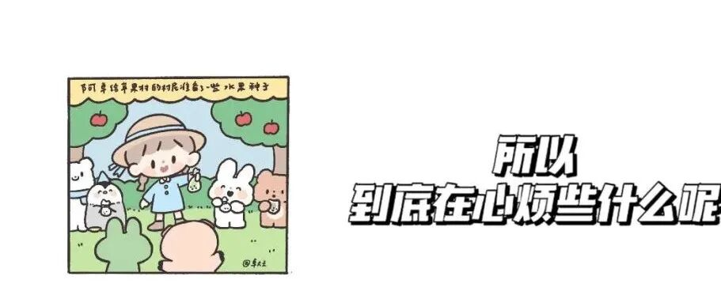

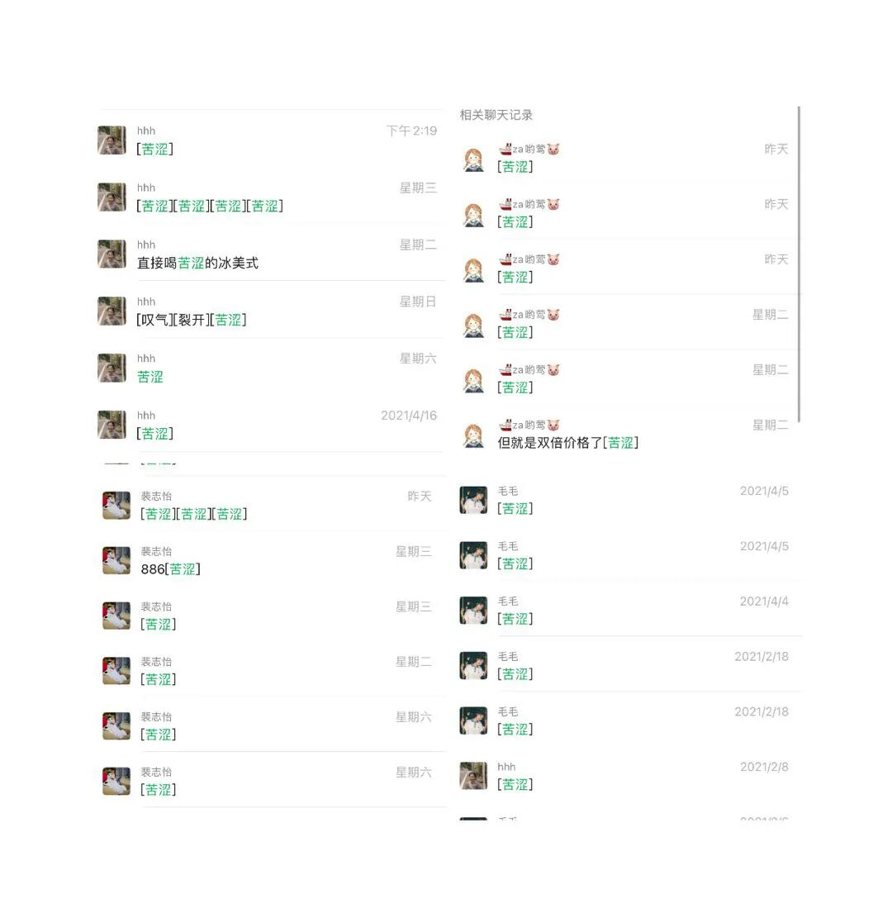

真是苦涩四连

大概是这个月写了不少的材料/申请/策划 总是会心累的 总是会怀疑一下意义的

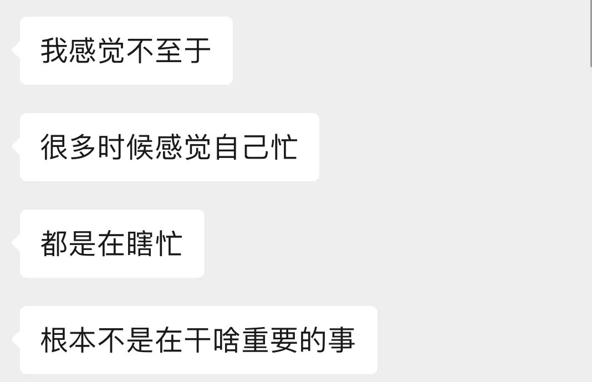

特别是被质问之后 觉得这些事情更没有意义了

哎 总是这样的 一被质问就开始虚了

——但是好像今天又想通了

之所以觉得没有意义 是因为“活在当下”的概念让我觉知到了写这些东西时候心情的烦躁 基于这份烦躁 就开始觉得 啊 为什么要这么折磨自己呢 何必呢。

但“活在当下”这个概念只是一种觉知罢了 通过这份觉知 去调整自己的心情 去做好之后的每一个选择

“活在当下”的概念 绝对不是意味着-必须每时每刻都保持心情的舒畅 必须享受每时每刻的好心情

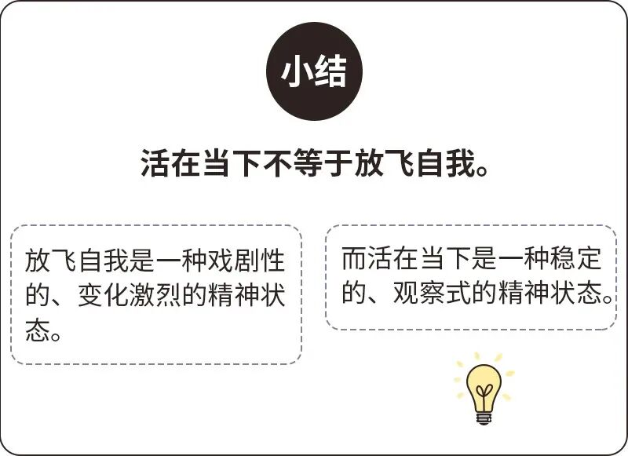

觉知到自己的疲惫 无力 和心烦 这是再正常不过的事情了

我想以后的无力感会越来越多的。

在写材料的过程中磨练自己的耐心，锻炼抠字眼的能力，也不是一件太坏的事情。

没有那么多事情是真正有“flow”心流体验的 又或许——

把一些不太喜欢的事情做好 然后去做一些喜欢的事情 那个时候的flow体验才是最让人享受的。

那就不断的磨练吧！

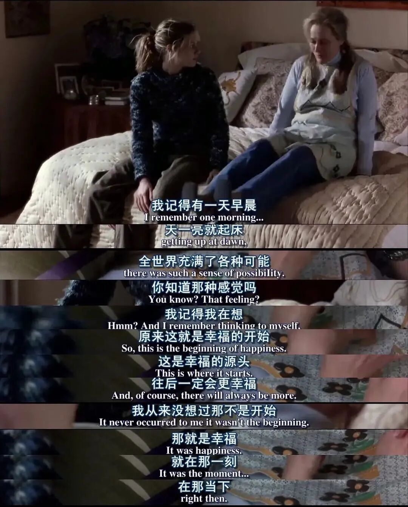

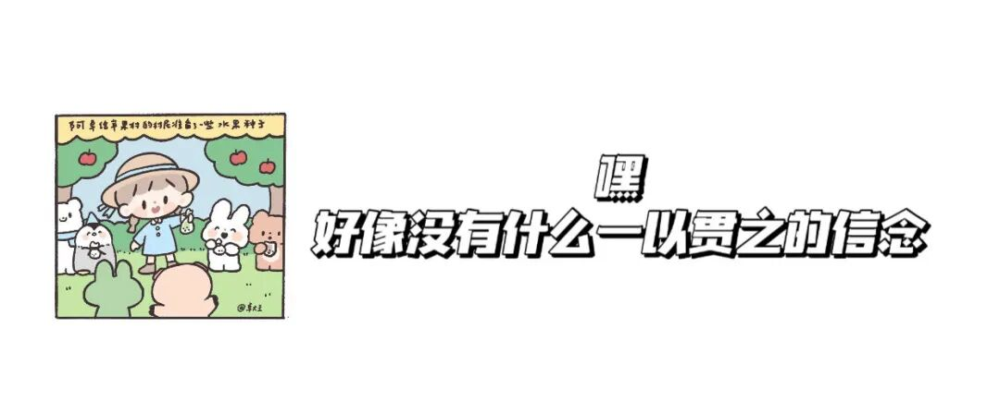

每次觉得事情多的时候，我都自我安慰：

嗯，事情总要一件一件来的，也会一件一件解决的。然后又会有新的事情来。

但是每次这么想之后，做事情的动力好像就只是“完成事情”而已。

甚至有些事情都不是我自己选择要去做的，它自然的掉到了我的头上而已。

而最近想通的是 之所以这么想 是因为把 “想做的事情”和“不得不做的事情”混为一谈了 每天把todo列满之后 真的觉得自己是个无情的赶DDL机器 在麻木的完成todo 的时候已经忘记去体会做完的成就感和踏实感了

所以在todo上还是得有一个区分

这样在开始之前就会有不同的心理准备 那么做事情时候的体验也就是不一样的了。

其实会把事情都处理好的，但是总喜欢说“啊 我老摸鱼了”

又或者

其实觉得学习真的是一件享受的事情 但是被扣上“一直在学习”的标签总觉得有些不适

——然后我发现 好像很多人都是这样的。

大概也是因为丧文化的风靡 或者是人们对于“聪明”的追捧

导致“学习”“认真”变成了愚笨的人才会去做的事情

而我自己确实以前非常崇拜那些不用努力就能成为优秀本身的人

问题是——

这样的人好像也不多。

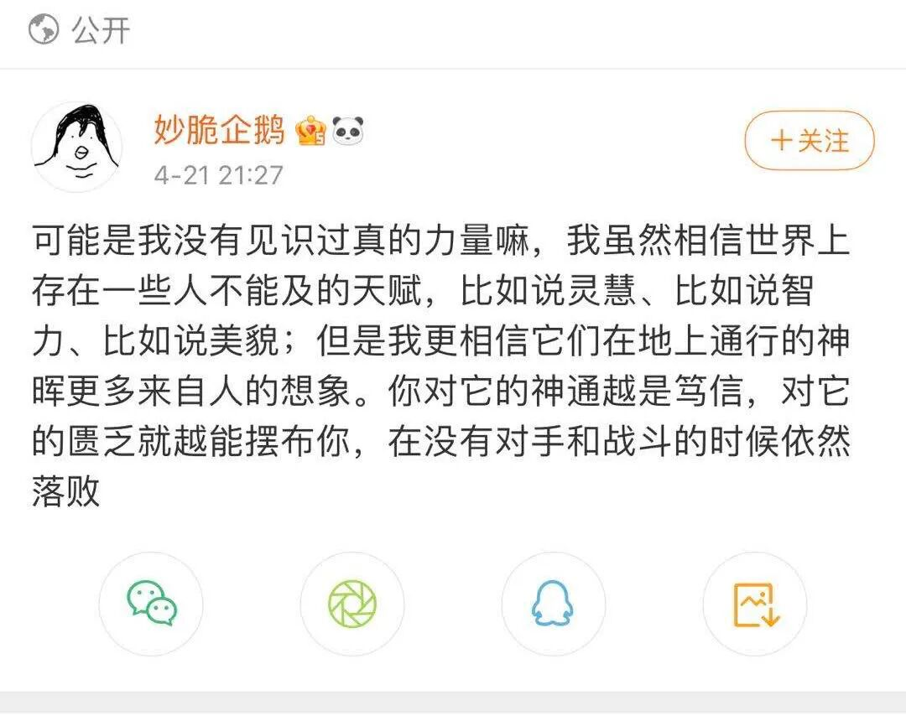

而大多数的崇拜 都是基于自己内心的想象

这一年来 我认识了很多以前觉得遥不可及的人

我慢慢了解到 其实大家的生活也都大差不差 有迷茫 有自我怀疑 有疲惫

光芒之下 是很多黑暗中的摸索

那些对于学科不同领域的透彻了解 是认真听完一门门网课之后才有的

那些高超的数据分析能力 也是自己在图书馆的书籍里不断摸索和练习出来的

于是了解到这些之后

一次和舍友聊到未来的学业之路时 我突然颇有些正经的跟她说：

“科研就是时间啊”

我不明白我说出这句话的底气是什么 我明明也还是个刚走上这条路的小白

明明走的还非常的坎坷

但是冥冥之中 还是相信努力的力量 相信时间+效率的无限可能。

现在真的非常喜欢 非常佩服 非常欣赏那些能够沉下心来去探索未知领域的人

所以还是希望自己能够成为一个坦诚的人

不要再为了心里觉得说一些颓废的话可以和对面的人拉近距离就心口不一了。

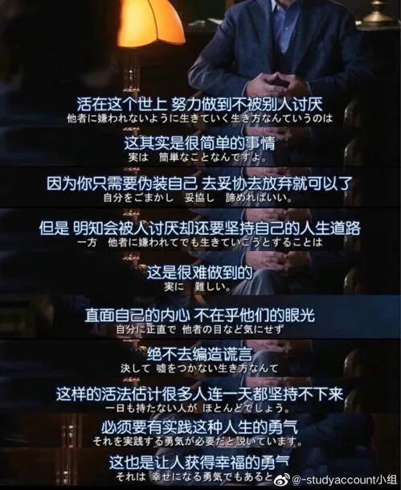

不知道是不是季节的问题 导致大家都很丧

这段时间我和朋友们一打开手机总是能收到无论是熟还是不熟的人的情感宣泄

我们一方面觉得 我们好像挺容易被信任的

另一方面又觉得 处理自己的生活就很累了 实在是没有心力再去应对别人的烦恼

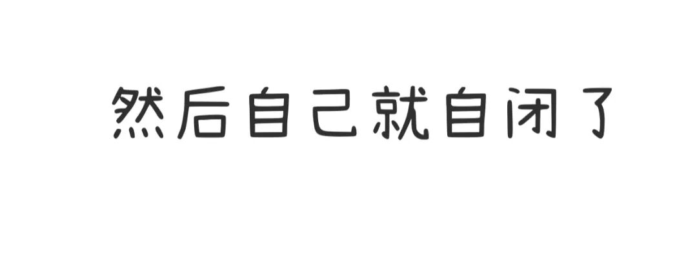

然后就又去心理咨询了。

> “当你不知道该如何帮忙的时候 你必须问清楚对面的需求是什么 这很难 但是你得说出来。”

确实是这样的 跟别人表达出自己的无可奈何真是一件很难的事情 特别是对于被赋予了无限期待的心理学学子来说。

但是心理咨询的原则本来就是

心理咨询师也从来不会提供具体的方法和建议

只是在引导来访者找到内心的真正欲望 明白来路和去向 而之后的选择 就是他们自己的事情了

不必为别人的纠结和痛苦而耗费心力 不用为了自己无法提供具体的建议而自我怀疑

仅仅是耐心的倾听别人的烦恼 给别人一个对话框的依赖感 就已经很好了。

而进一步的引导 只有在之后系统的培训之后才会有眉目

真的不能强加给自己太多的要求了 每个阶段都有每个阶段该做的事 能做的事

接受这个阶段有些无措的自己 也期待下一个阶段更理智更通透的自己。

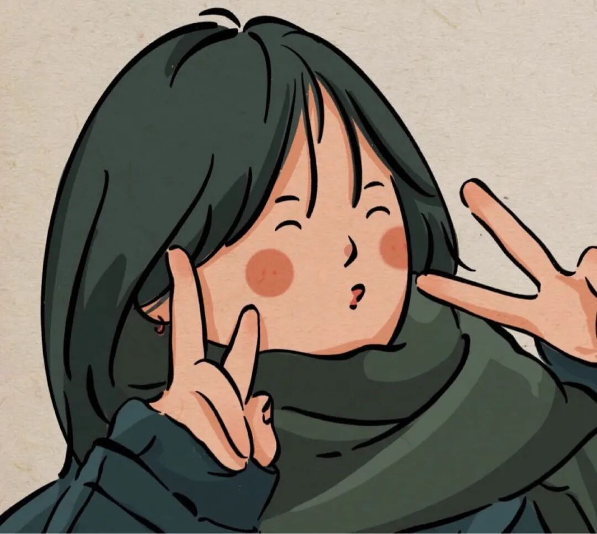

写完这些 真是觉得通畅多了！

真的还是要时常回顾 时常计划和复盘

那种突然陷入生活的无意义感的感觉 真的不想体会了！

（比如去年颓废的年终总结

有时候 我们真的需要

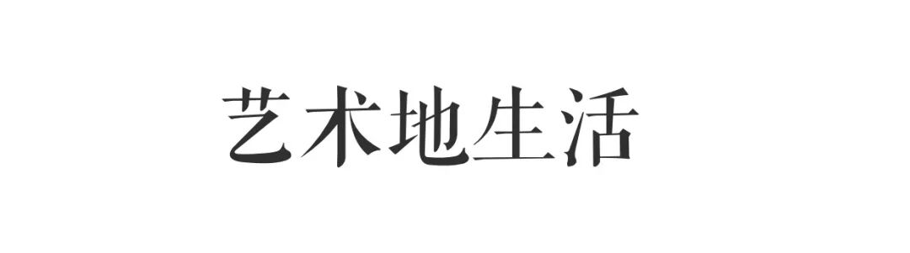

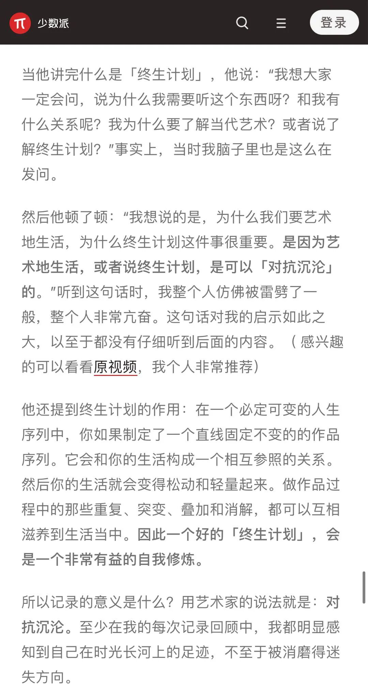

还有一些最近保存的图：

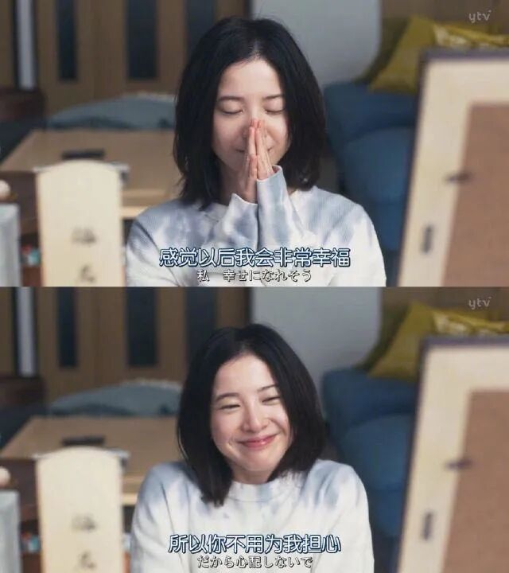

今天把这张图片发给了老母亲

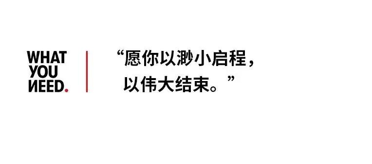

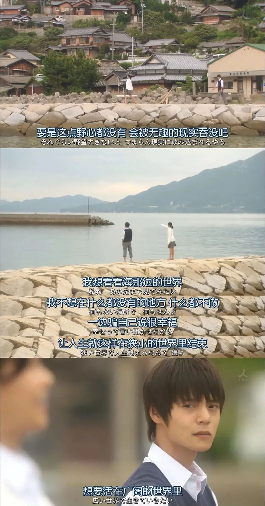

想要活在广阔的世界里！

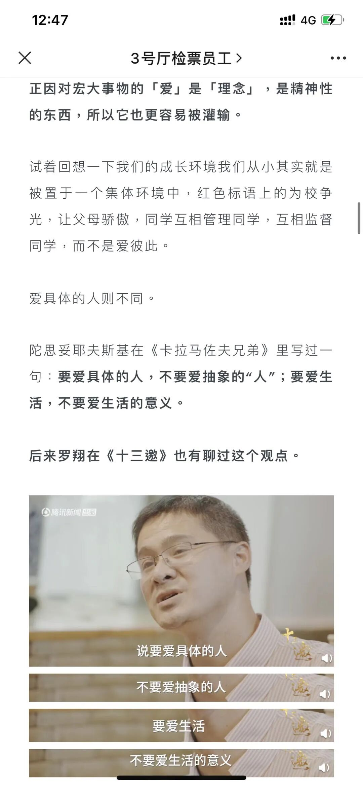

要爱具体的人，不要爱抽象的人

要爱生活，不要爱生活的意义

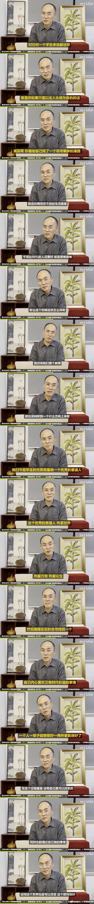

热爱万物 热爱众生

自己内心喜欢又有时代价值的事情

感谢你看到这里！

下次再见！

祝好！
