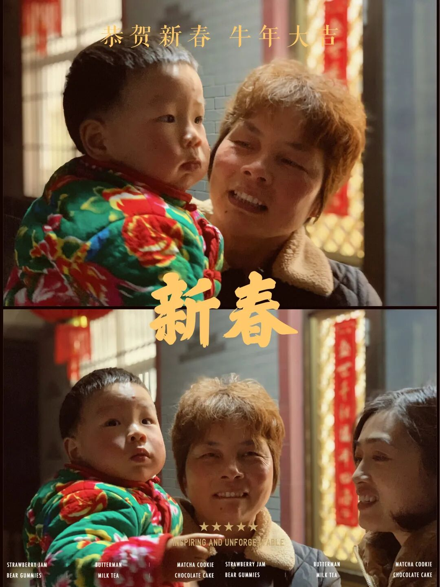

从10天前就开始思考怎么写2020年的年终总结。无果。

翻看这一年的公众号、备忘录、手账本，其实还是可以清晰地窥见成长的痕迹。

甚至是觉得，这一年实在是写了很多的“总结”和“复盘”。更多的，是对自己内心的审视，却少了点关注外界的辽阔和思辨。

所以，今年的总结大概是没有了。

觉得走了很多路，又觉得那只是文字记载里的路。以至于到年末回顾的时候，真的陷入了自卑和自我怀疑。

去年明明写到，过程才重要。可是今年却因为结果而自我否定了。希望能早早摆脱这个桎梏，重拾自信吧。

那么2021，请继续赶路吧。

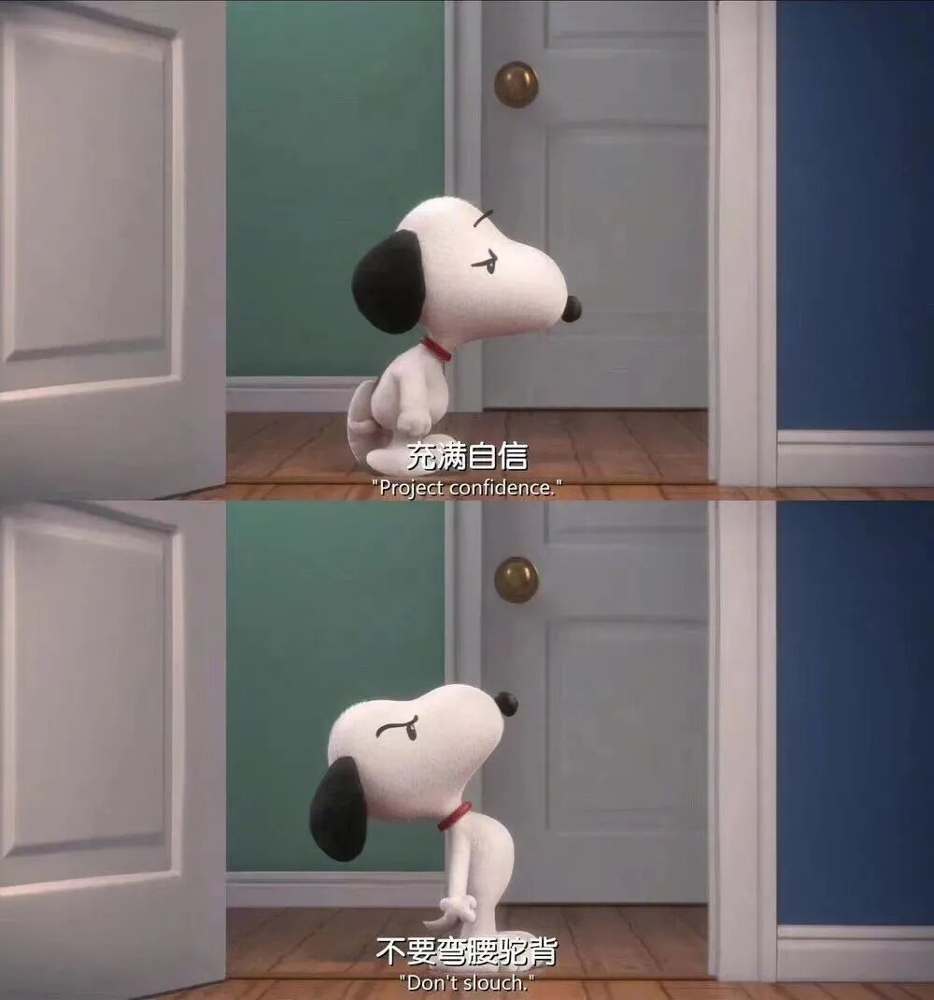

2020摘抄了很多鸡汤或不鸡汤的文字。
其中一些读来深觉有理/突然支棱了起来/有被hit。

但颓废时依然会颓废。不想学习时仍然无脑的刷着各路app。

但那一刻燃起的激情是真实存在的。

在短暂的学生岁月里，就是那一星半点的光亮让我们有时冲动，有时坚强，做一些当时觉得很荒唐的选择，又在日后回望时佩服那时的自己。

在此记录。时常回望。

☁️☁️☁️

**#关于希望/快乐/wonder**

1.来自《渡过》

想起一位来访者跟我说：在人生最绝望的时候想骑行到很远的地方自杀，却在夜里抬头看到了满天星光，彻底放弃了自杀的想法。只觉得好笑，可做的事还有很多。

2.来自《神盾局特工》

我总想到热力学第一定律，宇宙中的能量不会被制造出来，也不会被毁灭。这意味着我们体内蕴含的所有能量，每一个粒子都会成为别的事物的一部分，也许是海蛾鱼、微生物，也许在百亿年之后被超新星燃烧掉。

而现在构成我们身体的每个粒子，都曾经是别的事物的一份子，可能来自月亮，积雨云，或者来自猛犸，或者是猴子。成千上万的美丽生物都像我们一样惧怕死亡，我们赋予它们新生，希望是快乐的一生。

3.来自某条微博

几位博主收集了一些平常难以形容的快乐：

在你忙完了一堆事，耗尽精力后窝进椅子里那种宁静感。

那张你都不记得惊艳照片，在相册中找到它的一瞬间，当时的记忆全部涌上心头。

通过互联网与无数人瞬间产生联系时感受到的激情澎湃。

你爱的人都在身边。

走出纠结的时候，你在某一刻突然意识到，自己曾经无法摆脱的想法和感觉都成为了过去。

某人愿意在第一时间和你分享有趣的事情。

对某首歌一听钟情，这首歌仿佛在你的耳中有了生命，同时也激活了你微妙的某种感受。

在心中进入夏天的快乐

在返程的路上感觉自己到家了

假装在运动 其实在长胖的快乐

**#关于情绪稳定**

越长大越觉得情绪稳定是很宝贵的品质，花很多精力想有的没的，因为情绪崩溃而放弃做事真的太奢侈了。你的人生其实很有限，下沉的时间越长，可能就会越不知道怎么往前走。所以尽量对自己好一点吧，不要胡思乱想。好好做事，一步一步走到更好的地方去。

**#关于他人的恶意评价**

他们所说的构不成百分之一的你，却是一览无余的他们自己。

**#关于interaction**

1.来自某位心理博主

一个朋友问我：如果我一直散发负能量，你还愿意和我做朋友吗？

我答：你希望我们成为好朋友，是因为你想更好的成为你自己。你已经准备好做出改变了，所以你来了。我相信你走出第一步，是你越来越好的开端。

我还有一句话没有说出口，这也是我内心的界限：我不会一直和单纯消耗我的人做朋友，这是肯定的。同样的，我也想和“有更高频能量的人”链接，我也要更好地把自己活出来啊。

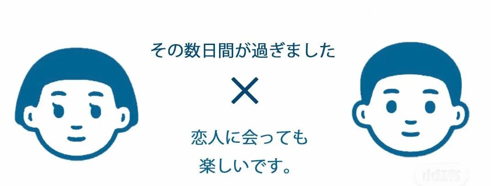

#关于尝试

1.来自2008年哈佛校长致辞

我听过你们谈论未来，知道你们的烦恼。我也知道你们担心收入，担心职业选择，担心人生的意义能不能实现。我要对你说的是，只有试过了才知道。不论是绘画、生物还是金融，如果你不去尝试做你喜欢做的事，如果你不去追求你认为最有意义的东西，你会后悔的。

人生的路很长，总有时间去实施备选方案，但不要一开始就退而求其次。

其实，一个人年纪轻轻的时候，是没有什么标准答案的。在五花八门的选择背后，往往只有一个真相，那就是“试试”二字”。

**#关于世俗的成功**

“世俗的成功给人自由，就是给人不被他人的说教所影响的自由。”

**#关于诗和远方**

诗不只是在远方，眼前也不只是有苟且。

因为在你苟且的时候，你心中尚存的不满，就是你眼前的第一行诗。

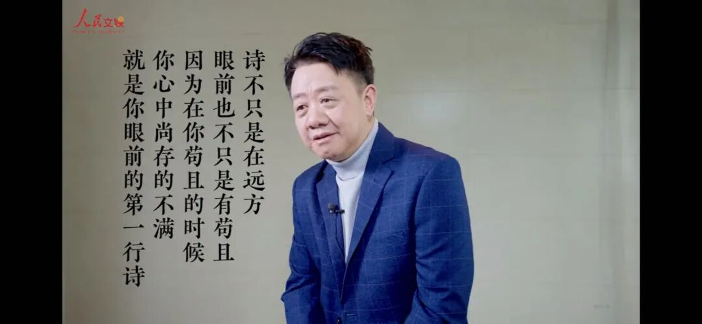

**#关于顺路这个概念 来自吴燕学姐的分享**

我很喜欢顺路这个概念，我们一同坐上了一辆顺风车。过程中有人上车了，有人下车了，有时候车坏了，有时候失去方向了，我们各自去了不同的目的地，但是我们共同分享过一段，顺路的旅程。

**#关于思考和行动 来自某博主**

罗翔老师说，人最大的痛苦，就是无法跨越「知道」和「做到」的鸿沟。

像笛卡尔所说的“我思故我在”，这句话是对的，思考是对的，但也很容易让我们沉浸于一种幻想之中——仿佛我只要思考到了，我就能做到，但其实不是这样。思想过说过深刻的东西，你为你自己所说的感动了，你就真的以为自己做到了，很大时候这是一种自欺。

就像我也经常在微博分享我的观点我的思考，会得到一些共鸣，但我自己能不能做到，我必须得承认我不敢自欺。同理，不管什么“至理名言”，都辩证的去看，道理说出来自然是很有道理，但是他们所教的，自己也不一定做得到。这种冲突就是，讲道理的人可能也在自我麻醉、自我欺骗。

活的清澈，上善若水任方圆，世间无几。

那就像罗翔老师说的“只能是你的行动，在你的言语之前，能够多那么一步”。所以你们也不要给予我或者其他博主任何光环，都只是在蹒跚学步，我只是废话比较多而已，是跟大家一起摸索成长啦。

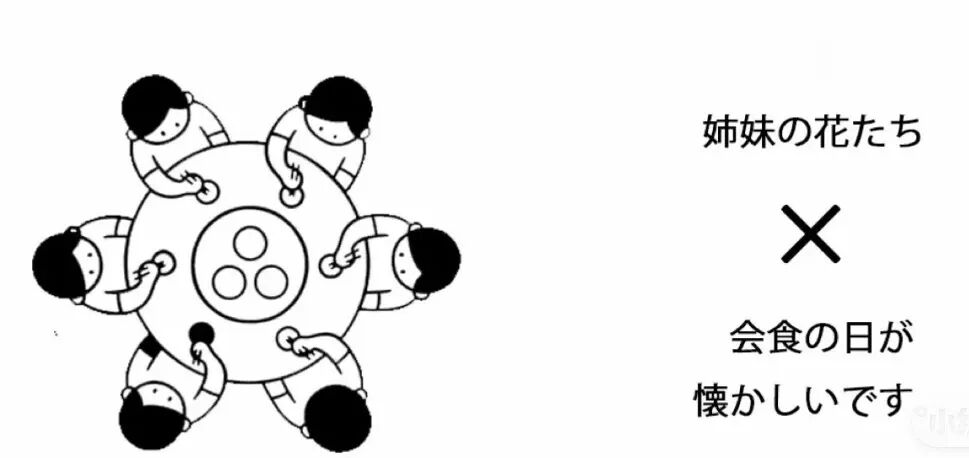

**#关于文学 来自某条热搜“我们为什么需要文学”**“如果我们生命中的某一瞬间可以向文学敞开，那我们所感到的那种破碎和孤独感，它就很可能得到陪伴，同时得到消解。”

贾平凹曾言：读书能使人识天地之大，能晓人生之难，有自知之明，有预料之先，不为苦而悲，不受宠而欢，寂寞的不寂寞，孤单的不孤单，所以绝权欲，弃浮华，潇洒达观，与嚣烦尘世而自尊自重，自强自立，不卑不畏，不俗不谄。

**#关于自己/成长**

1.自己这个东西，一开始是看不见的，你只有用它去碰撞了其他的东西，甚至是那些很强大，很可怕的东西，反弹回来，你才知道自己是什么样的。

——山本耀司

2. 来自知乎某鸡汤

我知道我值得那些更好的，也一定会付出与它相匹配的努力。

3.来自RJ分享的某张图片

好像憋着一口气在水里拼命往前游，抬头浮出水面，突然发现今年只剩几天就要结束了。

如果你问我，幸福对于现阶段的我来说是什么，我觉得，幸福是身体与心灵的同步，能够安住在眼前这一刻，不过在过去，也不活在未来。

别去纠结你是怎么走到这里的，你已经到这儿了，把脚下的路走好，就能抵达明天。

前行的路途中，愿我们都能认出自己。

4.来自阿詹的某条微博

但有许多感觉，好像永远变了。

那种完全沉醉在情节里，随着跌宕起伏的感觉没有了。其实现在看电子书里大家点评，比以前看评点本老先生们的点评，还有意思得多。但也和大家一样，开始觉得许多情节仿佛不合逻辑不合情理，要推敲一番，甚至查点资料。但如果看到了差评，又忍不住要在心里替老爷子辩护一番。

还有的地方，明显是新版里改过的，就要在心里和旧版拉扯一番。

如此，虽然还是读得停不下来，那个武侠的世界，就好像再不能进去了。

而且也不觉得那个世界快意了，只看到每个人都各有些奇怪的偏执和纠结，要么踏着命运的陷阱，要么背着命运的重压。

爱恨也不分明了，反派的死也不那么爽了，误会被解开不那么全身舒服了，两个人言归于好也不那么完满了。

以前看人物犹豫，简直心急如焚，恨他们不能早下决断，现在只觉得，这太难了，怎么都是错，拖延太正常了。

在路上阳光明媚，看的还正是初逢，没本事不忧虑无芥蒂，读到回来，读到半夜，就是误会过后，主角和配角付出了巨大牺牲，但也回不去了。

最可怕的是，没有那么好看了。生活里只要一想到就很快乐的事，就又少了一件了。

以前读完一部，总是睡不着，还心潮澎湃。现在也是睡不着，觉得有些无聊。。。

小时候，最怕去哪里旅游，怀着好大的期待，到了一看，未免“原来不过如此”。

更可怕还是，一个地方，记忆中非常美的，隔了几年兴冲冲带了朋友去看，发现原来，竟然不过如此。

原来读书也是这样。

快告诉我这是见山不是山的人生阶段，那种熟悉的感觉还会回来的。

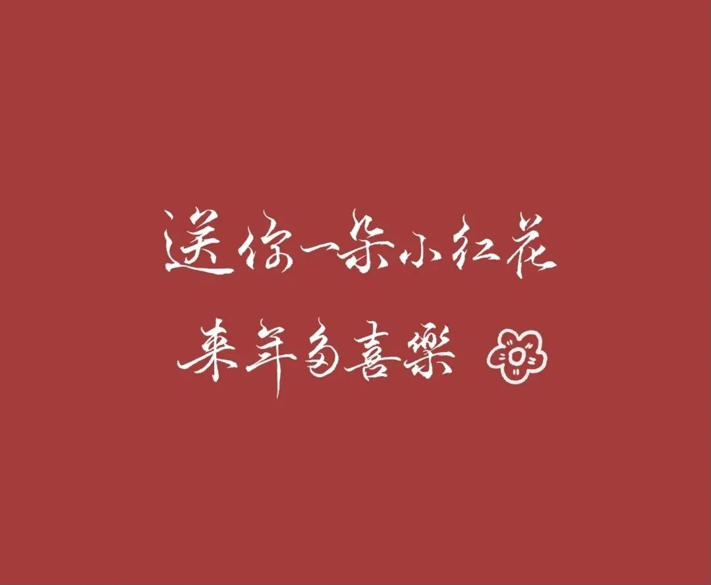

**#关于家人 来自微博**
不知道你们有没有过这样的体验。

放学后和朋友结伴回家 一到家 就听到妈妈把菜放进油锅里的滋滋声。

看你回来 围着围裙的妈妈从厨房里探出头 提醒你要先洗手。你急匆匆的 不管不顾。书包随意地丢到一边 就瘫坐在了沙发上。

桌面上有一份当地的报纸 书包里有几张未写的试卷。彼时的爸妈尚且年轻 你亦没什么忧愁 就算过几天要月考也丝毫不慌张。

每天回家都能吃到热气腾腾的饭 会因为今天家里来客人妈妈炸了鸡翅而开心很久。

后来的你长大 离开了家。父母逐渐苍老 你不再是那个会骗妈妈说要查资料而偷偷上网的小孩 如今的你有了24h自由上网的时间 也很难再有机会在妈妈炸鸡翅的时候在一旁偷吃。

你离家越来越远 可能也想过要闯出一片天 幻想过拥有自己的房子、自己的空间 但偶尔迷茫、沮丧、失落的时候回想 也还是觉得那个时候是真的很好 尚在年少。

我还记得那种感觉：四五点太阳还未落山的时候 金光灿灿的世界。它们就像是年少的缩影 印在名为过去的明信片上 永远发着光。

**#关于年终总结/过年/记录**

1. “我突然明白，或许，不管是文字还是图片，或者是其他的一些什么，只要你用某种方式把那些东西记下来，他们就成为你的一部分，你们就成了互相陪伴的状态。陪伴这种东西，你很难说清楚它到底是什么，甚至很多时候你对他不以为意。可是在某个时刻、某些特殊的时间点，你会忽然感受到它的力量。”

我们始终期待着这样特殊的时刻到来，甚至是憧憬。

就像每年我们都会期待新的一年一样。

因为未知，所以期待。

2. 来自《作为写作的阅读》

写作是你给予自己的一系列许可，让自己以某些方式表达、发明、跳跃、飞行。跌落。寻找具有你自己特色的叙述和坚持；即是说，寻找你自己的内心自由。既严格，又不对自己太苛刻。

3.来自某博主

对个人来说，年终总结还是挺有意义的。

因为每到总结的时候就会发现——一些当时觉得很大的事，其实根本不值一提；某些当时觉得微不足道的细节，却产生了长远的影响。

复盘总结做的越多，越会发现，人的日常生活感受往往困于眼前，囿于感性；我总是不自觉地在一些意义不大的细节上消耗过多精力和情绪；被视觉，听觉，和激素所支配；而忘记长远规划，忽视“看起来不明显的”关键问题。

生活是具体的，但理性应该从具体的细节中抽离出来。这是年终总结的意义。

4.来自《如此可爱的我们》

“过年的意义，从上古绵延至今，就像烟花一样耀眼着，闪耀着，给予我们无数次治愈彼此的勇气，然后重新出发。吃不到热腾腾的饭菜没关系，对连里藏着秘密。你也许不知道没关系，偶尔听听唠叨也没关系。即使在路上，我们还是会回到熟悉的家啊。”

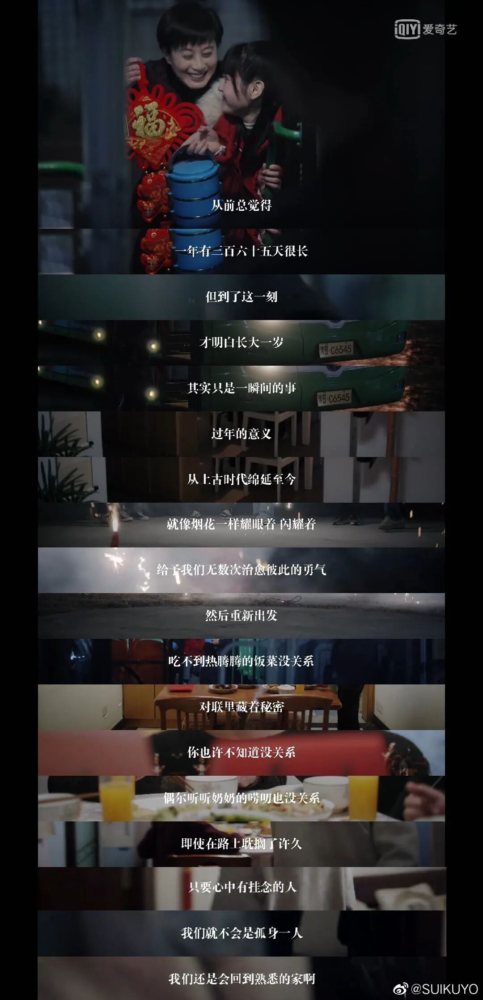

最后存一波祝福，嘿我永远爱你们呀！

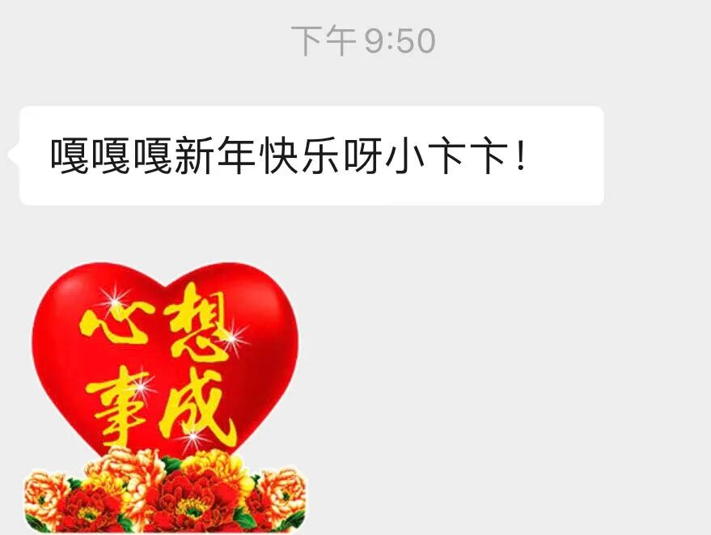

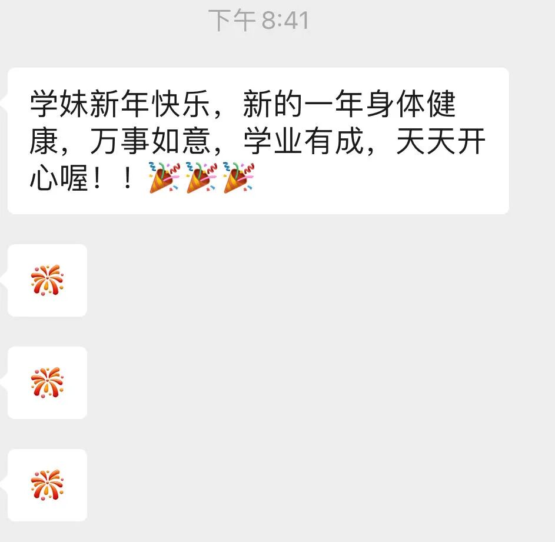

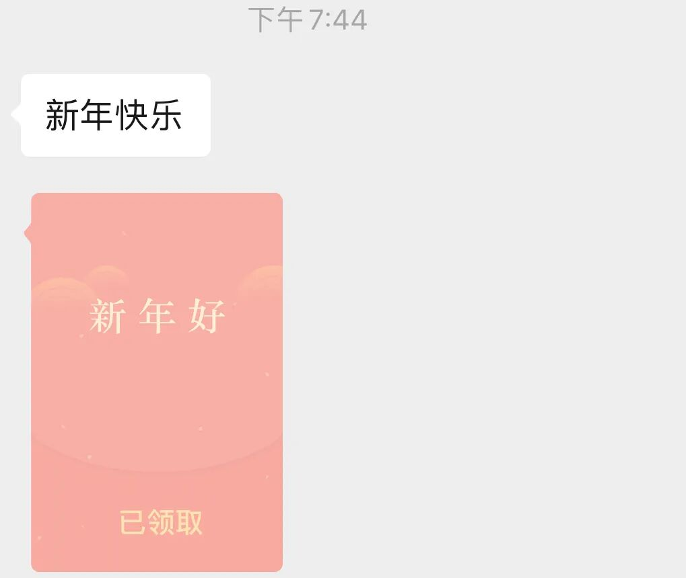

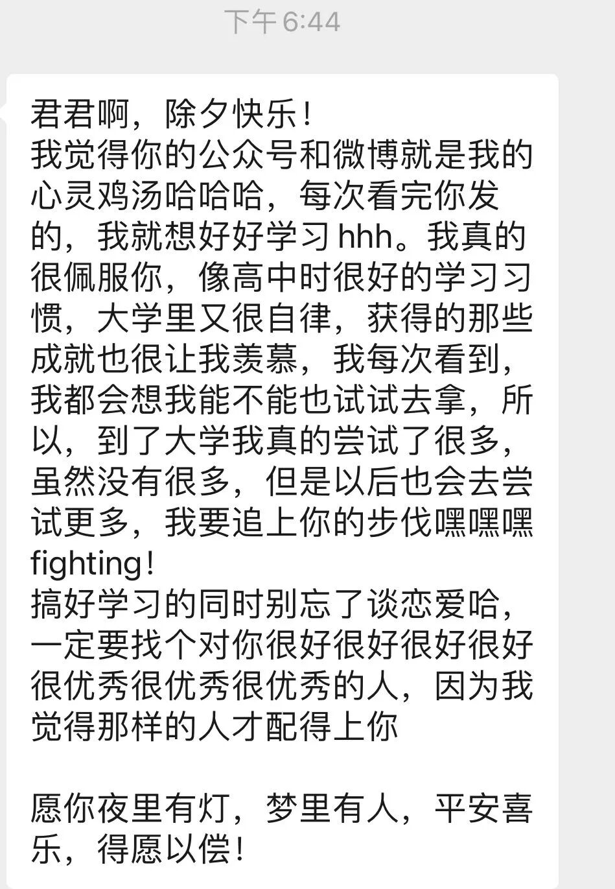

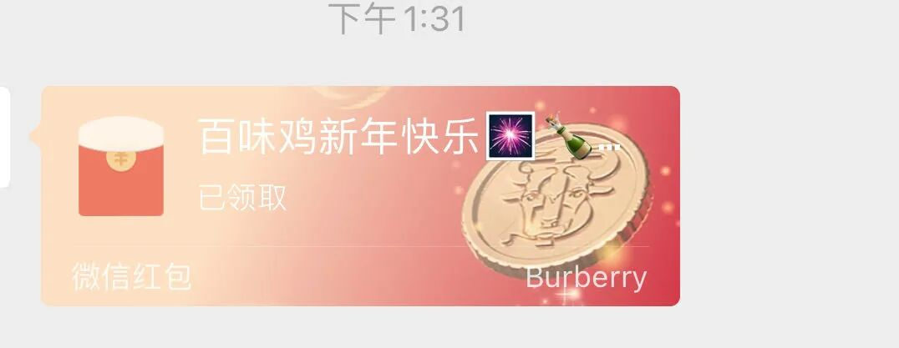

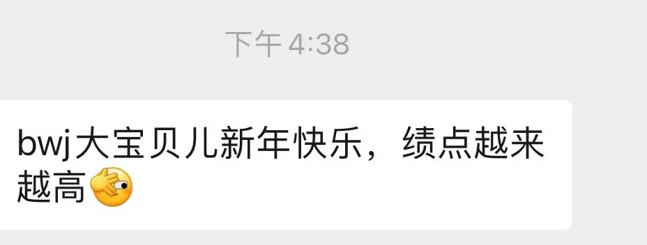

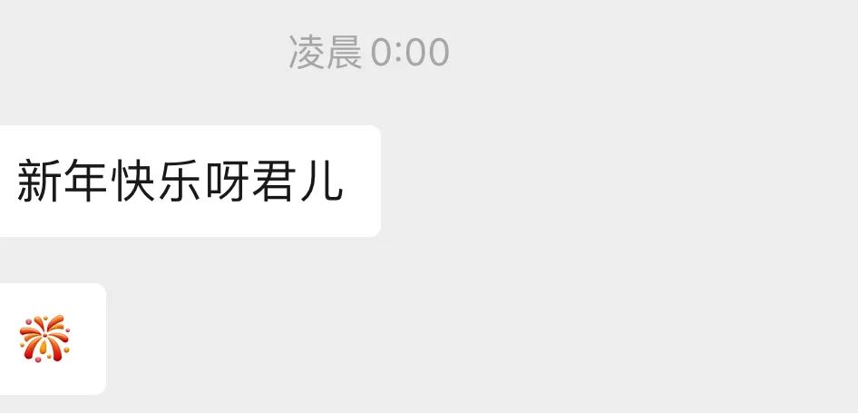

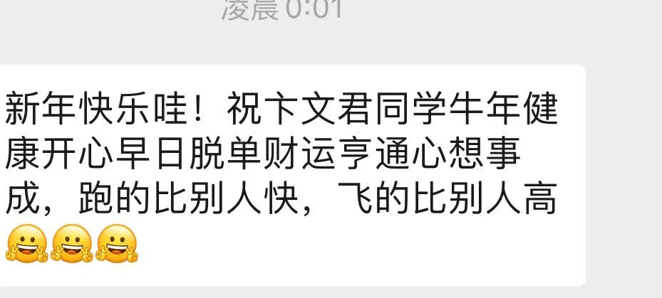

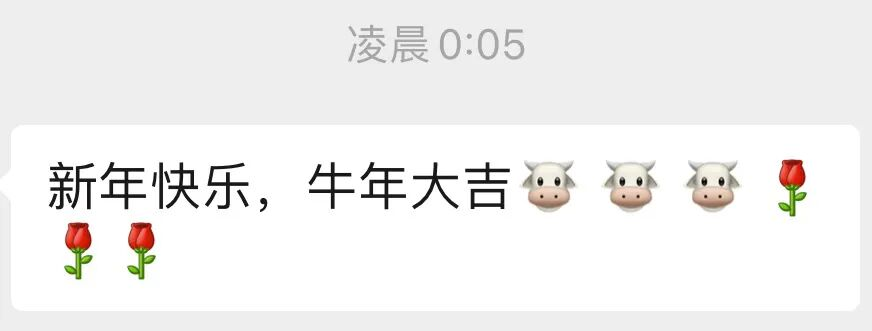

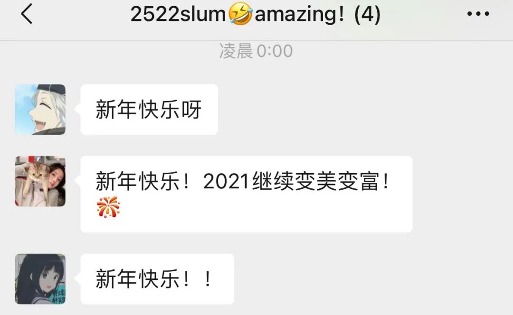

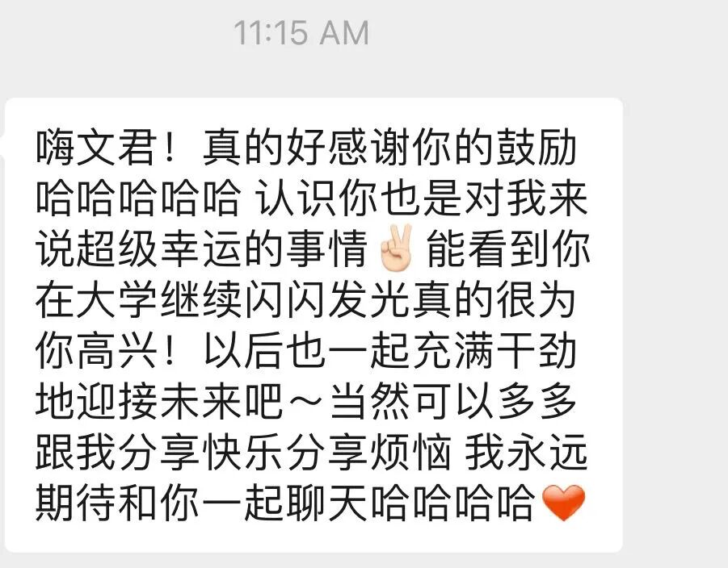

耶嘿！新年快乐！

要清醒又快乐的长大呀！

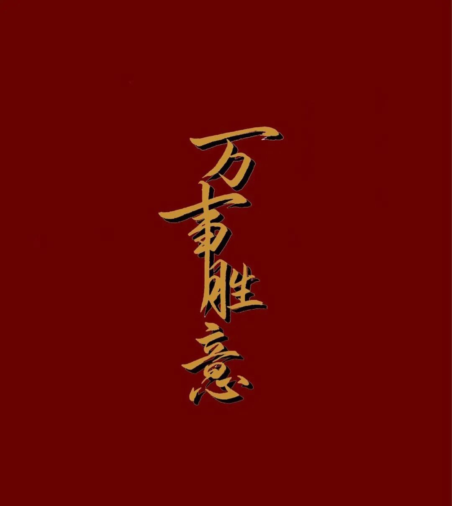

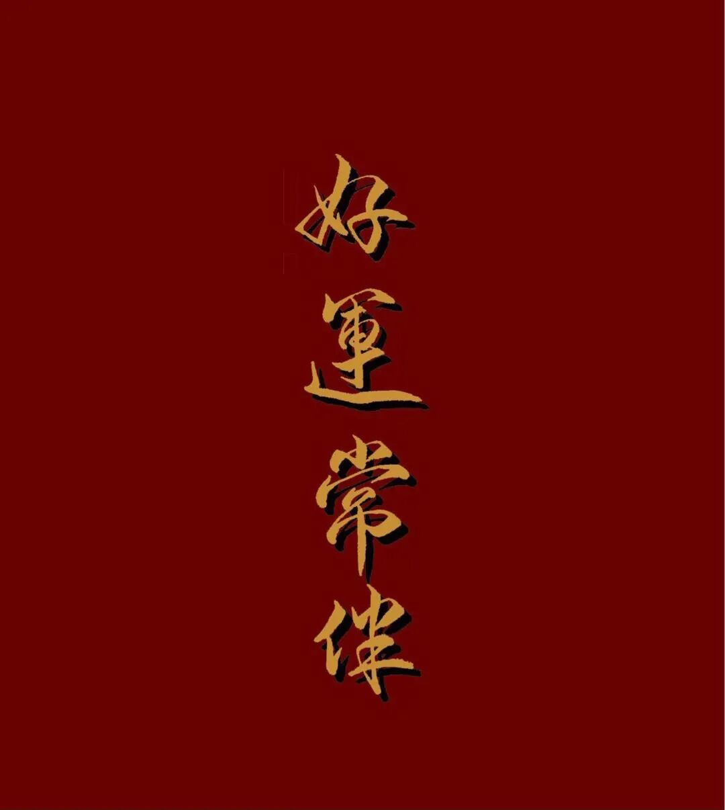
