**share

to you**

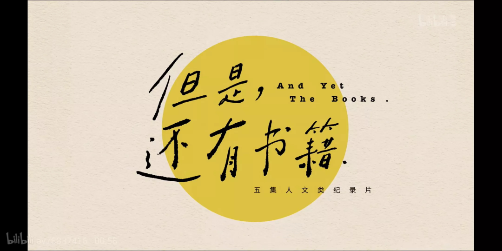

还有没有看纪录片了。以前我总觉得，纪录片是沉重而遥远的。

看《人生第一次》从第一集就开始爆哭，看《人间世》总是需要一份特殊的心情，《派出所的故事》没有周世奇马晓亮就觉得有些无聊🥱

或者就是承载着厚重底蕴的关于国宝、建筑等等，以我的境界无法耐着性子看完、却反复出现在以前作文里的纪录片。

直到最近看了许多纪录片分享，才知道现在有非常多真情实感、贴近生活的优秀纪录片值得去看。

而看纪录片带来的心灵的沉静和澄净，并不亚于读书。

更何况，这还是一部关于书籍的纪录片：）

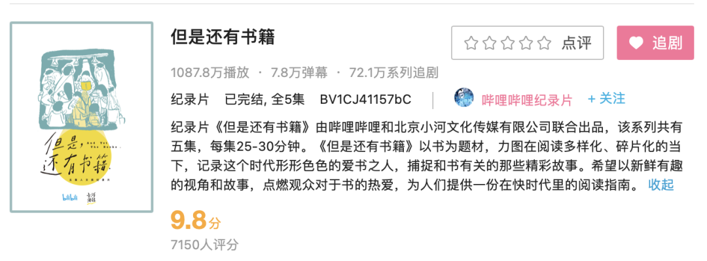

整部纪录片很短，一开始看得入迷，只想继续看下去。

后来看得不舍，5集就这么快结束了。

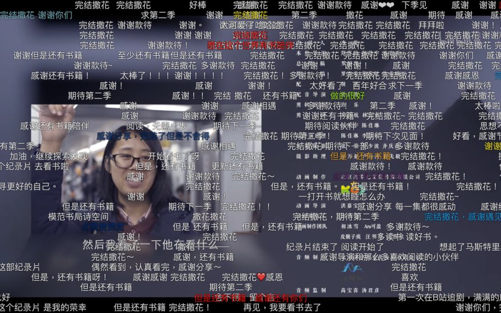

它讲述的不是传统意义上关于“多读书 读好书”的倡导，而是带我们探索书籍背后的那些人和故事。

第一集讲编辑、译者。

他们穿梭于字里行间，钻研着逗号、句号的学问；他们以敏锐的眼光，探寻文学的矿脉；他们以细微琐碎的工作，搭建起跨越语言的桥梁。摆渡于作者和读者之间，编织着航行于浩瀚文海中的思想之舟。

当说着优雅流利的西班牙语的范晔说起自己翻译《百年孤独》的经历时，我按了暂停键，去书柜里找出了百年孤独。

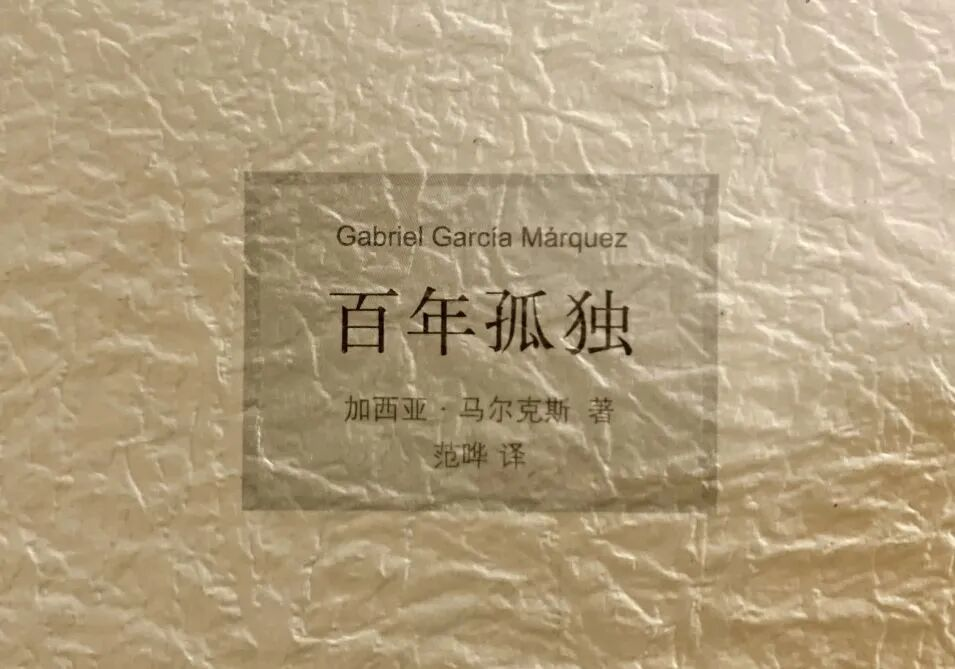

当看到翻译里真的是范晔的名字时，真是一种奇妙的被“connect”的感觉。

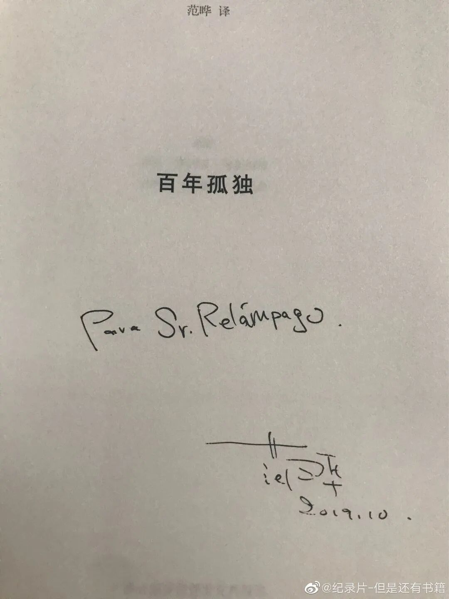

而看着俞国林整理编辑古籍，用13年整理郑天庭的日记还原西南联大的li shi ，则是“今人不见古时月，今月曾经照古人”之感。

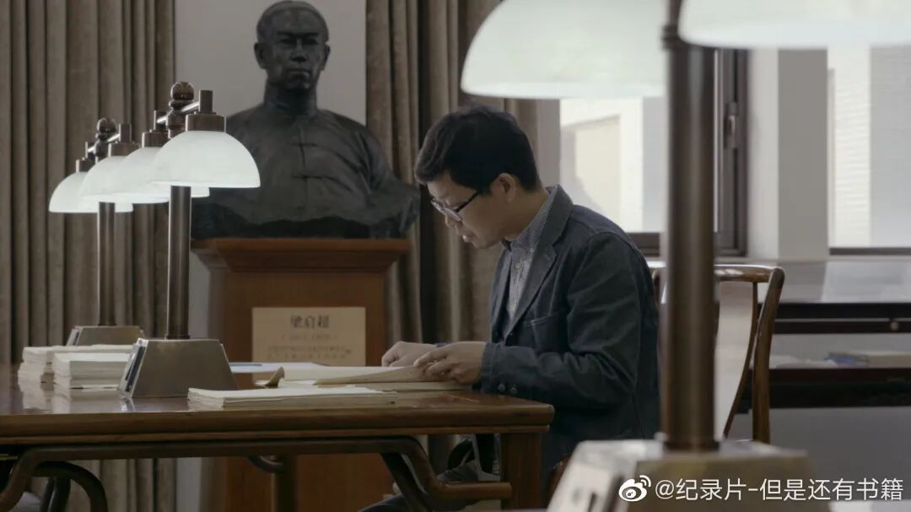

“虽然做的一向是为他人做嫁衣的工作，但当他们，以细小而绵密的针脚，连缀起那些被岁月尘封的文献，为读者编织出一条条通往前人思想的小舟，便是作为编辑的高光时刻。”第二集讲的是二手书的故事。

以前买二手书，只是图它价格便宜。而看了书籍的流转和店主们的经历，倒真是觉得二手书有它独特的风味。

二手书最有意思的地方，不仅在于精美、稀有，更在于念念不忘之后的必有回响。他们兜兜转转，几易其主，带着不同的记忆与故事，来到了藏书家的书房。当你捧起它时，书本身拥有一个故事，写书的人有一个故事，书的流转又是一个故事。

最感动的是店主lulu和蜗牛的故事。

“开一辆书车 行走中国”的经历竟然真实存在着。

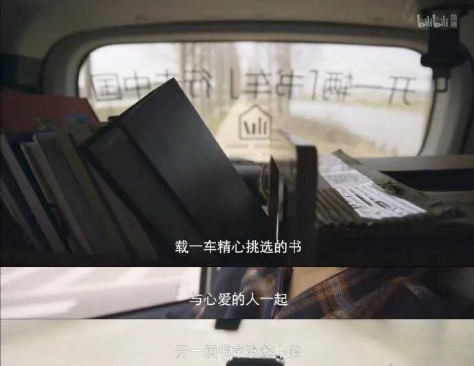

菜市场门口、村庄里、单位前...他们支起小小的摊位，让忙碌的人们重拾读书的感动。

“不买也没关系，看看不要钱。“

”书希望它被读。”

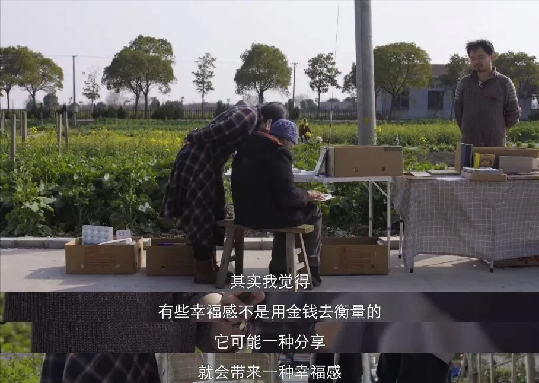

第三集讲的是绘本。

蔡皋奶奶的绘本，和我小时候看的那些绘本风格并不相同。是那种我小时候一定欣赏不来、耐不下性子读的风格。即使是现在的我也需要一番品味才能看懂的深意。

她以继承自民间艺术，艳丽、丰富、变形和夸张的技法，描绘民间鲜活蓬勃的生命力。

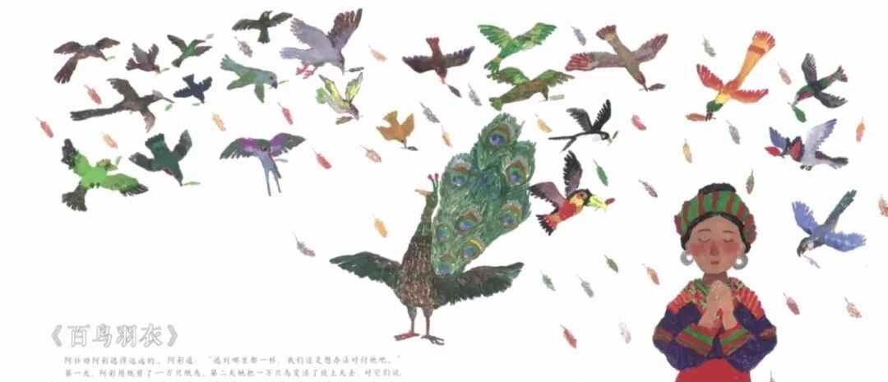

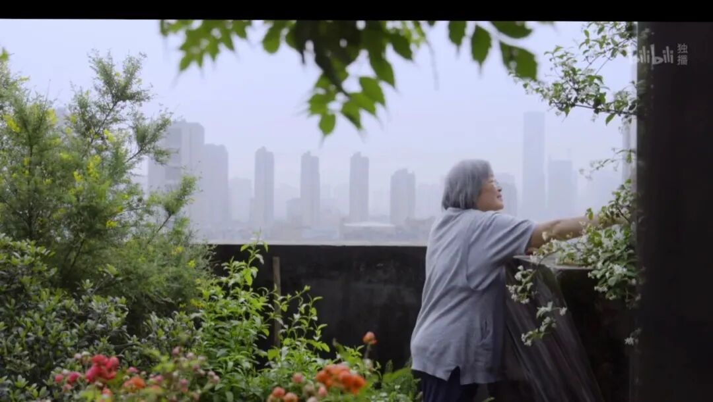

蔡皋奶奶还有一个在楼顶的小院子 真羡慕呀

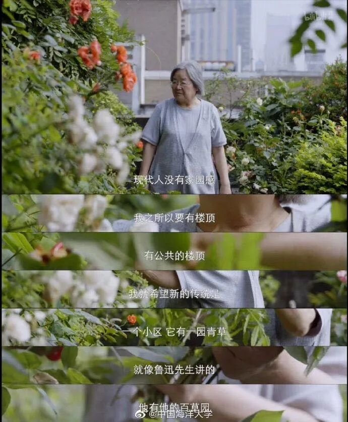

还有这集结尾的一段话：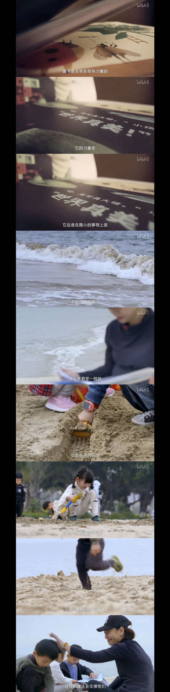

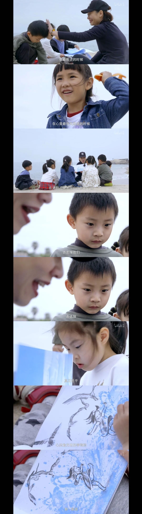

第四集讲的是书籍设计。
以前从不在意书籍设计，关注的是内容或是豆瓣评分。

而封面的设计，却需要设计者通读全书，了解作者，了解那个时代，绝不仅仅是对于四五个字的设计。

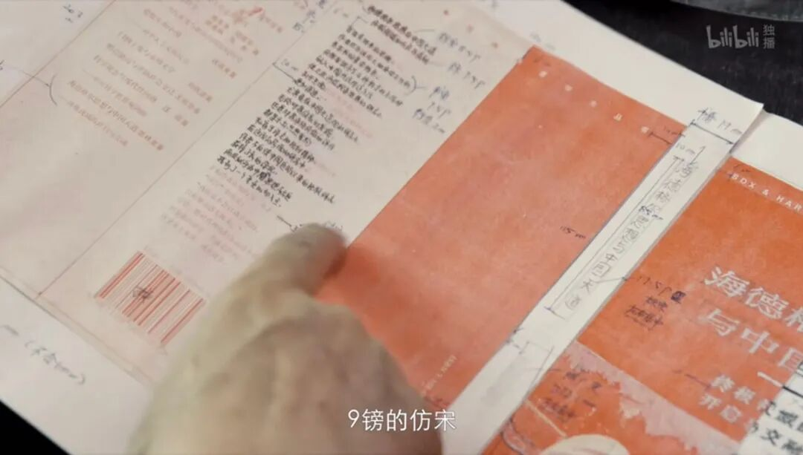

从内容中来的设计往往谦卑内敛，不动声色。但细看之下，总能发现隽永的情感与深邃的思想，都统统锁在那方寸之间。

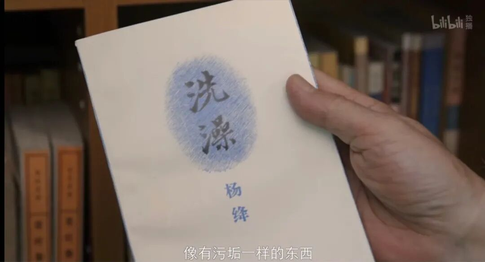

第五集讲的是如今的阅读。地铁上的读书人，是陌生人间早高峰晚高峰的彼此陪伴。

堵车路上的书籍讲解，缺少点逻辑，却迸发了更多的火花。

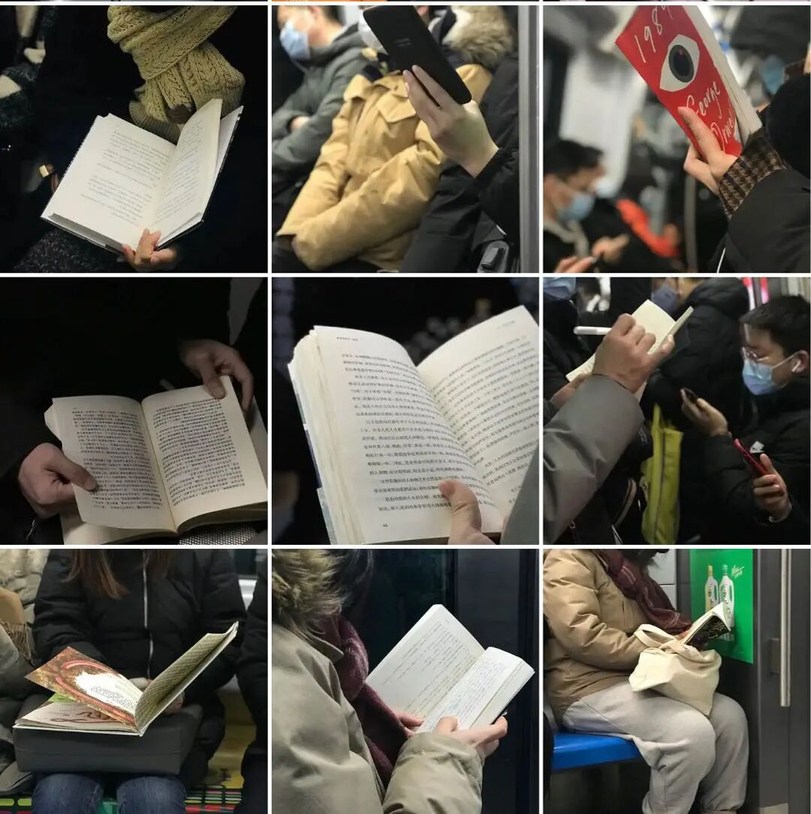

整部纪录片除了内容独特优质之外，老胡巨好听的配音（由姜广涛指导 且两人均未收取任何费用）、灵动、贴切的动画都是亮点。

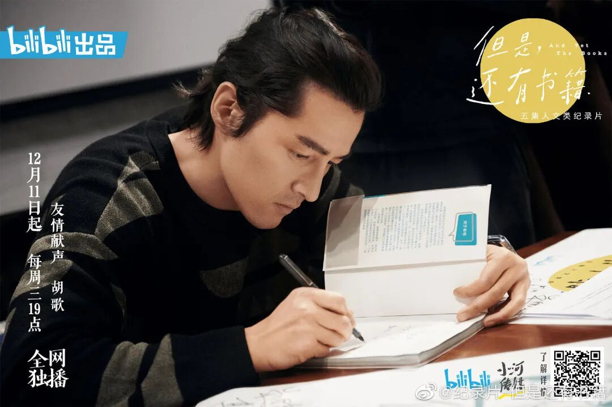

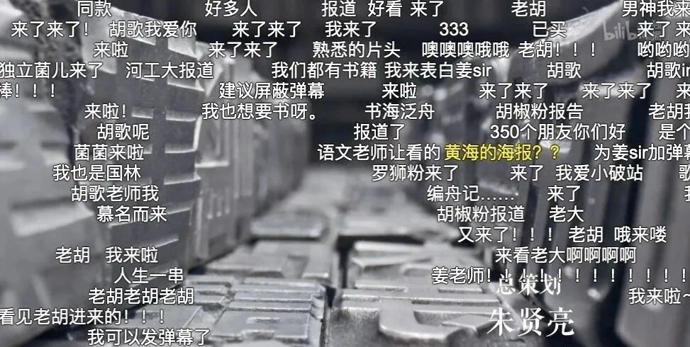

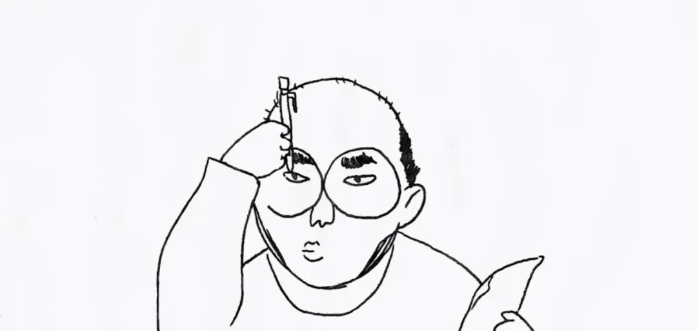

但是 还有书籍这个“但是”，折射了许多当下的语境。

生活真苦        但是 还有书籍

假期真无聊     但是 还有书籍

聊天真尬         但是 还有书籍

思想无比贫瘠 但是 还有书籍

还有很多搞不清楚的事情 但是 还有书籍

幸好 还有书籍。

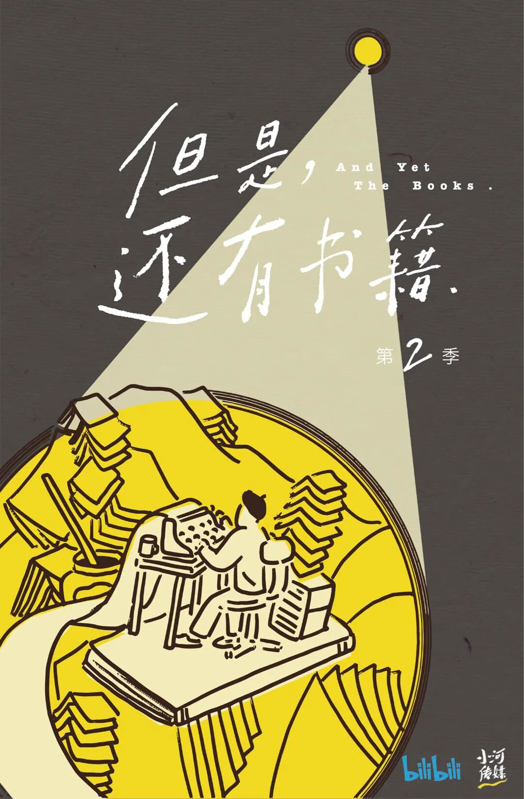

看到官博还有第二季 真不错👍
