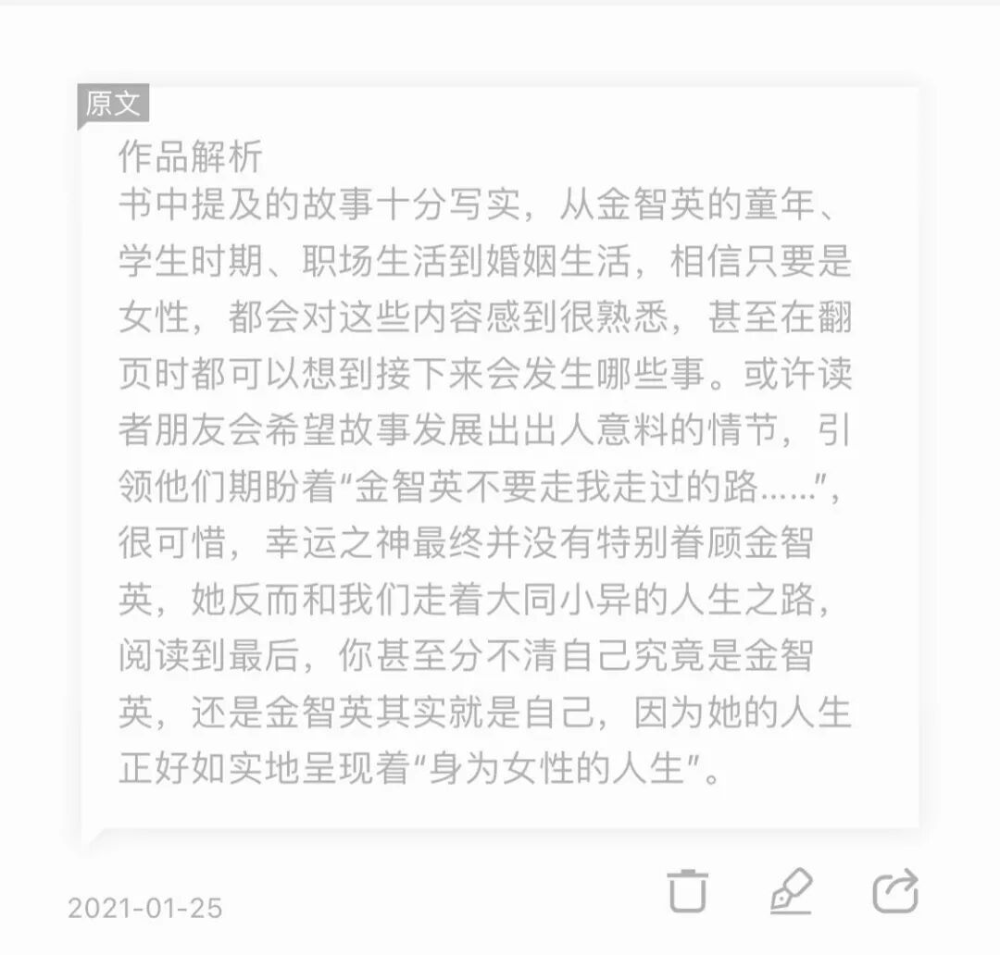
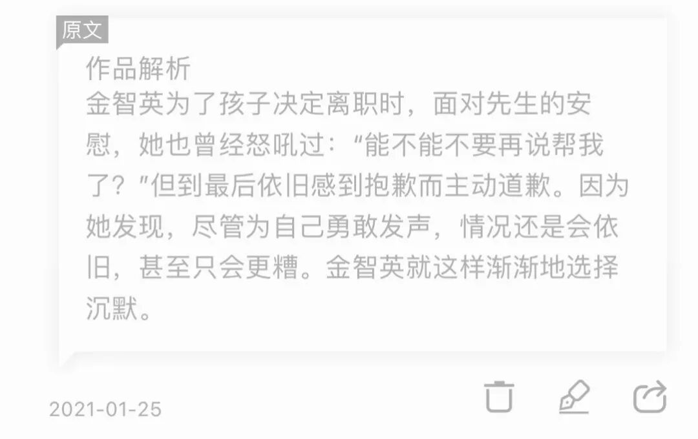
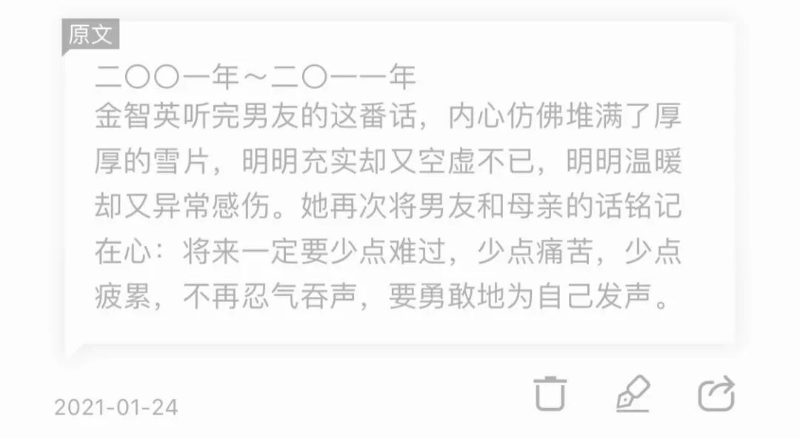
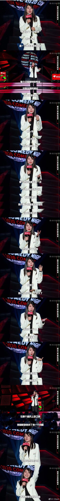

书写的平淡 写的真实 一度分不清这究竟是小说还是咨询师的来访日记。

而这样的题材，过多评论无益，在强化观念的方面，这本书已经做的够好了。读那些细节，感知金智英的隐忍、无奈，然后再联系现实。

有个谚语叫"elephant in the room”，意思是说对于一些十分显而易见的问题和现象，人们却往往视而不见。

许多看到"大象"的人因为在很大程度上他们就是获利者，所以在他们看来"大象"便会显得如此自然而然，一旦人们对其产生质疑或批评，反而会受到他们的侮辱与禁止。

那就说到这里吧。再记录一些看书时划下的句子：

from 后记 概括得真好

这是结婚后的金智英选择的沉默。

可她年轻时是这样希望将来的自己的啊。

"就是不要因为我们身为女性,而对我们作出评价,而是希望社会给予我们的评价与我们的性别无关，只是把我们当成一个实实在在的人。每个人都会有自己想要成为的样子，希望每一个女性都可以在一个无关性别的条件下成为自己想成为的样子，那就是最好的样子。”

这是作者赵南柱的话。

于是我又想起杨笠的这个段子：

“Feminism is not about man hate.

If you believe in equality, you are a feminist.”

用Emma watson的话作结

祝你永远自由。
