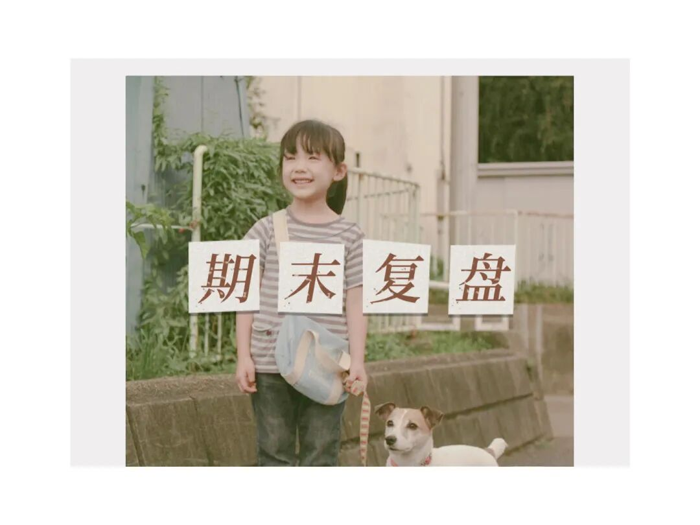
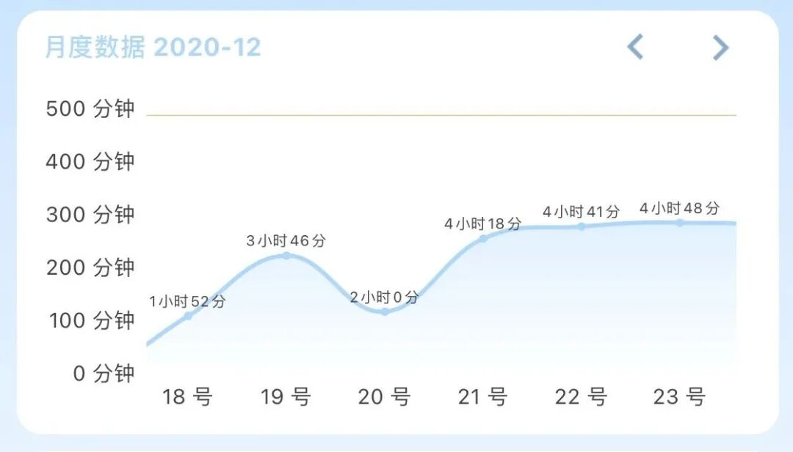
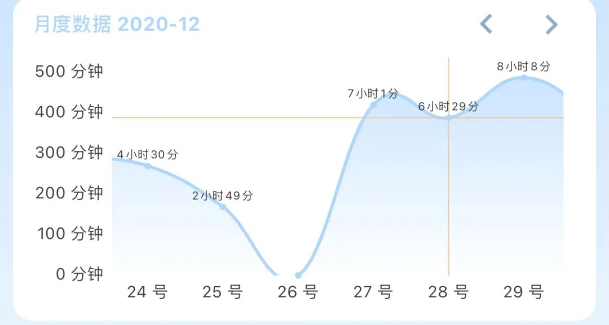
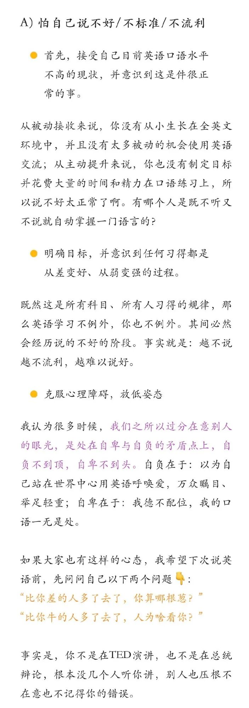
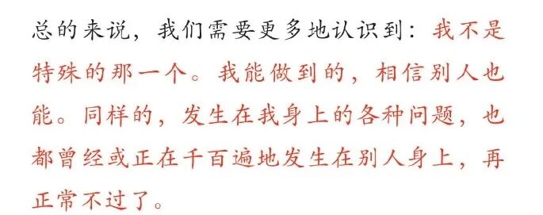
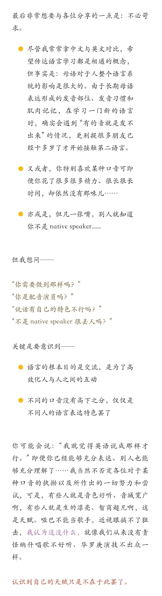
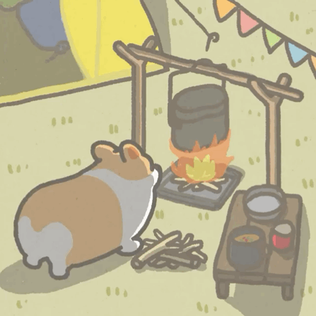
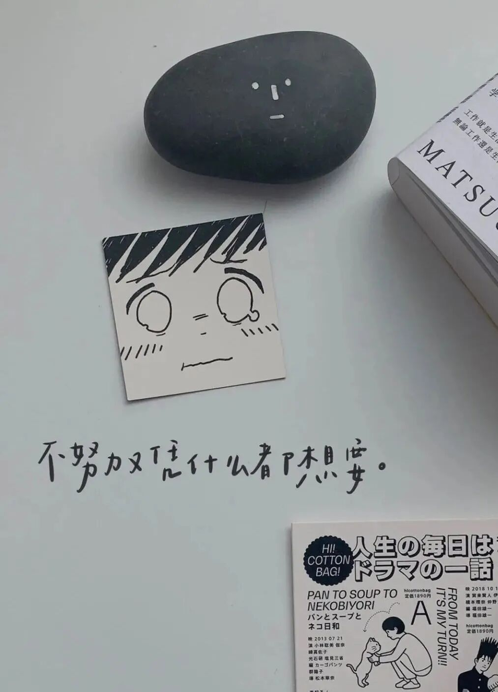

随着期末分数公布完毕、在家做five的日子开始变得无聊，突然就想来复盘一下大二上的期末了🤔

毕竟这个期末过得坎坎坷坷、飘飘悠悠，有一些复习的好方法，当然还有一些浮躁和焦虑需要去记录。

写给下学期期末周的自己看/也许也能给学弟学妹们大二上的复习提供一些思路

that's it!

翻了翻🍅（每年的期末都是🍅陪伴着我 真是第一个我用了那么久的效率APP）正式的期末复习应该是从17号开始的（英语结课完），一开始每天3-4个小时摸鱼式复习，后来发现这下要完，最后几天只能开始狂肝（下个学期一定不能这么毫无规划…）

25号还快乐过了圣诞🎄 26号还去科巷快乐吃喝了😋

要从何说起呢，那就每一门慢慢说吧。

**生理学**

听课状态：没听啥也没听完全听不懂/实在是讲的太无趣了🥱

复习方法：看白皮背白皮白皮yyds

反思：

1⃣️就算老师非常的无聊课后也应该看网课把没听的知识补上，生理的知识确实是有用的，不应该停留在书本上

2⃣️考前两天竟然还回了趟家吃喝玩乐，简直无法理解当时的自己…

3⃣️老师划掉的知识都会考（巨坑）所以还是把白皮所有的东西都背出来：（

（而且老师出卷的时候完全忘记了我们不是医学生也完全忘记了我们只有11学时所以课上无论讲没讲都会考真的是个巨坑👀）

**思修**

听课状态：只有放视频的时候抬头看看 otherwise低头摸鱼

复习方法：背重点

反思：

1⃣️真的是把重点背了无数遍最后发现真是没太大用一片真心终究是错付了🥱

2⃣️因为没看过题库没看过书所以也不知道考的题目到底是在什么地方的但其实为了这思修也没必要去刷题库过书本啦真的是心中有 love & peace 就够了

3⃣️晚点交卷！能多扯就多扯！大意了again 因为实在是想去喝口渴了的芋泥麻薯奶茶而草草交卷 ）：后悔了10086 and 第一道大题要多留点位置之后还能再加一点上去

**马原**

听课状态：后期才猛然意识到秋菊（掼🥚冠军）的魅力于是和啃婷做作听课然而已经太晚了还是前面的更重要一些

复习方法：题库yyds➕如果老师不划重点就去问其他专业要（很重要！）

反思：

1⃣️重要的思政课还是要好好听的！下学期的毛概一定关掉手机好好听课！

2⃣️题库真是每一套都应该好好看看特别是长得非常像真题的那些

3⃣️复习到后面可以把一些重点易混点和舍友一起抽背有奇效抽的就是考的👍

**英语**

听课状态：倒是真的好好听了

复习方法：考前2天刷一点考试题型

反思：这学期英语高是因为准备大英赛、六级等勉强保留了一些英语的感觉，下学期估计接触英语的机会就少了。英语还是一门功夫在平时的科目（so 寒假不可松懈！）

突然想到这学期上课的时候还挺积极的，一开始回答是因为能加平时分（🙄️就是这么功利），后来有一天英语老师看我们一个个都很困而且都低着头不回答问题时，一改平时温柔的语气，几乎是带着讽刺的说道：

“Somebody always comes to me and asks me how to improve English

I always tell them : just say it !

hey!  just say it and use it !”

而那节课后，我发现只要让手先举起来，让身体动作先于想偷懒的大脑，回答问题也就没那么难了。

and 千万不要有“包袱”

Share 今天刷微博看见的：

**发展心理学**

听课状态：努力听了（实在是太困的时候也确实是扛不住的/关于冬燕女儿的故事倒是都记得很牢

复习方法：照着ppt&书本&老师的重点整理一份完整的复习讲义（这个思路是在b站某学习博主那看到的：不能一本听课笔记一本错题本还有书本和ppt ❌要尽量把所有的东西都集中在一个载体上去复习✅）

反思：

1⃣️课上还是要尽量克服困的专业课的课堂岂能瞌睡😢

2⃣️因为题型非常丰富所以背书的时候每一个细节都不能放过（大段的心理学理论就没必要一字不差但是有些很短小的知识点不应该觉得不重要而忽略

比如考试的时候考了一个自我认知线索是相倚性和特征性这个我每次背书的时候都扫一眼➕理解记忆考试的时候也就有印象了😯oh 所以去理解抽象的概念在说些什么也非常重要死背书是不可的）

3⃣️最最经典的理论的原始模型千万不能忘（比如考试考了一个“海因茨偷药”在不同认知阶段的理解但是我只记了脱离这个故事的概念这个故事根本就没有仔细看过）

4⃣️不要自以为是地划掉自己觉得不重要的点（比如游戏的作用😓）

**实验心理学**

听课状态：认真听的快乐做实验大家一起快乐划水

复习方法：题库+根据重点翻书

反思：

1⃣️考这门的状态简直无力吐槽最后一门无比浮躁考前一天在床上进行了低效率复习（顺便摄入了汉堡蛋挞面包条非常之安逸）非常水的翻了一遍书就去考试了…

所以和之前的复习简直形成了强烈的对比而考完试给我最大的感受还是：抓住细节！

而结合上学期考的近代史，我顿悟：这种在书上划重点的科目最好还是在空闲的时候把重点全都整理出来，否则之后一遍遍看的时候就会把一些细小的知识点跳过（比如考试问的飞行员的注意力是怎么训练的这个是在小标题下面的举例介绍里但是我翻书的时候只粗糙地看了个小标题）

2⃣️题库还是要看的虽然原题不多但至少可以了解到实验心理学出题的方式&把抽象的实验方法放在具体的语境中去思考培养实验思维

最后做一下总结 to下学期的自己：

1.好好听课！如果实在听不下去也应该在这个礼拜及时搜一点网课补上

2.制定阶段性复习计划而不只是每日todo

3.在复习的第一个阶段把各种地方的重点整理到一个载体上后期再在这份载体上进行补充

4.还是继续保持知识输出的好习惯！白天自己复习晚上就可以和舍友们一起挑重点互相抽背互相质疑。

and 一大坨资料to学弟学妹

后台回复“4”即可😄

在看书了在看书了 book思议系列寒假一定要come back！！
