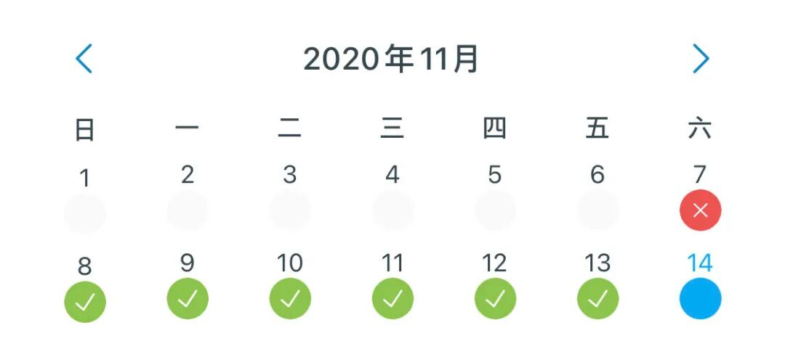
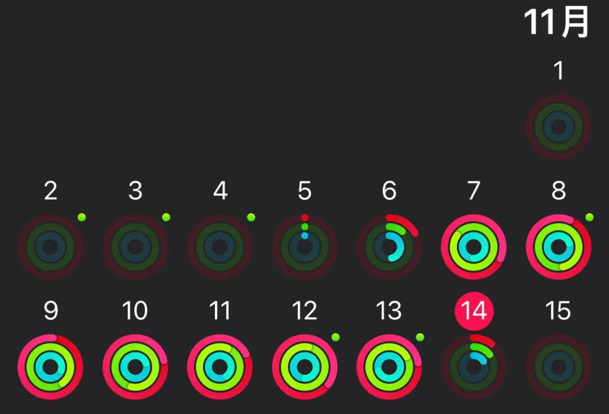
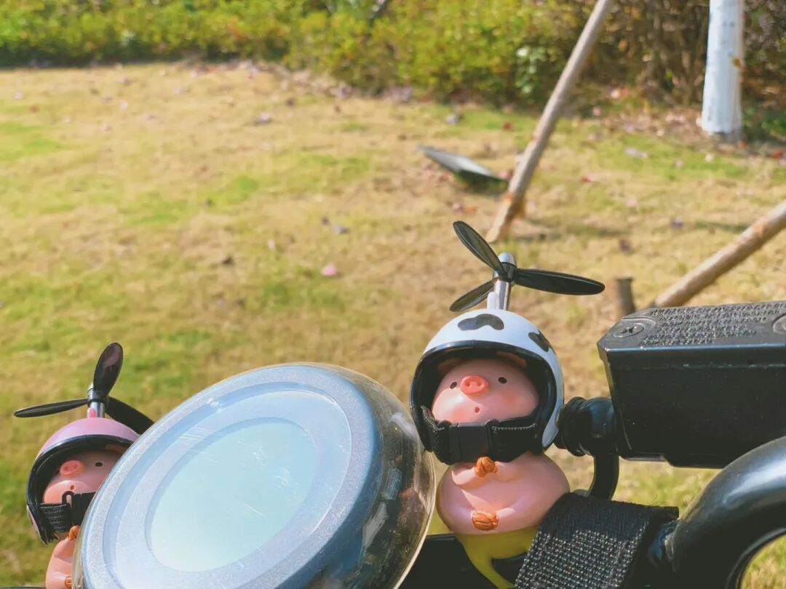
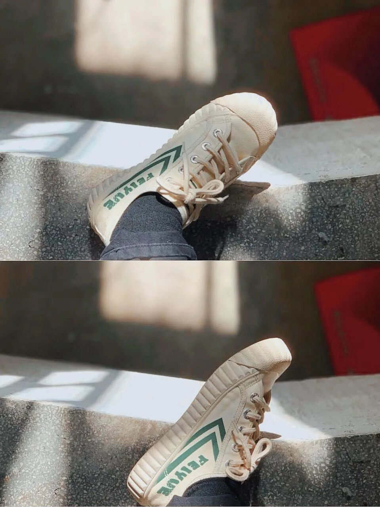
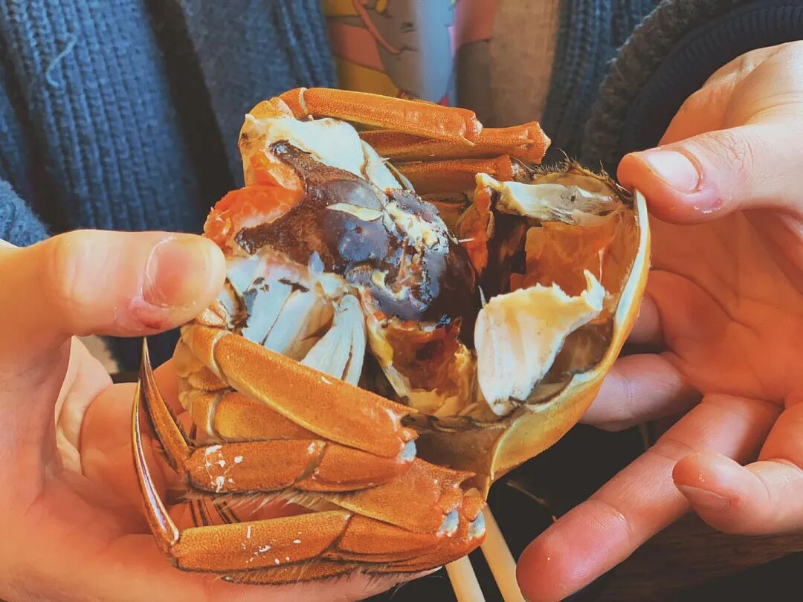

一只百味鸡

week1

快乐减肥

/写在前面

一个神奇的思路

当我把一个事情当成必须坚持的好习惯时，无论列了多少打卡表或是找人监督，必定有一天我会把褶皱的计划表扔掉/苦苦哀求我的监督者放过我-胖就胖吧 快乐最重要🙃。

然而这个学期受实验心理学的影响，突然想到，如果能把一个习惯当成一个变量去控制，加之以实验时间以及寻找一个可观测的因变量加以测量——其实也就是

把对于坚持好习惯的意志力转化成了对于实验研究的严谨态度。

毕竟做实验，固然是不希望实验条件突然发生变化的。

#于是：

实验类型：单被试 前-后测实验研究

自变量:是否在卡路里范围内进行饮食

因变量：体重

实验时间：11.8-11.13 总计6天

实验结果：很佛系地瘦了3斤

很粗糙的实验结果分析：使用YAZIO进行每餐卡路里的计算，坚持6天在推荐范围内饮食，体重即可在6天内有小幅下降，也是一个较为健康的结果。

附件：YAZIO记录图/

apple watch运动圆环记录图

（Ps：运动圆环是三个非常的简单的运动：每天消耗500卡以上&运动30分钟（包括走路）&每天有12个小时中有过站立行为。

in fact 这个并不能算是运动，只要每天我去图书馆＋上课就能够在晚上合上圆环了，所以下周的变量我已经想好了，运动！）

被试采访：

百味鸡表示，oh感觉好极了。

在前一天初步规划一下第二天的饮食，这样就不会临时起意去狂吃/站在人群中呆呆望着食堂的店而不知如何选择——节约时间goodgood；

想喝奶茶就喝，想吃吐司就吃，只要之后吃的热量少一些，控制在卡路里范围内即可

（但是确实没有吃炸鸡了，可能是之前吃的太多了，产生了暂时性的厌恶，一定只是暂时的）

———简直是快乐减肥法，事实上，本实验的目的也并不是减肥，只是训练自己进食的分寸感🤔

/分割线

快速地记录这一周中的某些瞬间

#早起⏰

早起确实快乐——

用手表或手环的震动叫醒自己是比手机闹钟温柔一万倍的选择；

如果在7：30来到食堂就会发现，食堂的玻璃竟然真的有阿姨在天天擦；

如果在7：45到达图书馆的门口就会看到，长长的入馆队伍中的每个人都已经开始了晨读；

而如果这是一个晴天☀️，走在路上感受着并不强的紫外线，脑补着身体里血清素随着阳光照耀而逐渐升高，便会在头脑里蹦出这样有些小学生的、带着一丝矫情做作、却又无比真实的反应当下感受的一句话：

哇 美好的一天开始咯😛

#图书馆📖

比起二楼三楼无比静谧的百人自习室，我更喜欢一楼咖啡厅两侧红色的四角座位。

咖啡机的声音/大厅里压低的读书声/进门学生卡的声音/偶尔有人上下楼的脚步声，反而让我觉得无比安稳；

而说起声音，每次走在外面听到学校对面地铁的声音，我又会在心里矫情又傻气的默念：

oh 这可是从南中医去往南大的地铁/这可是从南大开往南中医的地铁哇。

然后再默默在心里哼一遍当年和sjx听了无数遍的《虎口脱险》里的：

～爱你的每个瞬间，像飞驰而过的地铁～说过不会掉下的泪水～现在沸腾着我的双眼～

然后心里又是一份莫名的安稳；

图书馆的小推车上是大家还回来的书，瞥到一本：

《我想做一个能在你的葬礼上描述你一生的人》

这个题目真是有意思。

（后来发现是本散文集）

#正念🧘‍♀️

非常符合心理学气质的———本周我真的开始练习正念了。

因为手表上的呼吸功能可以有节律进行震动而让我定心的跟着它练习呼吸（but每次我只练习个2分钟，所以仅仅停留在觉得很好玩的境界

也是在听熊浩思辨与创新的网课时听他谈到：

正念就是活在当下，不和过去发生牵绊，不和未来发生交织，我们全然真实地活在当下。

然后回想自己的生活场景：

走在路上想着之后要做些什么吃什么/吃饭的时候刷刷文章和b站/洗澡的时候想想明天还没完成的作业/…

这些场景竟然都那么自然的和过去与未来发生着羁绊，于是突然觉得——oh我可怜的忙碌的大脑呀。

于是开始有意识地去感受自己的每一个步伐/认真品味饭菜 感受舌头和饭菜滋味神奇的触碰

———好处大概是 吃饭变慢了 咀嚼变多了 maybe也是很好的🤔

#一周☁️

于是一周又这么过去。

现在在地铁上即将前往我的亲戚家帮助她继续鼓舞一下他期中考了全校28名的孩子。唉，其实并不知道正确的方法是什么。

上了发展心理学后，知道了人从出生到成人一系列的心理生理成长过程👶：

不经意的意外就会导致关节错位/身体残疾/牙齿畸形/激素水平紊乱/认知障碍/安全感缺失等等，而我若是成为真的成了一个母亲，我又该如何去跟我的孩子解释他身体的变化/男生和女生的差异/如何进行性教育等等。

以前我看着我的亲戚们一个个挤破头把孩子塞进强化班觉得甚是夸张，如今却又觉得，若是作为一个家长，辛辛苦苦帮助孩子度过最脆弱的胎儿期和婴儿期，细心呵护着最终让他们有着正常的身体机能。而当他们的认知开始飞速发展的时候，固然也想让他们接触最好的学习习惯与环境，不敢有半步差错与滞后。

所以到底该如何权衡呢，所以什么才是正确的教育呢。唉，只能继续学习继续领悟了，继续抱持着理解与质疑、体谅与耐心。

家长与孩子之间达成和解本来就需要无比漫长的时间。

写着写着已经到柳州东路了，抬头看一眼地铁里的人，无论是低头玩手机/还是呆呆地望着地铁路线图/还是双手交叉靠着地铁杆子的人，他们都在自己的生活里忙碌的奔走着🚶

我突然想到我该跟我的小表弟说什么了，因为我看着眼前的这些陌生人，想到了高一暑假看心理学有关书籍时头脑里蹦出的那句，可以用蔡康永的腔调说出的：

“就是，你不好奇吗？”

人类太精彩了，一千个人就有一千个行为模式，这太生动了。

小表弟热爱物理，或许我就可以列举一下我仅有的在纪录片或公众号中看到的一些神奇的物理现象，然后再尝试永蔡康永的腔调问他：

“就是，你不好奇吗？”

#anyway

是美好的人间呀！

下周见～

图书馆外面看见的🐷

阴冷的教学楼里给jio晒晒太阳

&我爱飞跃

最后以上周与wej在盒马吃的快乐大闸蟹🦀️结尾😆
