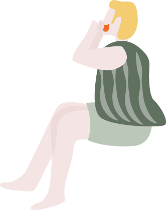
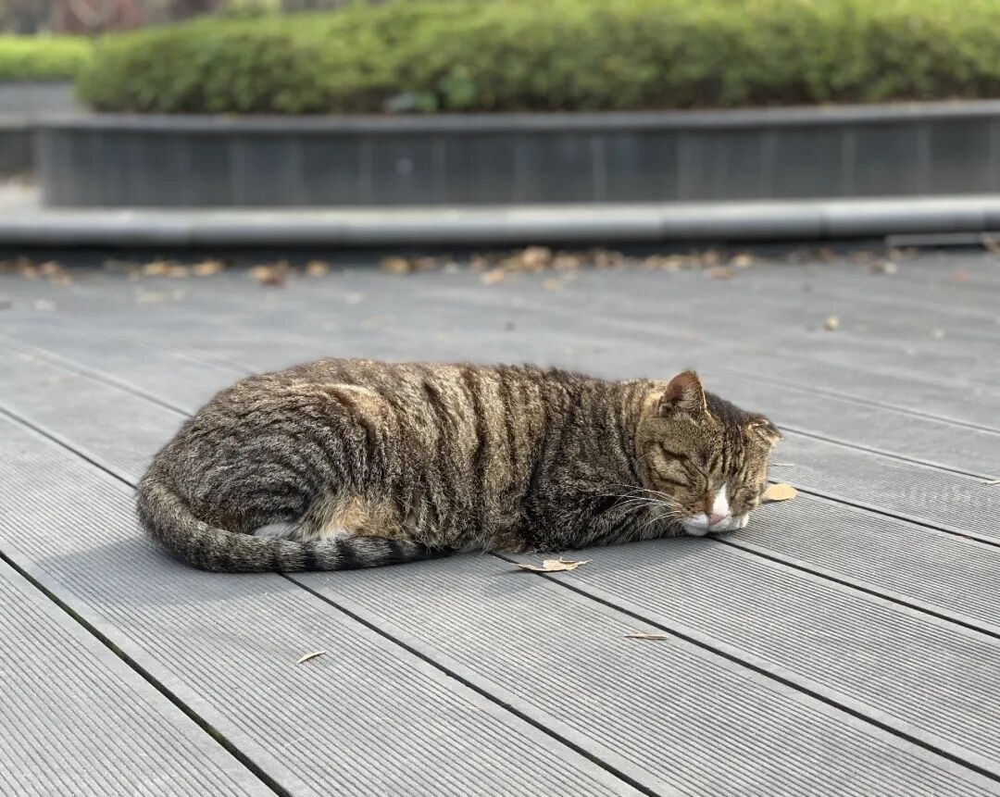
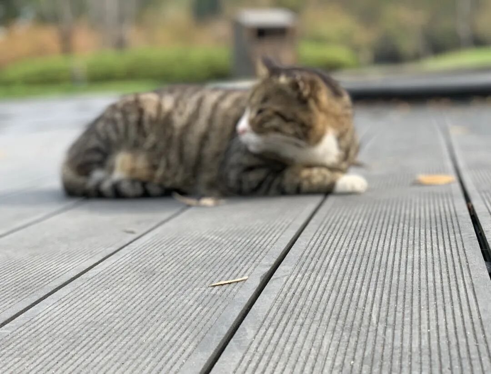
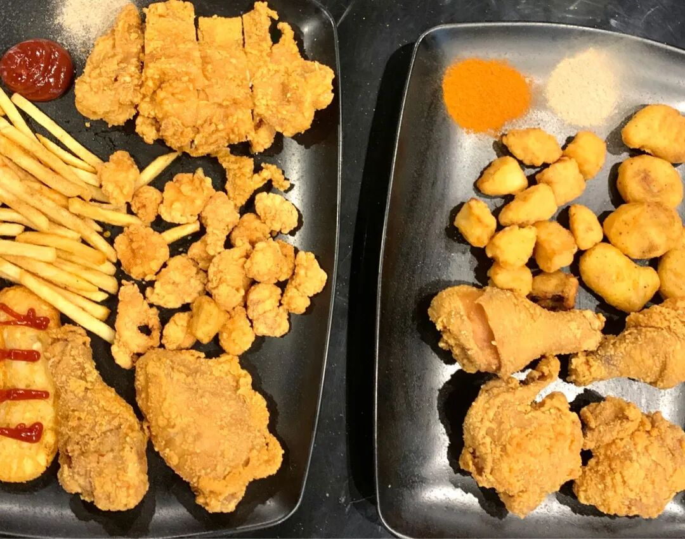
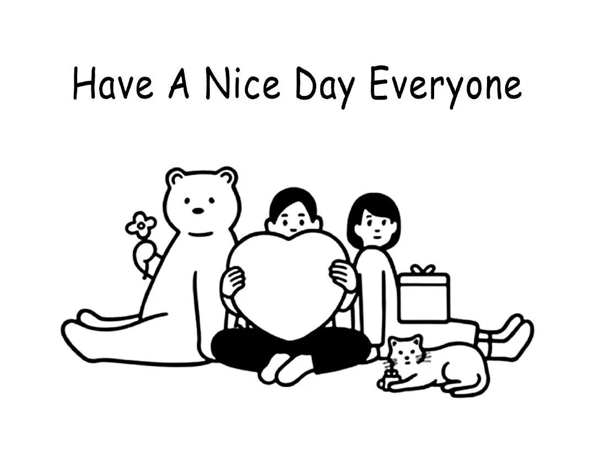
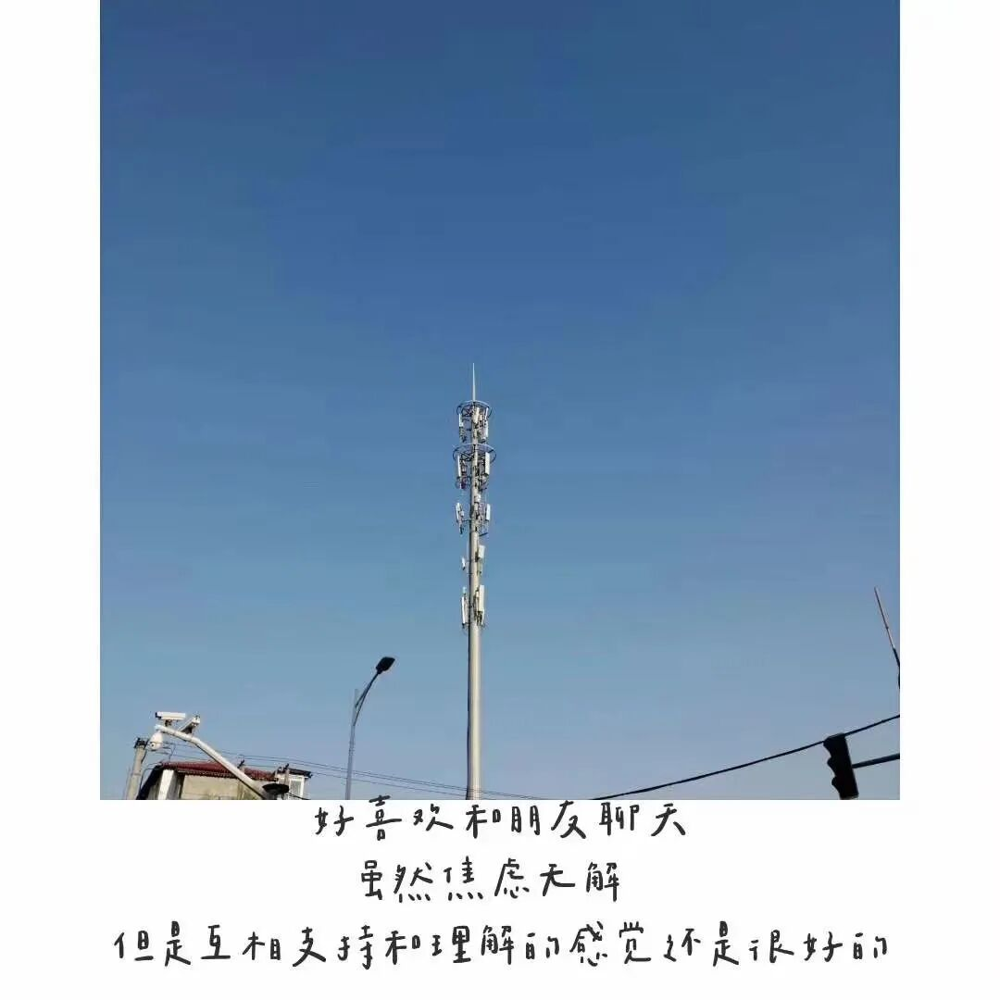
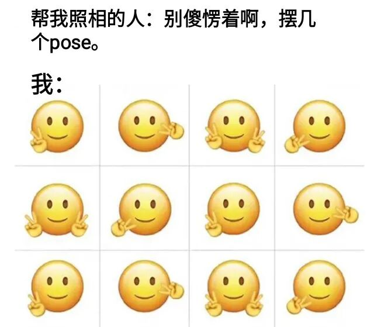
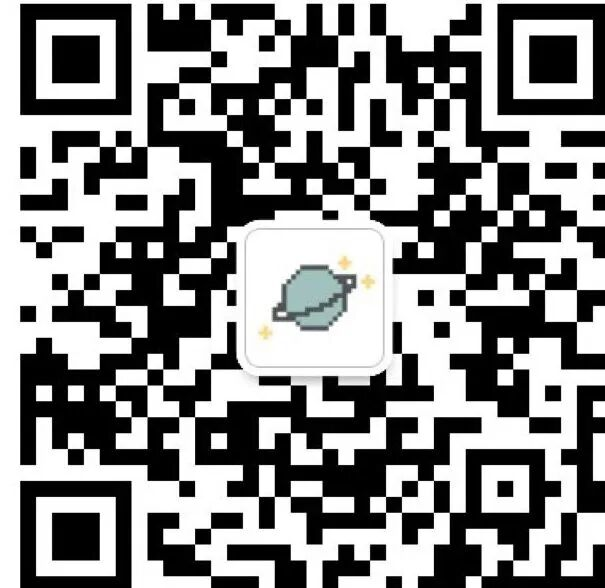

**杂记**

**无聊的碎碎念而已**

#本来晚上想写写无聊的材料/申请一下烦人的pu 然后早早睡觉的。

但是和wej散完步，从一管很缓的坡上慢慢往下走，看看路上的人，看看路灯下的猫猫，想想最近发生的事情，突然就想瞎写点什么。

#本来pu 然后早早睡觉的。

#今天和朋友们一起去会见了一个厉害的南大人。

（所以yy虽然很坏 但他每次都给我推荐非常善良的好兄弟 还是很不错的🤔）

我们像小记者一样问了许多的问题，其实问了一会儿气氛也自然了起来，完全没有菜鸡见大神的尴尬氛围——

其实大家的生活都差不多，比如——

都会在水课的时候玩耍，会打游戏，会扯淡，会吃炸鸡喝奶茶，也因为大学的事情太多而暂时搁置了阅读等。

但其实细节里面都是差距，比如——

对自己能力有清楚的认知，不会因为peer pressure去焦虑，感到差距就去继续往前赶好了；

越优秀的人越谦逊，就像李浩源说的：

希望自己永远保持90分的状态，60分的谦卑；

稳重 目的明确 杂念很少；

南大真好 love it 3000；

和园的炸鸡巨巨巨巨好吃！！

#自从下铺也装了个窗帘之后，学习甚至不用去图书馆，极快乐的。

#天气终究是越来越冷了，能穿的衣服感觉越来越少——

但是今日b站首页又开始给我推辩论了 于是又听了一遍阿詹讲精致穷

“但愿那些可以卓越的头脑 不要毁于过度的精致。”

maybe我就穿穿去年的棉服好了 好好学习 赶路要紧 买衣服做选择实在是太困难了

#人果然还是要去接触新鲜的人的，在固定的好友圈里，似乎大家的想法慢慢地也在同化了，交流的最终回复可能也就是一句：是的 我也这么觉得。（但是我想这也归咎于这个学期没怎么好好看书。哎，如果下一阶段有时间，一定要去输入一波的）这个想法也和我某一天晚上对“社交”的态度转变相似：不要觉得社交代表了社会、风骚、交际花等等太过世俗的举动，如果能够在交流的过程中了解到同龄人在想一些什么，去了解一下同一环境里不同人的生活方式，一定能引发自己很多的思考。

socialization。

#有些观念总是要反复强化的呀，毕竟女人实在是善变的。所以需要记录，所以需要wej。

#xyb和yc都好好！实在是遇到太多超级好的人了！

#不出所料，20岁生日的小推还是悄无声息地鸽了... 与此一起鸽的，还有之前想每周一次的课程总结（我当年真是低估了大二的学业任务...）今天的我去想20岁的一些愿望和19岁的一些收获，或许是这些：

要和朋友们一起去到更棒的地方，见更优秀的人；

不要自卑，也不要在这片小地方自满。保持生动、自在、在路上；

焦虑没用，吐槽没用，但总要的苦闷的，我们完全可以被允许在某一天突然颓废自卑觉得自己无药可救技不如人的。与人交流和找到事情忙起来永远是好办法。

（同时也希望 bwj吐槽的同时也要少说“SB”，多用“他的想法恕我不能苟同”“他或许有某些疾病”“他有些不太正常”等文明用语表达愤怒😐）

（来自zah的pyq）

理解万岁。生活方式、思想境界不同而已，没有那么多孰是孰非。

22：50的脑子只能想到这些了——

GO TO BED.

BYEBYE.😴

翻了翻相册 分享一下这个

人间真实hhh：）

BV1Rt4y1i7tu

还有昨日看到的一条b站

“我不是漂亮

我是生动 自在 闪闪发光”

**·· THE END ··**

90分的状态 60分的谦卑

