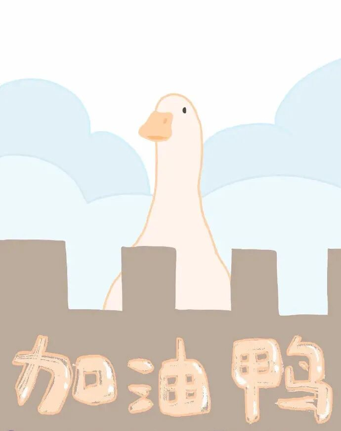
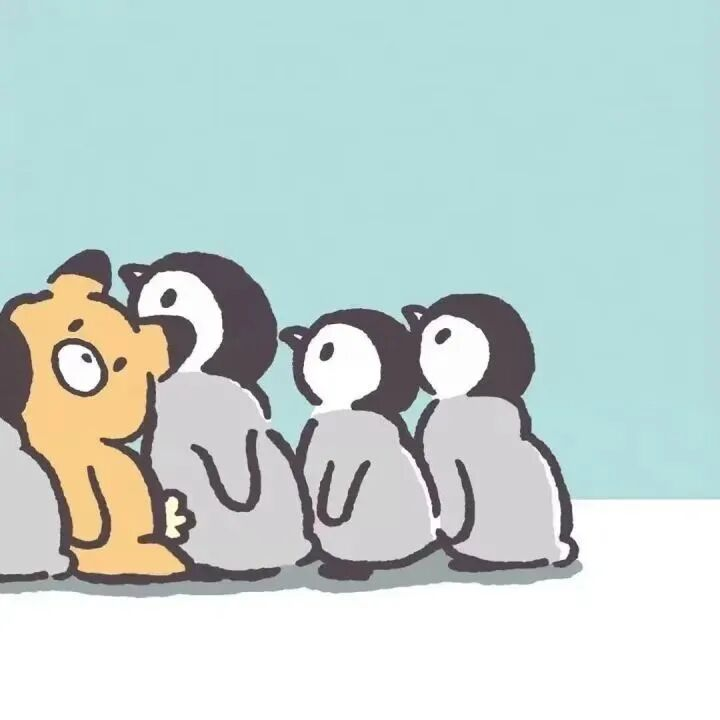

新学期的第一周课程终于结束，最大的感受大概是：

好像离心理学更近了一点。

一周的专业课输入了太多的东西，充实、兴奋，也伴随着疲惫，觉得自己的脑子不堪重负，又是路漫漫 任重而道远之感。

大一的学习总觉得有些空洞，靠着期末周的努力就可以获得一个虚高的绩点，然后在假期里把这些死记硬背的知识全都忘掉。

大二的学习让我觉得更加真实，如果不权衡好输入和输出、把实践和理论结合、多去接触除了心理公众号之外更严肃更专业的前沿讯息，的确很难在大二做到卓越。

于是今天上发展心理学的课上突发奇想想要搞一个心理学的tag，每周末都抽出时间做一些小小记录。

《发展心理学》
除了去了解人一生心理现象的发展规律，更是解决实际问题——做好自己/做好子女/做好父母。

1.智商的发展是一辈子的事情，但是情商在初中前就已趋于稳定。
也因此小学的教育往往显得有些畸形，在培养人格、认知的最佳阶段，小孩儿们都被从众的父母送去上“幼小衔接”了。

于是我想起了我那些一个假期5个辅导班的侄子侄女弟弟妹妹们，而我以前也这么跟他们的爸爸妈妈说过，他们总会这样回复我：

“你还小，等你到我们这个年纪也会像我们这样做的。”

（才不会 88）

我总觉得他们觉得自己的“正确”“合理”“科学”，无非是在做着和周围人一样的事情，群里的归属感让他们觉得自己很安全。

这真是悲哀。

有句话说

“如果不读书、不主动学习新的知识，你的三观都是由你周围柴米油盐酱醋茶的亲朋好友决定的”。

而每次我用这句话的时候，往往又会收到这样的回答：“我们老了，已经学不进知识了”/“我知道你是大学生，已经看不起我们这些人了。”

所以至今，我也不知道该如何去和这些人沟通。也希望未来学习的心理学能够给我答案

2.学会让孩子描述自己的情绪，不要只是一味的责骂和抑制情绪，如“哭什么哭，男子汉不能哭”。

这也是我在看《被忽视的孩子》里突然被戳中的点，在我小时候，我只希望自己永远被保护、被宽容、被原谅，期待着所有的失望、生气、愤怒之后都有妈妈温暖的怀抱。但这些显然不够。

那些在长大后羞于表达、不愿袒露内心的人，往往是因为自己在童年时缺少了表露自己情感、情绪的体验。

今天课上听冬燕说，每次她女儿有什么情绪时，她就让她评估自己的情绪等级，是“有点”“一般”还是“非常”。

（范儿说我们半年都要听着冬燕女儿的成长故事了 hhh szd）

一开始听来觉得爸爸妈妈是学心理学的小孩儿真是个行走的问卷机器，但是想来又觉得他们是在这样伴随着爱的理性中健康的成长，他们自在地表达着自己的情绪、诉说每一件事情的原因、和父母处在平等的地位上交谈、被给予充分的尊重，这真是一件很幸福的事情

3.小学阶段最重要的是三点：学习兴趣、学习态度、学习习惯。

父母更应该关注的应该是告诉孩子学习的意义是什么，是可以看到更广阔的世界、了解到更宽广的胸怀和哲思，能够按自己的想法而活、更加自由等等。

固然可以做一些思维启蒙的练习，但是繁重无趣的幼小衔接等就大可不必了。

引冬燕的话：“5岁学习一个礼拜还学不会的知识，到孩子7岁学一天就明白了，所以没必要让小孩老早就去学什么幼小衔接。”

觉得她的女儿真幸福again
觉得我的侄子侄女真惨again

所以“不能输在起跑线”上这句话中的“起跑线”不应是成绩的起跑线，更应该是人格、性格、价值观。如果真的不想让孩子输在起跑线上，父母就应该给孩子充分的陪伴，让孩子知道以后自己去面对危险时该怎么应对、如何自己去解决问题等等。

同时，也不能走入“挫折教育”的误区，既不是故意给孩子制造挫折，也不是过度保护孩子，而是在孩子遇到挫折时，给予孩子适当的鼓励、指导，帮助孩子去体会通过努力克服困难的过程，让孩子了解到：

* 挫折是可以战胜的，但需要他自己的努力。
* 家长是可以信任的，在他需要的时候，他们会提供适当的帮助。
* 通过这样的过程，孩子和家长都会体会到成长的喜悦，那才是家庭教育最终的目的。

然后看了一眼其他课的笔记，还只学了点绪论，就下次积累了点知识再思考and分享吧~

“我们从未长大，但我们从未停止过成长。”

