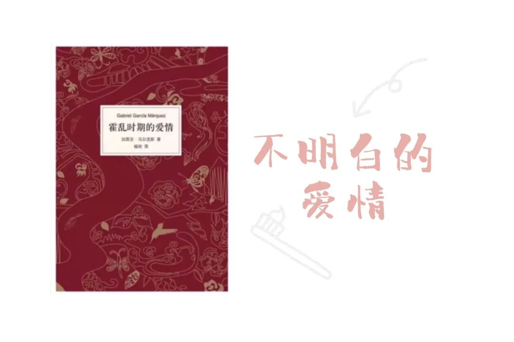
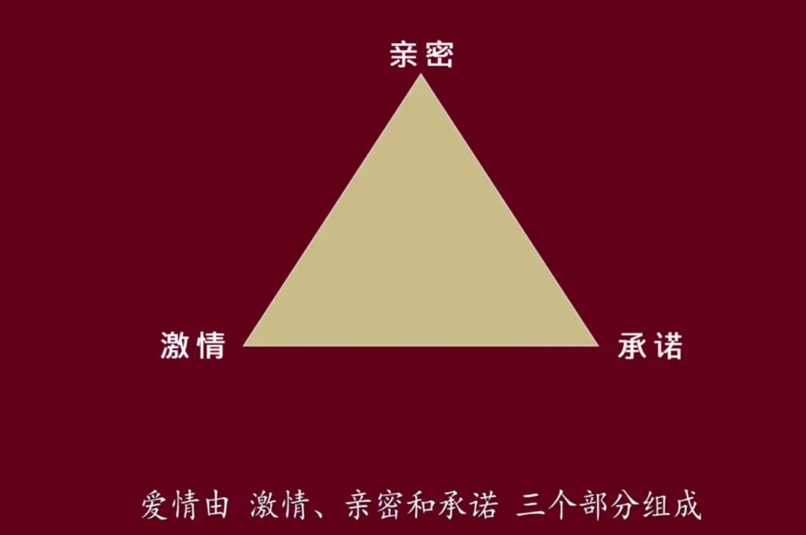

一开始读完这本书，我觉得自己读懂了爱情：啊，大团圆，有情人终成眷属，真好真好！

而细细回想，发现里面掺杂了太多复杂的东西。

故事情节很简单：一场关于爱情的漫长等待，在双方老年时终于有了结果。

但除了主线情节，还有很多其他的要素：霍乱、因为爱而不得的孤独而产生的622段关系、看似门当户对的婚姻、不伦、战争...

前几天看论文感慨能写综述的人实在是厉害，现在想要把这本书概括一些什么，却只能概括出以上这些支离破碎的内容。

斯滕伯格的爱情三元论里，包含着激情、亲密和承诺。

这也就意味着，这三者有多少种不同的分配，就会有多少种爱情的样子。

《霍乱时期的爱情》里，有激情贯穿着的世纪之恋、长相厮守的甜蜜，有基于承诺开始、逐渐转为亲密的漫长婚姻，也有仅仅出于寂寞而不考虑伦理的放纵...

所以就算是为了看看这世间爱情的万千模样，这本书也便值得读了。

而这本小说里的爱情都有同一种特色：跨越时间和死亡，它似乎可以永恒。

在社会规矩、背叛、老迈、皱巴巴的皮肤、无法自持的生理状况、衰老的气味面前，爱情有着癫狂的宁静，里面的所有人能平静地用爱情来克服一切障碍，直逼时间和死亡的尽头。

所以在故事的结尾：

“您认为我们这样瞎扯淡的来来去去可以继续到何时？”船长问。

阿里萨早在五十三年七个月零十一个日日夜夜之前就准备好了答案。

“一生一世。”他说。

（这个结尾的风格也真是马尔克斯无疑了）

因为之前为了不让其他人上船打扰他们的二人世界，便让船长举了霍乱病的黄旗，所以年迈的阿里萨和费尔明娜最终只能在船上漂泊，度过他们或许浪漫的余生。

我总觉得我对爱情的觉悟不高，于是又去知乎上搜了搜大家对于这本书的解读。其中的一段是这样的：

“其实这一切都适得其所，爱情就像霍乱，得病的人任性地做错事。就像为了保持对费尔明娜的忠贞，阿里萨一辈子不婚，但同时为了等着她丈夫先死掉，他靠不停地和各种女人发生关系来保持年轻;

就像费尔明娜带着那个年龄不该有的危险的天真，陷入爱情霍乱中，他们是像得病的人一样，带着远离思考的理智，却清楚地看见自己这样做样，带着远离思考的理智，却清楚地看见自己这样做。”

所以，我们有资格去评判别人的爱情吗。我们又能以什么样的标准去评判呢。

我越来越相信“这世上没有所谓正确的选择，我们后来做的一切都是为了让当初的选择变得正确”这句话。

我们可以有一万个理由去否定自己当初的选择，去受到外界评价的影响，去花大把的时间幻想走另一条道路会更好的可能性，然后去诘难当初做选择的自己。

却只有一个理由让自己坚持做下去，那就是你和当初做出选择的自己一样，相信自己是对的。

而最后，读完这本书再问一次：爱情是什么。

我也不知道。

它可能像一些东西。比如说。

像一次喜欢。像假装碰见。像拙劣的引起注意。像可怜的自尊。

像嫉妒。像猜测。像袒护。

像离开，像无数次离开。像遇见，像无数次遇见。

像无数次遇见却沉默如迷，像无数次离开却总在原地。

像晚上十点收到的纸条。像傍晚操场的跑步。

像遥远，比遥远还遥远。像身边，一个在厨房一个在房间。

像时间。像太阳。像薄荷。像19年6月9日的晚上。

像一个下雪的早上。像骑着共享单车的晚上。

像失望。像照片。像并排的桌椅。

像《最好的我们》里简单说的那句“一厢情愿就要愿赌服输”。

像后悔。像重蹈覆辙。像下定决心。

像我一点点忘记，在某一个特别的时候又突然的想起，毫无意义，但死活不承认。

爱情是什么呢。

我也不知道。
