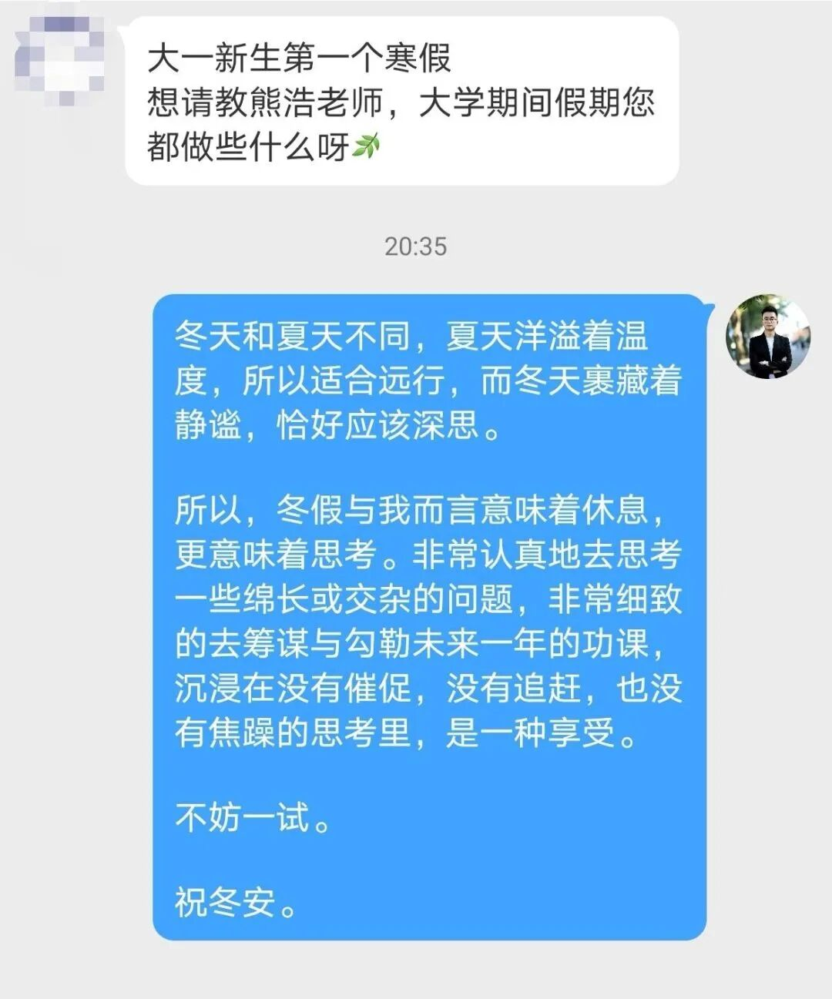
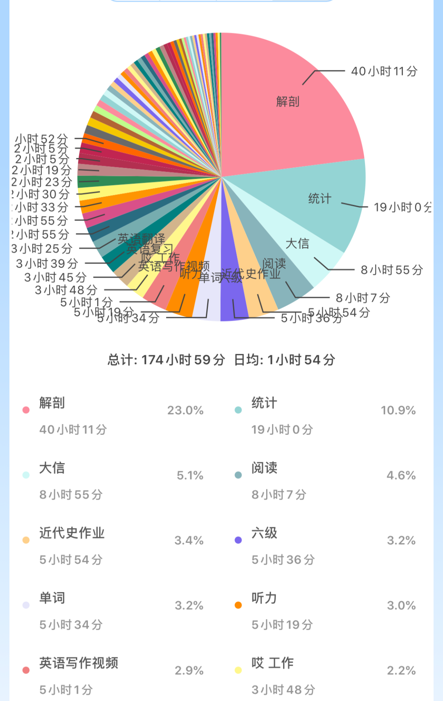
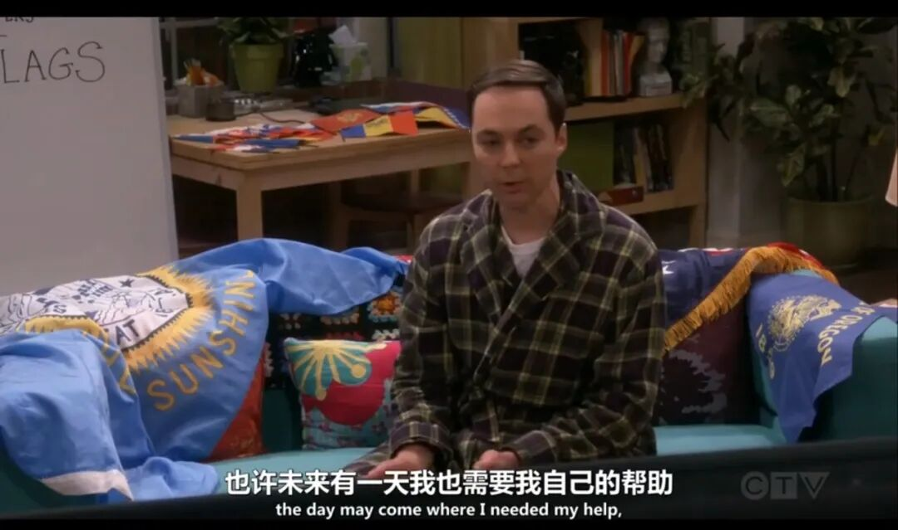

7.6的我还是太过天真，真以为能够连续七天狂学...结果被学车/去乡下/实习/火锅/...等搞得天旋地转，根本没有寒假时在家那般心如止水。

oh或许也是对的，你看熊浩老师这么说：

“冬天和夏天不同，夏天洋溢着温度，所以适合远行，而冬天裹藏着静谧，恰好应该深思。”

或许夏天就该多折腾/多行走/风风火火/...（最后变成一个黑人）吧。

但在夏日闹腾一天后静坐之时，却还是怀念寒假岁月静好的安稳感觉，回想了之前的学习经历并翻了点之前的record，决定自己做一些关于假期学习的总结。

理理思路。多总结固然是好的。

**01**

计划这件大事

前一天晚上必须列完第二天todo——and 不要试图一开始就制定完美的暑假计划/周计划/月计划/年计划

之所以这么想是因为：

从小到大无数个老师让我们制作假日作息表。

然后，就真的只是精心制作了一个作息表。

暑期生活有着太多的不确定性，宏观计划的存在总是让我们在遇到突发事件而无法完成原来任务时，徒增挫败感，几次无法坚持之后，就开始彻底放飞自我。

——

当然，周/月/年计划也并非不重要，只是顺序应在日计划之后。而我把自己觉得最清醒/理性地制定宏观计划的时间安排在平日里某项学习任务之后的时间。

于是，就聊到了日计划应该怎样合理设置。

**02**

日计划的分配

目前找到的对我来说最协调也尽量有意义的任务设置是：

重任务＋轻任务＋营养输入+自我管理+纯娱乐+运动（此项随心情而适当忽略...）

重任务：看艰深教材/看艰深网课/做题/复习单词...

（我觉得复习单词比背单词难多了）

轻任务：背单词/看简单网课/无脑抄笔记...

营养输入：刷刷有营养的知乎/微博/b站/公众号/（甚至是一些鸡汤）

（**知乎**风评虽然日渐变差，但还是有很多真大神在分享有用的东西。可以用来拓宽视角/寻找各种方法 比如找到时间管理小妙招、如何备考四六级、如何追到男神等等。知乎的作用来说就是跳出我的固有思维，观望更广阔的世界和方法；**微博**用来看大神们的输出 我一直喜欢看黄执中和熊浩的回答 每次都能开阔新思路；**b站**和知乎同用；心理学有很多有趣的**公众号**，平时浮光掠影不加记录真的很可惜，这段时间可以用来做一些笔记。）

自我管理：承接上文的制定长期计划/复盘

因为在学习了一段时间后，思维也会更有把控感和逻辑性，不至于天马行空盲目自信。

也可以在这段时间里对前期时间安排做一个调整

practice and flexibility make perfect~

（运动）：好吧 我是个美丽芭蕾坚持不过3分钟的人 真希望何时能够写一篇关于运动的推（真 fantasy）

纯娱乐：是的 szd纯娱乐 区分于上面的营养输入 此时可以看各种毫无营养/但是快乐的东西

比如看看知乎的（或许虚假）甜文/看看帅哥（最近觉得齐思钧真的太好了！）/吃吃瓜等

**03**

外界效率管理

从小到大我真是使用过无数款时间管理软件...

timing/forest/潮汐/pendo...

最后还是钟爱番茄todo

（比如这张来自期末周的时间统计让我深深觉得：

为了1.5个学分而狂学神解的自己像个憨憨...这真是失败的时间分配..

下一次一定不会这样了！）

这种知道自己的时间都分配在哪里的感觉真的hin不错

去年寒假一开始使用forest，用2h的树差不多可以一天6h。后来用了番茄todo之后发现到了5h就已经身心俱疲了。于是就觉得forest看似漫长的2h中伴随了太多切换任务时的摸鱼时间，遂觉得此软件甚是不妙（oh只是对我来说）

**04**

寻找极度舒适的身心愉悦感

亲测：最快乐的不是连续一个月的咸鱼时光 而是完成学习任务之躺在床上的愉悦感

（就比如高考后那个假期固然算是狂欢 但那肯定比不上高三假期玩耍时的快乐）

所以劳逸结合最重要 只有学习之后才能给自己创造最幸福的学习体验

而除了每天的劳逸结合 每周也应该抽出一天时间去做一个远离专业学习的彻底放松

用来去看书/逛超市/学画画/看剧/躺着/吃/整理房间/看小红书 想想怎么减肥/煮饭/...

**ps**

时间管理大法还在持续修炼中...

以上内容纯粹是对自己以往学习方式的整理

他人观此篇 就如同去知乎上搜索如何时间管理是一样的

so仅供参考

hope每一个人都能想起自己之前的成功经验 并不断补充 然后get better~

#这篇非常突然的推是因为今天在整理房间时翻到了去年的手账本。我很感激当时的自己竟然在高考前2个月也在认真的记录着那时的心情。那些缭乱的思绪和学习计划，就那么直白地躺在了本子里，被如今的我当作遗忘的时光去品读。挺奇妙的。

于是好久没有记录的我，又想重拾手账本，用笔去记录了。

而记录的意义 并不是产生于当下 而是作用于未来的自己

对于当下 它跟那些即刻想去享受的事情相比或许是个负担

但当未来的自己重新观望以前的那段时光 你会发现那时候的自己居然是那样的一种状态 现在的难题居然在当时也经历着并且轻易地化解了

（比如我以为自己当时查完分数之后悲伤的像个傻狗 没想到那时候的手账本上记录着我当时正在非常淡定地刷着53 淡定地做着英语阅读 励志地准备复读 还看了好多电影 写了几十篇的影评...生活非常充实...

非常的amazing啊 ）

又突然想到生活大爆炸12季里Sheldon和Amy知道自己研究的理论早就被推翻之后颓成傻子 such as 这样👇

后来Leonard找到了Sheldon小时候的record （虽然因为某些不可抗力只有一半了...）

（再安利一下小谢尔顿 看的非常快乐的一部美剧~）

#昨天更换了一个头像 更像一个公众号了 happy~

探索|记录|永远相信着

if有什么快乐的事情/有趣的想法/想问的问题

就来popi吧~

（马上要去可可西里玩耍了 太开心了！！）
