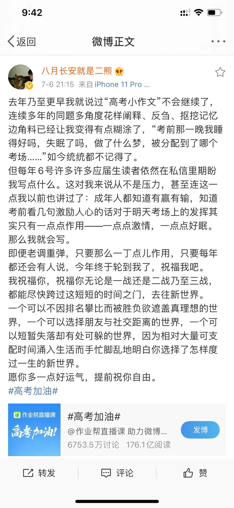
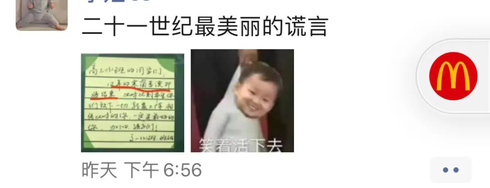
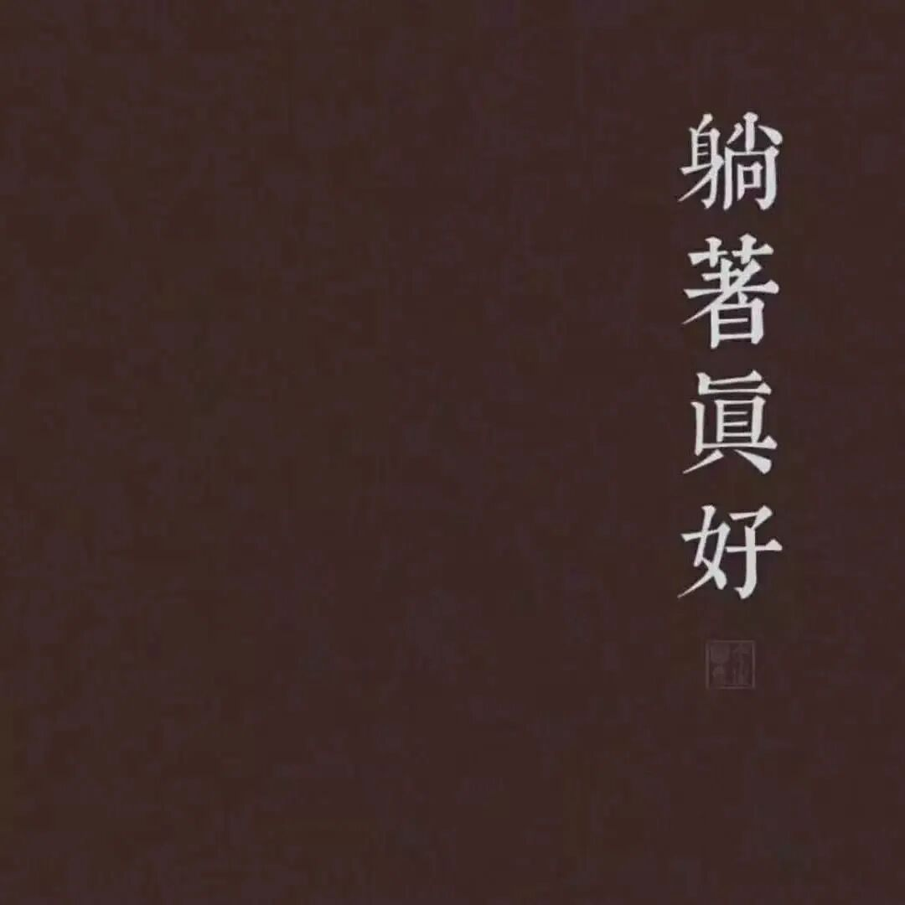
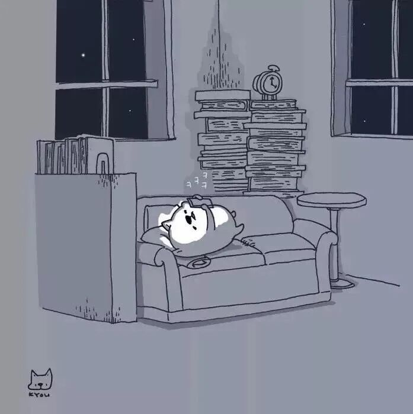

今日本想在pyq发一条深情的高考祝福 但随手一翻 觉得在一坨清北复交南大武大的朋友中显的略挫🥱而我的vx也的确没啥要高考的小同学 于是还是在这里小小record一下

晚上微博冲浪突然看到二熊更博了 如下：
这真是我最爱的女人啊！

“我祝福你，祝福你无论是一战还是二战乃至三战，都能尽快跨过这短短的时间之门，去往新世界。

一个可以不因排名攀比而被胜负欲遮盖真理想的世界，一个可以选择朋友与社交距离的世界，一个可以短暂失落却有处可躲的世界，因为相对大量可支配时间涌入生活而手忙脚乱地明白你选择了怎样度过一生的新世界。

愿你多一点好运气，提前祝你自由。”

是的 我始终觉得这是一个值得庆祝的时刻

虽然昨日又看到一位南航的学姐如是说：

图里的字是“12年的寒窗苦读即将结束”

而在我的感受里

高考的确是“寒窗苦读”的终点

因为它意味着

你可以把更多的时间和精力放在自己想要探索的事情上

可以用更加精细高能的设备帮助我们记忆而不是时刻带着“不记住就丢分”的负罪感去一遍遍刷题

它意味一段更丰富 更高效 更自主的学习时光

同时 还能去加一下心心念念的男神（即使也是怂的不敢讲话的… 😕

同时 还能狂吃东西 一人吃2盆小龙虾 2天刷完一部剧等（逐渐跑偏…

是的 躺着真好…

真突然 怎么思绪突然停止了呢…

好吧

我还沉浸在考完期末的闲鱼岁月里🐥

让我明日开始自救一下if卓有成效就在7天后再出一期经验推 且当立个flag了…

啊 再次感慨 ：

不用高考我可太开心了

不用上高中可太开心了！！！

（好坏🤔

have a good night～
