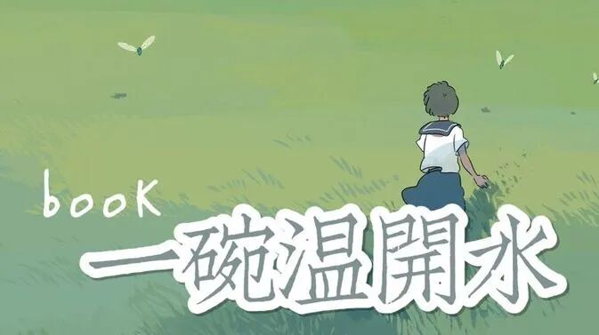

1

1

1

1

**......**

五一假期一口气看了四本书，刚打开《西西弗神话》，决定还是先做一个短暂的书籍和生活的整理，让自己感知最近这段生活的存在。

也因此想把之后的每一个假期都用来做阅读、观影和整理的工作，而周一到周五则用于学业上的巩固和进步。

**《人间处方》**

——然而对我来说并不是太有效的处方。

之前看到是“夏目漱石写给青年的信”才买的，结果发现是另一个人对信中字句的解读和延申。就像是高中用了无数次的素材：于丹讲国学，却讲成了鸡汤。

那些很美的意境，恬静中带着幽默的表达，在一番解读之后，变成了一碗温水，甚至是装在饭碗里的那种温水。Anyway 还是有几处让我觉得眼前一亮，让这碗温水又有了温度。

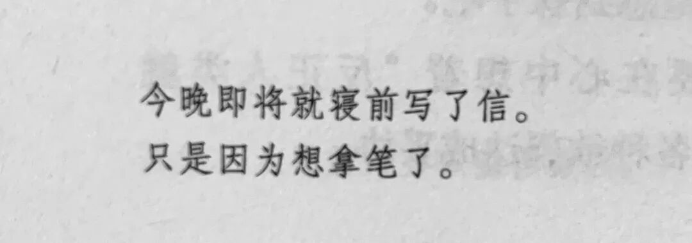

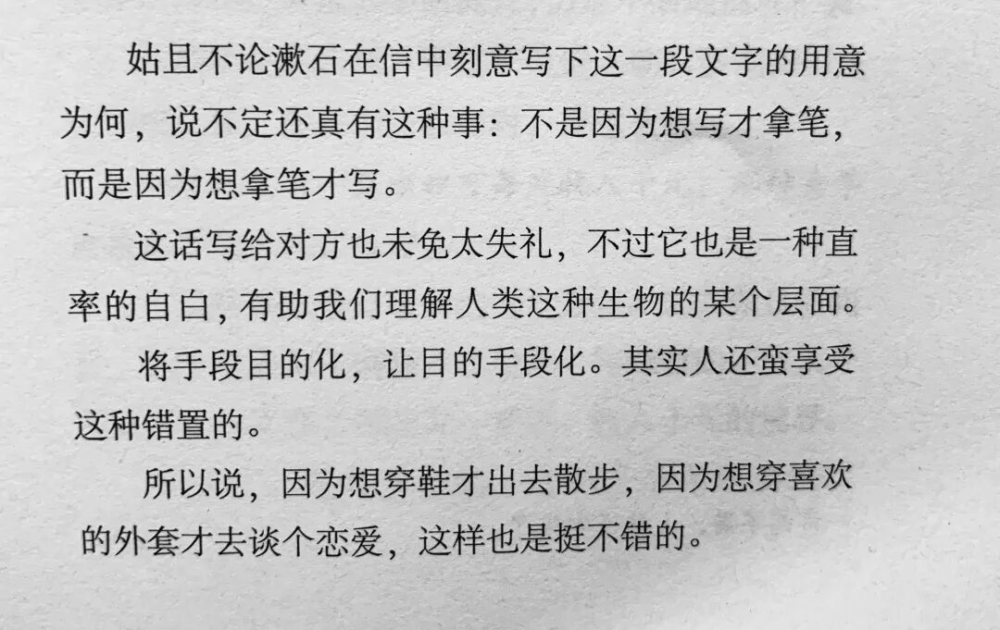

寻找事物之间的独特的因果和千丝万缕的关系，总是让我觉得很神奇。

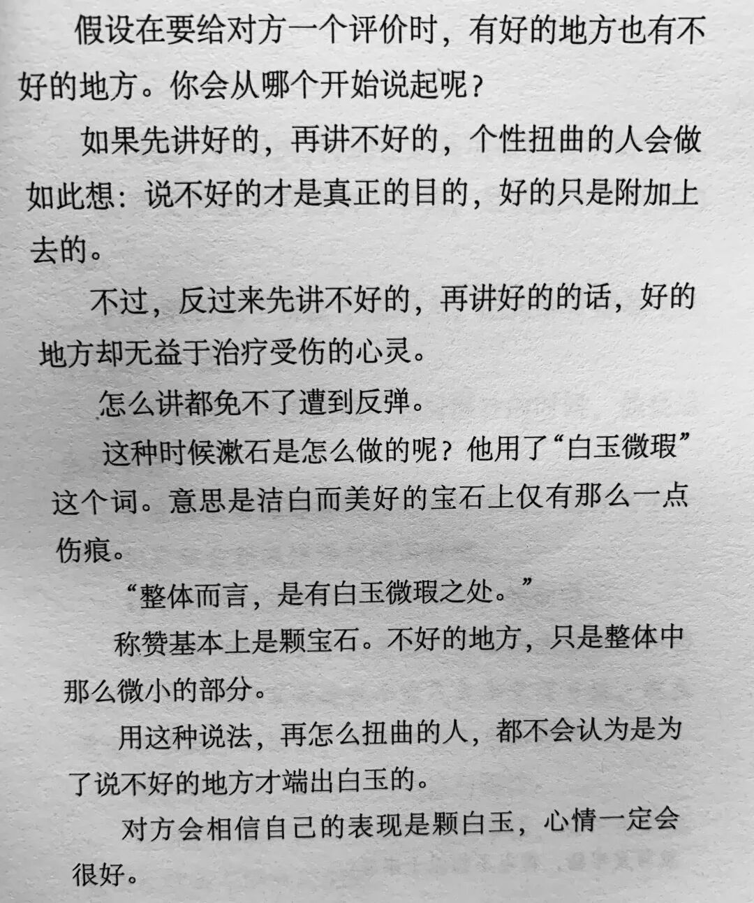

持续修炼之——言语艺术

#记一次答辩，刚说了一两百字就被打断；

“你能不能试着不要说‘然后’‘就是’这样的话呢？”

“好的。然后就是说...”

在学会开口表达之后，如何表达地体面，又是下一个阶段要修炼的东西。

**《北野武的小酒馆》**

曾经我看到

“虽然辛苦，但是我还是会选择那种滚烫的人生。”

就想看看北野武在电影路上的追寻，来治愈一下最近疲惫的脑子，结果还是有些失望了。

产生的最大的感受就是：

还是听专业的人讲讲他专业之内的事情吧。

会喜欢北野武的电影。但是很难去认同他的爱情观和他关于爱情的表达。

也可能是最近活得太紧张太正经了，在前面几章里我总觉得言之无物，只有最后一章谈到电影的时候才有了“还真点东西”的感觉。

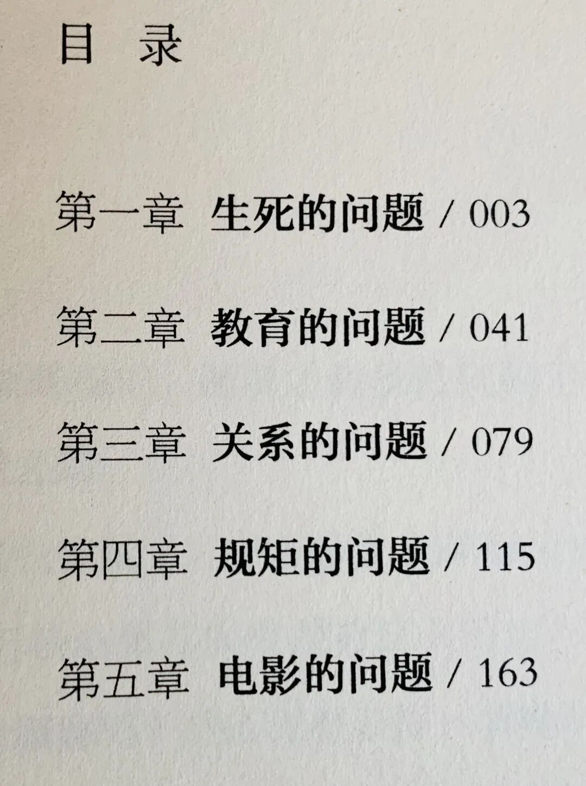

一直以来，我对于公众人物都有一个认识就是：只看我欣赏的这一面就好，不要有任何的上升。

有时候，这种认识也的确有些片面。但是却帮助我消解了很多不必要的情绪。

我总觉得，有时候连身边的人都无法判断清楚，又怎么能通过被转述被记录的所谓的“真相”和“实锤”，而去评判这些distant people 的整体呢。

无法做到。似乎也没有必要做到。

上升到了整体，就会在“人设崩塌”的时候，陷入无穷无尽的失望和对这个世界的怀疑。

所以还是更愿意把身边的人当作是参照和引导，我更愿意相信我自己在一段关系中感受到的、对对方的信任与崇拜。这种流动的、真实的情感让我不断地坚定自己一开始的判断。

比如一开始以为王蓉学姐是个拿遍了所有奖学金的高阶学霸，后来在实验室里看到她

两天看了三四本书，且中英文随意切换... 且除了奖学金还有无数的竞赛奖...

实在是学神...震惊我与范儿...

**《人间值得》**

适合在疲惫了一天之后、开着上铺的星星灯看。

会觉得你的选择还挺正确的，有些努力也还挺值得的。会被小小的治愈到。

但不适合在清醒的白天看。力度还是有些太小了。

**《Flipped》**

实不相瞒，这是我第一本不被迫看的英语原版...

看过电影版，也看过许多对其中爱情的描述，但是看英文版让我印象最深的却是那棵“sycamore tree”。

“My beautiful,magestic sycamore tree.

Through the branches she’d painted the fire of sunrise,and it seemed to me I could feel the wind.And way up in the tree was a tiny girl looking off into the distance,her cheeks flushed with wind.With joy.With magic.”

希望每一个人都能找到自己的sycamore tree.

with wind.with joy.with magic.

**《李银河说爱情》**

是这一次看书里最爱的一本，也是收获最多的一本。

最近身边朋友的爱情路都有些波折，纷纷尝尽了爱情的苦...

对爱情产生了诸多问号，于是就买了这本书。

虽然有许多问题仍未被解答，但是却有很多意料之外的收获。

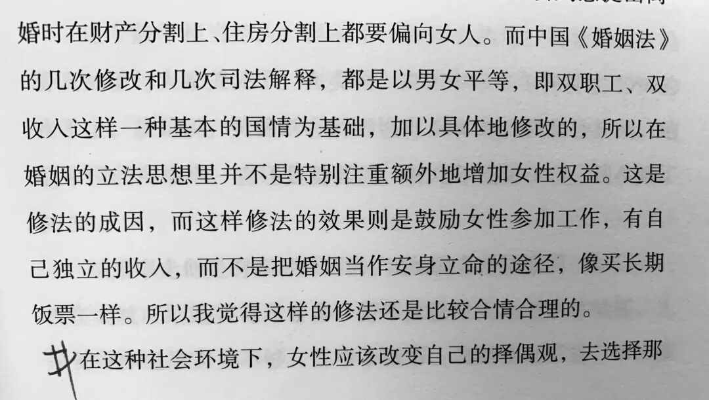

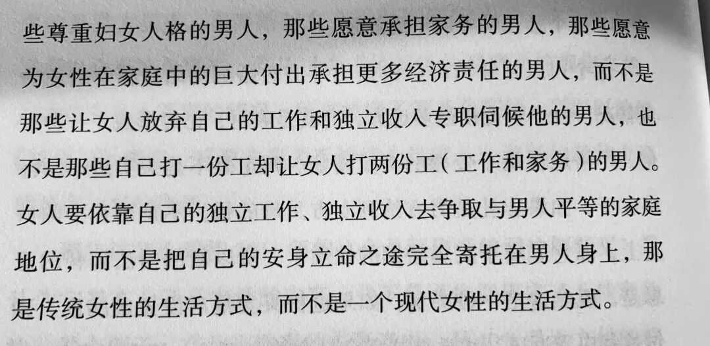

虽然每天看着余额宝的收益不亦乐乎..甚至和sjx感叹以后就当一个快乐的包租婆吧！但还是早早达成了要以后一定要经济独立的共识。

那就

前半生好好努力赚钱，后半生当个包租婆吧！

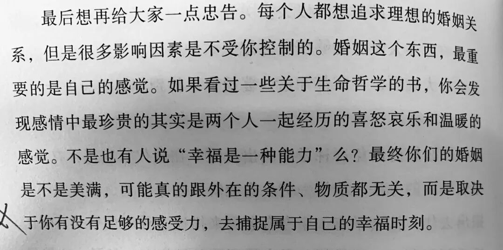

我们好像越来越喜欢说“治愈”这个词了。

听起来好像真的被生活一直挫伤着。

但看了这句话，突然有些释怀。

我们感受到被治愈，是因为我们对每一个tiny moments有足够的感受力，能把看到的事情与头脑中的想法联系起来，把它对应到每一个踌躇的决定和尴尬的瞬间，然后慢慢去消解这份短暂的悲伤。

于是欣儿每次的美食投递，都让我感觉无比幸福，虽然，这，也成为了减肥和治痘路上的一大绊脚石...

于是涵儿每次语音连环炮虽然真的很烦！但慢慢地我也开始给她发一坨坨的废话，宛如两个中年妇女...

于是看到小花小草都想拍。

于是每一个夕阳都想珍藏。

拥有这种能力。并且感谢这种能力。

**......**

前段时间真是忙碌啊，晕头转向的。于是就买了很多现在看来有些无味的书。

但我仍然感谢，在疲惫的生活里，还可以品尝这几碗不算太烫的温开水。

书籍伴随着心境。

在温吞的书籍陪伴中肝完的面试、申请、答辩，秃头的统计和神解...

Anyway一段生活终于结束。

兵荒马乱的期末月又要开始了。5月是清醒、理性的一个月，所以我给自己买了这样的一些书，去扩展这些好奇了很久的领域。

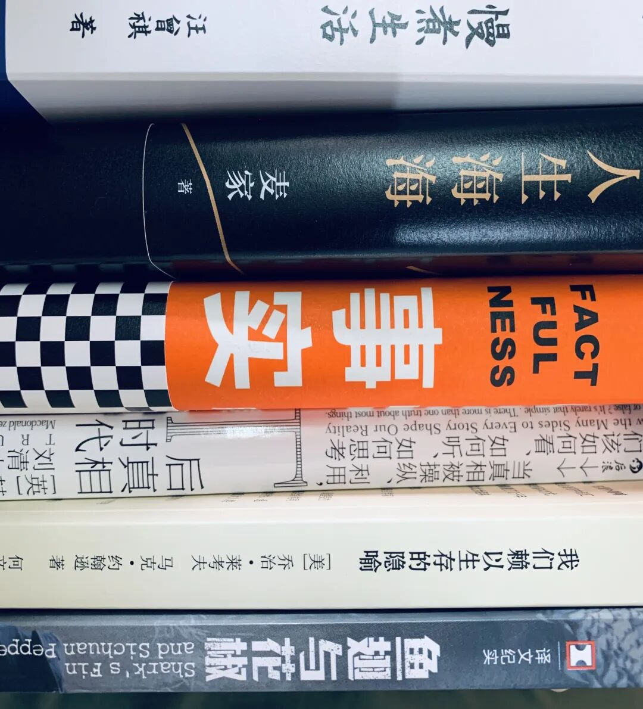

最后，再次分享来自熊浩的微博问答。

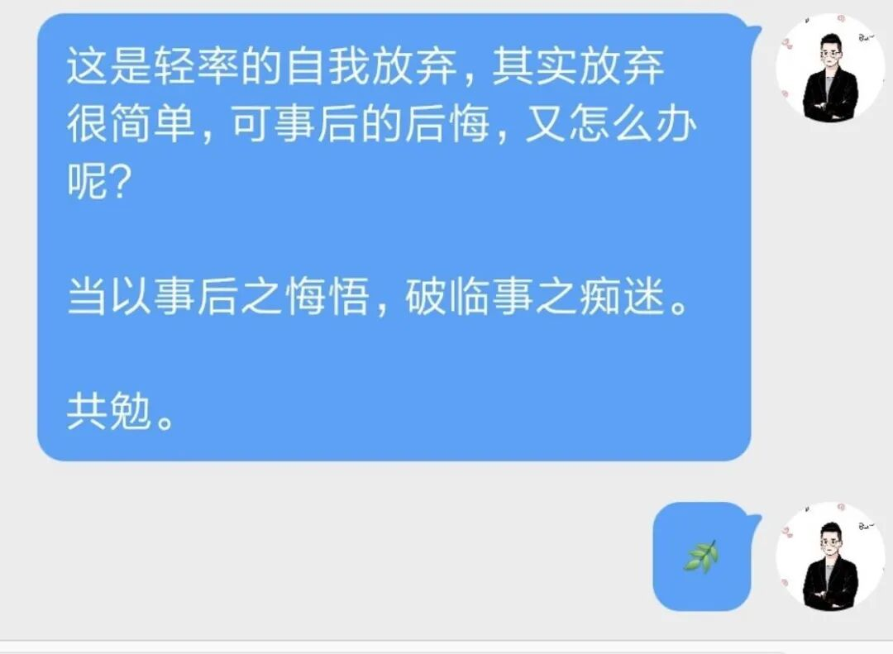

不要否定每一个不甘于平凡的瞬间

不要否定任何一类知识。

“当以事后之悔悟，破临事之痴迷。”

“You have to trust that the dots will somehow connect in your future.”

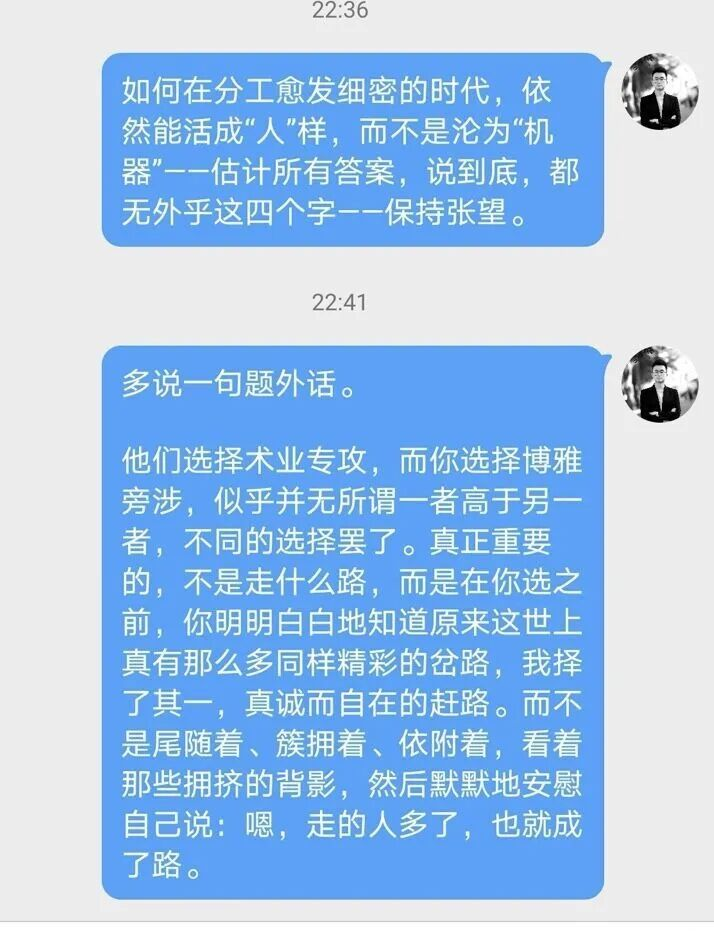

“保持张望。

要明明白白地知道原来这世上真有那么多同样精彩的岔路，我选择了其一，真诚自在地赶路。而不是尾随着、依附着，看着那些拥挤的背影，然后默默地安慰自己说：嗯，走的人多了，也就成了路。”

最近帮着学姐一起做实验，也深刻地感受到了心理学实验中与每一个陌生人沟通交流、倾听他们的故事、建立短暂的联系这件事情的快乐。

虽然会被不走心的量表和不走心的被试气到，但还是会期待整个实验最后的结果和意义。

每次朋友们以“文君啊”开头的时候，也真是大概率他们感受到了心理学的神奇、让我好好学心理学了。

虽然背后的实验不及一个最终的理论或效应有趣，但也慢慢地已经接受整个过程中的任何一环。

这世上有那么多同样精彩的岔路

我选了其一

并且目前真诚自在地赶路

希望以后也是。

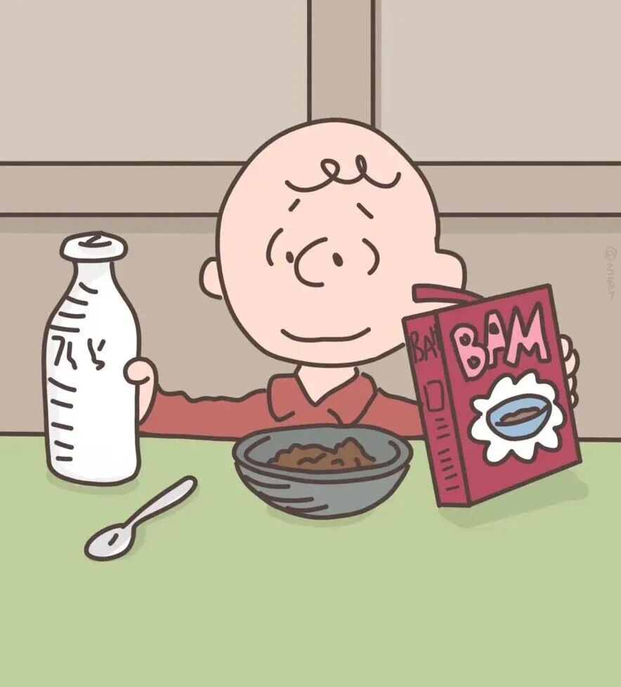

唔 青年节快乐呀！
