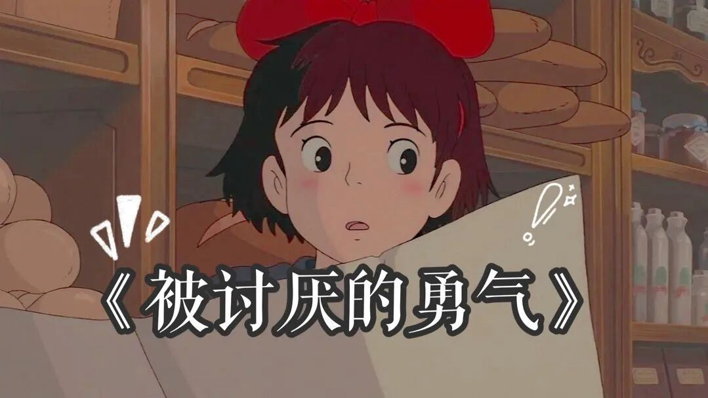
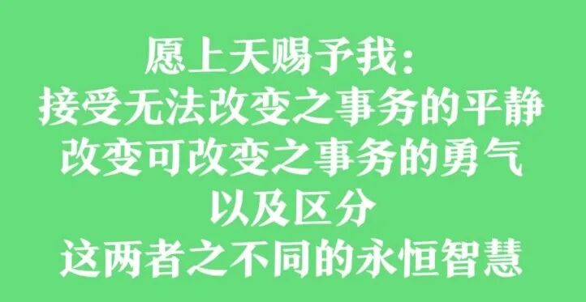
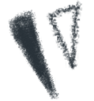

book思议

《被讨厌的勇气》

这本书是在黄执中微博下面一条点赞不多的评论里偶然看到的。看完这本书发现，少爷的某些让我觉得叹为观止的思考原来在上个世纪的维也纳就已经闪烁出了微光。

我想无论是谁，无论是不是学心理的，都应该去读一读《被讨厌的勇气》。读完后甚至让我觉得，如果所有人都能知道一点阿德勒的心理学，又需要什么心理咨询师呢...

（然而读这本书之前，我根本不知道阿德勒和弗洛伊德、荣格并称为心理三巨头的，我只隐隐约约记得高中晚自习去书架上拿了一本《自卑与超越》然后啥也看不懂就放回去了...）

由于阿德勒的观点是岸见一郎进行了整理，用对话体的形式展现，难免少了些学术的气息，所以也难免会有人看了一点点就将其归于鸡汤书那一类。但若能真的静下心来去揣摩其中的每一个例子，一定能够收获一些sparking的思路der。

由于百味鸡每次的写作热情都在心理学史的课上突然燃起，但是心中又有愧疚，所以瞎写一点点再去听一点点无聊的课吧。

**原因论 vs目的论**

你一定见过有的人这样倾诉着：

“因为我家庭不和睦，所以我才变得这么孤僻。”

“因为有人招惹我，所以我愤怒。”

很显然这是弗洛伊德式的原因论。

但是在阿德勒主张的目的论下的解释却是：

因为想达成报复父母的目的，所以变得孤僻；因为想达成让对方感到自责和害怕的目的，所以选择愤怒的情绪。

“经历本身不是成功与失败的原因，我们并非因为自身经历的刺激——所谓的心理创伤而痛苦，事实上我们会从经历中挖掘一些符合自己的因素，也就是说，决定我们自身的，不是过去的经历，而是我们自己赋予它的意义。”

阿德勒的观点总是给人一种他和弗洛伊德是死对头的感觉。

完全否认弗洛伊德提出的心理创伤——

这一点，一开始似乎太难接受了。因为“自我合理化”的确让我们的生活舒服了很多。所以一开始光是理论的灌输，看到这里的我并不能接受。后来看了更深一层的解释便慢慢清楚了。

“自我合理化”将很多事情都解释为：

正是因为有A，我才完不成B。

这样的解释其实在给自己一种暗示：

如果没有A，我就可以达成B。

但是很悲伤的事实是，即使没有A，都未必完成得了B。

而更悲伤的是，有些人只想坚守着这种“我也许可能会达成B”的梦幻的可能性，而永远不行动。

正是这个解释，让我慢慢了解到了目的论在某些事情上比原因论的优越性：

原因论让你一味的刨根问底去寻找A1,A2...这样的一种“看似在努力思考”的方式，实际上只是原地踏步，让你永远做不成B。

但是目的论让你意识到自己的目的并不对，于是再去寻觅一个恰当的目的，目的引导行为是很简单的逻辑，这样的思考才是有效的。

于是又回到了开头的例子。

本来认为“因为家庭不和谐，所以变得孤僻。”

后来想到“其实是想要让父母感到对我的内疚，我才表现的这样”。

→

可是分析之后，我知道这种目的是病态的。

→

于是更换目的：“我想让自己生活丰富一点，所以我开始变得乐观。”

而对应第二个例子，我们又可以换一个角度去思考“理智与情感”：从目的论的角度，无论是选择愤怒还是选择忍耐，这都不是最终答案，而只是达成目的的工具。

你并不是本就“应该”生气，而是你“选择”了生气。

（这句话书中也举了一个例子帮助理解，正在狂骂孩子的母亲，在接到老板的电话的时候可以一瞬间熄灭怒气而采用平静甚至奉承的语气。这也就意味着母亲对孩子的生气只是为了达到“希望孩子感到害怕吸取教训不再犯错”的目的，这种情绪是可以选择的甚至是能放能收的。它并不是一切过去的结果，而只是为了达到目的手段。）

书中所说的不无道理，但是给人一种生活中只要目的论就可以解决问题的态度，我总觉得不妥。以上的分析和判断，只是万千理解中的一种而已，当然不必去狂热的奉为圭臬。

多一条思路，只是帮助自己从更多的角度去分析自己。

ps：刚才说到原因论的时候想到了之前读的《被忽视的孩子》（running on the empty），讲述了童年的情感忽视对未来的影响，显然是原因论，分析地非常的透彻，同样值得一读。

**连续的刹那**

书的中间部分有几个论断也非常的妙，比如“课题分离”“自由就是拥有被讨厌的勇气”“一切矛盾都来自于人际关系”...等等都是非常有名的观点，可以去了解，但是对于目前的我来说有些牵强，于是就不加说明咯。直接跳到似乎是无关痛痒的最后一章。

人生不是几何里的一条线，而是粉笔画出的一条线。

几何里的一条线，确定起点再确定终点就可以了。但是粉笔画出的一条线如果用放大镜去照，就会发现那条线就是由一个个细小的点构成。

这是书里让我印象很深的一个例子，另一个则是当像你我一样的中二青年问出了非常合理非常正常的问题“那岂不是既不看过去也不看未来，这样还有追求？”时哲人回答的——

“如果你站在舞台上，聚光灯全部照向你，这时候你是看不到前面的观众的。只有当聚光灯不全照着你的时候，你才能看清楚前方。”

其实意思就是，全心全意过好当下这个刹那的人，是没有时间再去考虑未来的。

我不知道是什么时候不想给自己明确的未来目标而只想过好现在的。就像4年一遇的2.29那一天也并不想憧憬4年后的日子。

书中的原话“计划人生不是没必要，而是根本不可能。”

我想还是少了点前提，计划的时间跨度太长的确没有必要，久而久之活成了“别人期待中的自己”，那是潜在性人生。把计划的时间跨度拉短至很短的时间单位，给现在选择一个恰到好处的邻域，这是现实性人生。

过于理性吗？太过没有温度吗？少了点理想主义的光芒吗？或许吧。

但是看了最近的各种奇闻轶事，我越来越觉得：

保持理性或许有时候不是什么好事，但是不理性就一定是坏事。甚至删了微博。因为经历几次被奇奇怪怪的新闻牵着鼻子走只觉得疲惫，不如就把时刻关注新闻的状态调整为等事情始末清楚了，再去看一些厉害的公众号写的完整分析吧。而且目前来看删了微博真是省了许多许多的时间啊。

最后po一段书里提到的一句话，也是很久之前看b站的时候截的图，也算是点题了。

from 尼布尔的著名祈祷文：

（也不知道这个up主用地是什么迷惑的配色... 这也太绿了）

今日吃了紫燕百味鸡的藤椒鸡，鲜嫩多汁，入口即化，百味鸡不禁感慨：藤椒鸡真是世上最美味之物！至今想来仍然垂涎三尺令人欲罢不能啊，于是今日瞎写推文便就此作罢。江湖再见。

**把一切都根植于现在**

**百味鸡的pluto**

