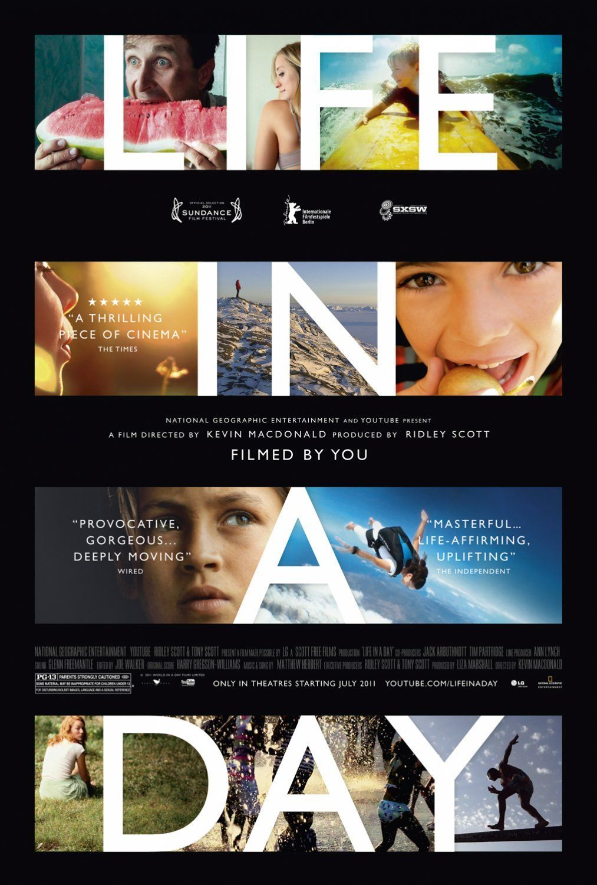
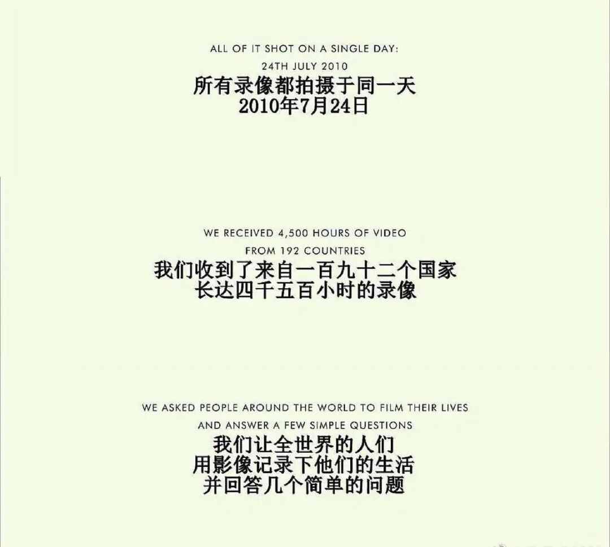
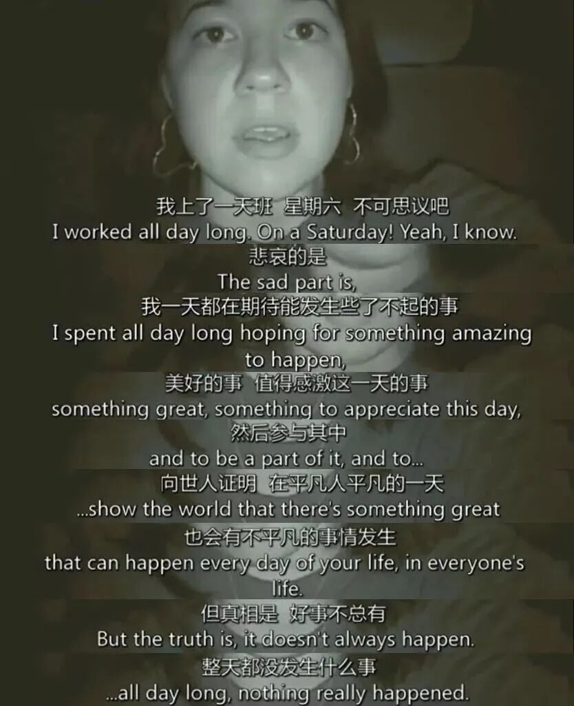
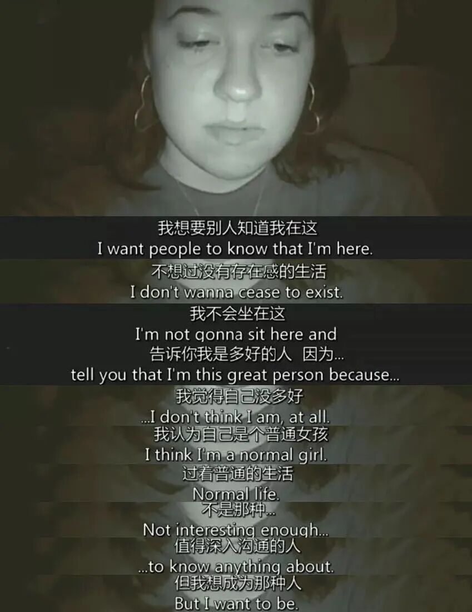
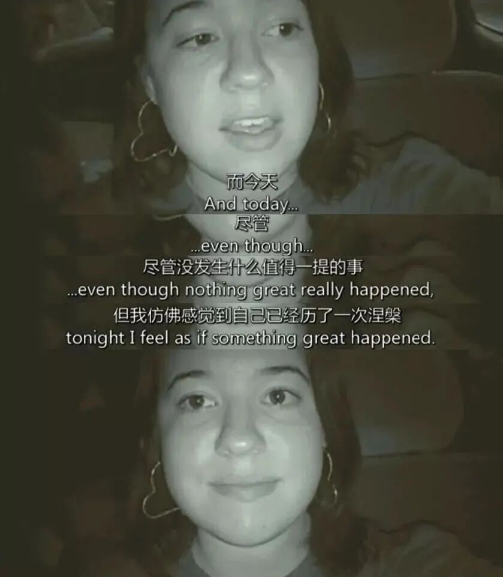
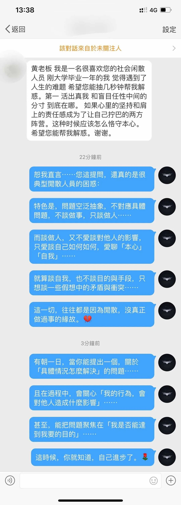
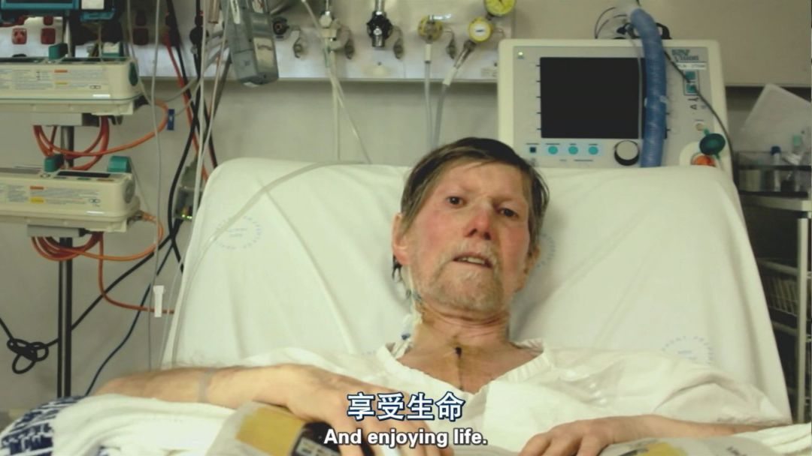

share to you

life in a day  浮生一日

recommend一部纪录片。偶然从人间理想何运晨的微博里看到的。一个储存全球各地的人在2010.7.24记忆的时间囊。

这一天，有新生命的诞生，婴儿、小鸡、长颈鹿...青春期的少年戴着耳机瘫在户外的长椅上喝啤酒，无所事事的少年学狼嚎叫...

每个人都有着自己的routine要做：醒来，翻滚，伸懒腰，却都是一样的起床气。然后去过自己的生活，头顶大筐的越南仆人进行庆典仪式敬神毗湿奴，做了心脏病大手术的老爷爷向那些照顾自己的护工和医生表达深深的谢意“No job is too big or too small”说等自己康复了一定要好好享受生活，做一些勇敢且疯狂的事情。

还有开着兰博基尼豪车的中年男人，随身携带手枪、注射器等危险品的crazy people，忙着照顾两个小婴儿的妈妈和总是拿着DV拍摄超喜欢惠特曼诗歌的爸爸...影片的最后，这一天还剩下4分钟时开始录像的女孩说：

我想导演剪辑时把这个片段放在最后一定是别有用意的。生活是多样的，有精彩感动的瞬间，有在喷泉中光着脚丫奔跑的惬意，有情侣亲吻的深情，也有疾病不请自来的痛苦，但更多的是没有任何值得一提事情发生的平凡一天，就像你我最近的生活。

很多人难免感慨生活的无意义，思来想去又会扯一些心灵鸡汤里总会倡导的字眼。于是想起少爷很久前的一个微博问答。

至今受用。

与其感慨人生的意义到底是什么、平凡到底是不是唯一的答案，然后陷入无限纠结，不如去想点具体的事情，比如，如何才能学好统计、近代史和看懂外刊、如何耐心上网课🙃（･∀･这篇草率推送就是在上心理学史的时候码的 网课真使人自闭自闭闭）

其实一开始很想在最前面加一句话“心理承受能力弱的就别看了”，因为片里的确有几个有些引人不适的镜头。但后来想想，那些镜头就是那些人、那些生物最真实的生活啊。20出头绝对不是再去逃避的年纪了，要愿意去观察外面的世界，去了解这个世界某个角落的有些人居然在那样生活那样思考着，去感受，同时也去感激，再把这额外收获的一切根植于自己的生活。（于是又想去旅游了 😭 ）

还有一会儿就下课了，或许我还是应该去听一会儿网课的... 88~

把一切都根植于生活  百味鸡的pluto
