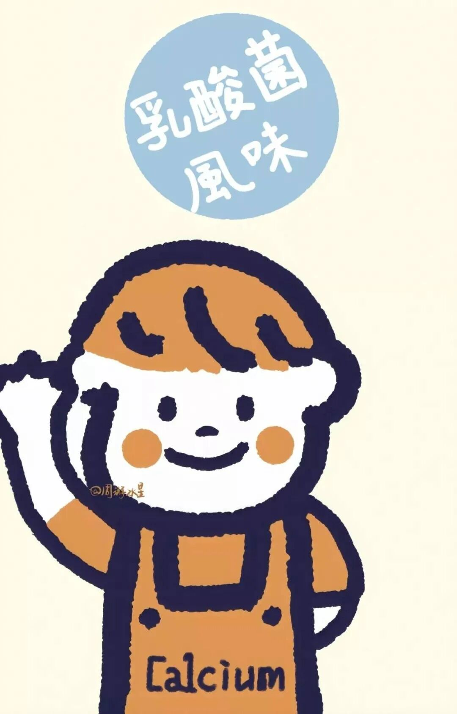
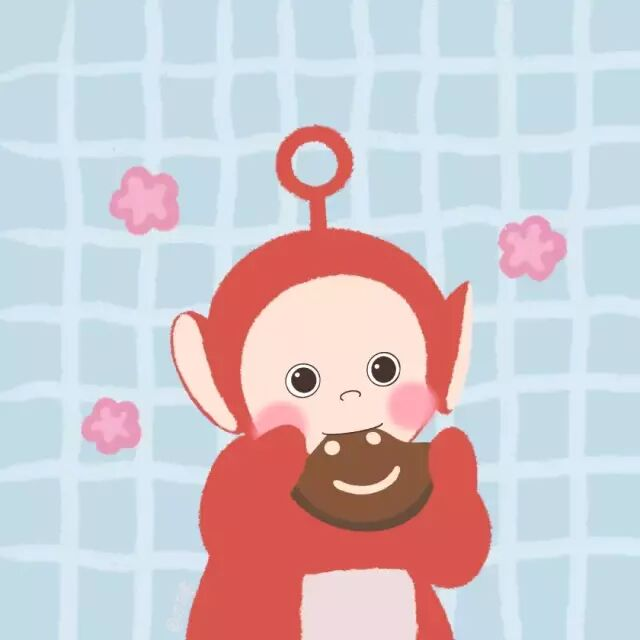
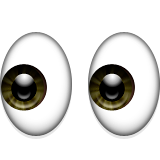
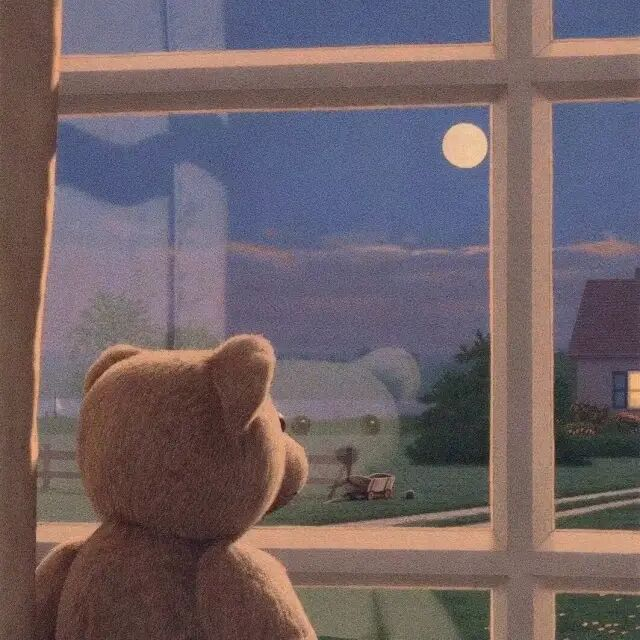
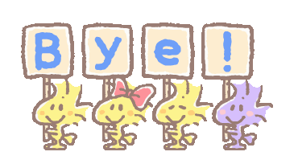

#share to you#这个话题就用来分享一些奇思妙想吧。or随便分享点啥，maybe以后去瞎玩瞎吃也会分享滴。

天哪，想念南京的第n天。

网课过烦、作业过多，瞎写写就溜咯~

（体育课竟然还要上传八段锦练习视频Orz 人间疾苦啊人间疾苦）

（今日份灵感来源于：《人性的弱点》、乱七八糟的各种微博、表白墙...）

**今日话题：****“我的坏习惯”**

总会有人问：我觉得自己好冷漠/我很孤独要怎么改...诸如此类关于自我相处的问题。

不如先从这种纠结感、不适感里跳出来，先去关注行为方式产生的原因，比如也许有这样一种可能：

*“我冷漠的时候，是因为我心情不好，不想被打扰。”*

*“我孤独的时候，是因为我和他们的爱好不同没什么好谈论的。”*

如果这样想，你就会发现“心情不好不想打扰”是现有的问题，而你的冷漠，恰恰是你自己最本能的解决问题的方式。

与此相反，如果选择另外一种方式，去附和别人的快乐，由于和他人心情的反差而产生不适之后，发送一条“人类的悲欢本并不相通”的微博，再陷入漫长的不被理解的痛苦。这个解决办法和用冷漠的态度让自己独处，哪种方法更好呢？

这样思考完以后，再去看看问出的这些问题，就会发现你的纠结类似于：病好了，却嫌药苦一样。你该思考的，明明不是药，而是你的病以后该如何防治啊。

所以，一个坏习惯，如果真的只带来坏处，那它在我们身上是留不住的。

因此，每一种坏习惯的背后，其实都是为了解决某个我们没意识到的真问题。而那个问题，一定比你对自己情绪的懊悔，更为重要。

如果总是按自己的理解将习惯刻意污名化，彻底否认它的价值，不愿意去思考习惯产生的原因，这样只会让你，更加发现不了真问题。

而如果哪一天这个问题不在了，不需要解决方法了，或许你的习惯就不存在了。

总之，keep thinking，keep finding吧。

纯属无聊瞎思考。只是突然觉得，有些事情还可以这样想而已。

若有什么逻辑错误，还请指正。

(｡･∀･)去搞体育课的八段锦去了...

if 你有什么难解的问题，8如来与我讨论8，与公众号聊天多么快乐hh。

毕竟，独想想，不如众想想嘛。

